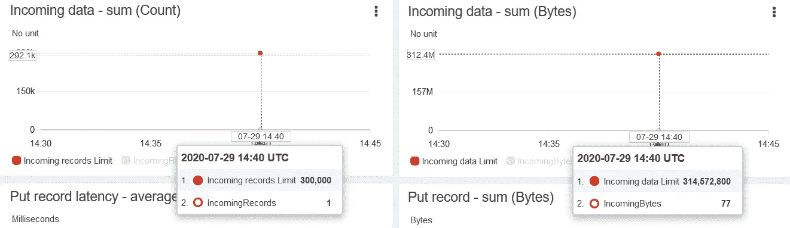
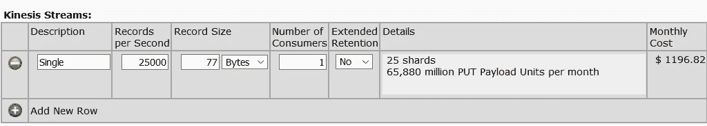
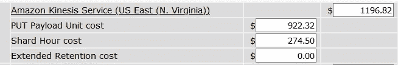
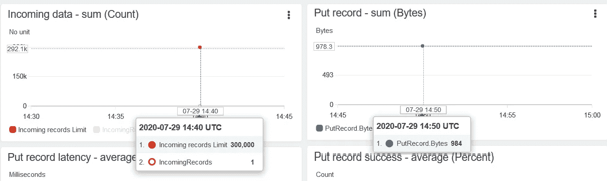
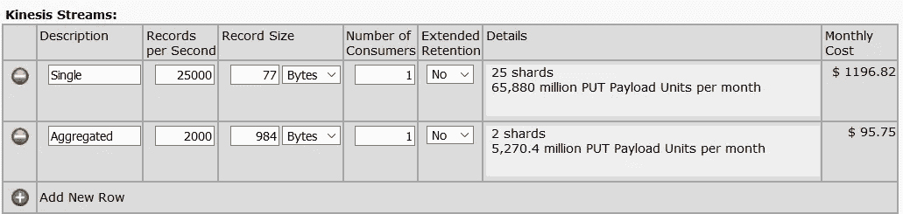
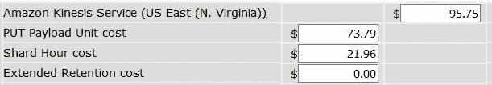

# 使用记录聚合节省 Amazon Kinesis 流成本

> 原文：<https://towardsdatascience.com/save-amazon-kinesis-stream-costs-using-records-aggregation-79c8fd9ea748?source=collection_archive---------42----------------------->

## 使用 KPL 记录聚合降低 AWS 成本的案例研究

图片来自 [Pixabay](https://pixabay.com/?utm_source=link-attribution&utm_medium=referral&utm_campaign=image&utm_content=3088958) 的 [xresch](https://pixabay.com/users/xresch-7410129/?utm_source=link-attribution&utm_medium=referral&utm_campaign=image&utm_content=3088958)

几年前，我们为一个客户开发了一个流管道，使用 Kafka 代理在他们自己的数据中心运行。流媒体管道是使用 Kafka Producer API 开发的。由于业务前所未有的增长，他们决定将其基础架构迁移到 AWS 云。作为迁移的一部分，我们决定实现 Kinesis Streams 来替代 Kafka。

在我们参与之前，客户内部团队已经做了一些调查并得出了一些数字。这是他们想出的办法:

**平均记录大小:** 77 字节
**记录格式:** JSON

[centos @ IP-172–31–70–220 ~]$ python 3 single _ record _ producer . py
向 Kinesis 流发送这些数量的记录:1

(*图片作者*)

(*作者图片*)

(*作者图片*)

假设每秒 25000 条记录，Kinesis 计算器估计的账单为**$ 1196.82/月**——相当高

由于明显的原因，客户对价格感到担忧，所以他们联系了我们。这篇文章的目的是展示你如何利用运动聚合来获得优势。你可能知道 Kinesis 流的成本是基于 2 个因素:

1.  碎片成本/小时(固定-根据所需碎片数量计算)
2.  PUT 有效负载(根据 PUT 有效负载而变化)—PUT 有效负载单元以 25KB 有效负载区块计算。**这就是使用 Kinesis 记录聚合可以节省成本的地方。**

## 什么是 Kinesis 记录聚合？

在大量情况下，数据工程师使用 Kinesis 生产者库(KPL)将记录写入 Kinesis 流。 [*聚合*](https://docs.aws.amazon.com/streams/latest/dev/kinesis-kpl-concepts.html#kinesis-kpl-concepts-batching) 是 KPL 的一部分，允许客户增加每个 API 调用发送的记录数量。

数据工程师通常按如下方式构建他们的代码:

*从源
循环中取出数据记录，用于记录:
调用 kinesis_client.put_record 方法发送一条* ***78 字节*** *记录
结束循环*

相反，这是他们**应该**做的事情:

*从源
循环中取出数据记录进行记录:* ***调用 Kinesis 聚合器—一次放入 12 条记录*** *请求
调用 kinesis_client.put_record 方法发送 984* ***字节*** *记录
结束循环*

[centos @ IP-172–31–70–220 ~]$ python 3 aggregate _ record _ producer . py
向 Kinesis 流发送这些数量的记录:12

(*作者图片*)

现在是成本节约…

(*图片作者*)

(*作者图片*)

**95.75 美元/月，相比之下**1196.82 美元/月—** 对于节省来说还不错**

**我希望您获得了一些关于如何为客户节约成本的宝贵见解。Kinesis 记录聚合当然是一个非常有效的方法，但是我建议你应该从开发周期的一开始就实现它。否则，您将需要重构大量代码来实现它。**

**我希望这篇文章是有帮助的。**亚马逊 Kinesis** 是由 [Datafence 云学院](http://www.datafence.com)提供的 AWS 大数据分析课程的一部分。课程是周末自己在网上教的。**