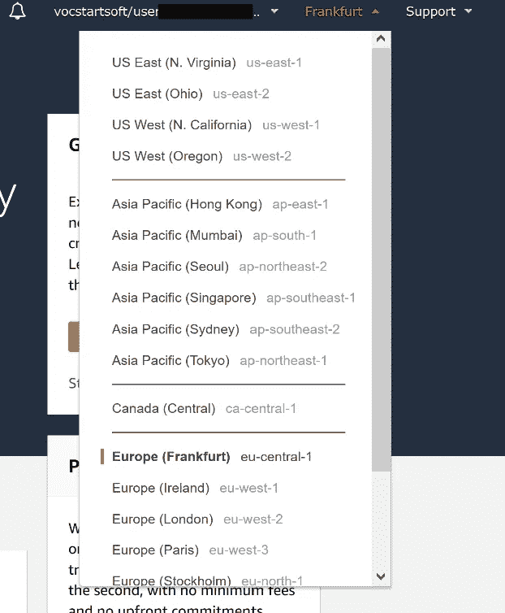
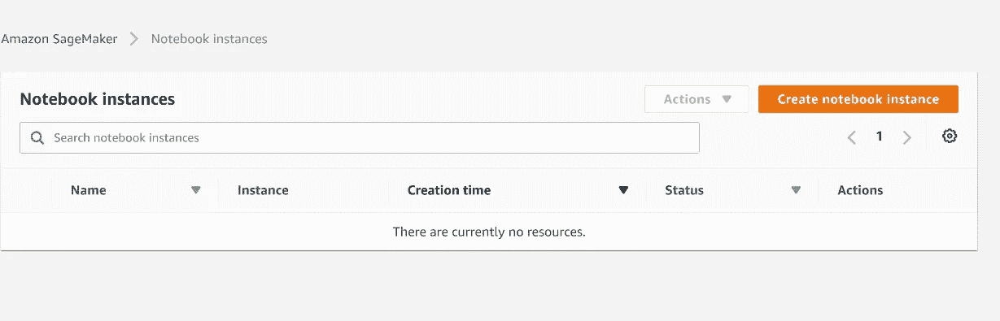
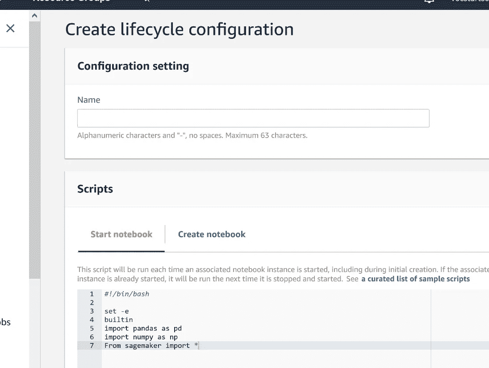
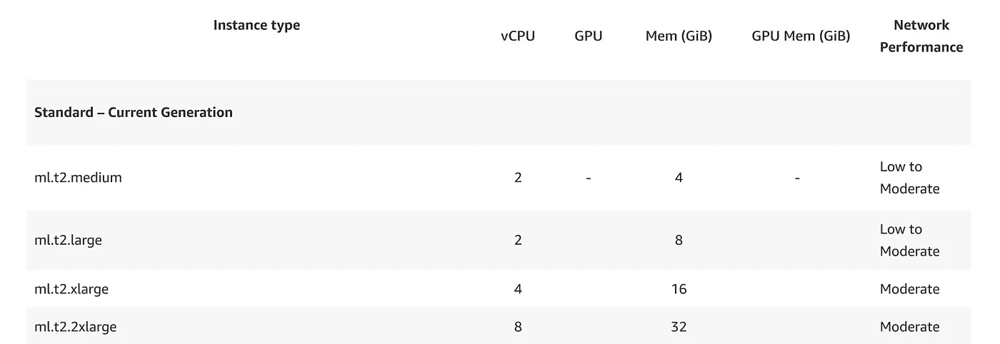
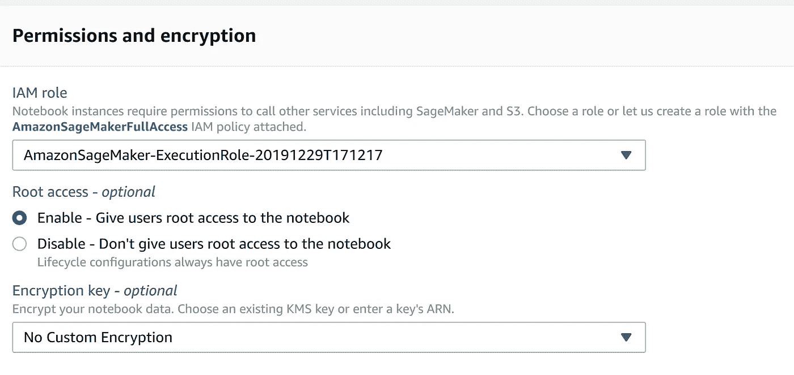
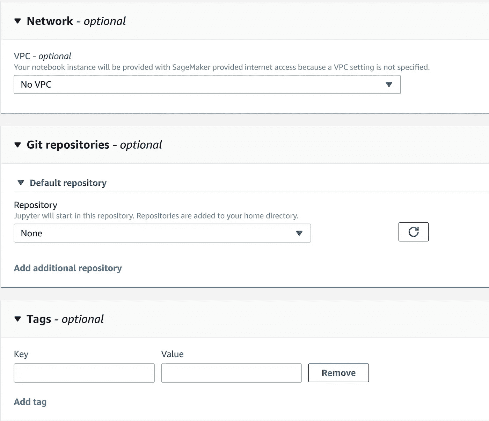
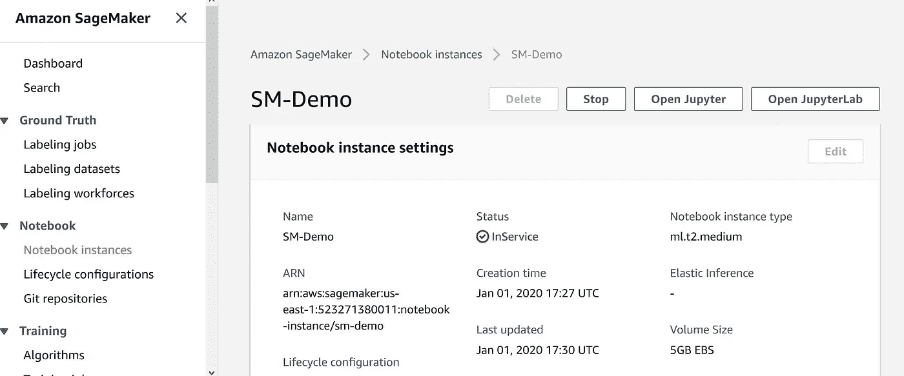
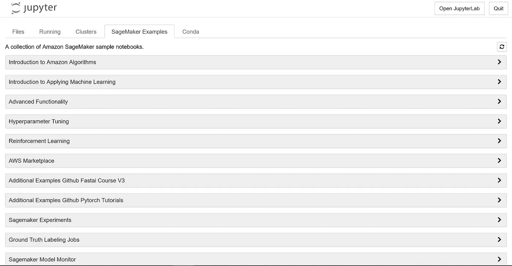
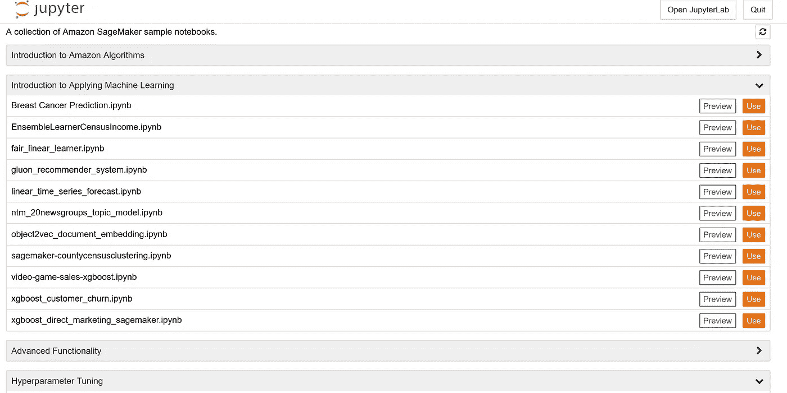
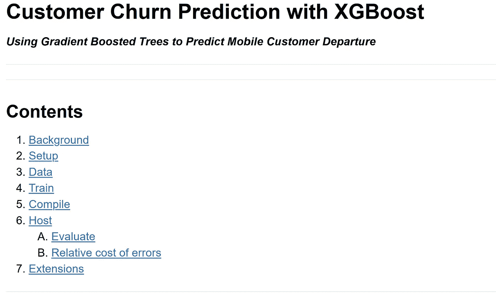

# 节省成为职业棒球手的时间:轻松且免费

> 原文：<https://towardsdatascience.com/save-time-becoming-a-ml-pro-easily-and-free-of-charge-a8ff2f683b1b?source=collection_archive---------32----------------------->

阿里·沙阿·拉哈尼在 [Unsplash](https://unsplash.com?utm_source=medium&utm_medium=referral) 上拍摄的照片

## **通过使用现成的 AWS SageMaker 笔记本**

如果你熟悉大数据、云计算和机器学习的基础知识，并希望获得新的知识和经验，AWS SageMaker 及其现成的笔记本是一个不错的选择。

> **首先什么是 aws:**
> 
> 亚马逊网络服务(AWS)是世界上最全面、最广泛采用的云平台，从全球数据中心提供超过 175 种全功能服务。从计算、存储和数据库等基础设施技术到机器学习和人工智能、数据湖和分析以及物联网等新兴技术，AWS 的服务和这些服务中的功能远多于任何其他云提供商。这使得将您现有的应用程序迁移到云中变得更快、更容易、更具成本效益，并构建几乎任何您可以想象的东西。 [*](https://aws.amazon.com/what-is-aws/)
> 
> **其次，什么是 SageMaker:**
> 
> 亚马逊 SageMaker 是一个完全托管的机器学习服务。借助亚马逊 SageMaker，数据科学家和开发人员可以快速轻松地构建和训练机器学习模型，然后直接将其部署到生产就绪的托管环境中。它提供了一个集成的 Jupyter 创作笔记本实例，可以方便地访问您的数据源进行探索和分析，因此您不必管理服务器。它还提供了常见的机器学习算法，这些算法经过优化，可以针对分布式环境中的海量数据高效运行。 [*](https://docs.aws.amazon.com/sagemaker/latest/dg/whatis.html)

**那么，我说的熟悉是什么意思呢？如果你能勾选以下所有方框，你应该很熟悉:**
*——你知道回归和分类的区别以及使用的领域。
-你听说过一些算法，比如 k 近邻、随机森林、极端梯度推进和主成分分析。你可以处理像 Keras，Tensorflow，PyTorch 或者 Chainer 这样的框架。
-你了解 AWS 的概念。
——你知道创造和使用 Jupyter 笔记本。*

**准备好了吗？**好了，让我们直入主题，攀登 ML 阶梯:
众所周知，aws 是一家全方位服务的云提供商。当人们听到“云”这个词时，有些人可能只会想到存储和数据库解决方案。但这仅仅是开始。不幸的是，他们提供各种各样的服务。比如图像和物体识别、BI 和 CRM 工具、区块链网络或虚拟现实应用。
他们的大多数服务和工具都可以通过 API 或使用 aws 管理控制台来访问。

AWS 管理控制台的登录页面

**专业提示:**如果你是 AWS 新手，还没有账户，你可以免费获得一个。这还不够:有了 AWS 免费层，你还可以访问几乎所有的 AWS 服务。存储大小和计算时间有一些限制。即使是免费的，你也必须在注册时提供你的信用卡信息。最好是设定一个预算限额，这样就不会被收费。如果你是学生，那就更好了:你可以获得一个免费教程的 AWS 教育账户，预算 100 美元，而且不需要提供你的信用卡或银行账户。

**1。开始**
登录 [AWS 管理控制台](https://signin.aws.amazon.com/signin?redirect_uri=https%3A%2F%2Fportal.aws.amazon.com%2Fbilling%2Fsignup%2Fresume&client_id=signup)，在搜索框中输入 Sagemaker 并点击结果。

**专业提示:** AWS 有几个数据中心。如果您必须遵守特殊的治理政策，您可以选择适合您的区域。例如，如果您必须遵守 GDPR，您可以在五个 EU-地点之间进行选择。位置对网速也很重要。注意:目前只有 US-East-1 (N. Virginia)支持学生帐户。

支持的 aws 区域

单击左侧的笔记本实例，然后单击创建笔记本实例:

如何创建新的笔记本实例

**提示:**通过设置生命周期配置，您可以设置每次启动或创建笔记本时运行的默认脚本。通过使用这种方法，您的工作效率会更高，因为您不需要每次都指定经常使用的库、工具或存储位置。

SageMaker 生命周期配置

**2。创建新笔记本时的选项**

**2.1。笔记本实例类型** Sagemaker 提供了广泛的实例类型选择，经过优化以适应不同的机器学习(ML)用例。他们做工作的方式不同。通过混合使用 CPU、GPU、内存和网络容量。选择正确的实例类型取决于您。甚至可以动态地更改实例类型。如果你的项目变得越来越大，你就可以把资源变得越来越大。

实例示例

**举例:**
> ml.t2.medium =机器学习标准二代中等大小

> ml.r5.2xlarge =机器学习内存优化第五代超大

**2.2。弹性推断**

为了加快你的学习进度，你可以选择 GPU 驱动的实例类型。另一方面，GPU 驱动的实例比 CPU 或 RAM 驱动的实例更昂贵。但是对于实时操作来说，它们的延迟通常太高。如果你不想妥协，你应该看看弹性推理。弹性推理允许您将适量的 GPU 驱动的推理加速附加到 Sagemaker 模型上。为您的应用选择最佳的 CPU 实例类型，附加适量的 GPU 加速，获得两全其美。

**2.3。权限和加密**

IAM 代表身份和访问管理。IAM 是一项服务，可以帮助您安全地控制对 AWS 资源的访问。您使用 IAM 来控制谁被验证(登录)和授权(有权限)使用资源。
注册您的第一个帐户时，您将拥有一个全访问单点登录帐户(也称为 root 用户)。AWS 强烈建议不要使用 root 用户执行日常任务，甚至是管理任务。相反，您应该从单个 IAM 角色开始。你也可以加密你的笔记本。更多细节请看 AWS 文档。

权限和加密

**2.4。可选定制**

亚马逊虚拟私有云(亚马逊 VPC)使您能够将 AWS 资源启动到您定义的虚拟网络中。这个虚拟网络非常类似于您在自己的数据中心运行的传统网络，具有使用 AWS 的可扩展基础架构的优势。

可选定制

将 Git 存储库与您的 notebook 实例相关联，以便在源代码控制环境中保存您的笔记本，即使您停止或删除您的 notebook 实例，该环境也会持续存在。您可以将一个默认存储库和最多三个附加存储库与一个笔记本实例相关联。存储库可以托管在 AWS CodeCommit、GitHub 或任何其他 Git 服务器上。它有助于坚持、合作或学习。

**2.5。完了！**

如果您完成了参数设置，您可以点击*创建笔记本实例*。如果您的笔记本处于活动状态，可能需要一段时间。通常几分钟。休息一下，喝杯咖啡，为下一步做准备。

**3。启动你的笔记本**

当您的笔记本处于使用状态时，您可以使用 Jupyter 或 JupyterLab 启动它。在这个演示中，我们使用常规 Jupyter。

**亲提示:** 离开时一定要把笔记本停好。即使没有模型，也有成本。

笔记本正在使用中

然后点击 SageMaker 示例

SageMaker 笔记本列表

正如你在上面的图片中看到的，有大量不同的例子。它们按主题分组。每个话题都是可扩展的。选择一个最符合你需求的。由于我们正在使用大数据和机器学习，我们选择:“*使用 XGBoost 的客户流失预测-
使用梯度提升树来预测移动客户离开*”。点击*使用*，笔记本启动。

机器学习笔记本

> **笔记本讲的是什么:** 笔记本描述了使用机器学习(ML)来自动识别不开心的客户，也称为客户流失预测。失去客户对任何企业来说都是代价高昂的。尽早发现不满意的客户，让你有机会激励他们留下来。

关于使用 XGBoost 进行客户流失预测的 SageMaker 笔记本

现成的笔记本带你经历一个典型的 ML 循环的每一步。这是一个公共数据集，所以很容易按照说明。现在，您可以看到并学习如何使用 XGBoost 算法来构建、训练和学习。玩得开心，享受吧！

**专业提示:**
为了最大限度地利用本教程并获得完整的理解，阅读一下关于 [AWS S3](https://docs.aws.amazon.com/s3/index.html?nc2=h_ql_doc_s3) 会很有好处。

当停止或完成工作时，请始终记住移除托管端点并避免被收费。

本笔记本展示了如何使用 aws 现成的 SageMaker jupyter 笔记本来增加您的 ML 知识！我希望你喜欢它。如果您有任何问题或建议，请随时使用下面的评论功能。敬请关注更新！