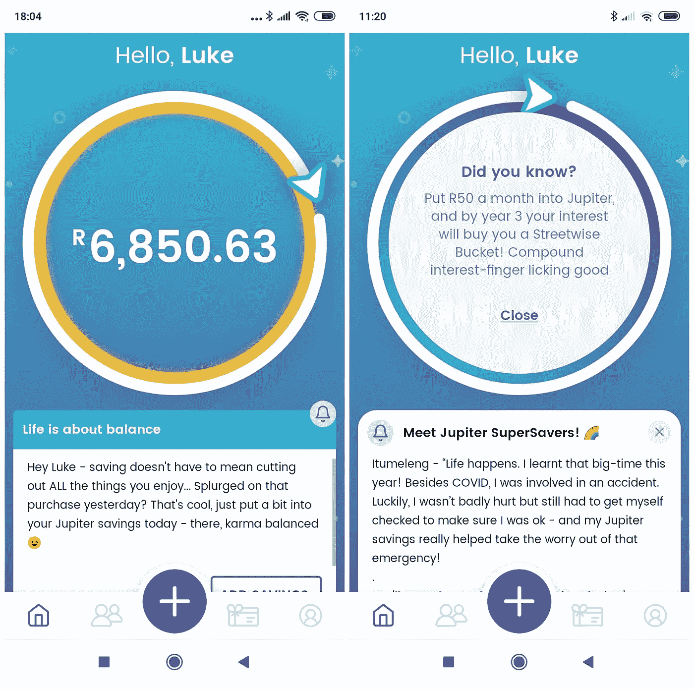
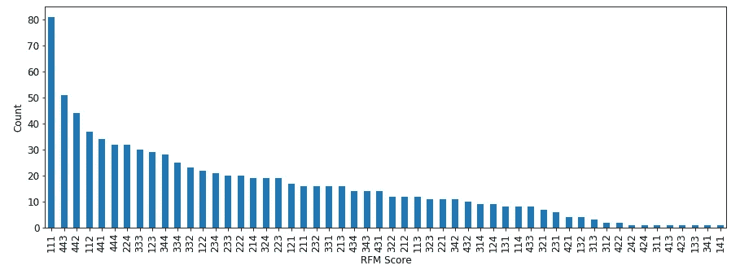
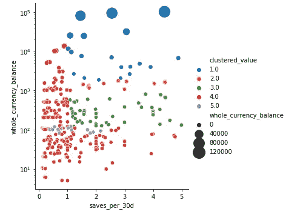
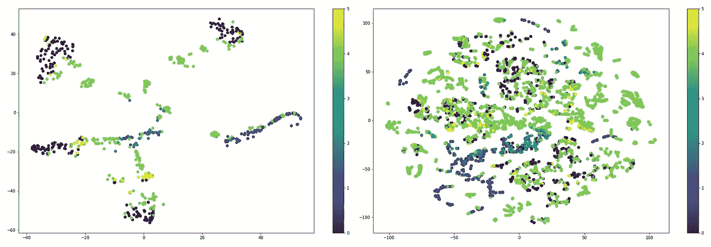
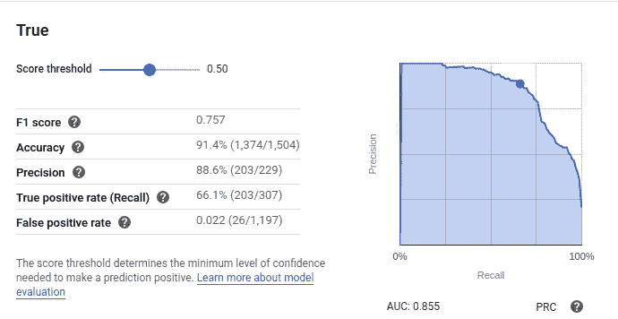
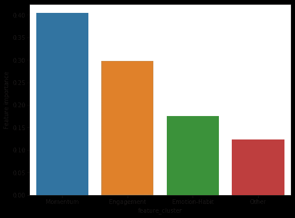

# 拯救之旅:动力、深度参与和动态细分市场

> 原文：<https://towardsdatascience.com/saver-journeys-momentum-deep-engagement-dynamic-segments-63fb24aafd1b?source=collection_archive---------56----------------------->

## *我们再看一眼 Jupiter 的早期数据，对用户进行细分，并试图预测是什么让一个人从低倾向储蓄者变成高倾向储蓄者*

版权所有木星储蓄。知识共享署名 4.0 国际许可。

合成:

*   应用程序参与度、储蓄势头和奖励能够以约 90%的准确率预测储蓄者的细分动态。
*   储蓄者抵制简单的分类，但是关注他们的*旅程*，而不是他们的静态点，导致可以采取行动的结构和意义。
*   关于固有用户特征或“大数据”的毫无根据的先验可能是无益的，尤其是在早期应用数据科学时。

# 寻找既健壮又有用的片段

在[之前的一篇文章](/emotion-and-habit-in-savings-d628be965bfd)中，我们看了一下 Jupiter 关于促使用户存更多钱的数据。在这一期节目中，我们将着眼于木星首批约 1000 名储户的总体行为，或者说细分和聚类。

第一步是传统的“RFM”细分——“**新近度**”(某人最近储蓄了多久)、“**频率**”(他们储蓄的频率)，以及“**货币量**”(他们的余额是多少)。

我们将所有储蓄者分成四分之一，然后组合标签，因此“111”意味着“前四分之一最近，前四分之一频率，前四分之一货币”，等等。通常当你这样做的时候，一个或两个部分会占主导地位(如果事情进展顺利，111；如果你遇到麻烦，444)。这是我们的情节:

标准分割技术中的高度异质性

至少我们最大的细分市场是 111，但这是一个很大的分散。我们可以将 111 和 112 归类为“频繁，高价值”，然后将 443 和 442 归类为“不频繁，低价值”，但这最多只能吸引 30%的用户。

> **储户不会落入一个漂亮的桶或几个角色**

在这之后，我们吵了很久。我们添加了行为数据并运行了一系列分析( [K-Means](https://medium.com/@april.griffin091/a-beginners-overview-of-the-k-means-clustering-algorithm-382b1efd11c3) 、 [HDBScan](https://hdbscan.readthedocs.io/en/latest/how_hdbscan_works.html) 、 [t-SNE](/t-sne-clearly-explained-d84c537f53a) 等)。大多数出现了和 RFM 一样的结果——大量的分散，没有直观的结构。不过，最终我们结合了两种方法，并开始取得进展:

(1)应用主成分分析( [PCA](https://blog.umetrics.com/what-is-principal-component-analysis-pca-and-how-it-is-used) )来找到用户事件流中变化的主要来源。我们可以通过**他们打开 Jupiter 应用程序和参与“片段”(应用程序内的金融知识片段)的频率、**以及他们**保存和赎回 boost** 的频率来解释用户之间的差异。交叉相关性加强了这一发现。**参与是一个有意义的变化轴**。

(2)将储蓄者分为每月储蓄一次以上的储蓄者和储蓄一次或一次以下的储蓄者，合并每个用户的事件计数，并在每个较大的池中运行聚类算法(HDBScan)。**这种划分使我们能够在两个池中的每个池中找到仅 2-3 个聚类点的良好匹配，总共有五个细分市场。**

当重新结合在一起并根据余额记录绘制时，我们最终找到了一种聚类方法，这种方法既代表了高维行为数据，又显示了值的清晰级数。这五个部分来自数据，而不是我们的先验，所以我们不能给它们起一个可爱的名字，但是我们可以开始问一些关于它们的好问题。

储蓄者按储蓄和余额的频率绘制，按价值分类着色

# 使用丰富的数据使分段动态化

细分只有在导致行动时才有用。所以我们问，我们能不能找到过去储户行为的一个方面，来预测他们现在属于哪一类？从那以后，我们的哪一个杠杆将最有效地影响这种行为，从而将储户转移到更有价值的细分市场？

首先，我们运行了各种模型，使用每个用户的事件计数作为输入特征，并将他们的最终细分作为目标标签。不幸的是，没有一个模型的精度远远超过 0.5——这是抛硬币的结果。考虑到一个内部结构复杂的小数据集，这并不奇怪。

但在这里，拥有一个丰富的数据集，构建和结构化，以方便流畅地进行这些分析，变得非常宝贵。对于我们来说，储蓄器的每个方面——事件、余额、行为——都是一系列实时事件的集合。**通过一点跑腿工作，我们可以滑动分段*和*事件几乎任意地沿着时间线计数**。

从 6 月初到 9 月底，我们使用这种能力在 3.5 个月的时间内每 3 天收集一次数据。这让我们从几百个数据点增加到接近 15000。

当我们把自己局限在单一时间点的问题上时，我们的模型仍然没有得到很大的提升，“我们能预测用户当前的细分市场吗？”这在某种程度上并不令人惊讶。如果数据增加接近重复，那么数据增加的帮助要比“大数据”的天真想法小得多。关于静态横截面结构的问题，仅移动横截面就非常接近于复制(参见下面的投影图)。

有限数据与增强数据的 t-SNE 图:二维空间已经填满，但没有清晰的结构出现

> 所以我们改变了问题，变成了关于**在时间上的进化，一个更有价值也更容易处理的问题**。

我们问:**什么能预测储户是否会在下个月“升级”他们的细分市场？** **从一个关于用户*在哪里*的问题，我们产生了一个关于用户*要去哪里*的问题。**在我们扩展的数据集中，每次我们都要向前看一个月，并检查用户群的变化。基本面数据点成了储户旅程中的一个阶段。

这并没有使扩增完全没有损失，但确实使它明显更好。对于理解静止的你这个问题，今天的你和一个月前的你或多或少是一样的；对于理解你的储蓄习惯是如何演变的问题，今天的你和一个月前的你有很大的不同，足以找到额外的意义。

# 参与+推动价值增长的动力

证据就在布丁中——模型度量。根据我们增加的数据，我们运行模型来预测某一天的某个特定储户，在当时对他们的一切都了解的情况下，是否会在下个月增加一个细分市场。仅使用简单的模型，准确率立即跃升至 70%，具有良好的假阳性/假阴性率。

由于数据集相当平衡，我们决定引入一些重型机器，并将数据输入谷歌云的 AutoML。它拟合了一个相当复杂的梯度增强树，并达到了 **90%的准确度**。我们担心标签泄露，但是交叉相关性、训练曲线和特征重要性分数都让我们放心了。

那么哪些特性最重要呢？

第一，**气势**。最重要的两个特征(25%和 15%)是储蓄者的余额四分位数和最近四分位数。因此，能够存很多钱(按原始金额计算)确实很重要——如果不重要的话，坦率地说，这很可疑——但这只能解释一个人晋升的可能性的四分之一。紧随其后的是近期。将这些放在一起作为对“动力”的粗略衡量，可以解释储户未来 40%的动力。

二、**订婚，尤其是深度订婚**。下一个重要的特性是用户打开应用程序的频率。然后——这让我们吃惊——**用户查看应用内信息存档的频率**。紧接着是**用户点击屏幕中央的金融知识“金块”**的频率。

这些可以解释为用户不只是打开应用程序，而是觉得有理由去探索它。每一个都占总特征重要性的 10%。当结合其他一些相关功能(如共享推荐代码或探索“拯救伙伴”)时，**深度参与总共解释了另外 30%的变化**。

最后，**情感奖励和储蓄习惯**。与我们前一篇文章中的发现相呼应，用户存钱的频率和他们是否已经兑现了一次提升占了另外 15%的特征重要性。最后的 10%分散在一系列其他功能中。

最终模型中的特征聚类和重要性

如何防止储户将**下移**到价值段？动力和参与因素同样重要。但是他们加入了**出站通信**。也就是说，如果我们最近给用户发了信息或让他们提高报价，用户就不太可能降级(通过退出或进入休眠状态)，即使他们没有深度参与应用程序。这是一种解脱，因为我们曾经想知道，打扰人们，或者只是过于频繁地提醒他们有这个储蓄罐，有时会导致提款。注意:并不是说我们认为这是垃圾邮件的许可证。

# 结论:使用(或不使用)旧的心智模型和大数据与丰富数据

总的来说我们能说什么？首先，我们第一篇文章中的发现得到了一些强化——**行为是可塑的，情感和参与很重要**，不仅仅是消费应用，也不仅仅是交易和加密。

还有另外两个更广泛的观点。有时我们会惊讶地经常被问到，“你的目标人群是什么？”一方面，如果只是最初的捷径，这是一个可以理解的问题。在某种程度上，年龄会对储蓄产生影响——职业道路只是让可用于储蓄的收入和不同年龄的储蓄压力有所不同。

但是仔细观察，这个问题可能代表一个没有根据的先验。更糟糕的是，这可能是一条糟糕的捷径。讽刺地说:如果你能在年龄和性别上做一个 Excel 支点，并认为它是连贯的，为什么要试图理解储蓄者行为的细微差别？过分简单的数据工具导致过分简单的想法，这些想法成为主导未来分析的先验知识。

我们有木星拯救者的年龄数据。我们还没有发现它能有效地解释储蓄者的行为。我们不需要它来达到预测节段运动 90%的准确性，或诱导反应率 70%以上的准确性，或在抵制任何简单分割的数据中寻找意义。

如果人口统计学很重要，他们会以结构的形式出现——所以只需要寻找结构。如果他们不这样做，他们就是一种虚假的一致性，是由简单的工具或大而有限的数据造成的。

**一个相关的注释是关于如何判断数据。*其他都等于*，数据越多越好(好得多)。但是*其他的几乎都不等于*。**

我们 Jupiter 团队中的一些人使用新的纯数字银行(“neobanks”)。今年搬家国的时候开的账户(*非常【2020 年初)。我用它作为我的主要银行账户。仅仅是交易数量就足以说明这一点。但是这个应用程序一直在使用宝贵的屏幕空间来帮助我“迁移到我们这里作为你的主要账户”。鉴于我交易的参考，它还不断为我提供我显然已经拥有的产品和服务的折扣。*

**这个 neobank 拥有 500 多万用户，因此它拥有“大数据”，但这些数据要么非常差，要么使用非常糟糕，要么两者兼而有之，因此这些数据不会比他们拥有 50 个数据点更有实际用途**。

因此，这将是我们一段时间内的最后一次数据发布。我们希望这篇文章和上一篇文章能让我们更好地了解我们正在构建的东西。希望他们也清楚地表明了丰富的数据可以做多少事情，即使是在早期——只要你抛开过去，充分利用现代数据方法的力量。

**最重要的是，我们希望他们已经表明，一些关于储蓄的旧观念——都是关于违约的，你不能让它变得有趣，只是减少摩擦，等等——至少对严肃的问题是开放的。即使这给我们带来了竞争，我们也希望其他人将很快超越已经厌倦的现代金融科技储蓄工具包(这里一个目标，那里一个总结)，更接近理解储户的行为，并帮助他们改变这种行为。**