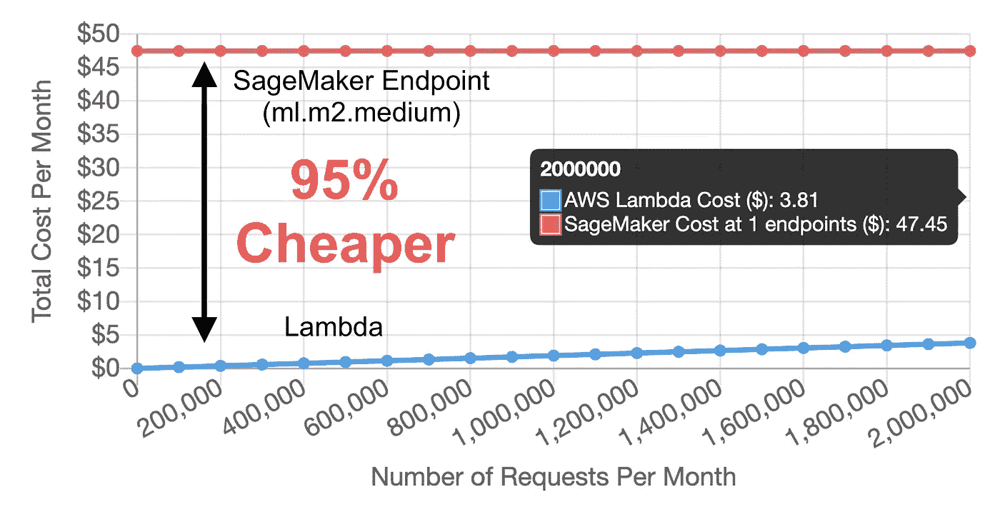
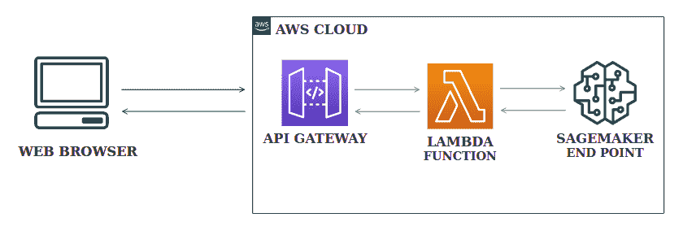
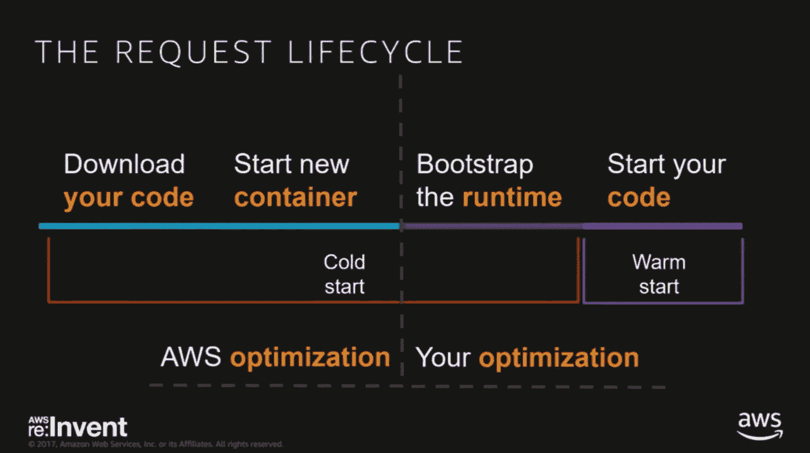
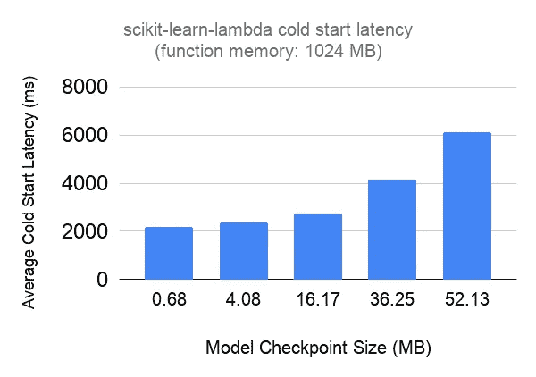
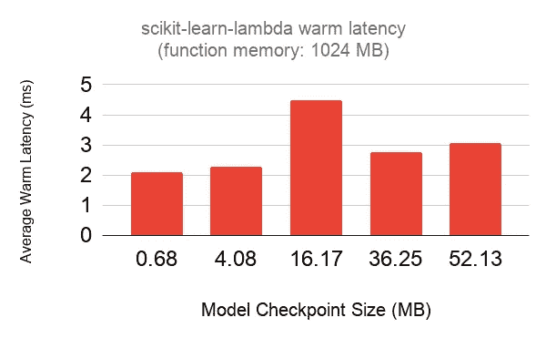

# 使用 AWS Lambda 进行 scikit-learn 预测可节省 95%的基础设施成本

> 原文：<https://towardsdatascience.com/saving-95-on-infrastructure-costs-using-aws-lambda-for-scikit-learn-predictions-3ff260a6cd9d?source=collection_archive---------36----------------------->

## 用于实时机器学习推理的 AWS Lambda 与 AWS SageMaker

*声明:我是* [*模型动物园*](https://modelzoo.dev/) *的开发者，一个专注于易用性的模型部署平台。*



在 https://modelzoo.dev/lambda-vs-sagemaker-cost/[试用我们的工具](https://modelzoo.dev/lambda-vs-sagemaker-cost/)

如果你是一个需要部署机器学习模型进行实时推理的 AWS 客户，你可能会考虑使用 **AWS SageMaker 推理端点**。然而，模型部署还有一个选项，这个选项有时会被忽略:直接在 **AWS Lambda 上部署。**虽然它有一些警告，但是 Lambda 的简单性和成本效益使得它值得考虑 SageMaker 端点用于模型部署，特别是当使用 **scikit-learn** 、 **xgboost** 或 **spaCy** 时。在本文中，我们将回顾使用 AWS Lambda 进行 ML 推理的一些好处和注意事项，并深入一些相关的基准测试。我们表明，在低使用率的情况下(每月< 2M 预测)，当将模型从 SageMaker 迁移到 Lambda 时，您可以节省高达 **95%的基础设施成本**。我们还将展示 [scikit-learn-lambda](https://github.com/model-zoo/scikit-learn-lambda) ，这是我们的开源工具包，用于在 AWS Lambda 上轻松部署 scikit-learn。

# 什么是 AWS SageMaker 推理端点？



通过 SageMaker 端点进行实时 ML 推理的 AWS 基础设施图

SageMaker 推理端点是 AWS 提供的令人印象深刻的端到端机器学习工具包的许多部分之一，从数据标记( [AWS SageMaker 地面真相](https://aws.amazon.com/sagemaker/groundtruth/))到模型监控( [AWS SageMaker 模型监控器](https://docs.aws.amazon.com/sagemaker/latest/dg/monitoring-overview.html))。SageMaker 推理端点提供了围绕 GPU 加速、自动缩放、AB 测试、与培训管道集成以及与离线评分集成的功能( [AWS 批量转换](https://docs.aws.amazon.com/sagemaker/latest/dg/inference-pipeline-batch.html))。这些特性的代价很高——最便宜的推断端点(ml.t2.medium)将花费您**$ 50/月**来运行 24/7。下一个最佳终点(ml.t2.xlarge)是**$ 189.65/月**。

# 什么是 AWS Lambda？


AWS Lambda 是一个通用的无服务器计算平台

AWS Lambda 是无服务器计算运动的先驱，让您无需提供或管理服务器即可运行任意功能。它只在需要的时候执行你的代码，并且自动伸缩，从每天几个请求到每秒几百个请求。Lambda 是一个通用的函数执行引擎，没有任何机器学习的特定功能。它激发了一个不断增长的工具社区，一些来自 AWS 本身([无服务器应用模型](https://aws.amazon.com/serverless/sam/))和一些外部附属的([无服务器框架](https://www.serverless.com/))。

# AWS Lambda 对实时机器学习推理的好处


*   Lambda 有一个**按请求付费**模式，可以随着你的成长而扩展。这是赞成还是反对取决于你的使用水平，但特别是**成本效益**服务在 2M 预测每月。在撰写本文时，SageMaker 不支持在低活动期自动调整到零。
*   Lambda 需要一个**更简单的实现**计算模型，其中并发/自动伸缩可以在逻辑之外透明地处理。
*   Lambda 要求**降低** **维护工作量**，无需管理任何底层服务器或逻辑。
*   Lambda 有一个丰富的开发者生态系统(开源和 SaaS)，用于监控、记录和测试无服务器应用，比如无服务器应用。有了 SageMaker，你就依赖于 AWS 特有的资源，比如用于工具的 [SageMaker 兼容容器](https://github.com/aws/sagemaker-containers)和 [SageMaker Python SDK](https://sagemaker.readthedocs.io/en/stable/) 。

# AWS Lambda 用于实时机器学习推理的缺点



导致冷启动延迟的请求生命周期。

*   Lambda 对可用资源有限制，最大 **3，008 MB 物理内存**和**不支持 GPU 加速**。对于使用具有严格延迟要求的大型模型的基础架构来说，这可能是一个障碍。
*   当在 5-10 分钟的不活动期后调用该函数时，Lambda 会导致**冷启动延迟**。[AWS Lambda](https://mikhail.io/serverless/coldstarts/aws/#:~:text=This%20article%20describes%20AWS%20Lambda,Cold%20Starts%20in%20Serverless%20Functions.)上的冷启动是一篇很棒的博文，深入探讨了影响冷启动延迟的一些因素。
*   **AWS Lambda 中的包大小限制**非常严格，压缩后为 50 MB，解压缩后为 250 MB。有变通办法( [AWS Lambda Layers](https://docs.aws.amazon.com/lambda/latest/dg/configuration-layers.html) )，但是这对于捆绑常见的 ML 依赖项(如 TensorFlow (~400 MB)和 PyTorch (~250 MB)来说可能是一个恼人的障碍。
*   Lambda 不能直接使用 Docker 容器作为依赖，而是有自己的依赖管理系统 [AWS Lambda Layers](https://docs.aws.amazon.com/lambda/latest/dg/configuration-layers.html) 。这有时需要用户在打包时做一点额外的工作。

# 案例研究:scikit-learn


[pharm assesse](https://pharmassess.ca/)是一个模型动物园用户，其任务是更自信、更高效地治疗更多患者。他们开发了一个专有模型，可以使用 scikit-learn 自动进行小病评估、诊断和治疗&文档，现在正在与一组初始用户一起测试它。他们的模型大小约为 50 MB，是 Lambda 部署的理想选择。

# 设置

通过 Model Zoo，PharmAssess 能够使用简单的 Python API 部署其 scikit-learn 模型。在幕后，Model Zoo 将把 scikit-learn 模型打包并部署到 AWS Lambda 函数中(参见我们的 [quickstart](https://colab.research.google.com/github/model-zoo/examples/blob/master/scikit-learn-quickstart/quickstart.ipynb) 获取完整示例)。

```
import modelzoo.sklearnmodel = ...  # train model
modelzoo.sklearn.deploy(model)
```

如果您喜欢维护自己的模型存储、部署和监控堆栈，您可以使用我们的开源包 [scikit-learn-lambda](https://github.com/model-zoo/scikit-learn-lambda) 通过无服务器框架将模型部署到您自己的 AWS 云上:

```
$ git clone [https://github.com/model-zoo/scikit-learn-lambda](https://github.com/model-zoo/scikit-learn-lambda)
$ cd scikit-learn-lambda
$ cp <model file> scikit-learn-lambda/model.joblib
$ serverless deploy
```

# 延迟基准



AWS Lambda 的一个重要警告是“冷启动”，即在 5-10 分钟不活动后发生的初始化开销。为了了解严重性，我们生成了具有三个隐藏层的 [MLPClassifier](https://scikit-learn.org/stable/modules/generated/sklearn.neural_network.MLPClassifier.html) 模型，每个隐藏层使用 100、250、500、750 和 900 的层大小。每个模型都在 iris 数据集上训练，并使用 [joblib](https://joblib.readthedocs.io/en/latest/index.html) 库序列化到磁盘。这导致模型文件的大小分别为 0.68 MB、4.08 MB、16.17 MB、36.25 MB 和 52.13 MB。我们使用 scikit-learn-lambda 将每一个部署到具有 1024 MB 内存的 lambda 函数，并测量三个样本的平均冷启动延迟，以生成上面的基准。

我们还在下面绘制了十五个样本的平均“热”延迟，每个模型的平均延迟在 2-5 毫秒左右。



有一些解决冷启动延迟的方法，比如[每隔几分钟就触发你的函数来保持它的热度](https://github.com/FidelLimited/serverless-plugin-warmup)或者使用[提供的并发](https://aws.amazon.com/blogs/aws/new-provisioned-concurrency-for-lambda-functions/)。但是，如果针对 p90+延迟进行优化是一项重要的业务需求，那么无服务器模式可能不适合您的使用案例。

# 成本基准

AWS Lambda 的使用情况很难结合每个请求的时间、内存使用情况和每月的总请求量来衡量。我们创建了这种交互式可视化，以帮助我们了解各种使用场景下的每月成本，以 SageMaker 端点为基准。

 [## AWS Lambda 与 AWS SageMaker 成本计算器

### modelzoo.dev](https://modelzoo.dev/lambda-vs-sagemaker-cost/) 

成本差异不言自明:使用上面观察到的平均热延迟和 1024 MB 的分配内存，Lambda 比来自最低成本层的单个 SageMaker 端点便宜一个数量级。按请求付费的模型也使其非常适合 AB 测试和原型开发——您可以部署您训练的每一个模型，而不必担心利用不足。

# TL；dr:什么时候应该使用 AWS Lambda？

一般来说，AWS Lambda 对较小的模型(<50MB) that can use CPUs for inference and for which you expect a usage pattern of <2M requests/month. This makes it ideal for building **原型**或**新产品**有意义，它们使用轻量级模型库【2】，如 **scikit-learn** 、 **xgboost** 或 **spaCy** 。