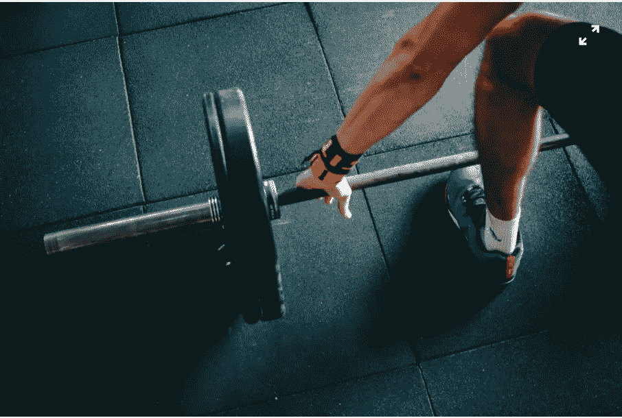
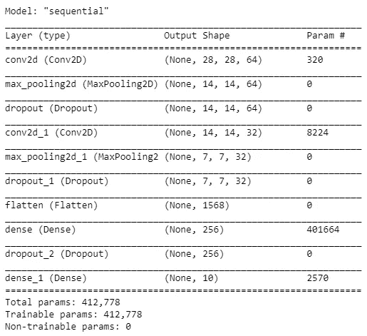
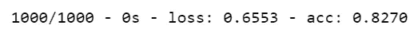
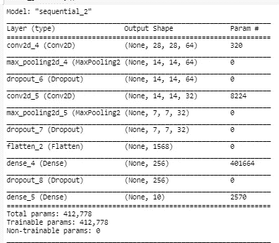
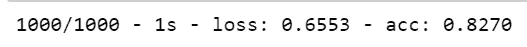
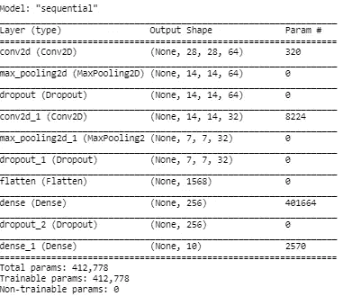
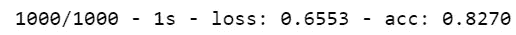

# 使用 JSON 和 YAML 文件保存和加载 Keras 模型

> 原文：<https://towardsdatascience.com/saving-and-loading-keras-model-42195b92f57a?source=collection_archive---------7----------------------->

## 使用 JSON 和 YAML 文件保存和加载深度学习模型的快速简单的方法



维克托·弗雷塔斯在 Unsplash 上的照片

> 你如何与在世界不同地方工作的其他团队成员分享你训练的深度学习模型，或者如何在训练期间或之后保存深度学习模型及其训练的权重，或者如何从你停止的地方恢复模型的训练？

**要回答以上问题我们需要保存一下**

*   **模型建筑**
*   **模型的训练权重或参数**

共享保存的文件将允许其他人重新创建模型来进行推理或从您停止的地方继续进一步的训练。可以通过加载模型来重新创建模型，并从包含模型架构和预训练权重的保存文件中训练权重。

使用不同的方法来保存和加载深度学习模型

*   **JSON 文件**
*   **YAML 档案**
*   **检查点**

在本文中，您将学习如何将 Keras 开发的深度学习模型保存为 JSON 或 YAML 文件格式，然后重新加载该模型。

为了保存模型，我们首先创建一个基本的深度学习模型。我使用了时尚 MNIST 数据集，我们用它来保存，然后用不同的方法重新加载模型。

我们需要安装两个库:`**pyyaml and h5py**`

```
**pip install pyyaml
pip install h5py**
```

我用的是 Tensorflow 1.14.0

```
#Importing required libararies
**import os
import tensorflow as tf
from tensorflow import keras**#Loading Fashion MNIST dataset
**(train_images, train_labels), (test_images, test_labels) = tf.keras.datasets.fashion_mnist.load_data()**#creating a smaller dataset 
**train_labels = train_labels[:1000]
test_labels = test_labels[:1000]**#Normalizing the dataset
**train_images = train_images[:1000].astype('float32') / 255
test_images = test_images[:1000].astype('float32') / 255**# Reshaping the data for inputing into the model
**train_images = train_images.reshape((train_images.shape[0],  28, 28,1))
test_images = test_images.reshape((test_images.shape[0],  28, 28,1))**#Defining and compiling the keras model
**def create_model():
    model = tf.keras.Sequential()
    # Must define the input shape in the first layer of the neural network
    model.add(tf.keras.layers.Conv2D(filters=64, kernel_size=2, padding='same', activation='relu', input_shape=(28,28,1))) 
    model.add(tf.keras.layers.MaxPooling2D(pool_size=2))
    model.add(tf.keras.layers.Dropout(0.3))
    model.add(tf.keras.layers.Conv2D(filters=32, kernel_size=2, padding='same', activation='relu'))
    model.add(tf.keras.layers.MaxPooling2D(pool_size=2))
    model.add(tf.keras.layers.Dropout(0.3))
    model.add(tf.keras.layers.Flatten())
    model.add(tf.keras.layers.Dense(256, activation='relu'))
    model.add(tf.keras.layers.Dropout(0.5))
    model.add(tf.keras.layers.Dense(10, activation='softmax'))** #Compiling the model **model.compile(loss='sparse_categorical_crossentropy',
             optimizer='adam',
             metrics=['accuracy'])

    return model**# Create a basic model instance
**model = create_model()****model.summary()**
```



# 使用 JSON 文件保存和加载模型架构

将模型保存和加载到 JSON 文件的步骤

*   将训练数据拟合到模型中
*   使用 **to_json()** 将模型架构保存到 JSON 文件中。返回的字符串将保存在一个 JSON 文件中
*   使用 **save_weights()** 保存训练好的重量
*   通过读取 JSON 文件从 JSON 文件中重新加载模型架构，然后使用 **model_from_json()** 将模型架构重新加载到新模型中
*   将使用 **load_weights()** 重新加载已训练的重量

**将列车数据拟合到模型中**

```
#Fit the train data to the model **model.fit(train_images, 
          train_labels,  
          batch_size=64,
          epochs=100,
          validation_data=(test_images,test_labels))**
```

**将模型架构和权重保存到 JSON 文件**

使用 ***to_json()*** 将模型架构写入 JSON 文件，并使用***save _ weights()***保存训练好的模型的权重

```
**from keras.models import model_from_json**# serialize model to json
**json_model = model.to_json()**#save the model architecture to JSON file
**with open('fashionmnist_model.json', 'w') as json_file:
    json_file.write(json_model)**#saving the weights of the model
**model.save_weights('FashionMNIST_weights.h5')**#Model loss and accuracy
**loss,acc = model.evaluate(test_images,  test_labels, verbose=2)**
```



原始模型的损失和准确性

**将模型架构从 JSON 文件重新加载到新模型**

我们已经创建了一个新的模型: ***model_j*** ，它将与保存的模型具有相同的架构

我添加了 glorot_uniform 库，因为我得到了初始化器的警告

```
**from keras.initializers import glorot_uniform**
#Reading the model from JSON file
**with open('fashionmnist_model.json', 'r') as json_file:
    json_savedModel= json_file.read()**#load the model architecture 
**model_j = tf.keras.models.model_from_json(json_savedModel)
model_j.summary()**
```



新模型与先前保存的模型具有相同的架构

**将训练好的重量重新加载到新模型中**

使用 ***load_weights()*** 将预训练的权重加载到新模型中

```
**model_j.load_weights('FashionMNIST_weights.h5')**
```

只有模型架构和预训练的权重被加载到新模型中，但是缺少模型编译细节，所以我们需要编译模型。

我们可以指定不同的优化器来编译模型，比如将优化器从 Adam 改为“Rmsprop”或“SGD”

```
#Compiling the model
**model_j.compile(loss='sparse_categorical_crossentropy',
         optimizer='SGD',
         metrics=['accuracy'])**
```

我们可以检查新模型的损失和准确性，以确认是否加载了相同的训练重量

```
loss,acc = model_j.evaluate(test_images,  test_labels, verbose=2)
```



使用 JSON 文件的新模型的测试数据的模型损失和准确性

# 使用 YAML 文件保存和加载模型架构

将模型保存和加载到 YAML 文件的步骤

*   将训练数据拟合到模型中
*   使用 **to_yaml()** 将模型架构保存到 YAML 文件中。返回的字符串将保存在 YAML 文件中
*   使用 **save()将训练好的重量保存在 H5 文件中。**
*   通过读取 YAML 文件从 YAML 文件中重新加载模型架构，然后使用 **model_from_yaml()** 将模型架构重新加载到新模型中
*   使用 **save()** 保存训练后的重量，并使用 **load_model()** 加载到新模型中

我们将使用之前的模型保存到 YAML 文件。我们不会再次拟合该模型，因为它已经被训练过了。

**将模型架构保存到 YAML 文件**

使用 ***to_yaml()*** 将模型架构写入 YAML 文件

```
#saving the model to a YAML file
**yaml_model= model.to_yaml()**# writing the yaml model to the yaml file
**with open('fashionmnist_yamlmodel.yaml', 'w') as yaml_file:
    yaml_file.write(yaml_model)**
```

**将模型架构从 YAML 文件重新加载到新模型**

从 YAML 中读取模型架构，并使用***model _ from _ YAML()***将其恢复为新模型 ***model_y***

我们得到了与原始模型相同的模型架构

```
**#Read  the model architecture from  YAML file**
**with open('fashionmnist_yamlmodel.yaml', 'r') as yaml_file:
    yaml_savedModel=yaml_file.read()**# Load the saved Yaml model
**from keras.models import model_from_yaml
model_y= tf.keras.models.model_from_yaml(yaml_savedModel)
model_y.summary()**
```



**使用 HDF5 格式的*Save()*****将权重保存在单个文件/文件夹**中

*   **模型的架构，以便我们可以随时随地重新创建它**
*   **模型的训练权重**
*   **训练配置如损失函数、优化器等。**
*   **优化器的状态**

**Save()有助于导出模型并重新创建整个模型，或者从您离开的地方继续训练。**

可以使用 ***load_model()、*** 恢复模型，这也负责使用保存的训练配置编译模型。

```
#saving the smodel's architecture, weights, and training configuration in a single file/folder.**model.save('fashionmnist.h5')**
```

**恢复模型**

```
# loading the model from the HDF5 file
**model_h5 = tf.keras.models.load_model('fashionmnist.h5')**
```

让我们在测试图像上评估新恢复的模型。注意，我们在这里没有编译模型

```
**loss,acc = model_h5.evaluate(test_images, test_labels, verbose=2)**
```



使用 YAML 文件的新模型的测试数据的模型损失和准确性

我们得到大致相同的损失和精度，因为我们没有在这里设置种子。

[保存模型并使用时尚 MNIST 重新加载模型的代码](https://github.com/arshren/save-and-load-model-and-weights/blob/master/Fashion%20MNIST-Save%20and%20load%20models.ipynb)

## 结论:

我们现在可以保存权重，并使用 JSON 文件或 YAML 文件将它们重新加载到一个新的模型中，这将允许您与世界分享您出色的深度学习工作，或恢复您的训练以获得更好的表现。

使用检查点保存和加载模型将在下一篇文章中讨论

## 参考资料:

 [## 保存和加载模型| TensorFlow 核心

### 您看到了如何将权重加载到模型中。手动保存它们与模型一样简单

www.tensorflow.org](https://www.tensorflow.org/tutorials/keras/save_and_load) 

[https://keras . io/getting-started/FAQ/# how-can-I-save-a-keras-model](https://keras.io/getting-started/faq/#how-can-i-save-a-keras-model)