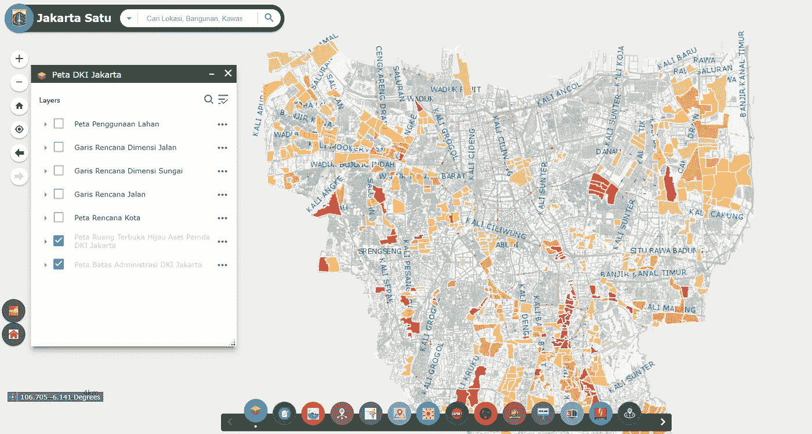
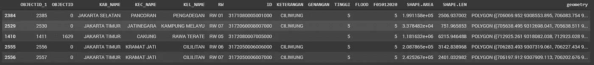
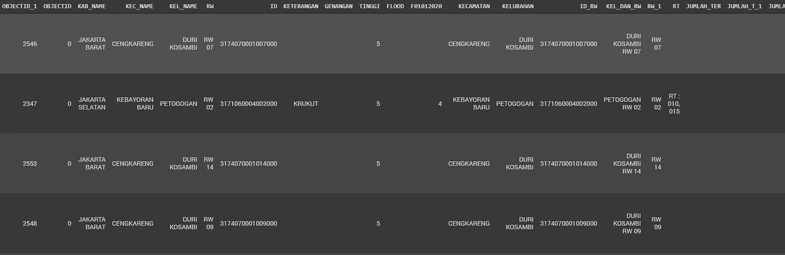
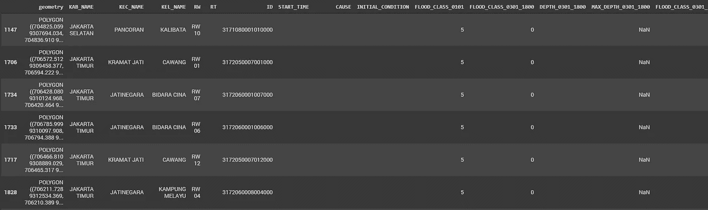
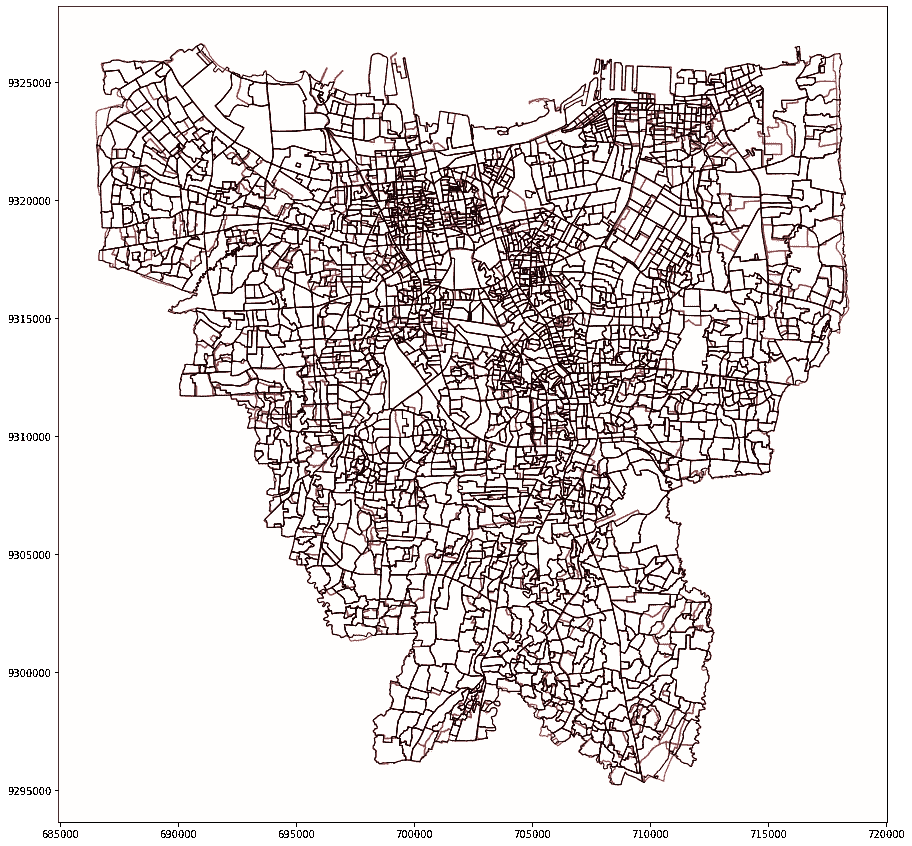
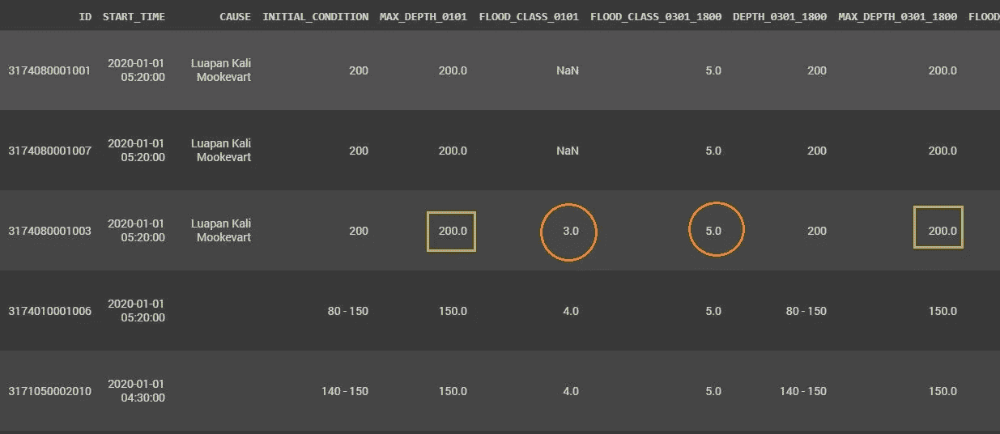
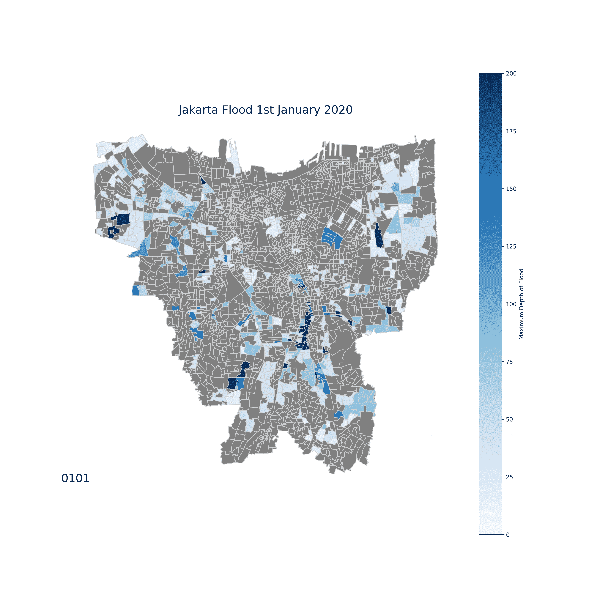

# 保存雅加达洪水数据以备不时之需

> 原文：<https://towardsdatascience.com/saving-jakarta-flood-data-for-a-rainy-day-d44695e487d6?source=collection_archive---------85----------------------->

## Python 如何帮助清理混乱的数据集，以便对未来的洪水监测进行潜在的改进


[乔丹·罗兰](https://unsplash.com/@yakimadesign?utm_source=medium&utm_medium=referral)在 [Unsplash](https://unsplash.com?utm_source=medium&utm_medium=referral) 上的照片

新的一年新的开始。嗯，对雅加达来说不是，它很快将成为印度尼西亚的非首都城市。当我们通常在那天晚上燃放烟花庆祝时，雅加达的人们却在忙着游泳。不过，方式不对。这场洪水破坏了雅加达的庆祝活动，而这几乎是一个传统。到 2020 年 2 月底，已经发生了 6 次。 ***六*** *。*

关于洪水灾害数据，雅加达政府已经与 petabencana.id 和灾害对策机构(BPBD 雅加达)合作，通过他们的官员或 petabencana.id 平台内的社区来监控洪水事件。最终产品将在一个名为 [Jakarta Satu](https://jakartasatu.jakarta.go.id/portal/apps/webappviewer/index.html?id=ee9940006aae4a268716c11abf64565b) 的平台上展示。最热门的产品是洪水地图，从 2020 年 1 月 1 日开始。问题是，给出的数据有多好？嗯，我不抱太大希望。我去过那里。



雅加达 Satu 平台，显示 2020 年 1 月 1 日的洪水事件

雅加达的洪水数据有点问题。好吧，这里没有糖衣。太可怕了。从平台上看，这张地图显然很漂亮，但在它背后？相反，这是一项有些草率的工作。尽管有一些有价值的信息，但数据管理从一开始就没有真正计划好，尤其是在 1 月 2 日更新之后。

洪水测绘数据可通过[中的 REST 服务获得，此处为](https://jakartasatu.jakarta.go.id/server/rest/services)。此处的目的是将自 1 月 1 日以来发生的许多洪水事件的数据合并，并将其整理成更整洁、更易读的数据。数据管理是使用本笔记本中的 Pandas 和 Geopandas 完成的。

# 1.数据和信息管理

## 初始条件

第一批数据和其他数据明显不一致。原始数据(1 月 1 日)仅关注洪水分类，用数字表示严重程度(1 表示低，5 表示非常高)。与此同时，1 月 3 日和其他日期的数据发生了重大变化，变得更加详细。意图是好的。但是，仍然有许多缺失值和空白列。

1 月 1 日有史以来第一次洪水列单:

```
[‘OBJECTID_1’, ‘OBJECTID’, ‘KAB_NAME’, ‘KEC_NAME’, ‘KEL_NAME’, ‘RW’, ‘ID’, ‘KETERANGAN’, ‘GENANGAN’, ‘TINGGI’, ‘FLOOD’, ‘F01012020’, ‘SHAPE.AREA’, ‘SHAPE.LEN’, ‘geometry’]
```



次日至最近(1 月 3 日-1 月 7 日)的栏目列表:

```
[‘OBJECTID_1’, ‘OBJECTID’, ‘KAB_NAME’, ‘KEC_NAME’, ‘KEL_NAME’, ‘RW’, ‘ID’, ‘KETERANGAN’, ‘GENANGAN’, ‘TINGGI’, ‘FLOOD’, ‘F01012020’, ‘KECAMATAN’, ‘KELURAHAN’, ‘ID_RW’, ‘KEL_DAN_RW’, ‘RW_1’, ‘RT’, ‘JUMLAH_TER’, ‘JUMLAH_T_1’, ‘JUMLAH_T_2’, ‘JUMLAH_T_3’, ‘JUMLAH_T_4’, ‘JUMLAH_T_5’, ‘JUMLAH_PEN’, ‘JUMLAH_P_1’, ‘LOKASI_PEN’, ‘MULAI’, ‘KONDISI_AW’, ‘KETINGGIAN’, ‘KETERANG_1’, ‘WAKTU_SURU’, ‘PENANGANAN’, ‘PENANGAN_1’, ‘PENANGAN_2’, ‘PENANGAN_3’, ‘BANTUAN’, ‘TINGGI_MAX’, ‘Shape__Are’, ‘Shape__Len’, ‘geometry’]
```



## 提高可读性

因此，为了整理出 1 月 1 日洪水的全面信息，必须提高可读性。以下是我目前所知道的，并相应地重新命名:

*Kab_name to ID 栏* : *行政* *信息| mulai:洪水监测时间| keterang_1:可能的洪水原因| kondisi_aw:初始条件| f 010102020:1 月 1 日洪水| tinggi:洪水深度| keting gi:洪水严重程度指数|tinggi_max:最大深度*

```
# Get the only valuable column for the analysis
flood_period_one = flood_0301_1800[[‘KAB_NAME’, ‘KEC_NAME’, ‘KEL_NAME’, ‘RW’, ‘RT’, ‘ID’, ‘MULAI’, ‘KETERANG_1’, ‘KONDISI_AW’, ‘F01012020’, ‘TINGGI’, ‘KETINGGIAN’, ‘TINGGI_MAX’, ‘geometry’]]# Rename them with proper naming to improve readability
flood_period_one.columns = [‘KAB_NAME’, ‘KEC_NAME’, ‘KEL_NAME’, ‘RW’, ‘RT’, ‘ID’, ‘START_TIME’, ‘CAUSE’, ‘INITIAL_CONDITION’, ‘FLOOD_CLASS_0101’, ‘FLOOD_CLASS_0301_1800’, ‘DEPTH_0301_1800’, ‘MAX_DEPTH_0301_1800’, ‘geometry’]
```

## 合并数据帧

后来，洪水泛滥被证明持续到 1 月 7 日左右。为了给出一个更广阔的视角，我将它们结合起来(从 1 月 3 日午夜到 1 月 7 日晚上)来看洪水每天的发展，从最高到最低的状态。将它们组合在一起的关键在于“ID”列。

```
# List of data that need to merge
flood_event = [flood_0301_2400, flood_0401_0600, flood_0401_1200, flood_0401_1800, flood_0401_2400,flood_0501_0600, flood_0501_1200, flood_0501_1800, flood_0501_2400,flood_0601_1800, flood_0601_2400,flood_0701_1800]#Join all the dataframe
from functools import partial, reduce
flood_merge = partial(pd.merge, on=['ID'], how='left')
flood_result = reduce(flood_merge, flood_event)
```

为了简化必要的数据，我将数据整理成关于洪水深度的具体数据。

```
# Take the ID before filtering commenced
flood_ID= flood_result[['ID']].copy()# Filtering the column list with Regex to ease up the job
flood_nextday = flood_result.filter(like=’TINGGI’,axis=1).copy()#Rename the column list
flood_nextday.columns = [‘FLOOD_CLASS_0301_2400’, ‘DEPTH_0301_2400’, ‘MAX_DEPTH_0301_2400’,‘........', ‘FLOOD_CLASS_0701_1800’, ‘DEPTH_0701_1800’, ‘MAX_DEPTH_0701_1800’]# Then join them together with concat()
flood_join  = pd.concat([flood_ID, flood_nextday], axis=1).reindex(flood_result.index)
```

最后，我们用这个把它们粘在一起。

```
# Merge from the first our clean dataframe called period_one
flood_1Jan = flood_period_one.merge(flood_join, how=’left’, on=’ID’)# Move the geometry to the first column index
flood_1Jan = flood_1Jan[[col for col in flood_1Jan.columns if col != 'geometry' ] + ['geometry']]#Show the result
flood_1Jan.sort_values(by='FLOOD_CLASS_0101', ascending=False).head()
```



但是，有许多关于内容和缺失数据的担忧，因此需要采取进一步的行动来实现近乎完美。

## 洪水可能原因

该信息还包括导致该事件的可能因素的原因。尽管有这样的意图，但数据提供得并不好，缺少很多值。这些信息几乎包含了这样的文字，例如:'**Penyebab:Lua pan Kali Krukut**'表示洪水来自 kru Kut 海峡。所以我只打算删除文本‘Penyebab’(cause)，因为它与进一步的处理无关。

```
flood_1Jan[‘CAUSE’] = flood_1Jan[‘CAUSE’].str[10:]
```

## 日期和时间

洪水监测时间在 START_TIME 列中给出。但是，该列是在字符串列上形成的。我建议这应该是一个日期时间对象。大部分初始数据看起来是这样的。

> 拉布，2020 年 1 月 1 日，普库尔 05:00 WIB

我们需要消除日名(拉布/星期三)、普库尔(时间)和 WIB(当地时间)

```
#Split between the comma and whitespace
date_split = flood_1Jan[‘START_TIME’].str.split(‘, ‘ , expand = True)#Get the index 1 column which consist of date (1 Januari 2020) and map in dictionary.
date_split[1] = date_split[1].map({’01 Januari 2020': ‘01–01–2020’, ’02 Januari 2020': ‘02–01–2020’})
date = date_split[1]#Assign the time data from index 2 of data split and split again then replace the '.' with ':' 
time = date_split[2].str.split(‘ ‘ , expand = True)
time = time[1].str.replace(‘.’, ‘:’)
```

然后，用**转换成 DateTime 对象。strptime**

```
from datetime import datetime
date_time = date + ‘, ‘+ time
date_time = date_time.astype(str)
flood_1Jan[‘START_TIME’].update(date_time)
flood_1Jan[‘START_TIME’] = flood_1Jan[‘START_TIME’].apply(lambda x: datetime.strptime(x,’%d-%m-%Y, %H:%M’ if x != ‘nan’ else x))
```

# 2.错误的管理数据

使用的管理数据是不同的。1 月份的洪水数据使用的是 2013 年数据的底图，而 2 月份的数据使用的是 2019 年的最新数据。这是相当独特的，因为这是一个提供准确性的问题。2013 年的数据在某些时候很麻烦。

```
ax = boundaries_january.plot(figsize=(15,15), facecolor=’none’, edgecolor=’red’)
boundaries_february.plot(ax=ax, facecolor=’none’, edgecolor=’black’)
```



基于 2013 年(红色)和 2019 年(黑色)的行政空间数据使用不当

是的，他们对自己的产品感到困惑。是的，还在学习…

因此，为了解决这个问题，我需要在这两个数据之间匹配相似的数字。我最大的猜测是 ID 栏。但不幸的是，事实并非如此。ID 已经完全用不同的编码改变了。所以，目前，我只是让它保持原样。也许在本文的下一部分。

# 3.空白和缺失数据

有一些关于不同位置的深度范围的信息。虽然我认为这可能会造成一些混乱和无用的由于广泛的差距范围。例如，*10–150cm*在这种情况下没有发现帮助。但是在某些情况下可能会有帮助，所以我决定稍微整理一下数据。

```
# The flood depth range located on column started with 'DEPTH_' so just use filterdepth = list(flood_1Jan.filter(regex=’^DEPTH’,axis=1))
depth.append('INITIAL_CONDITION')#Replace certain text to maintain similarity between the datafor depth_range in depth:
flood_1Jan[depth_range] = flood_1Jan[depth_range].str.replace(‘ cm’, ‘’)
flood_1Jan[depth_range] = flood_1Jan[depth_range].str.replace(‘s.d’, ‘s/d’)
flood_1Jan[depth_range] = flood_1Jan[depth_range].str.replace(‘s/d’, ‘-’)
```

此外，flood 类列需要转换为数字，并将零值替换为 NaN。稍后，它将对时间序列分析有用。相信我。

```
flood_class = list(flood_1Jan.filter(regex=’^FLOOD’,axis=1))for floods in flood_class:
flood_1Jan[floods] = pd.to_numeric(flood_1Jan[floods])
flood_1Jan[floods] = flood_1Jan[floods].replace(0, np.nan)
```

因此，除 1 月 1 日洪水数据(F0101)外，其他数据没有最大深度值，仅给出了洪水等级。在我们之前的行动之后，洪水的深度范围大部分应该是这样的:**‘10–150’。**因此，我利用数据的长度捕捉到了最大值。这是因为有些数据的数量是固定的。

```
# Get the maximum depth of 1st January flood and convert to numeric
add_max_depth_0101 = flood_1Jan[‘INITIAL_CONDITION’].apply(lambda x: x.split(‘-’)[-1] if len(x) > 3 else x)
flood_1Jan[‘MAX_DEPTH_0101’] = pd.to_numeric(flood_1Jan[‘MAX_DEPTH_0101’])# Change column position
flood_1Jan.insert(10, ‘MAX_DEPTH_0101’, add_max_depth_0101)
```

因此，我用 1 月 1 日数据中使用的大部分类别范围来映射字典。这是根据一个已经填写好的值做出的假设。但是，它考虑许多方面来提供一条尽可能准确的信息。

```
class_dict = {5: 200, 4: 150, 3: 80, 2: 40, 1: 20}flood_1Jan[‘MAX_DEPTH_0101’] = flood_1Jan[‘MAX_DEPTH_0101’].fillna(flood_1Jan[‘FLOOD_CLASS_0101’])flood_1Jan[‘MAX_DEPTH_0101’] = flood_1Jan[‘MAX_DEPTH_0101’].map(class_dict).fillna(flood_1Jan[‘MAX_DEPTH_0101’])
```

# 4.错误的分类

所使用的分类不时会有所不同。例如，在同一个地方，洪水深度为 150 厘米。然而，从 1 月 1 日起使用的分类是 4 级，而 1 月 3 日的数据显示是 5 级。这里发生了一些不一致。



洪水事件之间不一致的分类

```
flood_1Jan[‘MAX_DEPTH_0101’] = flood_1Jan[‘MAX_DEPTH_0101’].fillna(flood_1Jan[‘FLOOD_CLASS_0101’])flood_1Jan[‘MAX_DEPTH_0101’] = flood_1Jan[‘MAX_DEPTH_0101’].map(class_dict).fillna(flood_1Jan[‘MAX_DEPTH_0101’])
```

根据 2020 年 1 月 3 日及其他日期的数据分类，最好遵循这种方法。分类是这样的:

> 11-30 厘米的 1 级<10 cm
> 2 级
> 31-70 厘米的 3 级
> 71-150 厘米的 4 级
> 150 厘米的 5 级>

为了从数据中重新分类所有的洪水分类，我做了这个魔术。

```
verify_flood = [
(flood_1Jan[‘MAX_DEPTH_0101’] >= 150),
(flood_1Jan[‘MAX_DEPTH_0101’] < 150) & (flood_1Jan[‘MAX_DEPTH_0101’] >= 80),
(flood_1Jan[‘MAX_DEPTH_0101’] < 80) & (flood_1Jan[‘MAX_DEPTH_0101’] >= 40),
flood_1Jan[‘MAX_DEPTH_0101’] < 40) & (flood_1Jan[‘MAX_DEPTH_0101’] >= 20),
(flood_1Jan[‘MAX_DEPTH_0101’] < 20),
]classifications = [5,4,3,2,1]flood_1Jan[‘FLOOD_CLASS_0101’] = np.select(verify_flood, classifications, default=np.nan)
```

问题解决了。数据现在可以交付了。

# 结论

大多数政府数据在数据准备和管理方面都很糟糕，没有未来的考虑。我知道在这些数据中可以利用很多东西，如果这些数据能够以良好的方式得到充分的处理，这些东西可能会在以后被证明是有益的。这就是我这么做的原因。

你知道吗，这个工作最终会有回报的。这只是第一次互动。这是接下来将要发生的剧透。这是雅加达洪水分析和可视化的下一步。

