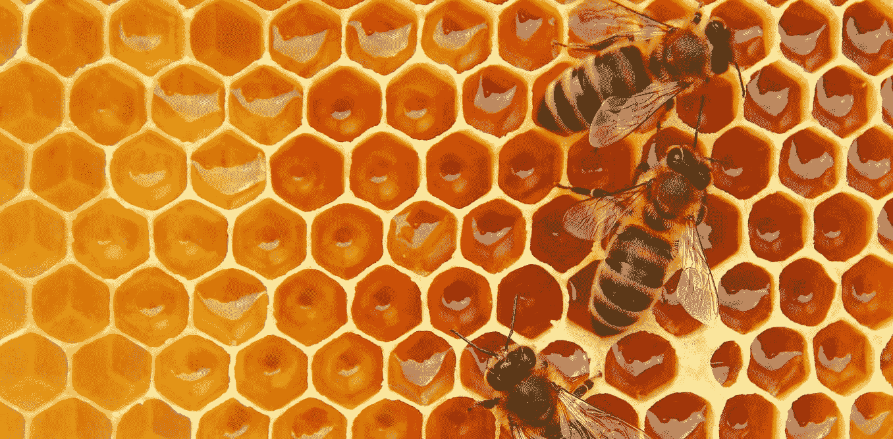
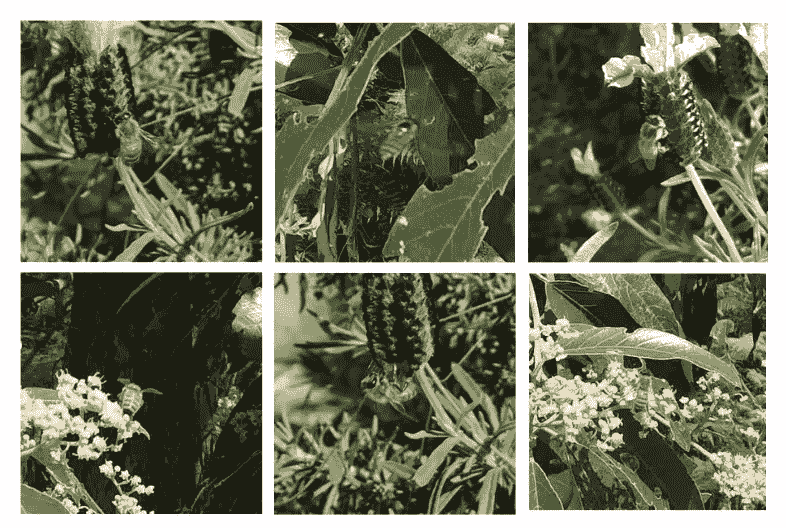
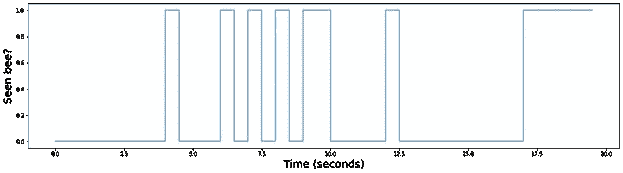
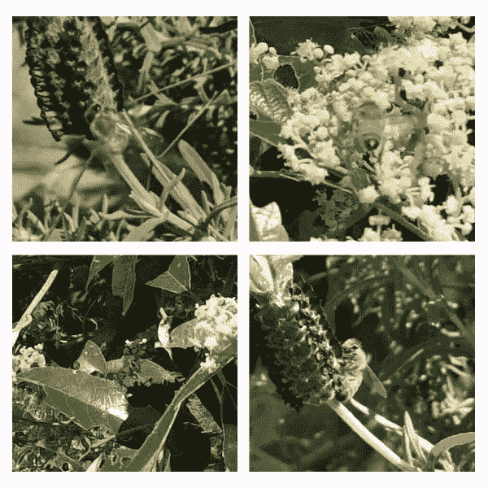

# 用机器学习拯救蜜蜂

> 原文：<https://towardsdatascience.com/saving-the-bees-with-machine-learning-9b2ec7189680?source=collection_archive---------34----------------------->

## [实践教程](https://towardsdatascience.com/tagged/hands-on-tutorials)

## 开发一个系统来帮助蜜蜂研究人员分析视频

图片来自 weter78/Shutterstock

W 如果没有蜜蜂，世界粮食供应链将会崩溃——大约三分之一的世界粮食产量依赖于蜜蜂。FDA 估计，在美国，蜜蜂授粉给农作物增加了 150 亿美元的价值(T4)。

蜜蜂在自然生态系统中也至关重要，交叉授粉的植物不能自我繁殖，间接为无数其他物种创造食物和住所。

鉴于蜜蜂在工业和环境中的巨大价值，越来越多的科学研究正在进行以了解它们的蜜蜂行为。

我有机会与蜜蜂产品合作研究中心合作，这是一个旨在促进澳大利亚蜜蜂产业发展的项目。CRCHBP 收集研究数据的主要方式之一是记录蜜蜂在其自然栖息地的高清视频。一段 20 秒的视频片段:

你看到右下角的蜜蜂了吗？

为了将这些视频转化为有用的统计数据，比如蜜蜂会拜访哪些花，会逗留多长时间，研究人员需要手动观看数百个小时的这些视频。这个过程可能需要**周**！机器学习能帮助我们吗？

## YOLO——别浪费时间了！

我的任务是开发一个系统，可以帮助识别视频中的蜜蜂，以加快分析过程。我得到了几个小时之前带注释的视频，所以我可以马上开始训练神经网络！

[YOLOv4](https://github.com/AlexeyAB/darknet) 是一个超级快速准确的物体检测框架，我用它创建了一个可以检测蜜蜂的模型。目前，它被认为是最先进的，所有技能水平的开发人员都可以使用。你只需要提供你自己的数据来训练一个定制的目标检测网络。

我将训练数据上传到了谷歌 Colab 笔记本电脑上，它提供了免费的 GPU——非常适合训练神经网络。编译 YOLO 就像把它粘贴到 Colab 实例中一样简单(我在这个项目中的所有代码都是[这里是](https://colab.research.google.com/drive/11aOWPZXCOkYLkBmV-ZV2n_Lj6WX49ZNk?usp=sharing)):

神经网络被训练的照片的例子

该网络在超过 40 万张蜜蜂图像上进行训练，总共花费了大约 2 周的时间。

在训练过程之后，网络可以以大约 90%的准确率识别静止图像中的蜜蜂。

为了检测视频中的蜜蜂，我们可以在每一帧上运行网络，然后将所有帧拼接在一起 Python OpenCV 库使这变得超级快速和简单。这个项目的所有代码都可以在这个 [Google Colab 链接](https://colab.research.google.com/drive/11aOWPZXCOkYLkBmV-ZV2n_Lj6WX49ZNk?usp=sharing)找到。您可以将它克隆到您自己的驱动器中，并将其用于您自己的数据集！

这是上一个视频的输出:

## 很好，但是这对研究人员有什么帮助呢？

我们可以编写一些自定义代码来跟踪屏幕上是否有蜜蜂。研究人员将从每一个处理过的视频中得到这个图表的副本。他们可以跳到视频中看到蜜蜂的地方。根据我的估计，蜜蜂只在大约 20%的时间里出现在视频中。

研究人员收到的输出图

有了这样的图表，任何分析视频的人都可以跳到最有趣的部分！由于视频通常长达数小时，这就节省了大量时间。

## 外卖食品

这是一个需要解决的有趣问题，看到这个系统部署在 CRCHBP 收集的万亿字节的数据上将是有益的。我从中得到的一点是有导师的重要性——西澳大利亚大学的马克·雷诺兹博士和杜惠恩博士在这个项目的整个完成过程中提供了巨大的帮助。

你成功了！非常感谢。如果你喜欢这篇文章，考虑把你的电子邮件放在下面我的邮件列表里！

如果你想和我谈谈，我的电子邮件是 gmail.com 的 chebthony。

