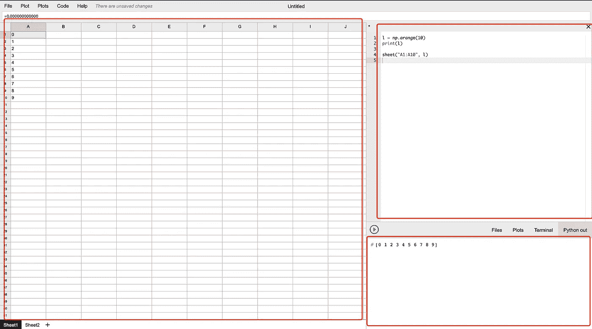
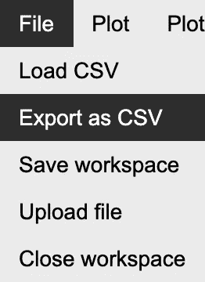
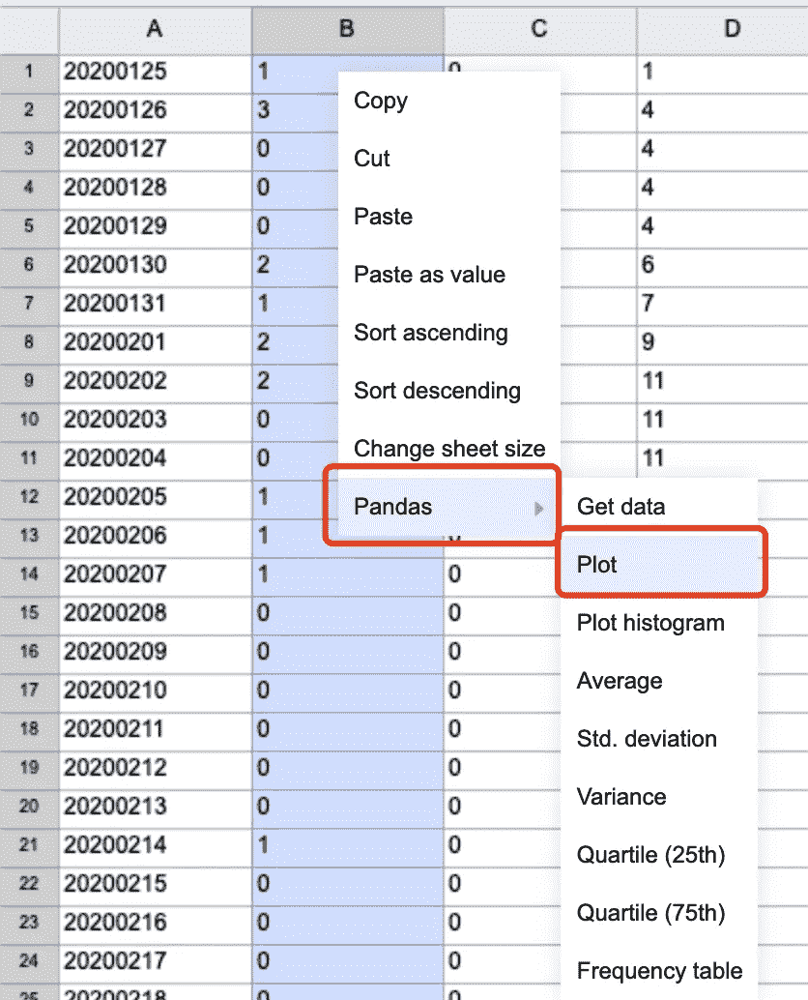
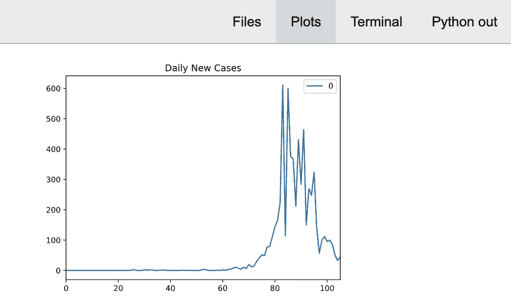
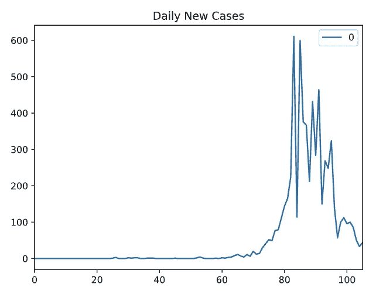
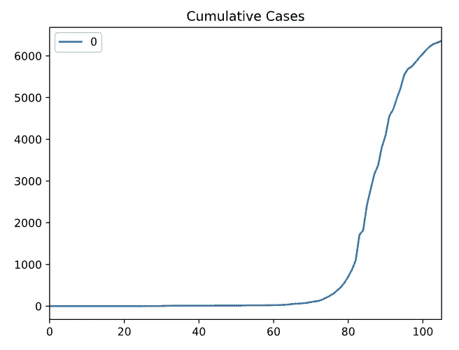
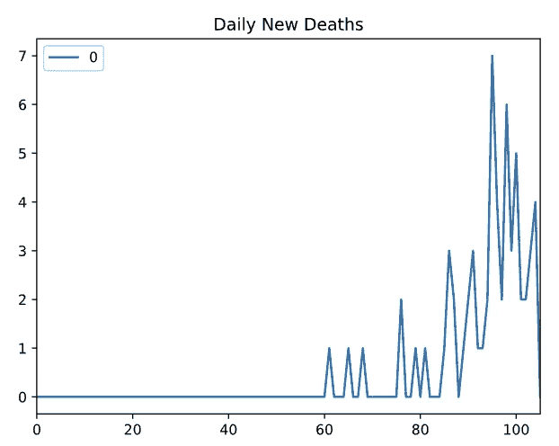
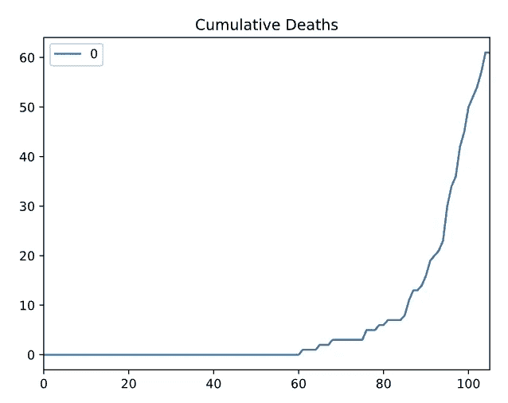

# 告别 Excel？使用新冠肺炎数据对 Python Grid Studio 进行简单评估

> 原文：<https://towardsdatascience.com/say-goodbye-to-excel-a-simple-evaluation-of-python-grid-studio-using-covid-19-data-90624f322b81?source=collection_archive---------1----------------------->


由 [xresch](https://pixabay.com/users/xresch-7410129/) 在 [Pixabay](https://pixabay.com/illustrations/analytics-information-innovation-3088958/) 拍摄的照片

## 具有 Python 编程语言技能的数据分析师/数据科学家的替代工具。

最近发现了一个优秀的开源项目“Grid Studio”。这个库结合了电子表格和 Python 在数据分析方面的优势。

你有没有想过

*   当您使用 MS Excel 时，您希望使用您的 Python 技能和库，如 Numpy、Pandas、SciPy、Matplotlib 和 Scikit-learn 来生成和操作数据
*   当您使用 Python 时，您可能认为需要数据的表格视图来实时了解当前数据集，但您能做的只是手动输出`df.head()`。

好的，这个库可以满足你的所有要求。

在一切之前，我们先来看看它是什么样子的。Grid Studio 是一个基于 Web 的应用程序。这是网络用户界面。



用户界面分为 3 个主要面板。

1.  电子表格，与流行软件如 Excel 和 Google Sheets 相同。
2.  代码区，您可以在其中编写 python 代码。
3.  File/Plots/Terminal/Stdout 窗口，将这 4 个窗口聚合为不同的选项卡。

因此，有了这个库，你就可以像 Jupyter/iPython 一样使用代码区编写你的 Python 代码并逐行运行，而“Python out”窗口会显示结果。此外，您还可以将您的熊猫数据框同步到电子表格，以便立即查看。

# 装置


Bret Kavanaugh 在 [Unsplash](https://unsplash.com?utm_source=medium&utm_medium=referral) 上拍摄的照片

先说 Grid Studio 的安装。您需要在本地机器上安装 docker 来运行源代码。如果你现在没有 docker 桌面，你可以从这里下载:

[](https://www.docker.com/products/docker-desktop) [## 用于 Mac 和 Windows 的 Docker 桌面

### 在你的桌面上容器化应用程序的最快方法是 MacOS 和 Windows 的应用程序…

www.docker.com](https://www.docker.com/products/docker-desktop) 

之后，在 GitHub 克隆 repo:

[](https://github.com/ricklamers/gridstudio) [## ricklamers/gridstudio

### Grid studio 是一个基于 web 的电子表格应用程序，完全集成了 Python 编程语言。它打算…

github.com](https://github.com/ricklamers/gridstudio) 

```
git clone [https://github.com/ricklamers/gridstudio](https://github.com/ricklamers/gridstudio)
```

然后，只需转到它的根文件夹并运行启动脚本:

```
cd gridstudio && ./run.sh
```

等待 docker 获取所有组件可能需要几分钟时间。此后，您将能够访问 Web 用户界面，网址为

```
[http://localhost:8080/](http://localhost:8080/dashboard/)
```

# 新冠肺炎数据的分析示例


[Webaroo](https://unsplash.com/@webaroo?utm_source=medium&utm_medium=referral) 在 [Unsplash](https://unsplash.com?utm_source=medium&utm_medium=referral) 上拍摄的照片

我不喜欢为了举例而写例子。所以，我们用一些真实的数据，用 Grid Studio 做一些基础的数据分析。

我们可以在这里得到新冠肺炎确诊病例的数据:

[](https://www.ecdc.europa.eu/en/publications-data/download-todays-data-geographic-distribution-covid-19-cases-worldwide) [## 下载今天全球新冠肺炎病例地理分布的数据

### 每天在欧洲中部时间 6:00 到 10:00 之间，一组流行病学家筛选多达 500 个相关来源，以收集…

www.ecdc.europa.eu](https://www.ecdc.europa.eu/en/publications-data/download-todays-data-geographic-distribution-covid-19-cases-worldwide) 

下载 CSV 文件格式的数据，其中包含世界上所有国家的新冠肺炎数据。

## 将数据加载到电子表格

```
# Read all data
df = pd.read_csv("[https://opendata.ecdc.europa.eu/covid19/casedistribution/csv](https://opendata.ecdc.europa.eu/covid19/casedistribution/csv)").dropna()
print(df.head())
```

我们可以通过链接直接阅读在线 CSV 文件。这里我觉得 Grid Studio 有一个改进。也就是说，它不像 Jupyter 笔记本那样可以即时打印你的变量。如果你想打印你的变量，你必须使用`print`方法。

另一个限制是，看起来电子表格不太支持`datetime`类型。在测试过程中，我发现它不能显示`datetime64[ns]`类型的熊猫栏。所以，我想把`dateRep`列转换成整数。

```
# Convert date to integer (because of Grid Studio limitation)
df.dateRep = pd.to_datetime(df.dateRep, format='%d/%m/%Y').dt.strftime('%Y%m%d').astype(int)
```

## 转换数据

首先，让我们按国家过滤数据。例如，我只对澳大利亚的数据感兴趣。

```
# Get Australia data
df_oz = df[df.countriesAndTerritories == 'Australia']
```

然后，我们将只选择`dateRep`、`cases`和`deaths`列。

```
# Retain only date, cases and deaths columns
df_oz = df_oz[['dateRep', 'cases', 'deaths']]
```

之后，按日期对数据框进行排序，这样我们就可以计算累计病例和死亡人数。

```
# Calculate cumulative cases & deaths
df_oz = df_oz.sort_values('dateRep')
df_oz['cumCases'] = df_oz.cases.cumsum()
df_oz['cumDeaths'] = df_oz.deaths.cumsum()
```

## 将数据呈现到电子表格中

现在，我们的熊猫数据框中应该有 5 列，分别是日期、新病例、新死亡、累计病例和累计死亡。让我们将数据框呈现到电子表格中。

```
# Show in sheet
sheet("A1", df_oz)
```

Grid Studio 使这一点变得非常容易。通过调用它的 API `sheet`，我们简单地指定将呈现数据框的左上角单元格，然后传递数据框变量。


如果您想显示标题，您也可以在`sheet`方法中指定`header=True`。

## 电子表格中的更多功能

当数据在电子表格中时，我们可以像使用其他常规软件如 Excel 和 Google Sheets 一样使用它。我就不演示`SUM`、`AVG`等公式特性了。每个人都很熟悉。

最有用的功能之一是您可以轻松地将电子表格导出为 CSV 格式。这意味着我们可以使用 Pandas data frame 的强大功能轻松下载和转换数据，然后导出以使用其他软件做进一步的分析。



另一个我认为非常有用的方法是通过点击使用`matplotlib`绘制数据。例如，如果我们想要绘制每天的新案例，只需简单地选择“新案例”列并右键单击它，如下图所示。



然后，在右下角，您可以在“绘图”选项卡中找到该绘图。



事实上，Grid studio 已经通过自动生成代码完成了这个情节。下面是为上面的图表生成的代码。

```
data = sheet("B1:B106")
data.plot()
show()
```

因此，如果有必要，我们可以添加一些注释。例如，我们可以给这个图表添加一个标题:

```
data = sheet("B1:B106")
data.plot(title='Daily New Cases')
show()
```



类似地，我们可以使用相同的程序分别绘制 4 列。接下来的 3 个图表是通过简单的点击和添加标题生成的，总共花了我 30 秒！



很明显，使用 Grid Studio 来执行一些简单的数据分析会非常快速和方便。感谢作者[里克·拉默斯](https://github.com/ricklamers)提出了这个惊人的想法。

# 局限性和未来的改进


照片由[桑嘎日玛罗曼塞利亚](https://unsplash.com/@sxy_selia?utm_source=medium&utm_medium=referral)在 [Unsplash](https://unsplash.com?utm_source=medium&utm_medium=referral) 拍摄

虽然我很喜欢这个结合了电子表格和 Python 的应用程序的想法，但我不得不说它离成熟还很远。在我看来，至少需要解决和实施一些限制和潜在的改进:

1.  应该支持所有的熊猫数据类型
2.  应该实现更多的电子表格的功能，大多数类似的应用程序会有，如拖动填充
3.  电子表格中有一些需要修复的错误，例如，加载的数据似乎停留在内存中，可能无法从电子表格中删除。
4.  建议:如果我们能把这张纸和熊猫的数据框装订在一起就太好了。也就是说，当您修改图纸时，数据框会更新，反之亦然。
5.  建议:如果 Python 的 stdout 输出可以转换成带有`[1]:`行号的 iPython 样式就太好了，这样调试起来会容易很多。

[](https://medium.com/@qiuyujx/membership) [## 通过我的推荐链接加入 Medium 克里斯托弗·陶

### 作为一个媒体会员，你的会员费的一部分会给你阅读的作家，你可以完全接触到每一个故事…

medium.com](https://medium.com/@qiuyujx/membership) 

如果你觉得我的文章有帮助，请考虑加入 Medium 会员来支持我和成千上万的其他作者！(点击上面的链接)