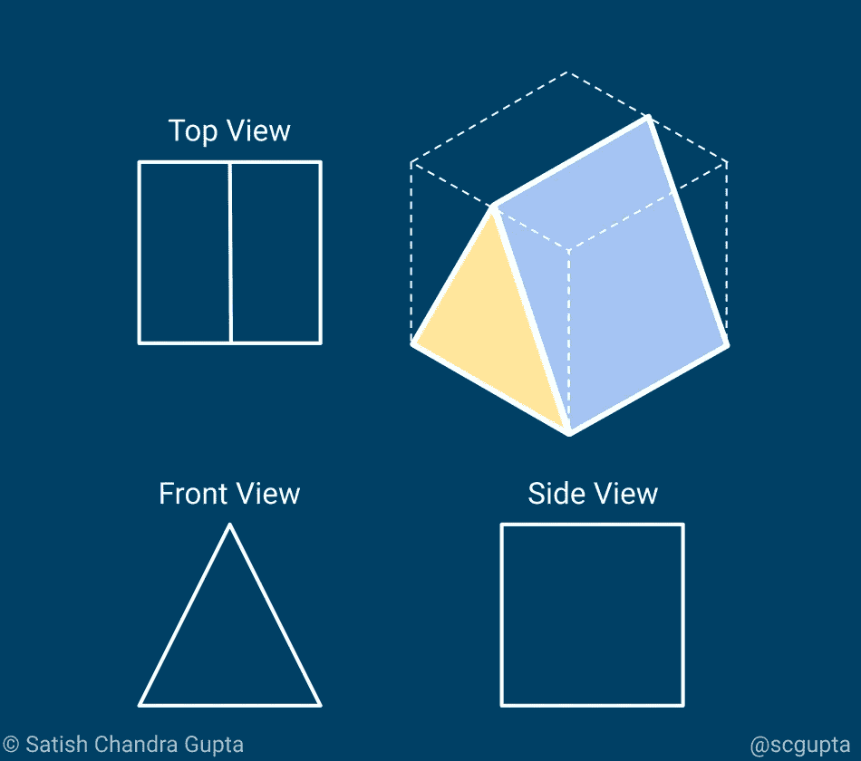
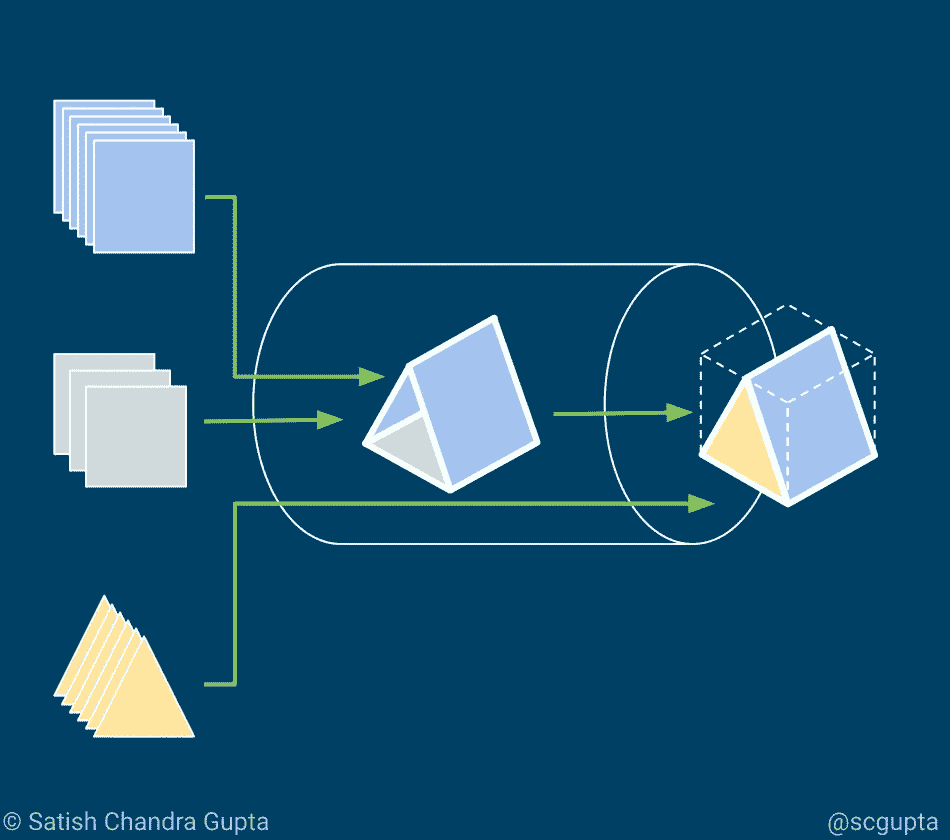
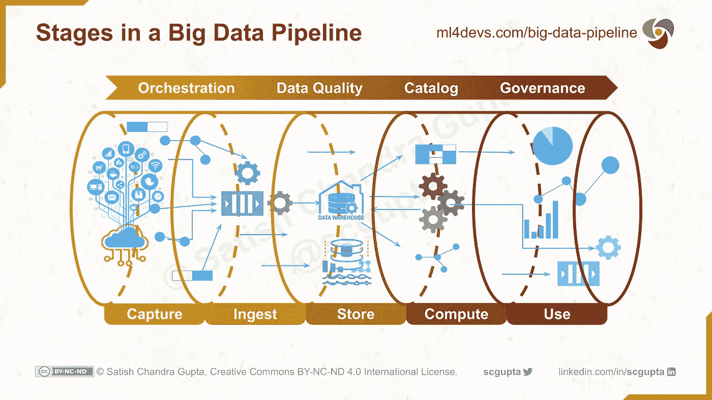
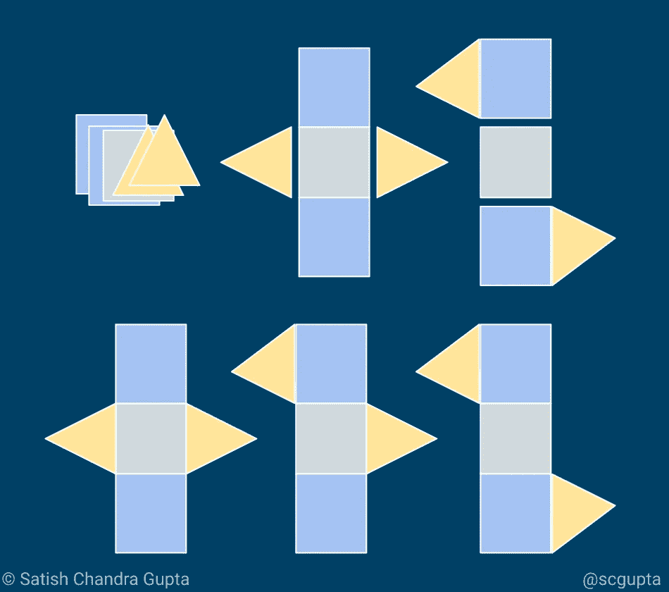
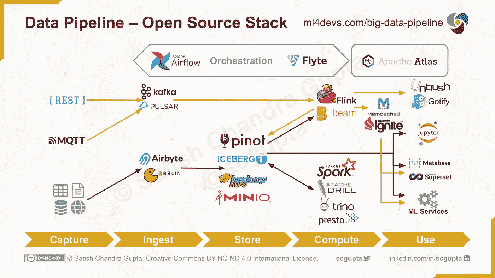
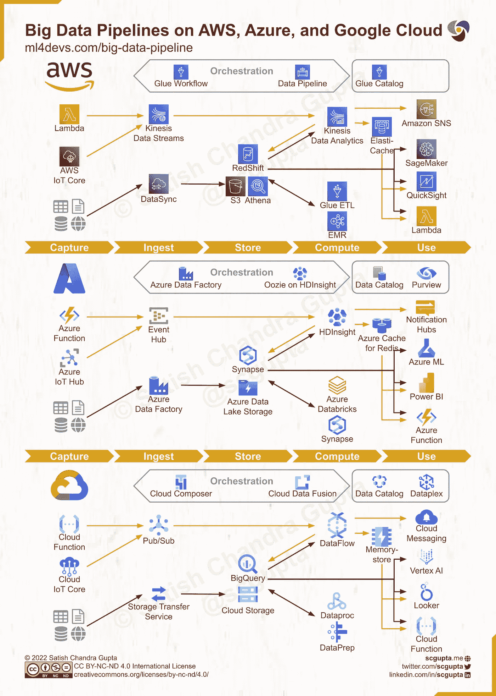
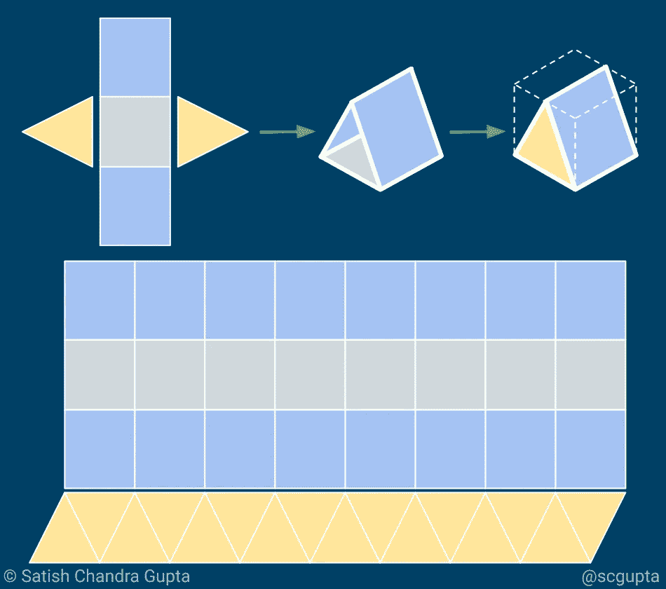

# 基于云的高吞吐量低延迟大数据管道架构

> 原文：<https://towardsdatascience.com/scalable-efficient-big-data-analytics-machine-learning-pipeline-architecture-on-cloud-4d59efc092b5?source=collection_archive---------0----------------------->

来源:图片由 [JuraHeep](https://pixabay.com/users/jurakovr-3023036/) 来自 [Pixabay](https://pixabay.com/illustrations/pipeline-water-flange-template-1566044/)

## 数据工程

## 可扩展和高效的数据管道对于分析、数据科学和机器学习的成功非常重要，就像可靠的供应线对于赢得战争一样重要。

***更新免费版:*** [*可扩展的高效大数据管道架构*](https://www.ml4devs.com/articles/scalable-efficient-big-data-analytics-machine-learning-pipeline-architecture-on-cloud/)

对于在现实世界中部署大数据分析、数据科学和机器学习(ML)应用程序，分析调整和模型训练只占工作的 25%左右。大约 50%的工作用于为分析和 ML 准备数据。剩下的 25%的努力用于使洞察力和模型推论易于大规模使用。大数据管道将所有这些整合在一起。这是一条铁路，曼梯·里的重型货车在这条铁路上行驶。长期的成功取决于正确的数据管道。

本文通过以下四个部分介绍了数据管道并概述了大数据架构的替代方案:

*   **视角:**通过了解所有利益相关者的视角，你可以增强工作的影响力。本节解释了各种观点，并研究了数据管道所需的工程特性。
*   **管道:**在本节中，您将了解大数据管道经过**数据湖**和**数据仓库**的概念性**阶段**。
*   **可能性:**在这一部分，您将了解用于平衡规模和速度的 **lambda 架构**，以及用于大数据架构关键组件的**技术选择**。你还会在 **AWS** 、 **Azure** 和 **Google Cloud** 上瞥见**无服务器**管道。
*   **生产:**本节提供了在生产中成功部署大数据管道的技巧。

# 远景

**视角:**视角取决于有利位置。

构建数据分析或机器学习应用程序涉及三个利益相关方:数据科学家、工程师和业务经理。

从数据**科学**的角度来看，目标是 ***使用可用数据为给定问题找到****最健壮*和计算*最便宜*的模型。

从**工程**的角度来看，目的是 ***建造*** 东西，让*别人*可以*依赖；通过创造新的东西*或者寻找更好的方式来创造现有的东西，这些东西可以 24x7 运行*而不需要太多人工干预。*

*从**业务**角度来看，目的是 ***向顾客传递*** *价值*；科学和工程是实现这一目标的手段。*

*在本文中，我们将重点关注工程视角，特别是处理 ML 应用程序中所需的大量数据的方面，同时考虑其他视角。数据管道的理想工程特性是:*

*   ***可访问性:**数据科学家可以方便地访问数据以进行假设评估和模型实验，最好是通过查询语言。*
*   ***可伸缩性:**随着数据量的增加而伸缩，同时保持低成本的能力。*
*   ***效率:**数据和机器学习结果在指定的延迟内准备就绪，以满足业务目标。*
*   ***监控:**关于数据和管道健康状况的自动警报，需要对潜在的业务风险做出主动响应。*

# *管道*

**

***管道:**运转良好的大数据管道是机器学习成功的必备条件。*

*数据的价值只有在转化为可操作的洞察力后才能释放出来，并且这种洞察力必须及时交付。*

*一条**数据管道**将端到端的操作缝合在一起，包括*收集*数据、*将* it 转化为洞察力、*培训*模型、*交付*洞察力、*应用*模型，无论何时何地都需要采取行动来实现业务目标。*

> *数据是新的石油。它很有价值，但如果不提炼，就不能真正使用。必须把它变成气体、塑料、化学物质等。创建一个有价值的实体，推动盈利活动；因此，必须对数据进行分解和分析，使其具有价值。
> —克莱夫·亨比，英国数学家，乐购俱乐部卡的设计师*

*数据管道有五个阶段，分为三个部分:*

*   ***数据工程:**捕获、摄取、准备(大约 50%的工作量)*
*   ***分析/机器学习:**计算(大约 25%的工作量)*
*   ***交付:**演示(约 25%的工作量)*

***抓取:**数据源(手机 app、网站、web apps、微服务、物联网设备等。)被装备以捕获相关数据。*

***接收:**测量源将数据泵入各个入口点(HTTP、MQTT、消息队列等)。).也可能有从谷歌分析等服务导入数据的工作。数据可以有两种形式:blobs 和 streams。所有这些数据都被收集到一个数据湖中。*

***准备:**提取、转换、加载(ETL)操作是对数据湖中的数据块和流进行清理、符合、整形、转换和编目；使数据准备好供 ML 使用，并将其存储在**数据仓库**中。*

***计算:**这是分析、数据科学和机器学习发生的地方。计算可以是批处理和流处理的组合。模型和洞察(结构化数据和流)被存储回**数据仓库**。*

***展示:**洞察通过仪表盘、电子邮件、短信、推送通知和微服务交付。ML 模型推理被公开为微服务。*

**

*大数据管道中的阶段。*

## *数据湖与数据仓库*

*[**数据湖**](https://en.wikipedia.org/wiki/Data_lake) 包含通常以 blobs 或文件形式接收的所有自然/原始形式的数据。 [**数据仓库**](https://en.wikipedia.org/wiki/Data_warehouse) 存储清理和转换后的数据以及目录和模式。湖和仓库中的数据可以是各种类型的:结构化(关系)、半结构化、二进制和实时事件流。*

*湖和仓库是物理地保存在不同的商店中，还是通过湖上的某种接口(例如 [Hive](https://hive.apache.org/) 查询)来物化仓库，这是一个选择的问题。这种选择是由速度要求和成本限制决定的。*

> *无论采用哪种方法，保留用于审计、测试和调试目的的原始数据都很重要。*

## *探索性数据分析*

*探索性数据分析(EDA)的作用是分析和可视化数据集，并制定假设。它可能会暴露收集的数据中的差距，导致新的数据收集和实验，并验证一个假设。*

*您可以将它们视为小规模的 ML 实验，以瞄准一小组有前途的模型，这些模型在完整的数据集上进行比较和调整。*

*拥有一个维护良好的数据仓库，包括目录、模式和通过查询语言的可访问性(而不需要编写程序),有助于加快 EDA 的速度。*

# *可能性*

**

***可能性:**架构是性能和成本的权衡。有六个选项播种在这个形象，使一个三角形帐篷形状。从左上到右下，制作帐篷所需的胶水量逐渐减少。在 prod 中你会选择做哪一个？注意三角形的底边比另一边小，浅蓝色的那块是长方形而不是正方形。*

*数据管道、数据湖和数据仓库并不是新概念。过去，数据分析是使用批处理程序、SQL 甚至 Excel 表来完成的。现在发生变化的是促进机器学习的大数据的可用性，以及对实时洞察的需求不断增长。*

*有几种架构选择提供了不同的性能和成本权衡(就像随附图片中的选项一样)。我了解到技术上最好的选择不一定是生产中最合适的解决方案。您必须仔细检查您的需求:*

*   *需要实时洞察还是模型更新？*
*   *您的应用程序的过时容忍度是多少？*
*   *成本限制是什么？*

*根据这些问题的答案，您必须在 [Lambda 架构](https://en.wikipedia.org/wiki/Lambda_architecture)中平衡批处理和流处理，以满足您的吞吐量和延迟需求。Lambda 架构由三层组成:*

*   ***批处理层:**提供高吞吐量、全面、经济的 map-reduce 批处理，但延迟较高。*
*   ***速度层:**提供低延迟实时流处理，但成本较高，当数据量较大时可能会超出内存限制。*
*   ***服务层:**当准备好时，来自高吞吐量批处理的输出与流处理的输出合并，以预先计算的视图或特别查询的形式提供综合结果。*

*lambda 架构中的基本假设是源数据模型是*仅追加*，即摄取的事件被打上时间戳并追加到现有事件中，永远不会被覆盖。*

## *大数据架构:您对云堆栈的选择*

*下图显示了一个使用开源技术实现大数据管道所有阶段的架构。准备和计算阶段经常被合并以优化计算成本。*

**

*使用开源技术的大数据架构*

*大数据架构和技术选择的关键组件如下:*

*   ***HTTP / MQTT 端点**用于接收数据，也用于提供结果。这方面有几种框架和技术。*
*   ***发布/订阅消息队列**，用于接收高容量流数据。[卡夫卡](https://kafka.apache.org/)是目前事实上的选择。经过实战证明，它可以扩展到高事件摄取率。*
*   ***用于数据湖(和数据仓库)的低成本大容量数据存储**， [Hadoop HDFS](https://hadoop.apache.org/docs/stable/hadoop-project-dist/hadoop-hdfs/HdfsUserGuide.html) 或云 blob 存储，如 [AWS S3](https://aws.amazon.com/s3/) 。*
*   ***查询和目录基础设施**为了将数据湖转换成数据仓库，Apache [Hive](https://hive.apache.org/) 是一种流行的查询语言选择。*
*   ***Map-Reduce 批量计算**引擎，用于高吞吐量处理，例如 [Hadoop Map-Reduce](https://hadoop.apache.org/docs/current/hadoop-mapreduce-client/hadoop-mapreduce-client-core/MapReduceTutorial.html) ，Apache [Spark](https://spark.apache.org/) 。*
*   ***流计算**用于延迟敏感处理，例如 Apache [Storm](https://storm.apache.org/) ，Apache [Flink](https://flink.apache.org/) 。Apache [Beam](https://beam.apache.org/) 正在成为编写数据流计算的*和*选择。它可以部署在火花批流道或 Flink 流道上。*
*   ***数据科学和 ML 的机器学习框架**。 [Scikit-Learn](https://scikit-learn.org/) 、 [TensorFlow](https://www.tensorflow.org/) 和 [PyTorch](https://pytorch.org/) 是实现机器学习的热门选择。*
*   ***低延迟数据存储器**用于存储结果。根据数据类型和用例，有许多成熟的 [SQL 与 NoSQL](/datastore-choices-sql-vs-nosql-database-ebec24d56106) 数据存储选择。*
*   ***部署**编排选项有 [Hadoop YARN](https://hadoop.apache.org/docs/current/hadoop-yarn/hadoop-yarn-site/YARN.html) 、[Kubernetes](https://kubernetes.io/)/[kube flow](https://www.kubeflow.org/)。*

*规模和效率由以下杠杆控制:*

*   ***吞吐量**取决于摄取的**可伸缩性**(即 **REST/MQTT** 端点和**消息队列**)、数据湖**存储**容量和 **map-reduce 批处理**。*
*   ***延迟**取决于**消息队列**、**流计算**和**用于存储计算结果的数据库**的**效率**。*

## *大数据架构:无服务器*

*随着[无服务器计算](https://en.wikipedia.org/wiki/Serverless_computing)的出现，可以通过避免 DevOps 来快速启动。体系结构中的各种组件可以由所选云服务提供商提供的无服务器组件替代。*

***亚马逊网络服务**、**微软 Azure** 、**谷歌云平台(GCP)** 上大数据管道的典型无服务器架构如下图所示。每一个都与上一节讨论的大数据架构紧密相关。你可以把这些作为参考，入围适合你需求的技术。*

**

*亚马逊网络服务( **AWS** )、微软 **Azure** 、谷歌云平台( **GCP** )上的大数据管道架构。图片由作者提供，并在[Creative Commons BY-NC-ND 4.0 International](https://creativecommons.org/licenses/by-nc-nd/4.0/)许可下发布。*

# *生产*

**

*在制作中，简单常常胜过聪明。你可能会注意到，制作三角形帐篷的选择并不需要最少的胶水。所需零件的生产方式以及整体操作的简单性对于减少出错的可能性非常重要。*

*生产可能是不可操作的分析和机器学习的墓地。如果您不投资对管道的健康状况进行 24x7 的监控，每当一些趋势阈值被突破时就会发出警报，那么它可能会在没有人注意到的情况下失效。*

> *请注意，工程和运营支出不是唯一的成本。在决定架构时，也要考虑时间、机会和压力成本。*

*操作数据管道可能会很棘手。这里有一些我从惨痛的教训中学到的技巧:*

*   ***在扩展数据科学团队之前，扩展数据工程。** ML 车皮不先铺铁路就跑不了。*
*   ***在干净的数据仓库中勤奋工作。** ML 只和数据一样好。在定义正在收集的数据的模式、对其进行编目时要有纪律。如果没有这些，不要惊讶有多少*数据*在存储中永久腐烂，变成仅仅*字节*。*
*   ***开始简单。从无服务器开始，尽可能少地凑合。只有在投资回报合理的情况下，才转向成熟的渠道或您自己的部署。在计算阶段投资最少的 Bootstrap。通过调度一系列 SQL 查询和云函数来实现计算，甚至可以实现“无计算”。这将使整个管道准备得更快，并让您有充足的时间专注于将数据策略、数据模式和目录准备就绪。***
*   ***仅在仔细评估后构建。**业务目标是什么？你有什么手段来影响业务成果？哪些见解将具有可操作性？收集数据并在此基础上构建 ML。*

# *摘要*

*关键要点是:*

*   *调整分析和机器学习模型只需要 25%的努力。*
*   *尽早投资数据管道，因为分析和 ML 只和数据一样好。*
*   *确保勘探工作的数据易于访问。*
*   *从业务目标出发，寻求可行的见解。*

*我希望这篇文章对你有用。对于在生产中构建一个健壮的数据管道，你有什么技巧和诀窍？请在评论中分享。*

***如果您喜欢，请:***

******

**原载于*[*ML4Devs.com*](https://www.ml4devs.com/articles/scalable-efficient-big-data-analytics-machine-learning-pipeline-architecture-on-cloud/)。*