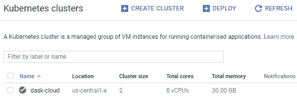

# 基于谷歌云的 Dask 可扩展机器学习

> 原文：<https://towardsdatascience.com/scalable-machine-learning-with-dask-on-google-cloud-5c72f945e768?source=collection_archive---------27----------------------->

## Dask 为您的数据科学工具库增添了一大利器，它为您提供了大规模计算的高级并行性


Paul Pasieczny 在 FreeImages.com 拍摄的照片

***于 2021 年 11 月 13 日更新，以反映在谷歌云*** 上设置 Dask 集群的最新步骤

许多人对 ask 进行了评估，并将其与其他工具进行了比较，包括 Spark、Ray 和 Vaex。它是与 Numpy、Pandas 和 Scikit-Learn 等其他社区项目合作开发的，绝对是扩展机器学习的一个很好的工具。

因此，本文的目的不是比较 Dask 的优缺点(为此，您可以参考本文末尾的参考链接)，而是添加到现有的关于 Dask 在云上部署的文档，特别是 Google Cloud。谷歌云为新注册用户提供了免费试用，所以你可以免费试用。

# 在 Google Cloud 上部署 Dask 的步骤

我们首先列出要采取的一般步骤，然后用截图详细说明每个步骤(随意点击每个步骤进行导航)。拥有一个 Google Cloud 帐户是关注本文的唯一前提。

1.  [创建 Kubernetes 集群](#a984)
2.  [设置舵](#5fae)
3.  [部署 Dask 进程和 Jupyter](#3c4b)
4.  [连接到 Dask 和 Jupyter](#fe44)
5.  [配置环境](#2d39)
6.  [移除你的集群](#22ec)

# 1.创建 Kubernetes 集群

我们的第一步是通过谷歌 Kubernetes 引擎(GKE)建立一个 Kubernetes 集群。

a)登录谷歌云控制台后，启用 [Kubernetes 引擎 API](https://console.cloud.google.com/apis/api/container.googleapis.com/overview)


b)启动谷歌云壳

您应该会在控制台页面的右上角看到一个类似于下面红框中按钮的按钮。点击它，会弹出一个终端。这个终端后面的虚拟机预装了各种工具，最重要的是 *kubectl* ，这是一个控制 Kubernetes 集群的工具。


点击红框中的按钮，启动*谷歌云外壳*

c)创建一个受管理的 Kubernetes 集群

在 Google Cloud Shell 中键入以下内容，创建一个托管的 Kubernetes 集群，将 *< CLUSTERNAME >* 替换为以后可以引用的名称。

```
gcloud container clusters create \
  --machine-type n1-standard-4 \
  --num-nodes **2** \
  --zone us-central1-a \
  --cluster-version latest \
  <CLUSTERNAME>
```

上面代码中参数的简要描述:

*   *machine-type* 指定每个节点的 CPU 和 RAM 的数量。您可以从这个[列表](https://cloud.google.com/compute/docs/machine-types#machine_type_comparison)中选择其他类型。
*   *num-nodes* 确定要旋转的节点数量。
*   *区域*是指您的集群所在的数据中心区域。你可以选择[在离你的用户不太远的地方](https://cloud.google.com/compute/docs/regions-zones/#available)。

当您的集群正在初始化时，您还可以在 [Kubernetes 集群](https://console.cloud.google.com/kubernetes)页面上看到它正在旋转:

*   在控制台页面顶部的搜索栏中键入 *kubernetes clusters* 。


*   从下拉列表中选择 Kubernetes 集群。


*   可以看到指定了 *< CLUSTERNAME >* 的集群正在旋转。等到绿色勾号出现，集群就准备好了。



或者，您也可以通过运行以下命令来验证您的群集是否已初始化:

```
kubectl get node
```

部署集群时，您应该看到状态为*就绪*。


d)向群集提供帐户权限

```
kubectl create clusterrolebinding cluster-admin-binding \
  --clusterrole=cluster-admin \
  --user=<GOOGLE-EMAIL-ACCOUNT>
```

将*<GOOGLE-EMAIL-ACCOUNT>*替换为您用于登录 Google Cloud 的 GOOGLE 帐户的电子邮件。

# 2.设置舵

我们将使用 Helm 在 Kubernetes 集群上安装、升级和管理应用程序。

a)通过在 Google Cloud Shell 中运行安装程序脚本来安装 Helm

```
curl [https://raw.githubusercontent.com/helm/helm/HEAD/scripts/get-helm-3](https://raw.githubusercontent.com/helm/helm/HEAD/scripts/get-helm-3) | bash
```

b)验证舵安装正确

```
helm version
```

确保版本至少为 3.5。


# 3.部署 Dask 进程和 Jupyter

我们就快成功了……在我们开始运行机器学习代码之前，还有几个步骤。

a)使用 Dask 的 Helm 图表库添加和更新包信息

```
helm repo add dask [https://helm.dask.org/](https://helm.dask.org/)
helm repo update
```

b)在 Kubernetes 集群上启动 Dask

```
helm install my-dask dask/dask --set scheduler.serviceType=LoadBalancer --set jupyter.serviceType=LoadBalancer
```

默认情况下，这会部署一个 dask 调度器、三个 dask 工作器和一个 Jupyter 服务器。

根据您的使用情况，您可以修改上述代码中的选项:

*   *my-dask* 用于引用您的 dask 设置，您可以更改为其他名称。
*   — set 会将参数*调度器.服务类型*和*调度器.服务类型*设置为值*负载平衡器*。这对于我们使用外部 IP 地址来访问 Dask dashboard 和 Jupyter 服务器是必要的。如果没有此选项，默认情况下将只设置集群 IP，如本[堆栈溢出帖子](https://stackoverflow.com/questions/62324275/external-ip-not-exposed-helm-dask)中所述。

# 4.连接到 Dask 和 Jupyter

在上一步中，我们在集群上启动了 Dask。但是，部署可能需要一分钟的时间，过一会儿您可以用 kubectl 检查状态:

```
kubectl get services
```

一旦准备就绪，外部 IPs 将为您的 Jupyter 服务器( *my-dask-jupyter* )和 dask 调度程序( *my-dask-scheduler* )显示。如果您在 *EXTERNAL-IP* 下看到 *<挂起>* ，请在再次运行上述代码之前多等一会儿。


在您的网络浏览器中输入 *my-dask-jupyter* 和 *my-dask-scheduler* 的外部 IP 地址将允许您分别访问您的 jupyter 服务器和 dask 仪表板。

对于 Jupyter 服务器，您可以使用默认密码 *dask* 登录。要更改此密码，请参见下一节。

恭喜你！您现在可以开始运行您的 Dask 代码:)


单击笔记本下的按钮开始:)

注意:如果您在访问 Jupyter 时遇到 404 错误，只需点击顶部的 Jupyter 徽标即可进入登录页面。


# 5.配置环境

在步骤 4 之后，您也许能够执行一些基本的 Dask 代码，但是如果您想运行 dask-ml 呢？默认情况下不会安装。如果您想启动三个以上的默认工作人员，该怎么办？改一下你的 Jupyter 服务器密码怎么样？

因此，我们需要一种方法来定制我们的环境，我们可以通过创建一个 yaml 文件来配置它。该 yaml 文件中的值将覆盖[标准配置文件](https://github.com/dask/helm-chart/blob/master/dask/values.yaml)中相应参数的默认值。

为了便于说明，我们将使用下面的*值。一般来说，配置分为三个主要部分:调度、工人和 Jupyter 各一个。*

Dask Helm 部署更新的配置文件模板

要更新配置，只需执行以下操作:

*   在您的 Google Cloud Shell 中，运行`nano values.yaml` 来创建文件 *values.yaml* 。
*   复制粘贴上面的模板(随意修改)并保存。
*   更新您的部署以使用此配置文件:

```
helm upgrade my-dask dask/dask -f values.yaml
```

*   请注意，您可能需要等待一段时间，以便更新准备就绪。

**配置概述**

我们还在下面提供了模板中常用配置的一般描述。

a)安装库

在 Worker 和 Jupyter 下，你可以找到 *env* 的子部分。请注意，安装可以通过 conda 或 pip 进行，包之间用空格隔开。

```
env:  # Environment variables.
  - name: EXTRA_CONDA_PACKAGES
    value: dask-ml shap -c conda-forge
  - name: EXTRA_PIP_PACKAGES
    value: dask-lightgbm --upgrade
```

b)工人人数

工人数量可以通过*副本*参数指定。在我们的例子中，我们要求 4 个工人。

```
worker:
  replicas: 4  # Number of workers.
```

c)分配的资源

根据您的需要，您可以通过 *resources* 子部分增加分配给调度程序、工作程序和/或 Jupyter 的内存或 CPU 数量。

```
resources:
  limits:
    cpu: 1
    memory: 4G
  requests:
    cpu: 1
    memory: 4G
```

c) Jupyter 密码

Jupyter 密码是*密码*参数下的哈希值。您可以通过替换此字段来更改您的密码。

```
jupyter:
  password: 'sha1:aae8550c0a44:9507d45e087d5ee481a5ce9f4f16f37a0867318c'
```

要生成新密码的哈希值，

*   首先在你的 Jupyter 发射器中发射一个终端。


*   在命令行中运行`jupyter notebook password`并输入您的新密码。哈希后的密码将被写入一个名为*jupyter _ notebook _ config . JSON*的文件。
*   查看和复制哈希密码。


*   替换 *values.yaml* 中的*密码*字段。

# 6.移除集群

要删除您的 Helm 部署，请在 Google Cloud Shell 中执行:

```
helm del --purge my-dask
```

请注意，这不会破坏 Kubernetes 集群。为此，您可以从 [Kubernetes 集群](https://console.cloud.google.com/kubernetes)页面中删除您的集群。

通过上面的指南，我们希望您现在能够在 Google Cloud 上部署 Dask。

感谢阅读，我希望这篇文章是有用的:)也请随时评论您可能有的任何问题或建议。

# 参考

[](https://www.datarevenue.com/en-blog/pandas-vs-dask-vs-vaex-vs-modin-vs-rapids-vs-ray) [## 攀登熊猫:达斯克 vs 雷 vs 摩丁 vs 瓦克斯 vs 急流

### Python 和它最受欢迎的数据争论库 Pandas 人气飙升。与竞争对手相比，如…

www.datarevenue.com](https://www.datarevenue.com/en-blog/pandas-vs-dask-vs-vaex-vs-modin-vs-rapids-vs-ray)  [## Kubernetes 和 Helm - Dask 2.22.0+11.gb5156d66 .脏文档

### 使用 Kubernetes 和 Helm 很容易在云资源上启动 Dask 集群和 Jupyter 笔记本服务器。这是…

docs.dask.org](https://docs.dask.org/en/latest/setup/kubernetes-helm.html)