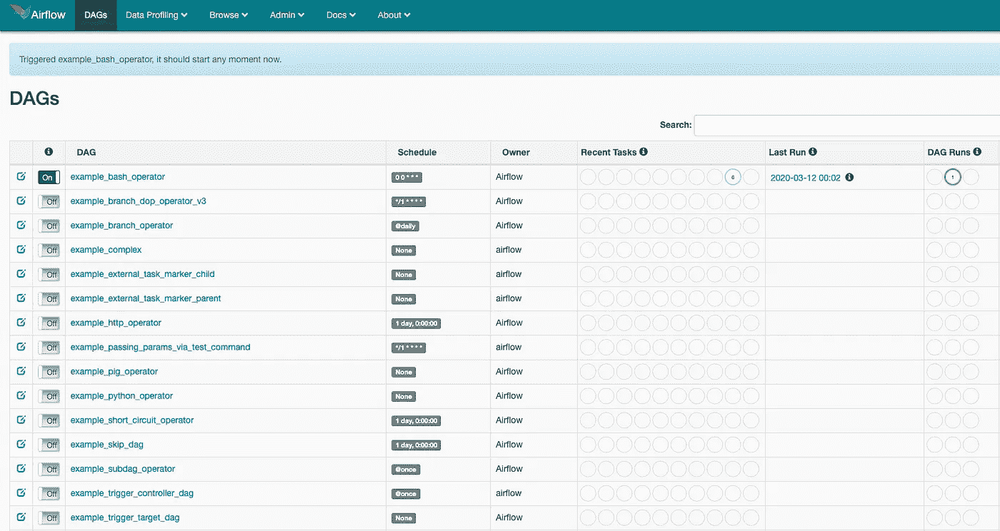
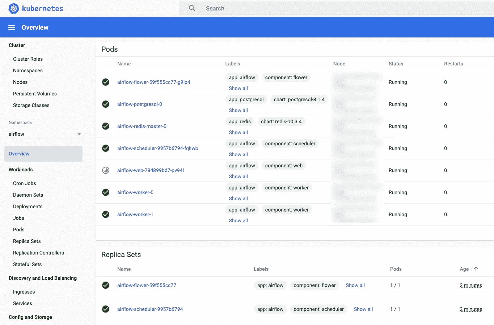
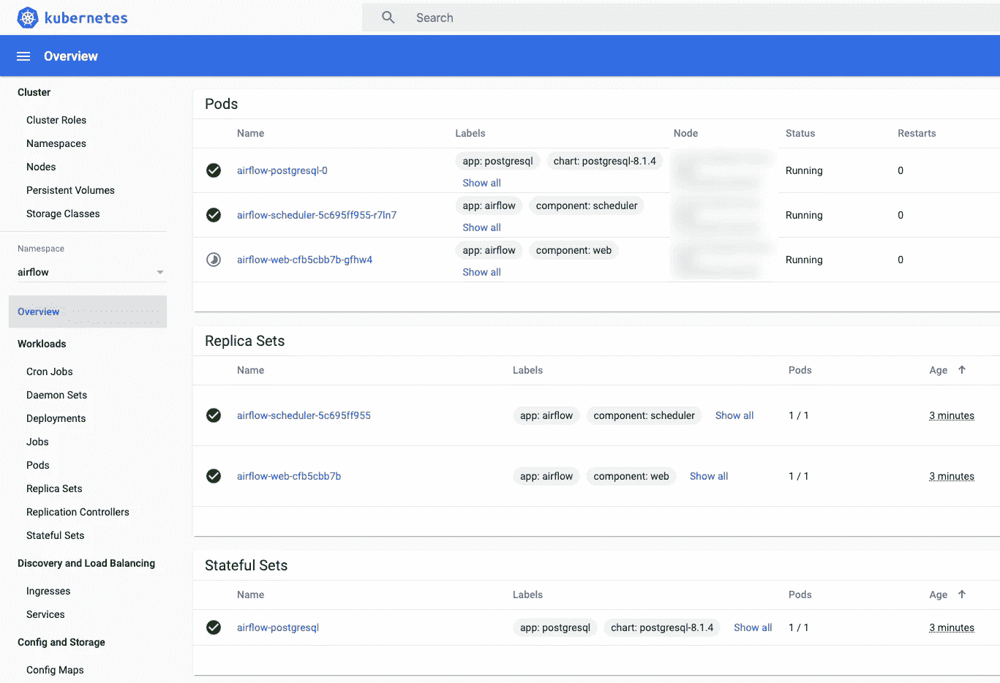
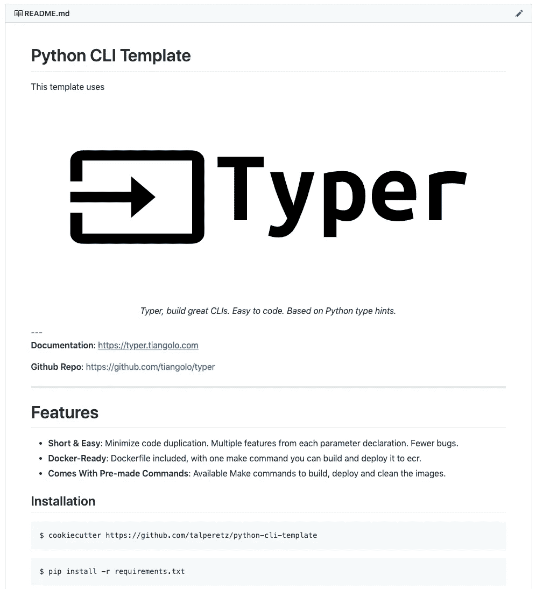

# 利用气流和 Kubernetes 扩展您的数据管道

> 原文：<https://towardsdatascience.com/scale-your-data-pipelines-with-airflow-and-kubernetes-4d34b0af045?source=collection_archive---------9----------------------->

## 完美的气流设置


不管你是在运行后台任务、预处理作业还是 ML 管道。编写任务是容易的部分。最难的部分是流程编排——管理任务之间的依赖关系、安排工作流并监控它们的执行是一件非常繁琐的事情。

输入**气流**。您的新工作流管理平台。

# 为什么是气流？

几年前，在[有效扩展:当 Kubernetes 遇到 Celery](https://medium.com/hackernoon/https-medium-com-talperetz24-scaling-effectively-when-kubernetes-met-celery-e6abd7ce4fed) 时，我写了我自己使用 Flask、Celery 和 Kubernetes 实现的工作流引擎。我考虑了可用的解决方案——包括气流。由于看不到令人满意的解决方案，我决定实现自己的框架。从那时起，气流已经走过了漫长的道路。以下是我改用气流的原因:

## 可攀登的

当使用正确的设置时，也就是我们将要看到的设置，气流既可扩展又具有成本效益。

## 含电池

虽然 UI 并不完美，但它是 Airflow 的核心竞争力之一。在这种情况下，一张图片胜过千言万语-



气流 UI

无论是以[操作符](https://airflow.apache.org/docs/stable/_api/airflow/operators/index.html)的形式还是以[执行器](https://airflow.apache.org/docs/stable/_api/airflow/executors/index.html)的形式，Airflow 都有大量的集成。

以及一个实验性但不可或缺的用于工作流的 REST API，这意味着你可以动态地触发工作流。

## 经过战斗考验

有这么多公司使用气流，我可以放心知道它会不断改善。


正在使用气流

# 完美的气流设置

## 🔥一次性基础设施

使用 helm 和一些预制的命令，我们可以轻松地破坏和重新部署整个基础架构。

## 🚀经济高效的执行

我们使用 kubernetes 作为任务的引擎。Airflow scheduler 将在新的 pod 上运行每个任务，并在完成后将其删除。允许我们使用最少的资源根据工作负载进行扩展。

## 🔩解耦编排

使用 Kubernetes 作为任务运行器的另一个巨大优势是——将编排与执行分离。你可以在[中了解更多信息，我们都在错误地使用气流，以及如何修复它](https://medium.com/bluecore-engineering/were-all-using-airflow-wrong-and-how-to-fix-it-a56f14cb0753)。

## 🏃动态更新的工作流程

我们使用 Git-Sync 容器。这将允许我们单独使用 git 来更新工作流。无需在每次工作流程变更时重新部署气流。

# 气流执行选项

## CeleryExecutor+KubernetesPodOperator(推荐)



更多 Pods |指定 Docker 映像中的执行代码

编排和执行的➕解耦。
➖为芹菜工人提供额外的豆荚和花卉监测。

## kubernetexecutor+whatever operator



更少的窗格| Dag 中定义的代码

➕没有多余的豆荚。
➖弱解耦。我们必须在 Dag 中定义执行代码和依赖关系。

## kubernetexecutor+KubernetesPodOperator

➕没有多余的豆荚。
➕将编排和执行解耦。
➖ **不支持** —当前导致 pod 启动递归。

# 让我们设置它

## 先决条件

```
brew install kubectl
brew install helm
```

确保你有:

*   [配置到您的 EKS 集群](https://docs.aws.amazon.com/eks/latest/userguide/create-kubeconfig.html)的 kubectl 上下文。
*   一个[带自动缩放器](https://docs.aws.amazon.com/eks/latest/userguide/cluster-autoscaler.html)的 Kubernetes 集群组。
*   [docker 图像的 ECR 储存库](https://docs.aws.amazon.com/AmazonECR/latest/userguide/repository-create.html)。

还建议[设置 Kubernetes 仪表板](https://aws.amazon.com/premiumsupport/knowledge-center/eks-cluster-kubernetes-dashboard/)。

## 设置

```
cookiecutter https://github.com/talperetz/scalable-airflow-template
```

要填写 cookiecutter 选项，请查看[可扩展气流模板 github repo](https://github.com/talperetz/scalable-airflow-template) 。

```
make deploy
```

瞧🎉

# 作为 Docker 图像的任务

我使用 docker 图像，因为我可以将气流从它运行的实际任务中分离出来。我可以在不改变气流配置、代码或部署的情况下改变底层任务。

当构建图像时，我从 [python-cli-template](https://github.com/talperetz/python-cli-template) 开始，它提供了快速而直观的 cli 体验。



Github 上的 Python CLI 模板

## 工作流程示例

```
from datetime import datetime, timedelta

from airflow import DAG
from airflow.contrib.operators.kubernetes_pod_operator import KubernetesPodOperator

default_args = {
    "owner": "airflow",
    "depends_on_past": False,
    "start_date": datetime(2015, 6, 1),
    "email": ["airflow@airflow.com"],
    "email_on_failure": False,
    "email_on_retry": False,
    "retries": 1,
    "retry_delay": timedelta(minutes=5),
}

example_workflow = DAG('kube-operator',
                         default_args=default_args,
                         schedule_interval=timedelta(days=1))
with example_workflow:
    t1 = KubernetesPodOperator(namespace='airflow',
                               image="ubuntu:16.04",
                               cmds=["bash", "-cx"],
                               arguments=["echo", "hello world"],
                               labels={'runner': 'airflow'},
                               name="pod1",
                               task_id='pod1',
                               is_delete_operator_pod=True,
                               hostnetwork=False,
                               )

    t2 = KubernetesPodOperator(namespace='airflow',
                               image="ubuntu:16.04",
                               cmds=["bash", "-cx"],
                               arguments=["echo", "hello world"],
                               labels={'runner': 'airflow'},
                               name="pod2",
                               task_id='pod2',
                               is_delete_operator_pod=True,
                               hostnetwork=False,
                               )

    t3 = KubernetesPodOperator(namespace='airflow',
                               image="ubuntu:16.04",
                               cmds=["bash", "-cx"],
                               arguments=["echo", "hello world"],
                               labels={'runner': 'airflow'},
                               name="pod3",
                               task_id='pod3',
                               is_delete_operator_pod=True,
                               hostnetwork=False,
                               )

    t4 = KubernetesPodOperator(namespace='airflow',
                               image="ubuntu:16.04",
                               cmds=["bash", "-cx"],
                               arguments=["echo", "hello world"],
                               labels={'runner': 'airflow'},
                               name="pod4",
                               task_id='pod4',
                               is_delete_operator_pod=True,
                               hostnetwork=False,
                               )

    t1 >> [t2, t3] >> t4
```

# 高级气流

*   [Twitter 中的 ML 工作流](https://blog.twitter.com/engineering/en_us/topics/insights/2018/ml-workflows.html)
*   在网飞安排笔记本
*   [气流提示&招数](https://medium.com/datareply/airflow-lesser-known-tips-tricks-and-best-practises-cf4d4a90f8f)

## 如果你喜欢这篇文章，一定要关注我:

**中:**[**https://medium.com/@talperetz24**](https://medium.com/@talperetz24) **推特:**[**https://twitter.com/talperetz24**](https://twitter.com/talperetz24) **领英:**[**https://www.linkedin.com/in/tal-per/**](https://www.linkedin.com/in/tal-per/)