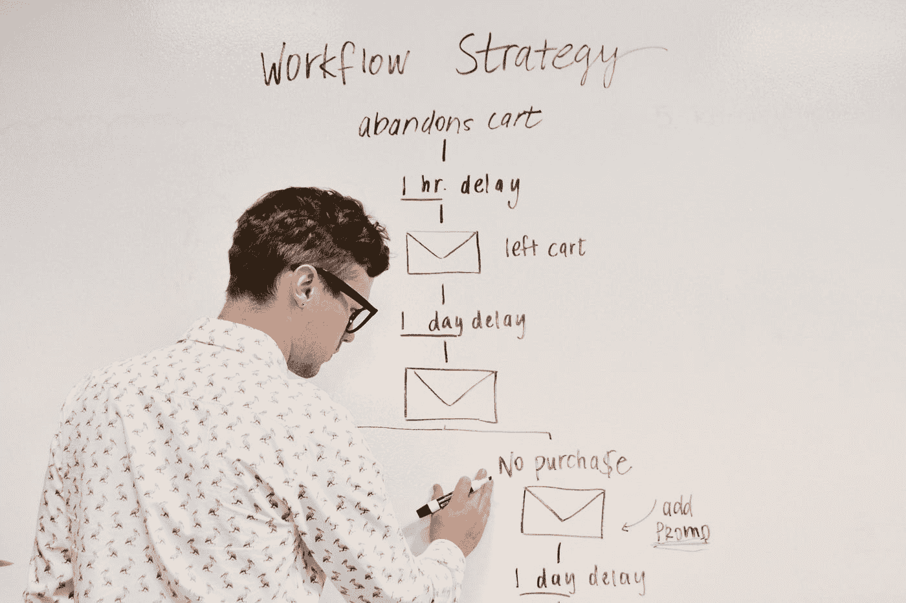

# 使用 Apache Airflow 扩展 DAG 创建

> 原文：<https://towardsdatascience.com/scaling-dag-creation-with-apache-airflow-a7b34ba486ac?source=collection_archive---------19----------------------->



[活动发起人](https://unsplash.com/@campaign_creators?utm_source=medium&utm_medium=referral)在 [Unsplash](https://unsplash.com?utm_source=medium&utm_medium=referral) 上的照片

数据科学社区中更困难的任务之一不是设计一个结构良好的业务问题的模型，或者开发在可伸缩环境中运行的代码库，而是在 ETL 或数据科学管道中安排任务，定期执行模型，并自动化中间的一切。

这就是[阿帕奇气流](https://airflow.apache.org/)前来救援的地方！借助以图形形式显示任务的 Airflow UI，以及以编程方式定义工作流以提高可追溯性的能力，在生产中定义和配置 Data Science 工作流变得更加容易。

然而，还有一个困难。在某些情况下，相同的建模、整体流程会被用于不同的数据源。为了提高性能，最好让这些进程同时运行，而不是将它们添加到同一个 dag 中。

没问题，让我们简单地为每个进程创建一个 dag，所有进程都有相似的任务，并安排它们同时运行。如果我们遵循 DRY 软件开发原则，有没有一种方法可以用相同类型的任务创建多个不同的 Dag，而不必手动创建它们？

> 有没有一种方法可以创建具有相同类型任务的多个不同 Dag，而不必手动创建它们？

## 最初的方法

首先，让我们假设我们的初始 dag 如下所示:

```
from datetime import datetime, timedelta
from dateutil.relativedelta import relativedelta
from time import sleep

from airflow import DAG
from airflow.operators.python_operator import PythonOperator# the default arguments for the DAG
default_args = {
    "depends_on_past": False,
    "start_date": datetime.now() - relativedelta(days=1),
    "retries": 1,
    "retry_delay": timedelta(seconds=120),
    "email_on_failure": False
}

dag = DAG("dummy", default_args=default_args, schedule_interval=None)# python function we are to use that only sleeps for 60 seconds.
def tmp():
    sleep(60)

    print("Dag passed!")
    return None

t1 = PythonOperator(python_callable=tmp, task_id="time", dag=dag)
```

这个 dag 的目的是简单地休眠，然后打印一个语句。这是一个非常简单的 dag，但是让我们假设这将代表我们的数据科学工作流。如果这是我们部署到生产中的唯一数据科学工作流，我们很可能会感到满意。

但是，如果像前面提到的那样，我们想要创建多个具有相同类型任务的 Dag，而不必手动创建它们，该怎么办呢？例如，以我们上面的初始 dag 为例，如果我们想要配置在打印语句之前我们想要休眠的秒数会怎么样呢？这就是我们需要理解流程的哪些部分是可配置的，然后允许这些部分成为流程中的变量。让我们再次尝试我们的初始 dag:

```
from datetime import datetime, timedelta
from dateutil.relativedelta import relativedelta
from time import sleep

from airflow import DAG
from airflow.operators.python_operator import PythonOperator

default_args = {
    "depends_on_past": False,
    "start_date": datetime.now() - relativedelta(days=1),
    "retries": 1,
    "retry_delay": timedelta(seconds=120),
    "email_on_failure": False
}# this function will create a dag, define the python callable and add it to the PythonOperator
def create_dag(dag_id, seconds=60):
    dag = DAG(dag_id, default_args=default_args, schedule_interval=None)

    def tmp():
        sleep(seconds)

        print("Dag passed!")
        return None

    t1 = PythonOperator(python_callable=tmp, task_id="time", dag=dag)

    return dag# here we create a global variable called dummy dag, which will store the DAG object here.
globals()["dummy_dag"] = create_dag("dummy", 60)
```

当一个变量被添加到 python 脚本中的全局字典时，它被渲染并被视为在全局范围内创建的变量，即使它最初是在函数范围内创建的。现在，您可以轻松创建多个任务相似的 Dag。

> 现在，如果某些 Dag 的任务分配只有微小的变化，会怎么样呢？

一般来说，大多数人会简单地用相似的 DAG 创建过程创建多个 python 脚本。

但是，有更好的办法。

## 特定 Dag 的可配置任务分配

考虑这个例子，我们最初在一个名为 task_assigner.py 的 python 模块中定义它

```
from functools import reduce

from airflow.operators import *

# this will be just a small subset of operators that we will define
task_dict = {
    "external_task": ExternalTaskSensor,
    'python_operator': PythonOperator,
    'trigger_dag': TriggerDagOperator,
    "bash": BashOperator
}

class TaskAssigner:

    def __init__(self, parent_dag):
        self.parent_dag = parent_dag

    def define_tasks(self, task_params):
    """
    This will use the task_dict to help map the task define to the appropriate task with the correct parameters

    :param tsk_name: The unique name of the task
    :type: str
    :param task_params: The parameters for all the task
    :type: dict
    """

        defined_tsk_dict = {}

        for tsk in task_params.keys():
            dag_type = task_params[tsk]["type"]
            params = task_params[tsk]["params"]
            params["dag"] = self.parent_dag
            params["task_id"] = tsk

            defined_tsk_dict[tsk] = task_dict[dag_type](**params)

        return defined_tsk_dict

    def map_task(self, tsk_names, defined_task_dict):
    """
    This will help map the sequence of the tasks to the appropriate defined task

    :param tsk_names: The sequence of the tasks to run
    :type tsk_names: str
    :param defined_task_dict: The dictionary of defined tasks
    :type defined_task_dict: dict
    """

        res_lst = []

        for tsks in tsk_names:
            if isinstance(tsks, list):
                res_lst.append(self.map_task(tsks, defined_task_dict))
            elif isinstance(tsks, str):
                res_lst.append(defined_task_dict[tsks])
            else:
                raise ValueError

        return res_lst    

    def run(self, task_sequence, task_params):
    """
    This will assign each task in the sequence, with the right parameters, to the parent dag

    :param task_sequence: This will be a list of, or a list of list, of strings
    :type task_sequence: List[List[str]] or List[List[List[str]]], or something in between.
    :param task_params: The parameters for all the task
    :type task_params: dict
    """

        defined_task_dict = self.define_tasks(task_params)

        # this is a List[List[Tasks]] or a List[List[List[Tasks]]]
        run_lst = self.map_task(task_sequence, defined_task_dict)

        def tmf(tsks):
            reduce(lambda tsk1, tsk2: tsk1 >> tsk2, tsks[1:], tsks[0])

        list(map(tmp, run_lst))

        return None
```

然后在另一个脚本中使用 TaskAssigner，比如说在 dag.py 中

```
import json

from datetime import datetime, timedelta
from dateutil.relativedelta import relativedelta
from time import sleep

from airflow import DAG
from airflow.operators.python_operator import PythonOperator

from task_assigner import TaskAssigner

default_args = {
    "depends_on_past": False,
    "start_date": datetime.now() - relativedelta(days=1),
    "retries": 1,
    "retry_delay": timedelta(seconds=120),
    "email_on_failure": False
}# now what we do is create a dag, pass it into the TaskAssigner
# with the dag sequence and the params for each task in the dag.def create_dag(dag_id, dag_sequence, dag_params):
    dag = DAG(dag_id, default_args=default_args, schedule_interval=None)

    tsk_assign = TaskAssigner(dag)

    tsk_assign.run(dag_sequence, dag_params)

    return dag# we read in our configuration file with our parameters in the dag
with open("dag_configs.json") as f:
    config = json.load(f)# we loop through each dag id in the JSON file, and then create our dag and add it as a global variable here.for dg_id in config.keys():
    globals()[dg_id] = create_dag(dg_id, config[dg_id]["dag_sequence"], config[dg_id]["dag_params"])
```

这里使用的 dag_configs.json 是:

```
{
  "dummy": {
    "dag_sequence": [["dummy"]],
    "dag_params": {
      "dummy": {
        "type": "bash",
        "params": {"bash_command": "sleep 60"}
      }
    }
  }
}
```

## 把所有的放在一起

现在，我们讨论了如何利用 OOP 定义多个 Dag，这是 DRY 兼容的。但是，这是假设每个 dag 都是相互独立的，实际情况通常不是这样。有些情况下，每个 dag 都可能依赖于另一个 dag。

你认为解决办法是什么？

如果您有任何问题，请随时联系我们。

此外，我正在创建的内容将只在 blog.pyscale.net 完全可用。请访问该网站获取更多内容，尤其是如果您想了解更多关于面向初学者的数据科学工具的信息！

一如既往，#happycoding！