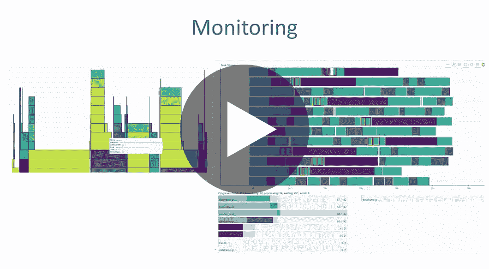

# 扩展机器学习

> 原文：<https://towardsdatascience.com/scaling-machine-learning-fc5e0a36f220?source=collection_archive---------21----------------------->

## [活动讲座](https://towardsdatascience.com/event-talks/home)

## Razvan Peteanu | TMLS2019

来自多伦多机器学习峰会的演讲:【https://torontomachinelearning.com/ 

## 关于演讲者:

Razvan Peteanu 目前的职位是 TD Securities 的首席架构师-机器学习。他有 25 年的软件开发经验，主要是在金融行业。在过去几年中，他的重点一直是在云中或内部构建可扩展的机器学习解决方案。

## 关于演讲:

一些在数据科学中非常普遍教授和使用的库并不是为大规模机器学习而设计的，因此扩大计算可能是一个挑战，特别是许多课程倾向于专注于算法，而不涵盖 ML 工程。从积极的一面来看，现在有很多方法可以解决这个问题，为一个给定的项目选择正确的方法是一个重要的决定，因为改变架构可能是昂贵的。该演讲将讨论几种扩大机器学习的方法的利弊，包括最近的发展。

[YouTube](https://www.youtube.com/watch?v=aPP4ynaJT9U)