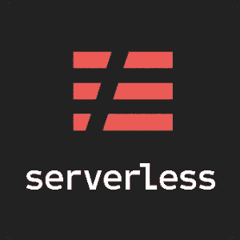
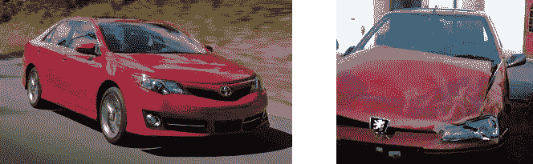
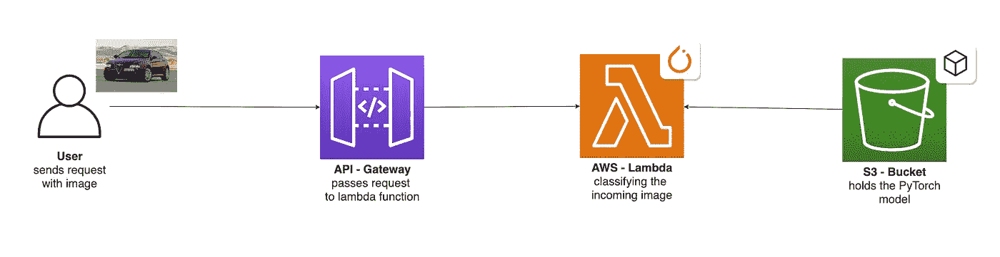
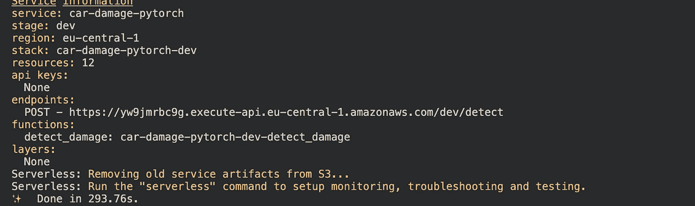
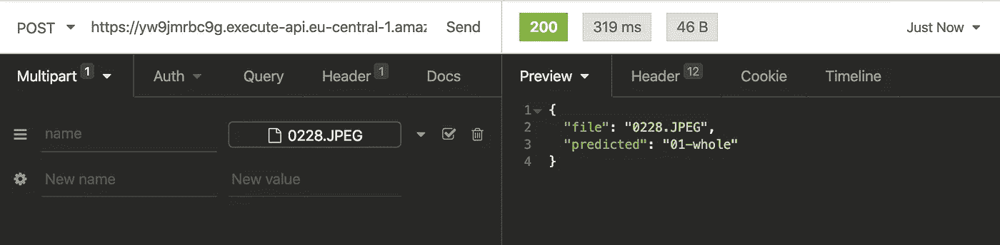

# 从零到英雄的机器学习

> 原文：<https://towardsdatascience.com/scaling-machine-learning-from-zero-to-hero-d63796442526?source=collection_archive---------42----------------------->

## 通过使用 AWS Lambda、无服务器框架和 PyTorch 来扩展您的机器学习模型。

凯尔·格伦在 [Unsplash](https://unsplash.com/?utm_source=unsplash&utm_medium=referral&utm_content=creditCopyText) 上的照片

*原载于 2020 年 5 月 8 日*[*https://www . philschmid . de*](https://www.philschmid.de/scaling-machine-learning-from-zero-to-hero)*。*

# 介绍

构建机器学习模型的工作流程往往在评估阶段就结束了:你已经达到了一个可以接受的准确度，你可以在你的“研究环境”和“哒哒！任务完成。”但这还不是全部！机器学习工作流程中最后也是最重要的一步是**部署**你的模型用于生产。

> *在生产中不工作的模型是没有价值的*

部署的模型可以定义为无缝集成到生产环境中的任何单元，它可以接收输入并返回输出。但公司面临的机器学习的主要问题之一是找到一种方法在这样的环境中部署这些模型。

> [*据报道，大约 40%的失败项目停滞在开发阶段，没有投入生产*](https://medium.com/vsinghbisen/these-are-the-reasons-why-more-than-95-ai-and-ml-projects-fail-cd97f4484ecc) *。* [***来源***](https://medium.com/vsinghbisen/these-are-the-reasons-why-more-than-95-ai-and-ml-projects-fail-cd97f4484ecc)

在这篇文章中，我将一步步向您展示如何使用 AWS Lambda 部署您自己定制的 Pytorch 模型，并使用 API 将其集成到您的生产环境中。我们将大规模利用简化的无服务器计算方法。

## 什么是 AWS Lambda？

[AWS Lambda 特性](https://aws.amazon.com/de/lambda/features/)

AWS Lambda 是一种计算服务，让你无需管理服务器就能运行代码。它只在需要的时候执行你的代码，并且自动伸缩，从每天几个请求到每秒几千个请求。您只需为您消耗的计算时间付费，当您的代码不运行时，则不收费。

# 要求

本文假设您已经安装并配置了用于部署 AWS Lambda 功能的[无服务器框架](https://serverless.com/)，以及一个工作 Docker 环境。无服务器框架帮助我们开发和部署 AWS Lambda 功能。它是一个 CLI，开箱即可提供结构、自动化和最佳实践。它还允许您专注于构建复杂的、事件驱动的、无服务器的架构，由函数和事件组成。

无服务器框架徽标

如果你不熟悉或者还没有设置无服务器框架，看看这个[无服务器框架快速入门](https://serverless.com/framework/docs/providers/aws/guide/quick-start/)。

通过修改无服务器的 YAML 文件，你可以连接 SQS，比如说，创建一个深度学习管道，或者甚至通过 AWS Lex 将其连接到聊天机器人。

# 辅导的

在我们开始之前，我想给你一些关于我们将要使用的模型的信息。我在 google colab 中训练了一个 Pytorch 图像分类器。如果你想知道 Google Colab 是什么，看看这里的。我为分类[汽车损坏检测](https://www.kaggle.com/philschmid/car-damage-image-classifier)创建了一个数据集，并微调了一个 resnet50 图像分类器。在本教程中，我们将使用`Python3.8`和`Pytorch1.5`。

数据集中的示例图像

我们要做什么:

*   使用无服务器框架创建 Python Lambda 函数
*   将 Pytorch 添加到 Lambda 环境
*   写一个预测函数来分类图像
*   创建一个 S3 存储桶，用于保存模型和上传模型的脚本
*   配置无服务器框架以设置 API 网关进行推理

我们正在构建的架构将会是这样的。

项目的架构

现在让我们开始学习教程。

# 创建 AWS Lambda 函数

首先，我们通过使用带有`aws-python3`模板的无服务器 CLI 创建 AWS Lambda 函数。

这个 CLI 命令将创建一个包含`handler.py`、`.gitignore`和`serverless.yaml`文件的新目录。`handler.py`包含一些基本的样板代码。

# 添加 Python 需求

接下来，我们将 Python 需求添加到 AWS Lambda 函数中。为此，我们使用无服务器插件`serverless-python-requirements`。它自动捆绑来自`requirements.txt`的依赖项，并使它们可用。`serverless-python-requirements`插件允许你捆绑非纯 Python 模块。更多关于[的信息，请点击这里](https://github.com/UnitedIncome/serverless-python-requirements#readme)。

## 安装插件

要安装插件，请运行以下命令。

这将自动把插件添加到你的项目的`package.json`和`serverless.yml`中的插件部分。

## 向`requirements.txt`添加要求

我们必须在根级别创建一个`requirements.txt`文件，包含所有需要的 Python 包。但是您必须小心，解压缩后的部署包大小不能超过 250MB。你可以在这里找到所有 AWS Lambda 限制的列表。

如果我们用`pip install torch`安装 Pytorch，这个包大约有 470 MB，这对于部署在 AWS Lambda 环境中来说太大了。因此，我们在`requirements.txt`中直接添加到 python wheel 文件(`.whl`)的链接。所有 PyTorch 和 torchvision 包的列表请参考此列表。

`requirements.txt`应该是这样的。

为了使依赖性更小，我们将在`serverless-python-requirements`插件中使用三种技术:

*   `zip` -将`requirements.txt`中的依赖项压缩到一个附加的`.requirements.zip`文件中，并将`unzip_requirements.py`添加到最终的包中。
*   `slim` -删除不需要的文件和目录，如`*.so`、`*.pyc`、`dist-info`等。
*   `noDeploy` -从部署中省略某些包。我们将使用标准列表，排除那些已经内置到 Lambda 中的包，以及 Tensorboard。

您可以在“配置我们的`serverless.yaml`文件”部分看到它的实现。

# 预测功能

我们的 Lambda 函数实际上由 4 个函数组成。

*   `load_model_from_s3()`用于将我们的模型从 S3 加载到内存中，创建我们的 PyTorch 模型和一个名为`classes`的列表，它包含可预测的类。
*   `transform_image()`用于将输入图片转换成 PyTorch 张量。
*   `get_prediction()`，使用变换后的图像作为输入来获得预测。
*   `detect_damage()`是我们 Lambda 环境的主要功能。

## 伪代码

工作程序代码看起来像这样。

# 将训练好的模型添加到我们的项目

如前所述，我在 [colab 笔记本](https://colab.research.google.com/drive/1Ehy2Tfadj4XASpMDMuNTqHZsXHtDvTmf#scrollTo=Rp7DFKE18vHI)中训练了一个汽车损坏检测模型，它以一幅图像作为输入，并返回所描绘的汽车是`01-whole`还是`00-damaged`。我还添加了一些代码，为您完成所有的捆绑魔术:如果您运行笔记本，它将创建一个名为`cardamage.tar.gz`的文件，准备部署在 AWS 上。记住，Lambda 函数解压缩后的大小只能是 250MB。因此，我们不能将我们的模型直接包含到函数中。相反，我们需要用`load_model_from_s3()`从 S3 下载它。

为此，我们需要一个 S3 桶。您可以使用管理控制台或此脚本创建一个。

在我们创建桶之后，我们可以上传我们的模型。您可以手动或使用提供的 python 脚本来完成。

# 配置`serverless.yaml`

下一步是调整`serverless.yaml`并包括`custom` Python 需求配置。我们将编辑`serverless.yaml`的四个部分，...

*   保存我们的运行时和 IAM 权限的`provider`部分。
*   我们配置`serverless-python-requirements`插件的`custom`部分。
*   在`package`部分，我们将文件夹排除在生产之外。
*   在`function`部分，我们创建函数并定义调用 Lambda 函数的事件。

看一下完整的`serverless.yaml`。不要担心，我将在一分钟内详细解释所有四个部分。

## 供应者

在无服务器框架中，我们在`provider`部分定义我们的功能部署在哪里。我们使用`aws`作为我们的提供商，其他选项包括`google`、`azure`等等。您可以在此找到完整的提供商列表[。](https://www.serverless.com/framework/docs/providers/)

此外，我们定义我们的运行时、环境变量和 Lambda 函数拥有的权限。

作为运行时，我们使用`python3.8`。为了让我们的函数工作，我们需要两个环境变量`S3_BUCKET`和`MODEL_PATH`。`S3_BUCKET`包含我们之前创建的 S3 存储桶的名称。`MODEL_PATH`是我们的`cardamage.tar.gz`文件在 S3 桶中的路径。我们仍然缺少将模型从 S3 导入 lambda 函数的权限。`iamRoleStatements`处理我们的 lambda 函数的权限。我们从 S3 获取模型所需的许可是`s3:getObject`，将我们的 S3 桶的 ARN ( [亚马逊资源名](https://docs.aws.amazon.com/general/latest/gr/aws-arns-and-namespaces.html))作为资源。

## 习俗

在`serverless.yml`的`custom`部分，我们可以定义插件或其他脚本的配置。更多详情，请参考本[指南](https://www.serverless.com/framework/docs/providers/aws/guide/variables/)。如前所述，我们使用`serverless-python-requirements`来同时安装和减少依赖项的大小，这样我们就可以将所有东西打包到 Lambda 运行时中。如果你想知道它是如何工作的，你可以在这里阅读。

## 包裹

`package`部分可用于从最终包中排除目录/文件夹。这为包装过程提供了更多的控制。你可以`exclude`特定的文件夹和文件，比如`node_modules/`。更多细节请看这里。

## 功能

第四个也是最后一个部分——`function`——包含了 Lambda 函数的配置。我们在这里定义分配的内存大小、超时和`events`。在`function`的`events`部分，我们可以定义一些事件，这些事件将触发我们的 lambda 函数。对于我们的项目，我们使用`http`，它将自动创建一个指向我们函数的 API 网关。您还可以为`sqs`、`cron`、`s3`等定义事件。你可以在这里找到完整的列表。

# 部署功能

为了部署该功能，我们在`package.json`中创建一个`deploy`脚本。要部署我们的功能，我们需要启动并运行 docker。

之后，我们可以运行`yarn deploy`或`npm run deploy`来部署我们的功能。这可能需要一段时间，因为我们正在用 docker 创建一个 Python 环境，并在其中安装我们所有的依赖项，然后将所有内容上传到 AWS。

这个过程完成后，我们应该看到类似这样的东西。

部署的 lambda 函数

# 测试和结果

为了测试我们的 lambda 函数，我们可以使用失眠症、邮差或任何其他 rest 客户端。只需在请求中添加一张受损或整辆汽车的图片作为多部分输入。让我们用这张图片试试。

测试图像

失眠请求

作为我们对红色汽车测试的结果，我们得到了`01-whole`，这是正确的。此外，您可以看到完整的请求花费了 319 毫秒，而 lambda 执行时间大约为 250 毫秒。老实说，这相当快。

如果您打算重新构建分类器，您必须小心，第一个请求可能需要一段时间。首先，Lambda 正在解压和安装我们的依赖项，然后从 S3 下载模型。完成一次后，lambda 需要大约 250 毫秒-1000 毫秒，这取决于分类的输入图像大小。

**最棒的是，如果有几个传入请求，我们的分类器会自动扩展！**

您可以毫无顾虑地扩展到数千个并行请求。

感谢阅读。你可以在这里找到 GitHub 库的完整代码，在这里找到 colab 笔记本。如果你有任何问题，随时联系我。

[*Lance Miles*](https://medium.com/u/33e6e3b8da22?source=post_page-----d63796442526--------------------------------) *提到，您可能必须在 API 网关的设置中包含“多部分/表单数据”作为二进制媒体类型，以便网关能够以 base64 编码通过失眠症发送的图像。*