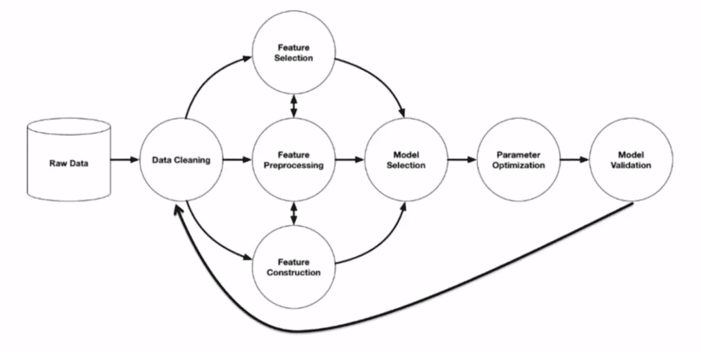
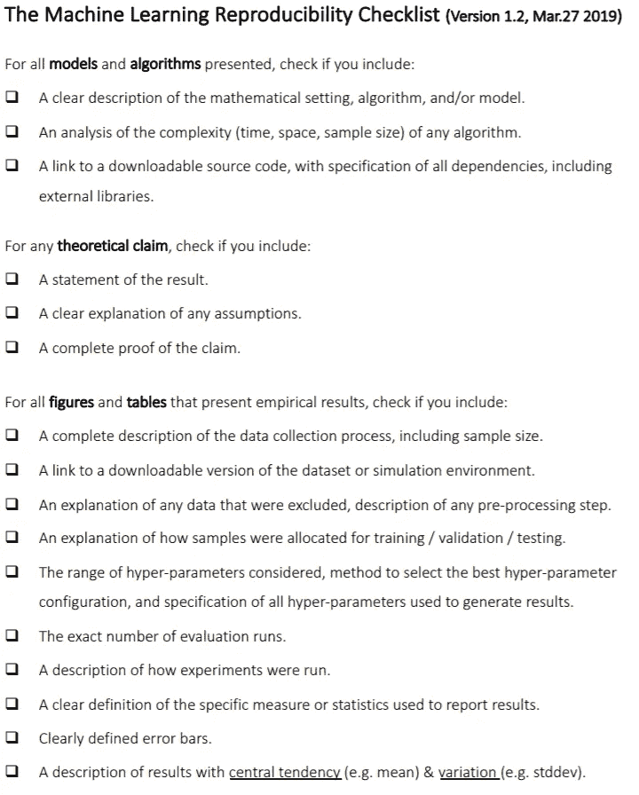
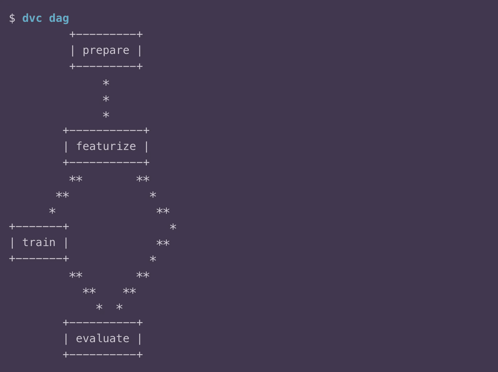
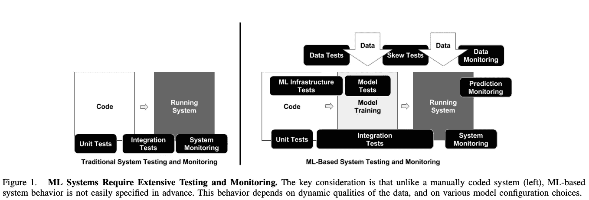
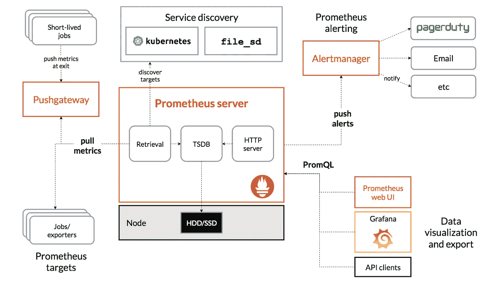
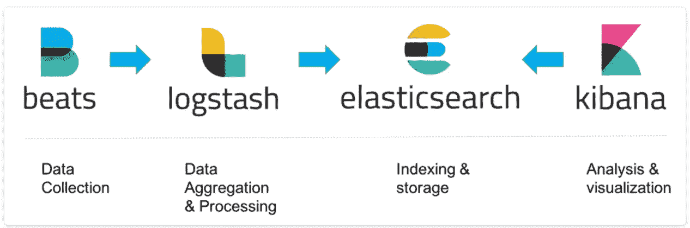

# 在现实世界中扩展机器学习

> 原文：<https://towardsdatascience.com/scaling-machine-learning-in-real-world-cb601b2baf4a?source=collection_archive---------39----------------------->

图片来源:Unsplash @Nasa

机器学习正以惊人的速度在平台、工具、技术、堆栈和操作化的范围内发展。然而，现实世界中的扩展仍然存在差距，这种差距开始在处于解决可重复性、测量、版本问题的后期阶段的玩家或正在尝试一些模型或算法并受到运营方面阻碍的新玩家中变得明显。即使在更大或更成熟的参与者中，由于现实世界正在变化或处于不断变化的状态，这也是数据和相关模型的本质，因此扩展问题也很明显。在数据科学领域，这被称为[隐藏的技术债务](https://papers.nips.cc/paper/5656-hidden-technical-debt-in-machine-learning-systems.pdf)，它是发展的活跃领域之一。

在这篇文章中，我将分享我在应对这些挑战时的学习和经验，并列出一些架构原则或指导来解决这些问题，并构建在现实世界中扩展的能力

# 数据科学工作流程

以一个典型的数据科学工作流程为例，如 [R Olson](https://arxiv.org/pdf/1603.06212.pdf) 的一篇论文中所述，我们可以看到这与通常的软件开发在实验和反馈决策循环的使用上有什么不同。允许扩展该工作流程的关键原则或因素是:再现性、测试和监控、测量和可观察性

图片来源:[评估用于自动化数据科学的基于树的管道优化工具](https://arxiv.org/pdf/1603.06212.pdf)

# 再现性

图片来源:Unsplash @Kara Eads

再现性不是一个容易或简单的问题。需要考虑的方面有很多，其中比较重要的是数据、领域、外部依赖、结果测量和评估标准等。但是，有一些选项可以帮助您开始使用解决方案。这里的关键原则是版本控制，包括数据、模型和所有与执行相关的工件，如代码、管道、评估指标、接受和拒绝的结果、实验或 AB 测试需求等。

图片来源: [NeurIPS 重现性清单](https://medium.com/@NeurIPSConf/call-for-papers-689294418f43)

在软件栈中，可以捕捉这些类型需求的选项之一是 DVC，数据版本控制[dvc.org](https://dvc.org)的缩写。这是一个开源框架，位于 [Git](https://git-scm.com) 之上，集成了云存储服务，如 [AWS S3](https://aws.amazon.com/s3) 、 [GCP GCS](https://cloud.google.com/storage) 。这允许 ML、NLP、DL 管道被版本化、跟踪和复制。摘自 dvc [文件](https://dvc.org/doc/user-guide/what-is-dvc):

“数据处理或 ML 管道通常从大型原始数据集开始，包括中间的特征化和训练阶段，并产生最终模型，以及准确性指标[和](https://dvc.org/doc/command-reference/metrics)。

为数据科学对大型数据文件和目录进行版本控制很好，但还不够。数据是如何过滤、转换或用于训练 ML 模型的？DVC 引入了一种机制来捕捉*数据管道*——产生最终结果的一系列数据过程。

DVC 管道及其数据也可以很容易地版本化(使用 Git)。这使您可以更好地组织您的项目，并在以后准确地再现您的工作流程和结果，就像它们最初构建时一样！"

图片来源:[https://dvc.org/doc/command-reference/dag](https://dvc.org/doc/command-reference/dag)

在 DVC 中，流水线阶段和命令、它们的数据 I/O、相互依赖性和结果(中间或最终)在`dvc.yaml`中指定，可以手动编写或使用助手命令`[dvc run](https://dvc.org/doc/command-reference/run)`构建。这使得 DVC 可以在以后修复一条或多条管道(见`[dvc repro](https://dvc.org/doc/command-reference/repro)`)。

> *DVC 为此构建了一个依赖图(*[*DAG*](https://en.wikipedia.org/wiki/Directed_acyclic_graph)*)。*

在现实世界中，该解决方案跨环境层进行映射，从具有较少限制的构建配置的本地开发开始，到使用 Jenkins、Travis 等 CICD 工具构建的集成测试环境，再到具有严格限制的 prod 部署环境。

# 测试和监控

图片来源:Unsplash @cdc

世界的货币是变化，这表现在数据中。如果 ML 或 ML、NLP、DL 模型的任何组合提供的结果与当前模式不同步，则会对相关性、准确性、偏差以及收入、参与度、忠诚度和信任度等业务和企业指标产生负面影响。最近的一个例子是在 Covid 环境下客户行为和互动的变化。适应了这种变化的车型增加了客户参与度，加深了品牌信任度，建立了忠诚度，而由于数据变化而漂移的车型则相反。

机器学习的测试领域从根本上不同于软件测试。数据的组合、具有多个步骤的管道、离线在线培训服务、跨层的故障点等等，这些是一些关键因素。谷歌发布了一项重要的研究[ML 测试分数:ML 生产准备和技术债务减少的指标](https://storage.googleapis.com/pub-tools-public-publication-data/pdf/aad9f93b86b7addfea4c419b9100c6cdd26cacea.pdf)为测试制定了指导方针

图片来源:[ML 测试分数:ML 生产准备和技术债务削减的一个指标](https://storage.googleapis.com/pub-tools-public-publication-data/pdf/aad9f93b86b7addfea4c419b9100c6cdd26cacea.pdf)

有了这个指导，我们就可以使用这些边界来构建测试框架:数据、基础设施、模型、集成、监控等等，并有一定程度的重叠。在更高的层次上，这种划分可以被看作是数据+模型+代码以及生产/操作需求，比如监控。在软件方面，这转化为测试脚本(以 PyTest 为例)、执行模型(Docker)、跟踪框架(MLFlow)、日志记录(ELK stack Elastic Search/LogStash/ki Bana)、监控(Prometheus、Grafana)的组合

考虑到边界的数量和测试的类型，以及执行和反馈循环，这是一个非常复杂的任务。这里的方法是在 ML 技术债务分析、技术能力分析、基本需求分析和一些架构、路线图视图的指导下提出一个计划。这里的关键成果是开始构建由计划指导的框架，开始从团队获得现场使用，并开始反馈循环

# 测量和可观察性

图片来源:Unsplash @Dan Lohmar

测量对于建立任何类型的基线来衡量准确性和相关性都是至关重要的。度量有很多方面，如原始度量、聚合度量、基线、偏差、已解释的、未解释的等等。这是 ML 中快速发展并与运营和业务高度重叠的领域之一。测量和测试监控之间有很大的重叠，主要区别在于测量紧密关注可观察性，即通过观察外部来确定系统内部情况的能力。推特在他们的[科技](https://blog.twitter.com/engineering/en_us/a/2016/observability-at-twitter-technical-overview-part-i.html) [博客](https://blog.twitter.com/engineering/en_us/a/2016/observability-at-twitter-technical-overview-part-ii.html)帖子中提到了可观察性。辛迪·斯里哈兰的[文章](https://medium.com/@copyconstruct/monitoring-and-observability-8417d1952e1c)是一个很好的参考。引用她的文章:

“监控”最适合报告系统的整体健康状况。因此，监控最好局限于从基于时间序列的仪器、已知故障模式以及黑盒测试中获得的关键业务和系统指标。另一方面，“可观察性”旨在提供对系统 ***行为的高度精细的洞察，以及丰富的上下文*** ，非常适合调试目的。

图片来源:[普罗米修斯文档](https://prometheus.io/docs/introduction/overview/)

度量标准可以利用数学建模(采样、聚合、汇总、关联)和预测的力量来获取系统在当前和未来的时间间隔内的行为知识。由于 numbers 针对存储、处理、压缩和检索进行了优化，因此指标可以延长数据的保留时间并简化查询。这使得指标非常适合构建反映历史趋势的仪表板，这些趋势描述了运营问题(延迟、内存/CPU 使用)以及预测监控(中值和平均值、最小值/最大值、标准偏差)

度量显示服务或应用程序的趋势，而日志则关注特定的事件。日志的目的是尽可能多地保存特定事件的信息。日志中的信息可用于调查事件并帮助进行根本原因分析。

图片来源:[https://www.elastic.co/elastic-stack](https://www.elastic.co/elastic-stack)

就映射到软件堆栈而言，非生产或开发环境更适合诸如 [MLFlow](https://mlflow.org/) 等解决方案，而生产级环境需要 ELK、Prometheus、Grafana 类型堆栈的规模、速度和可靠性。

# 我们将何去何从

任何围绕扩展或生产数据科学的对话，都需要谈论持续集成/持续部署或 CICD，简而言之，在 DevOps、MLOps 领域众所周知。这是一个值得单独讨论的话题。简单地说，当我们整合并自动化再现性、测试、监控、测量、可观察性时，最终结果或成果是 CICD 执行模型或框架。在以后的文章中，我将探讨这些核心元素是如何组合在一起形成 CICD 管道的。

我希望这篇文章能提供一些关于机器学习的真实世界的有用信息，并有助于实现规模化。我期待听到您的反馈。