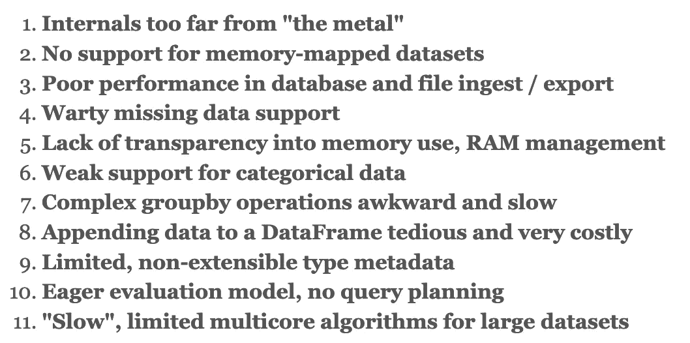
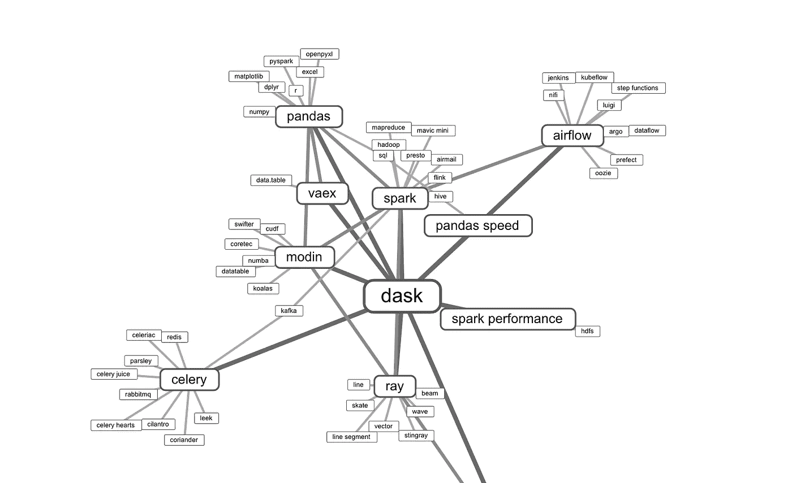
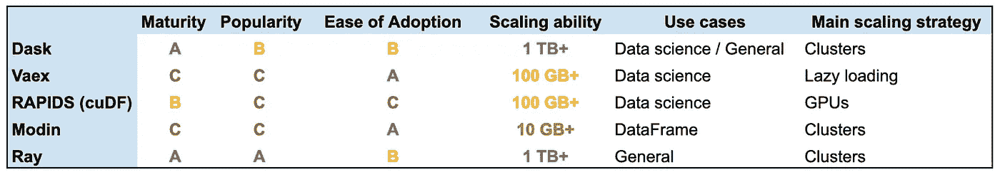

# 攀登熊猫:比较达斯克、雷、摩丁、瓦克斯和拉皮兹

> 原文：<https://towardsdatascience.com/scaling-pandas-comparing-dask-ray-modin-vaex-and-rapids-c74c85a4e59c?source=collection_archive---------31----------------------->

## 如何更快地处理更多数据

加速与 Dask、Ray、Modin Vaex 和 RAPIDS 的数据争论——来源:作者

Python 和它最受欢迎的数据争论库 Pandas 人气飙升。与 Java 等竞争对手相比，Python 和 Pandas 使得数据探索和转换**变得简单**。

但是众所周知，Python 和 Pandas 都有关于**可伸缩性**和**效率**的问题。

Python 立刻失去了一些效率，因为它是一种解释型的动态类型语言。但更重要的是，Python 一直关注简单性和可读性，而不是原始能力。同样，Pandas 专注于提供一个简单的高级 API，很大程度上忽略了性能。事实上，熊猫的创造者写了“[我讨厌熊猫的 10 件事](https://wesmckinney.com/blog/apache-arrow-pandas-internals/)”，总结了这些问题:

性能问题和缺乏灵活性是熊猫自己的创造者不喜欢这个库的主要原因。([来源](https://wesmckinney.com/blog/apache-arrow-pandas-internals/))

性能问题和缺乏灵活性是熊猫自己的创造者不喜欢这个库的主要原因。([来源](https://wesmckinney.com/blog/apache-arrow-pandas-internals/))

因此，许多开发人员试图以各种方式为 Python 和 Pandas 增加更多功能也就不足为奇了。一些最著名的项目是:

*   [**Dask**](https://www.datarevenue.com/ml-tools/dask)**:**一个低级的调度器和一个高级的部分 Pandas 替换，面向计算集群上的运行代码。
*   **Ray:** 跨处理器或集群并行化 Python 代码的底层框架。
*   [**摩丁**](https://www.datarevenue.com/ml-tools/modin) **:** 熊猫的替代者，由**达斯克**或**雷**驱动。
*   [**Vaex**](https://www.datarevenue.com/ml-tools/vaex)**:**部分熊猫替代，使用惰性评估和内存映射，允许开发人员在标准机器上处理大型数据集。
*   [**急流**](https://www.datarevenue.com/ml-tools/rapids) **:** 一个运行在 GPU 上的数据科学库集合，包括 [cuDF](https://github.com/rapidsai/cudf) ，部分替代了熊猫。

还有其他人。以下是 Python 数据争论的概况:

Dask、Modin、Vaex、Ray 和 CuDF 经常被认为是彼此的潜在替代者。来源:使用[工具](https://anvaka.github.io/vs/?query=Dask)创建

那么，如果您正在处理大量数据，并且需要更快的结果，您应该使用哪一种呢？

# 告诉我该试哪一个

在决定使用哪种工具之前，最好对每种方法有更多的了解。我们将仔细比较它们，但您可能希望按照以下顺序尝试它们:

*   **摩丁**，以**射线**作为后端。通过安装这些程序，只需更改一行代码(将' import pandas as pd '改为' import modin.pandas as pd ')就可以获得显著的好处。与其他工具不同，摩丁的目标是与熊猫完全兼容。
*   一个更大更复杂的项目。但是 Dask 也提供了 Dask.dataframe，这是一个更高级的类似熊猫的库，可以帮助你处理核外 T21 数据集。
*   **Vaex，**它旨在帮助您在标准笔记本电脑上处理大量数据。它的 Pandas replacement 包含了一些 Pandas API，但它更侧重于探索和可视化。
*   **激流、**如果有 NVIDIA 显卡的话**。**

# 快速比较

我们研究的每个库都有不同的优势、劣势和扩展策略。下表对这些进行了概述。当然，和很多事情一样，下面的大部分分数很大程度上取决于你的具体情况。

Dask 和 Ray 比较成熟，但是摩丁和 Vaex 比较容易上手。如果你有 GPU 的话，Rapids 是有用的。

Dask 和 Ray 比较成熟，但是摩丁和 Vaex 比较容易上手。如果你有 GPU 的话，Rapids 是有用的。

这些都是主观的分数，根据你的具体情况可能会有很大的不同。在分配这些等级时，我们考虑了:

*   **成熟度:**自第一次提交以来的时间和提交次数。
*   **人气:**GitHub 明星数量。
*   **易于采用:**用户期望的知识量、假定的硬件资源和易于安装。
*   **扩展能力:**每个工具的广泛数据集大小限制，取决于它是主要依赖于单个机器上的 RAM、硬盘空间，还是可以扩展到机器集群。
*   **用例:**无论这些库是被设计来加速 Python 软件的速度( **General** )、专注于数据科学和机器学习(**数据科学**)、还是被限制为简单地替换 Pandas 的“数据框架”功能(**数据框架**)。

# CPU，GPU，集群，还是算法？

如果您的数据集太大，无法在单台机器上有效地工作，那么您的主要选择是跨…

*   **…多线程或处理器:**现代的 CPU 都有几个独立的内核，每个内核都可以运行很多线程。通过跨内核并行化来确保您的程序使用所有潜在的处理能力通常是最容易的起点。
*   **…GPU 核心:**显卡的设计初衷是高效地并行执行数百万像素的基本运算。然而，开发人员很快就看到了这种能力的其他用途，“GP-GPU”(图形处理单元上的通用处理)现在是一种流行的方法，可以加速严重依赖矩阵操作的代码。
*   **…计算集群:**一旦你达到单台机器的极限，你就需要一个联网的机器集群，协同工作。

除了增加更多的硬件资源，巧妙的算法也能提高效率。像 Vaex 这样的工具严重依赖于****(在确定需要结果之前不做任何计算)和 [**内存映射**](https://en.wikipedia.org/wiki/Memory-mapped_file) (将硬盘上的文件视为加载到 RAM 中)。****

****这些策略没有一个天生就比其他策略好，您应该选择适合您的特定问题的策略。****

****并行编程(无论您使用线程、CPU 内核、GPU 还是集群)提供了许多好处，但它也非常复杂，并且使调试等任务变得更加困难。****

****现代图书馆可以隐藏一些——但不是全部——增加的复杂性。无论你使用哪种工具，你都有可能期望一切都井井有条(左下)，但结果却是一片混乱(右下)。****

********

****并行处理并不总是像你期望的那样完美。( [Source Reddit](https://www.reddit.com/r/aww/comments/2oagj8/multithreaded_programming_theory_and_practice/) )****

****并行处理并不总是像你期望的那样完美。([来源](https://www.reddit.com/r/aww/comments/2oagj8/multithreaded_programming_theory_and_practice/)****

# ****达斯克 vs 雷 vs 摩丁 vs 瓦克斯 vs 激流****

****虽然并非所有这些库都是彼此的直接替代，但在决定为项目使用哪个库时，直接比较它们是有用的。****

****在进入细节之前，请注意:****

*   ****RAPIDS 是一个图书馆集合。为了进行比较，我们只考虑 **cuDF** 组件，它相当于熊猫的急流。****
*   ****Dask 最好被认为是两个项目:一个低级 Python 调度程序(在某些方面类似于 Ray)和一个高级 Dataframe 模块(在许多方面类似于 Pandas)。****

# ****达斯克对雷****

****Dask(作为一个底层调度器)和 Ray 在目标上有很多重叠，都是为了让 Python 代码更容易在机器集群上并行执行。Dask 更专注于数据科学领域，提供更高级别的 API，进而为 Pandas、NumPy 和 scikit-learn 提供部分替代，此外还有一个低级别的调度和集群管理框架。****

****Dask 和 Ray 的创建者在[中讨论了这些库如何与 GitHub 线程](https://github.com/ray-project/ray/issues/642)进行比较，他们得出的结论是调度策略是关键区别之一。Dask 使用集中式调度器在多个内核之间共享工作，而 Ray 使用分布式自下而上的调度。****

# ****达斯克对摩丁****

****Dask(更高层次的数据框架)承认 Pandas API 的局限性，虽然它为了熟悉而部分地模拟了这一点，但它并不打算完全兼容 Pandas。如果你有复杂的现有 Pandas 代码，你不太可能简单地把 Pandas 换成 Dask。数据框架，让一切按预期工作。相比之下，这正是摩丁努力的目标:100%报道熊猫。Modin 可以运行在 Dask 之上，但最初是为了与 Ray 一起工作而构建的，这种集成仍然更加成熟。****

# ****Dask 对 Vaex****

****Dask (Dataframe)并不完全兼容熊猫，但是已经很接近了。这些紧密的联系意味着达斯克也背负着熊猫固有的一些包袱。Vaex 与 Pandas 的差异更大(尽管对于基本操作，如读取数据和计算汇总统计数据，它非常相似)，因此也更少受到它的约束。****

****最终，Dask 更侧重于让您扩展代码以计算集群，而 Vaex 使在单台机器上处理大型数据集更容易。Vaex 还提供了一些功能来帮助您轻松地可视化和绘制大型数据集，而 Dask 则更专注于数据处理和争论。****

# ****达斯克对拉皮兹(cuDF)****

****Dask 和 RAPIDS 通过由 RAPIDS 提供的集成[很好地合作。如果您有一个计算集群，您应该使用 Dask。如果你有 NVIDIA 显卡，你应该用 RAPIDS。如果你有一个 NVIDIA GPUs 的计算集群，你应该两者都用。](https://rapids.ai/dask.html)****

# ****雷 vs .摩丁或瓦克斯或急流****

****把雷和摩丁，Vaex，或者激流比，没那么有意义。与其他库不同，Ray 不提供高级 API 或 Pandas 等价物。相反，雷为摩丁提供动力，而[以类似于 Dask 的方式与急流](https://docs.ray.io/en/latest/tune.html)整合。****

# ****摩丁 vs. Vaex****

****与 Dask 和 Vaex 相比，Modin 的目标是提供一个完整的 Pandas 替代品，而 Vaex 与 Pandas 的差异更大。如果您正在寻找一种快速的方法来加速现有的 Pandas 代码，那么 Modin 应该是您的第一选择，而 Vaex 更可能对新项目或特定用例感兴趣(尤其是在单台机器上可视化大型数据集)。****

# ****摩丁对急流(cuDF)****

****摩丁通过 Ray 或 Dask 使用许多 CPU 内核来扩展熊猫代码。RAPIDS 通过在 GPU 上运行熊猫代码来扩展它。如果您有可用的 GPU，请尝试一下 RAPIDS。但最容易的胜利可能来自摩丁，你可能应该先尝试过摩丁后再转向急流。****

# ****Vaex vs. RAPIDS (cuDF)****

****Vaex 和 RAPIDS 的相似之处在于，它们都可以在一台机器上提供性能提升:Vaex 通过更好地利用计算机的硬盘驱动器和处理器内核，而 RAPIDS 通过使用计算机的 GPU(如果可用且兼容的话)。RAPIDS 项目的整体目标是比 Vaex 更广泛，让你端到端地进行机器学习，而数据不会离开你的 GPU。Vaex 更适合原型开发和数据探索，允许您在消费级机器上探索大型数据集。****

# ****最后一句话:过早的优化是万恶之源****

****玩新的专业工具很有趣。也就是说，许多项目都存在过度工程化和过早优化的问题。如果你还没有遇到规模或效率问题，单独使用 Python 和 Pandas 也没什么问题。它们被广泛使用，提供了成熟性、稳定性和简单性。****

****一旦你达到了 Python 和 Pandas 自身的极限，你就应该开始研究这里讨论的库。否则，您可能会花费太多时间来选择和配置库，而不是在项目上取得进展。****

****我们已经用这些库构建了许多项目，并且知道何时以及如何使用它们。如果你需要第二种意见，请联系我们。我们很乐意帮忙。****