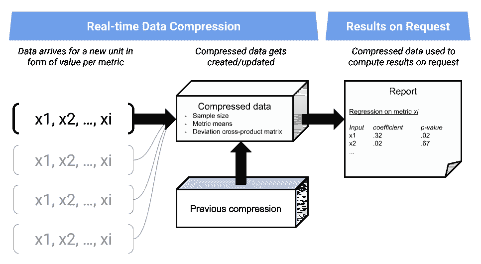
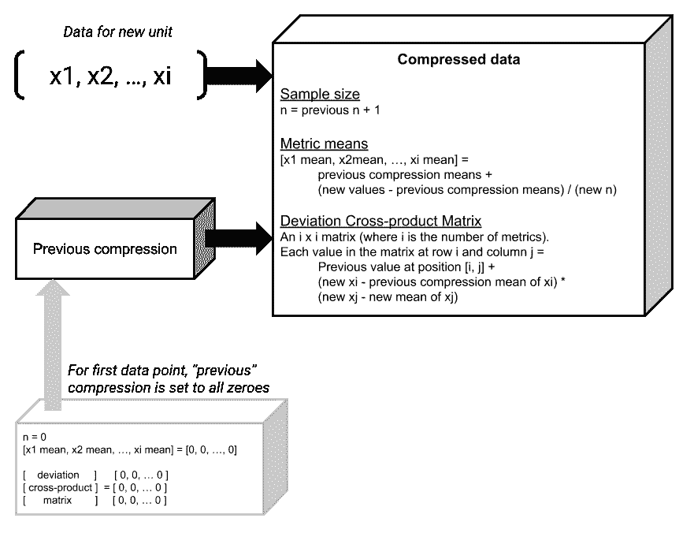
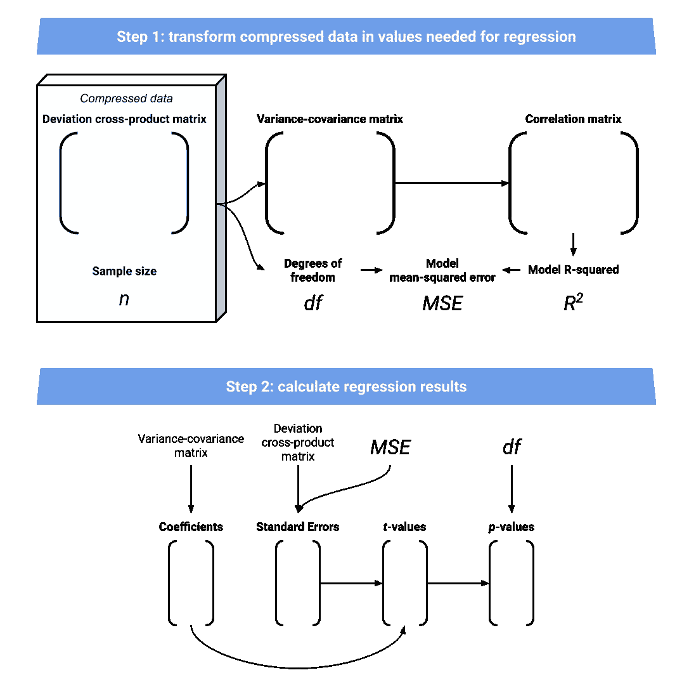
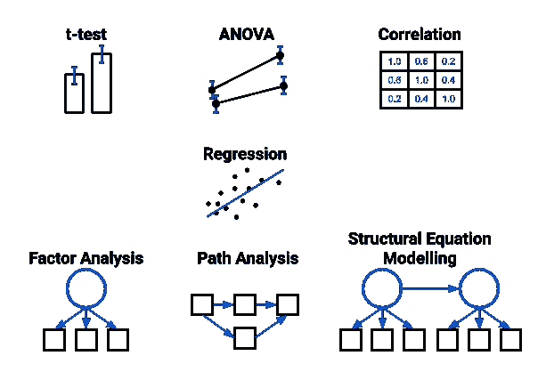

# 利用在线回归等功能扩展实时推理

> 原文：<https://towardsdatascience.com/scaling-up-real-time-inference-with-online-regression-and-more-902a939c171c?source=collection_archive---------53----------------------->

根据数据做出正确的决策意味着成功或失败。这就是为什么谷歌的[团队试图实现“更多、更好、更快的实验”，也是为什么他们和许多其他公司投资开发内部实验平台(](https://static.googleusercontent.com/media/research.google.com/en//pubs/archive/36500.pdf)[微软的 ExP](https://exp-platform.com/) 、[网飞的闪亮](https://netflixtechblog.com/its-all-a-bout-testing-the-netflix-experimentation-platform-4e1ca458c15)、[优步的 XP](https://eng.uber.com/xp/) 、 [Booking.com 的 ET](https://arxiv.org/abs/1710.08217) ，不胜枚举)。基础是 A/B 测试，现在这种测试被大规模实时地广泛进行。

这些天来，我们的胃口已经超出了 A/B 测试。科学家们面临着挑战，要在越来越复杂的情况下运用更先进的技术来改进决策。作为一个个人例子，我帮助将微软的 CUPED 引入 Booking.com 的 ET 以增强实验能力。这有助于更好地做出决策，但我并没有快速或廉价地做出决策。它是每天使用整个数据集计算的，随着数据的增长，成本会越来越高。另一个例子是[网飞的 XP](https://netflixtechblog.com/reimagining-experimentation-analysis-at-netflix-71356393af21) 允许数据科学家部署任意的统计函数。同样的规模挑战也适用，因此他们有一个专门的数学工程团队来编写高性能代码并减少代价高昂的瓶颈(例如，分位数自举和 OLS 回归)。

巧合的是，这篇文章讨论了回归(CUPED 也基于此)对决策的价值，如何将结果扩展到大量数据并实时显示，以及一个简单的基础如何为实时统计方法的宝库铺平道路。下面是我们将涉及的技术部分的总结。



实时回归方法概述

附注:我正在分享这个问题统计方面的一个解决方案。首先，虽然我找不到它们，但其他解决方案可能已经存在了(我的意思是，网飞团队说它是可用的)。如果你知道并且有能力，我很乐意在评论中与你分享！另一件事是，这并没有涵盖问题的工程方面。为了大规模成功实施，您需要将了解这里发生的事情的数据科学家与知道如何适当地传输和存储数据的工程师配对。

# 回归

普通最小二乘回归(从现在开始我就称之为“回归”)是建模连续数据最广泛使用的方法之一。它在机器学习中被大量使用，但这不是我们在这里的目的。我们在这里用它进行统计推断。如果你不太熟悉这种使用方式，它应该会让你兴奋地了解到回归涵盖了许多有用的统计技术测试，从简单的 *t* 测试到结构方程建模。最后会有更多的介绍。基本上，在你的推理工具包中加入回归可以极大地扩展你做出正确决策的范围。

*警告:我在故意推销回归的价值。然而，这种价值来自于对数据和结果的假设，这些假设对未经培训的用户构成了严重的风险。如果你对使用基于回归的方法进行推断感兴趣，一定要和一个了解风险的统计学家讨论。如果你不这样做，你最终可能会做出更糟糕的决定！*

问题是，如何扩展回归并不像使用简单的技术那样显而易见。这当然是它没有被大规模利用的一个原因。因此，让我们开始研究如何扩展我们的回归工具包，以便大规模、实时地工作！

# 让它发挥作用的洞察力

## 压缩是关键

有效处理大规模数据通常涉及数据压缩。例如*t*——测试不需要每个数据点。他们只需要跟踪几个数字:组均值、方差和样本量([个人演示贴](https://drsimonj.svbtle.com/big-data-solutions-a-b-t-test))。类似地，分位数自举可以用分桶数据来完成([网飞邮报](https://netflixtechblog.com/data-compression-for-large-scale-streaming-experimentation-c20bfab8b9ce))。如果您可以使用可以实时更新的压缩数据集，那么您就成功了！

事实证明我们可以利用这个来回归。无论您的总数据有多大，回归只需要一些汇总统计数据，这些统计数据可以随着新数据的到来而更新。

## 回归只需要协方差和 n

**所有一个回归需要的是** [**协方差矩阵**](https://en.wikipedia.org/wiki/Covariance_matrix) **和样本大小。**

拥有 25 个指标和 1 亿个数据点。见鬼，10 亿个数据点？！没问题。你只需要 326 个数字。指标的 25x25 协方差矩阵(嗯，它的各种变换)，它是对称的，因此有 325 个唯一的数字，一个数字代表样本大小。

现在我们知道了这一点，这篇文章的其余部分将介绍如何实现实时回归，然后讨论这种方法可能带来的其他好处。

# 让它工作

## 用于回归的实时数据压缩

*注意:我将使用 r 来演示这项技术。你可以在这里* [*找到我的 GitHub 上的完整代码*](https://github.com/drsimonj/OnlineRegression) *。*

我们需要协方差矩阵，但是随着数据的流入，使用中间对象更容易:*偏差叉积矩阵。*“偏差”指的是“与平均值的差异”,“叉积”是数值相乘的总和。因此，当一个新单元(例如，用户)的数据出现时，我们更新三样东西:样本大小、度量平均值(用于计算偏差)和偏差叉积矩阵。这里有一个总结:



当新实验单元的数据到达时，如何更新压缩数据

对于那些渴望代码的人来说，我写了一个 R 函数`update_compression()`,当新单元的数据到达时，它会这样做。你可以在 GitHub repo 中找到它。除了一个矩阵转置(如果你愿意可以避免)，这都是基本的数学。

让我们通过一个简单的数据集来看看它的实际应用:

```
# A simple data set of 10 observations
xs#>              x1       x2        x3
#>  [1,] 0.1366358 5.719901 11.807291
#>  [2,] 2.0323437 4.750903  6.992279
#>  [3,] 1.2030423 5.903466  8.910174
#>  [4,] 1.9078714 5.649198  7.488551
#>  [5,] 2.6487667 7.465745 11.340035
#>  [6,] 4.5719305 7.744037 10.077654
#>  [7,] 0.7048246 4.347754  7.146864
#>  [8,] 2.5375564 6.234913  9.964397
#>  [9,] 1.2603890 4.258484  7.630200
#> [10,] 1.4273975 7.329029 12.639481
```

假设第一个单元(第一行)到达，我们运行我们的函数。结果是:

```
*# Compress first row of data*
compressed_d <- update_compression(xs[1,])
compressed_d#> $n
#> [1] 1
#> 
#> $means
#>         x1         x2         x3 
#>  0.1366358  5.7199010 11.8072912 
#> 
#> $dcrossp
#>      [,1] [,2] [,3]
#> [1,]    0    0    0
#> [2,]    0    0    0
#> [3,]    0    0    0
```

这表明我们的样本大小为 1，每个指标的平均值就是数据点本身。叉积都是 0，只有 1 个数据点。

现在每一行都按顺序显示。最后的结果是什么？

```
# Iteratively update the compression with remaining data **for** (i **in** 2:nrow(xs)) {
  compressed_d <- update_compression(xs[i,], compressed_d)
}compressed_d#> $n
#> [1] 10
#> 
#> $means
#>       x1       x2       x3 
#> 1.843076 5.940343 9.399693 
#> 
#> $dcrossp
#>           [,1]      [,2]      [,3]
#> [1,] 13.747618  8.726897  1.679592
#> [2,]  8.726897 14.509862 18.319109
#> [3,]  1.679592 18.319109 38.730283
```

样本量为 10。滴答！手段呢？

```
apply(xs, 2, mean)#>       x1       x2       x3 
#> 1.843076 5.940343 9.399693
```

滴答！

以及偏差叉积矩阵？我在回购协议中留下了一些[更简单的检查方法。如果你知道你的矩阵代数，我们可以这样验证它:](https://github.com/drsimonj/OnlineRegression/blob/master/notebook.Rmd#L112-L119)

```
xs_d <- sweep(xs, 2, apply(xs, 2, mean)) # all deviation scores
t(xs_d) %*% xs_d#>           x1        x2        x3
#> x1 13.747618  8.726897  1.679592
#> x2  8.726897 14.509862 18.319109
#> x3  1.679592 18.319109 38.730283
```

完美！

我们现在可以在单位进入我们的实验时更新高度压缩的数据。这是让事情实时、大规模运转的关键。

## 从压缩数据回归

我们现在需要的是根据请求从压缩数据中获得回归结果。下面是如何发生这种情况的总结。



从压缩数据(离差叉积矩阵和样本大小)到最终回归结果的进展总结

我为此写了另一个 R 函数，`compressed_regression()`，你也可以在这里的 repo】中找到它。请注意，这比数据压缩更复杂。你需要非常了解矩阵形式的回归，这样才容易理解。存在矩阵运算(例如，`%*%`的乘法运算、`t()`的变换运算和`solve()`的求逆运算)以及从 t 分布中获取 p 值的需求(使用`pt()`)。不过，对于数据科学家和工程师来说，实现这些应该不是问题。

无论如何，让我们来测试一下。假设我们有之前的压缩数据，并想在 x2 和 x3 上回归 x1:

```
compressed_regression(
  compressed_d$dcrossp,
  compressed_d$n
)#>   coefficient standard_error   t_value     p_value
#> 1   1.3571198      0.2666634  5.089261 0.001416338
#> 2  -0.5985403      0.1632186 -3.667107 0.007994773
```

这与 R 的内置回归模型相比如何？

```
summary(lm(x1 ~ x2 + x3))$coefficients[-1,]#>      Estimate Std. Error   t value    Pr(>|t|)
#> x2  1.3571198  0.2666634  5.089261 0.001416338
#> x3 -0.5985403  0.1632186 -3.667107 0.007994773
```

完美！对于实现来说，这就差不多了。

*注意:我的方法要求在计算中使用截距，但计算不准确。为什么？计算它需要额外的工作，但我从未见过截距在推理/假设测试(相对于预测)中有用。如果您想试着弄清楚它，您将想要开始修改代码* [*在这里*](https://github.com/drsimonj/OnlineRegression/blob/master/notebook.Rmd#L180-L181) *添加占位符值。*

# 回归和超越！

随着实时回归成为一种选择，它还打开了什么？下图显示了一些统计技术，这些技术可以从这里讨论的完全相同的压缩数据中进行。我不打算解释它们或它们的用途，但我相信有统计学背景的读者会很兴奋。不过，如果你有问题，请提出来，因为这些答案可能会成为一篇好的后续文章。



只是一些统计技术，可以使用我们的压缩数据

对于推理和数据探索，大规模使用这些方法是非常令人兴奋的事情！如果你想探索一些更复杂的方法，我可以推荐用接受协方差矩阵作为输入的 [lavaan 包](http://lavaan.ugent.be/tutorial/cov.html)在 R 中进行测试。

嗯，我就知道这么多了。感谢阅读，我希望这对你有用。如果你有问题，有改进的想法，或者你想更进一步，请评论！