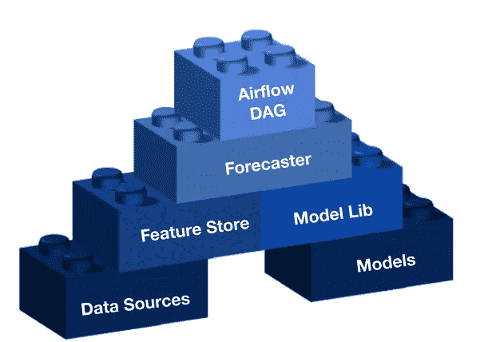

# 扩展您的时间序列预测项目

> 原文：<https://towardsdatascience.com/scaling-your-time-series-forecasting-project-9b7cb31a75dc?source=collection_archive---------30----------------------->

## 这篇博客基于我在国际预测研讨会 [ISF2020](https://isf.forecasters.org/) 上的演讲，题目是— **扩大销售预测的最佳实践。**

照片由[埃里克·麦克莱恩](https://unsplash.com/@introspectivedsgn?utm_source=unsplash&utm_medium=referral&utm_content=creditCopyText)在 [Unsplash](https://unsplash.com/s/photos/groot?utm_source=unsplash&utm_medium=referral&utm_content=creditCopyText) 上拍摄

# 我们预测什么，为什么？

在[Wix.com](http://wix.com)，我们一直在使用时间序列预测模型作为我们预测 Wix 未来产品系列的数据科学项目的一部分。这让该公司做了两件重要的事情:(1)基于未来的收款进行更好的预算规划；(2)对股市的准确引导。

**预测收藏是一项具有挑战性的任务**(每一项预测任务都是如此)，但我们一直在不断改进，并取得了惊人的成绩。在这篇博客中，我想分享一些我们对扩展预测项目的见解和实践。

# 从底层开始扩展—设计的重要性

我们的设计基于独立的构建模块协同工作

为了使我们的系统能够扩展并容纳更多的特征、更多的模型以及最终更多的预测者，我们将它划分为上述构件。每个构件都独立存在，但也知道如何与他人沟通和合作。每个问题的简短解释(希望我将来能更深入地描述它们，请在下面评论/DM with requests):

*   **数据源**—用于访问和查询我们所有不同的表格和数据库。
*   **特征存储** —使用来自数据源的数据创建时序特征。给定所请求要素的列表，它将返回一个时序数据集。
*   **模型—** 为清晰起见，本文引用了时间序列的开源模型。
*   **模型库** —模型的包装器，具有我们选择的超参数，并与源自特征库的数据集兼容。
*   **预测器** —从特征存储中获取数据集，从模型库中获取模型，并为我们所需的任务创建时间序列预测器。
*   **气流 DAG**—[DAG](https://airflow.apache.org/docs/stable/concepts.html#:~:text=In%20Airflow%2C%20a%20DAG%20%E2%80%93%20or,and%20their%20dependencies)%20as%20code.)在我们的系统中扮演着几个角色，在这种情况下(后面会有更多)我们指的是它安排预报员的运行(在我们的情况下是每天)

如上所述，这种设计支持扩展，同样重要的是，它支持快速实验，这是每个成功的数据科学项目的基础。

# **让您的朋友和数据更亲密**

数据始终是每个数据科学项目中最重要的部分。当预测一个源于你的业务的时间序列时，你自然会想要添加你可用的“内部”信息。当你想给时间序列预测增加一些特性时，你必须确保你知道这些特性的未来值是多少(或者你也必须预测它们，这会增加很多复杂性)。也就是说，这些要素可能会随着时间的推移而发生变化，并且可能会出现不同类型的错误，从而极大地影响您的结果。

**从下游错误到** [**上游**](https://www.amazon.com/Upstream-Quest-Problems-Before-Happen/dp/1982134720) **解决方案** —密切关注您的结果和数据是发现下游问题的关键(下一节将详细介绍)，这里的重点是将这些转化为上游解决方案——基于我们的设计，我们能够在不同层上进行数据验证:

*   **数据源**验证我们正在获取符合我们预期的最新数据。
*   **特征库**验证特征是否符合我们对数据集的要求。
*   **气流 DAG** 在运行预测器之前验证表格是否已更新以及之前的流程是否成功完成。

# **监控——我们如何适应业务变化**

我们可以将业务变更分为两类:

*   **内部变化** —例如，新销售、新产品、价格变化等..
*   外部变化——比如一个新的竞争对手，甚至是一个遥远的全球性疫情。

尽管变化可能非常不同，但适应这些变化需要经历相似的阶段:

1.  **发现变化** —这是我们进行监控的地方，我们不断跟踪我们的结果，并通过分析报告和电子邮件提醒(再次使用 DAG)将它们与过去的结果进行比较。
2.  **了解变化—** 变化有趋势吗？我们能量化影响吗？它从哪里来的？这在内部和外部变化之间是非常不同的，它总是一个非常具有挑战性的任务。有时甚至理解我们并不完全理解这种变化也可能是我们的结论。
3.  **帮助模型理解变化—** 这很大程度上取决于我们在前一阶段得出的结论，如果我们对变化及其未来行为有很好的理解，我们可能会通过某个特征将其引入模型。我们也可以决定看看这个模型是否会自己发现这个变化。

# **何时以及如何改进您的车型**

micha Parzuchowski 在 [Unsplash](https://unsplash.com?utm_source=medium&utm_medium=referral) 上拍摄的照片

如果你仔细遵循，现在你已经有了一个相当好的系统，但是现在呢？你应该在什么时候改进你的模型，如何改进？请做好准备，这一部分会包括一些棘手的问题，而不是很多决定性的答案。

也就是说，一个答案可以解决所有问题——实验是处理这些问题的关键。

## 如果它没坏，就不要修理它？

预测器运行良好，但是您开始考虑一个应该非常相关的新功能——您应该添加它吗？

## 如果它开始发出吱吱声，然后修理它？

预测者的误差略有增加，你要回到上一节，标出一些可能的变化。但是你不确定预测者的这种变化会是什么结果——你应该添加它们吗？

## 什么时候改变是好的改变？

改变预测器或增加一个功能会增加复杂性和未来可能的技术债务(尽管我们的系统旨在减少这种情况)。这项新功能的影响是什么？随着时间的推移，这种影响会增加吗？改进是否足够显著，足以证明增加新功能或改变预测工具的成本是合理的？

## 追踪变化，改写历史

假设我们已经添加了新的变更，现在是时候回去监控变更并查看其效果了。但从某种意义上来说，我们现在是在比较两种不同的预测者(苹果和橙子？).一方面，我们希望看到我们的新预测者与旧预测者的对比，但另一方面，我们希望看到我们的新预测者与新预测者的对比，就好像它在一周前运行一样(据此是苹果与苹果的对比)。

为此，我们有两个表:

*   **真实历史**基本上是当天生产的模型的实况结果。
*   **更新历史**历史，就好像我们当前的模型和当前的特征和数据一直伴随着我们(我们为此运行所有以前的日期)。

# 结论

当业务快速变化时，扩展并保持预测系统的准确性是一项非常具有挑战性的任务，但是使用这些实践对我们来说已经走了很长的路，希望它也能为您服务。