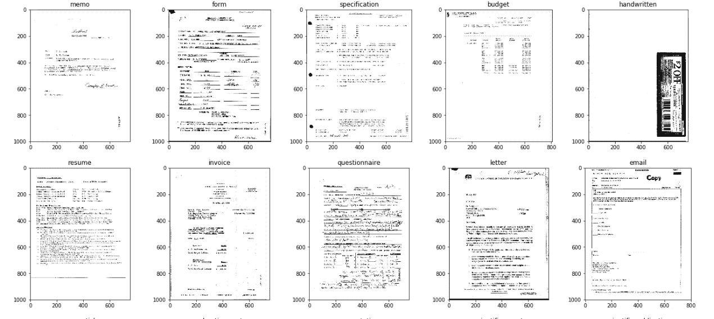
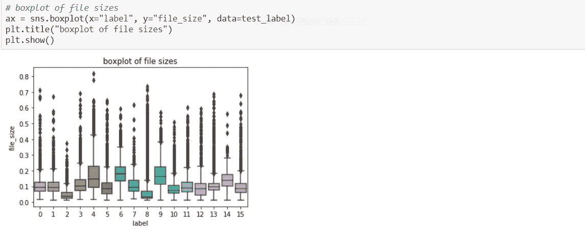
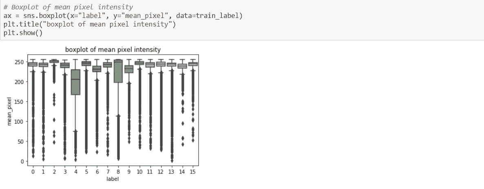
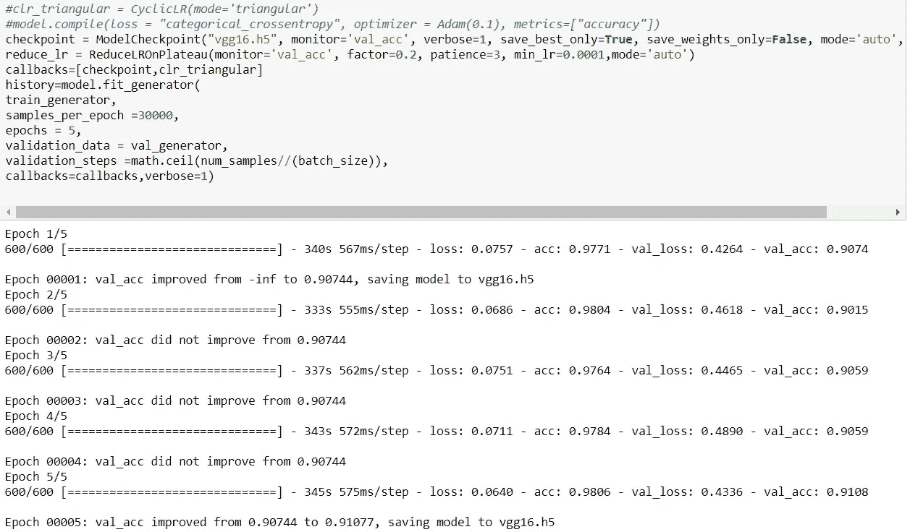
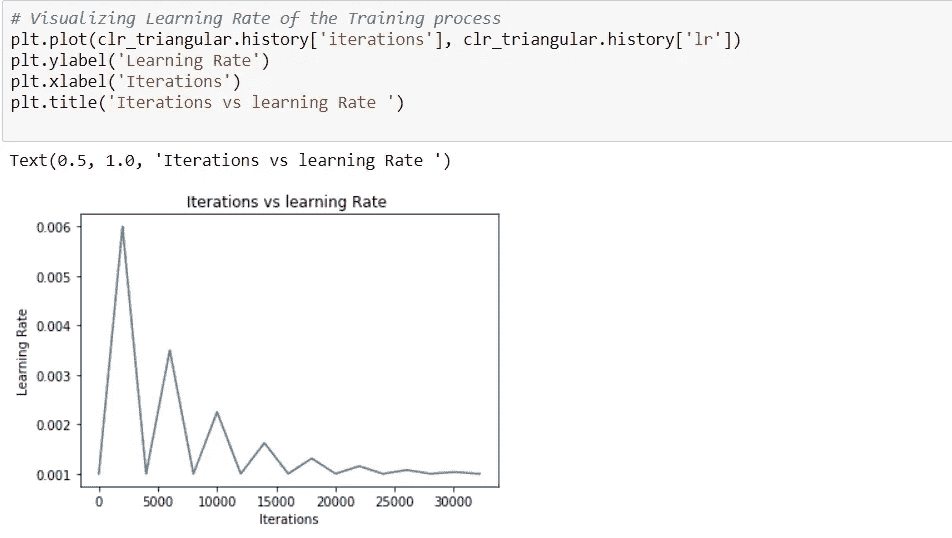
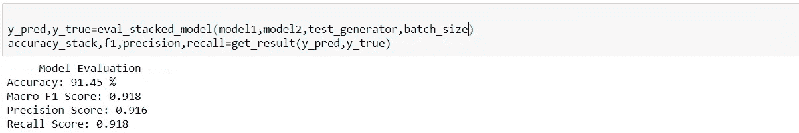
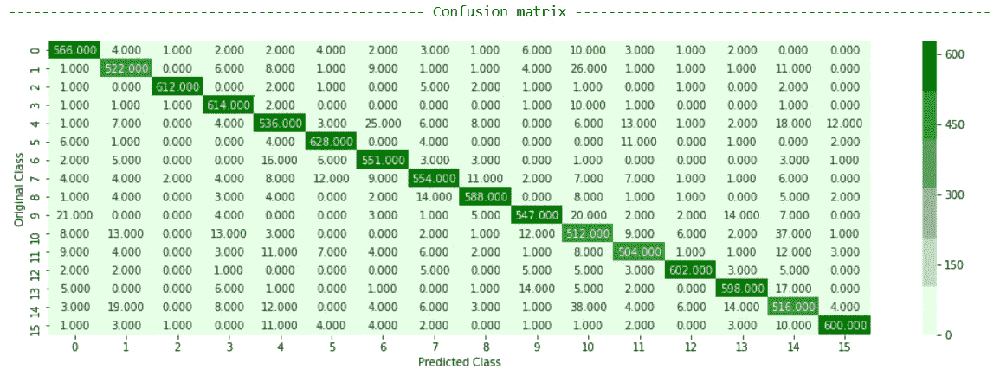
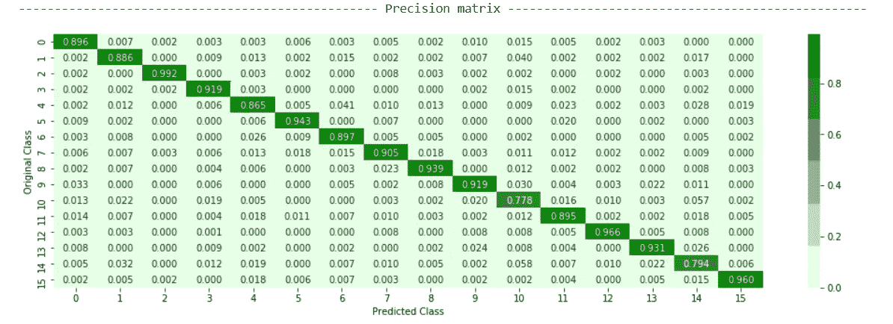

# 使用计算机视觉的扫描文档分类

> 原文：<https://towardsdatascience.com/scanned-document-classification-using-computer-vision-33a42d9e01f9?source=collection_archive---------6----------------------->

## 一种解决扫描文档分类问题的深度学习方法

在数字经济时代，银行、保险、管理、医疗和法律等部门仍然需要处理各种手写笔记和扫描文档。在业务生命周期的后期，手动维护和分类这些文档变得非常繁琐。对这些非机密文档进行简单而有意义的自动化宁滨将使维护和利用这些信息变得容易得多，并大大减少人工工作量。

扫描的文档

本案例研究的目标是开发一个基于深度学习的解决方案，可以自动对文档进行分类。

**数据:**对于本案例研究，我们将使用 RVL-CDIP(瑞尔森视觉实验室复杂文档信息处理)数据集，该数据集由 16 类 400，000 幅灰度图像组成，每类 25，000 幅图像。有 320，000 幅训练图像、40，000 幅验证图像和 40，000 幅测试图像。调整图像大小，使其最大尺寸不超过 1000 像素。该数据集的大小超过 200 GB。

**业务-ML 问题映射:**我们可以将业务问题映射为多类分类问题。当前数据集中有 16 个类别。我们需要仅基于扫描文档的像素值来预测文档的类别，这使得问题变得困难。 ***但是等等，为什么不能用 OCR 提取文字，应用 NLP 技术呢？是的，我们也对这个想法感到兴奋，但是低质量的扫描导致了较差的文本提取质量。在实际的商业场景中，我们也无法控制扫描的质量，因此依赖于 OCR 的模型即使经过适当的预处理也可能会泛化能力差。***

**KPI 和业务约束:**数据集相当平衡。因此，我们选择准确性作为主要指标，微观平均 F1 分数作为次要指标，以惩罚错误分类的数据点。我们还使用混淆度量来验证模型的性能。对延迟的要求适中，对可解释性没有具体要求。

**我们能从文档的像素强度和大小中得到什么吗？**

让我们尝试使用一个方框图来显示文档的平均像素强度和大小

从方框图中，我们可以观察到某些类型的扫描文件的尺寸与其他文件大不相同，但也有重叠。例如，类别 13 和类别 9 的文件大小差别很大，但是类别 9 的大小与类别 4 和类别 6，7 重叠。

我们可以观察到，对于 75%的情况，类别 4 的平均像素强度位于 160–230 像素之间。但是对于大约 50%的情况，它也与类别 6 的平均像素值重叠。对于其他类，平均像素值重叠。

**分析方法**

为了解决眼前的问题，我们在扩充的数据上训练了卷积神经网络(CNN)。我们已经尝试在有和没有数据增强的情况下训练模型，结果是可比较的。

高级分析工作流程图

**太好了！但是如何决定网络架构呢？你是如何训练网络的，因为数据一次装不下？**

从头开始训练神经网络需要大量的时间和计算资源来收敛，为了避免这种情况，我们采用了迁移学习的帮助。我们从在 ImageNet 数据集上训练和在我们的数据集上重新训练的预训练网络的权重开始。针对这类问题的当前 SOTA 模型使用域间和域内迁移学习，其中图像被分成四个部分:页眉、页脚、左体和右体。首先使用预训练的 VGG16 模型来训练整个图像(域间)，然后使用该模型来训练部分图像(域内)。

在这个实验中，我们采用了一种稍微不同的方法。我们没有使用 VGG16 进行域内迁移学习，而是训练了两个并行模型 VGG16 和 InceptionResNetV2，并使用这些模型的堆栈作为我们的最终模型。我们的假设是，由于这两个模型的不同架构，他们将学习图像的不同方面，并将它们堆叠将导致良好的概括。 ***但是我们如何选择这些型号呢？*** *这基本上来自交叉验证的结果。* 我们尝试了各种网络架构，像 VGG16、VGG19、DenseNet、ResNet、InceptionNet，选出了最好的两个。

我们使用 keras 的 ImageDataGenerator 类来预处理和加载训练数据，而不是将整个数据一次性加载到内存中。

VGG16 网络的最终培训阶段

**好的。但是如何处理超参数呢？**

对于任何 CNN 的超级参数是:学习率，池大小，网络大小，批量大小，优化器的选择，正则化，输入大小等。

学习速率对神经网络的收敛起着重要的作用。深度学习问题中使用的损失函数是非凸的，这意味着在存在几个局部最小值和鞍点的情况下，找到全局最小值不是一件容易的事情。如果学习率太低，它将缓慢收敛，如果学习率太高，它将开始振荡。在本案例研究中，我们使用了一种称为“循环学习率”的技术，其目的是以这样一种方式训练神经网络，即对于每个训练批次，学习率以循环方式变化。

但是它为什么会起作用呢？在 CLR 中，我们在一个阈值内改变学习率。周期性的较高学习率有助于克服它是否停留在鞍点或局部最小值。

对于其他超参数，我们开发了定制的效用函数来检查哪种配置效果更好。假设在 10 个时期之后，我们得到了 47%的准确度。我们将在那时使用该模型作为测试基线，并使用效用函数来检查哪个配置集(即 batch _ size/optimizer/learning _ rate)将在未来时代产生更好的准确性。

**结果**

我们使用 VGG16 模型实现了 90.7%的准确率，使用 InceptionResNetV2 实现了 88%的准确率。上述两个模型的比例叠加模型获得了 97%的训练准确率和 91.45%的测试准确率。

你可以在这里找到完整的实现。

**引用:**

1.  A.W. Harley，A. Ufkes，K. G. Derpanis，“用于文档图像分类和检索的深度卷积网的评估”，ICDAR，2015 年。
2.  [https://arxiv.org/abs/1506.01186](https://arxiv.org/abs/1506.01186)
3.  [https://www . research gate . net/publication/332948719 _ Segmentation _ of _ Scanned _ Documents _ Using _ Deep-Learning _ Approach](https://www.researchgate.net/publication/332948719_Segmentation_of_Scanned_Documents_Using_Deep-Learning_Approach)