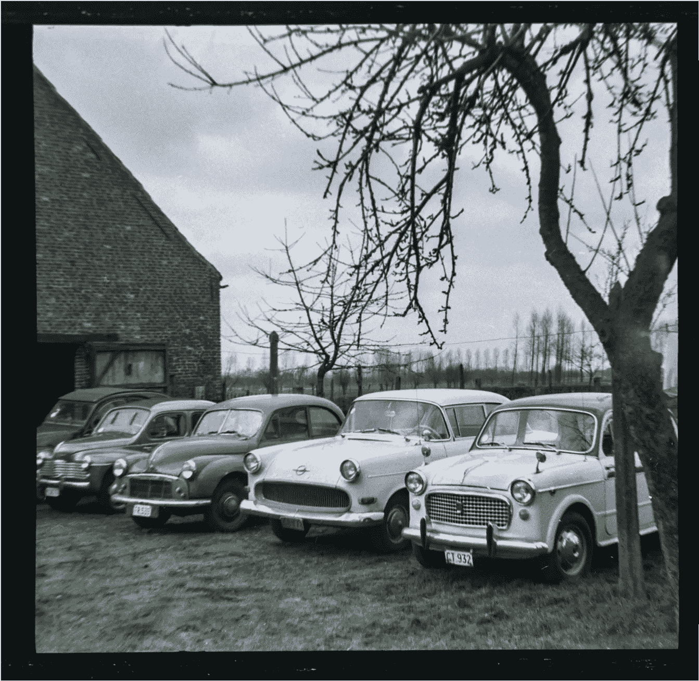

# 使用 DeepAI 扫描旧的黑白胶片底片并将其转换为彩色图像

> 原文：<https://towardsdatascience.com/scanning-and-converting-old-black-and-white-film-negatives-to-color-images-using-deepai-5eb9c549d34a?source=collection_archive---------27----------------------->

*封面照片由*[*Grzegorz Mleczek*](https://www.lifeofpix.com/photo/film-camera/)

这篇文章与我之前关于(生物)医学的文章无关，但是使用了我在博士研究期间学到的一些 Python 技巧。它没有深入研究深度学习背后的理论，而是展示了一个如何使用该技术的实际例子。我在本教程中使用 Adobe Photoshop 和 Lightroom，如果你成功地使用了开源软件，请在评论中告诉我。

世界大部分地区再次陷入困境，许多人又回到了家中。如果你正在寻找一件不涉及任何其他人的事情，你可能会在本教程中找到一些灵感。

我的祖父母给了我一些旧的黑白底片，这篇博客描述了我用 DeepAI 扫描、数字化和着色的过程:

之后 vs 之前

# 扫描胶片底片

我用我的 DSLR(尼康 D3500 和 Samyang 135 mm f/2.0 镜头)、一个三脚架、我的手机作为背光和一个纸箱扫描了胶片底片，我剪下这个纸箱以便底片可以放进去。如果你没有 DSLR，你可以用你的手机作为相机，笔记本电脑屏幕作为背光，但不要指望惊人的效果(使用一个捕捉原始文件的应用程序，最好是一个三脚架，以保持尽可能低的 ISO。我在下面添加了 DSLR 与小米 9T 相机的对比。

DIY 底片扫描仪，智能手机放在盒子背面。胶片和智能手机之间需要有一些距离，否则你最终会得到图像中的像素模式。

我的相机设置是 ISO100，f/4 和 1/8 秒快门速度(确保你拍摄的是 RAW 而不是 JPG)，结果是这样的图像:

# 反转负像

每张照片都是不同的，所以你必须尝试什么是有效的。我是从亚历克斯·伯克的指导开始的。

扫描、裁剪和编辑 B&W

lightroom 预设可以在 [my Github](https://github.com/rmvpaeme/convertNegatives/blob/main/makePositive_B%26W.xmp) 上找到。

# 给 B&W 图像着色

现在我们进入最有趣的部分:使用深度学习将 B&W 图像转换为彩色图像。

互联网上有很多选择，但大多数要么很贵，要么没那么好(或者两者兼而有之)。我开始在 Photoshop 上使用新的神经过滤器的“着色”功能，但结果很糟糕。

在更多的谷歌搜索之后，我找到了 DeepAI。不幸的是，每个大于 1200x1200 像素的图像都会被缩小，如果您在工作流程的其余部分使用 RAW 文件和高分辨率图像，这是一个遗憾。据我所知，deepAI 的付费版本也不支持更大的图像，如果他们支持，请告诉我。

幸运的是，DeepAI 允许使用 API 提交作业。换句话说，如果我们将图像分割成 1200x1200 像素的重叠拼贴，给这些拼贴着色，然后将它们拼接在一起，应该不会有任何质量损失。分割图像可以用[这个代码](https://github.com/Devyanshu/image-split-with-overlap)来完成:

一旦所有图像被分割，我们可以使用 Python 将每个单独的图像块提交给 DeepAI:

在 Photoshop 中自动合并单个帧:“文件”>“自动”>“Photomerge ”,并根据图像执行一些额外的调整(对比度、鲜明度等):

用我的智能手机代替我的 DSLR 得到的结果要差得多，但是我没有优化这个过程:

所有代码都在我的 [GitHub](https://github.com/rmvpaeme/convertNegatives) 上。如果你发现 DeepAI 使用的模型有任何偏见，请发推文或电子邮件告诉他们。

# 玩得开心，呆在家里，保持社交距离，阻止冠状病毒的传播。