# 近红外光谱中的散射校正和异常值检测

> 原文：<https://towardsdatascience.com/scatter-correction-and-outlier-detection-in-nir-spectroscopy-7ec924af668?source=collection_archive---------22----------------------->

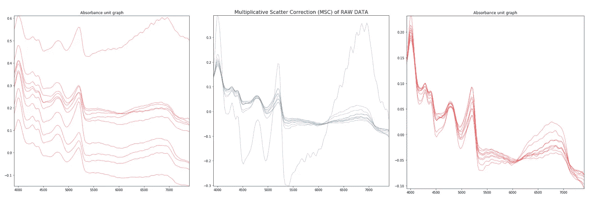

人工智能领域的最新进展已经引起了 NIR 传感器数据和机器学习技术的集成，以实现这些结果。在这篇文章中，近红外传感器与电脑接口和样品进行扫描。我们对每个样本进行了十次扫描，扫描时间为十秒钟，以减少误差并包括样本的所有部分。在我们的案例中，扫描结果是分散的，并且由于光线、工作距离和扫描过程中的人为错误的变化，我们有异常值。为了减少散射和消除异常值，我们对近红外(NIR)数据实施了乘性散射校正(MSC)和标准正态变量(SNV)。

数据预处理是在近红外光谱和大多数光谱分析中建立大多数类型校正模型的基本步骤。通过精心设计的预处理步骤，可以大大提高模型的性能。

原始数据；样本 1 和样本 2 包含重复读数

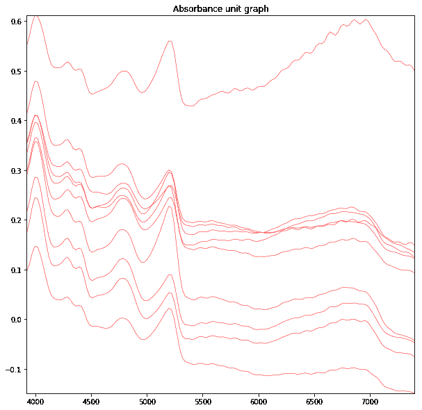

图 1 .具有 10 个重复读数的样品 1 的原始吸收光谱。x 轴:波长，y 轴:吸光度单位

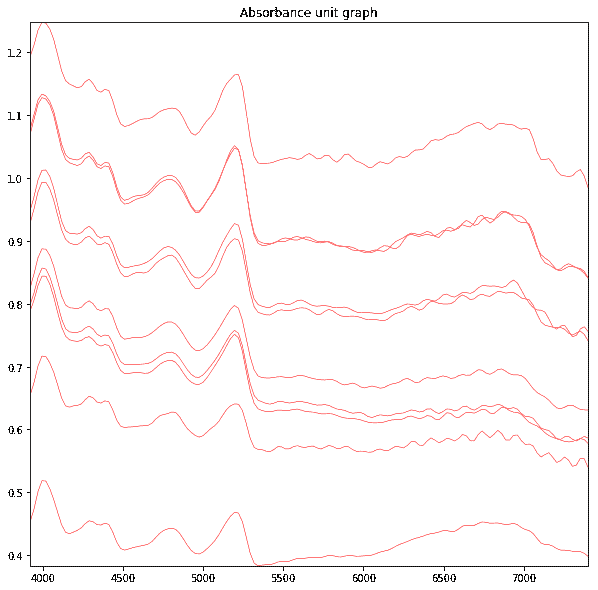

图 2 .具有 10 个重复读数的样品 2 的原始吸收光谱。x 轴:波长，y 轴:吸光度单位

## Python 中的乘法散射校正

MSC 需要一个参考光谱作为开始。理想的参考光谱是没有散射效应的光谱。在实践中，我们将样本数据的平均值作为参考。这是 MSC 和 SNV 最重要的区别。

现在，正如你可以收集到的，得到一个没有不必要的散射效应的光谱并不容易，不是在我们感兴趣的所有波长上。因此，如果数据表现良好，我们可以将平均光谱作为我们所追求的理想光谱的近似。颗粒尺寸和路径长度的影响会因样品不同而随机变化，因此平均值会合理地减少这些影响，至少在这些影响真正随机的近似值中是如此。这是 MSC 背后的主要假设。

让我们认为 Xm 是平均谱。我们首先相对于平均光谱回归每个光谱 Xi。这是通过普通最小二乘法 Xi ≈ ai + biXm 完成的，然后我们计算校正的频谱 Xmsc = (Xi-ai)/bi

```
def msc(input_data, reference=None):
    """
        :msc: Scatter Correction technique performed with mean of the sample data as the reference. :param input_data: Array of spectral data
        :type input_data: DataFrame :returns: data_msc (ndarray): Scatter corrected spectra data
    """ eps = np.finfo(np.float32).eps
    input_data = np.array(input_data, dtype=np.float64)
    ref = []
    sampleCount = int(len(input_data))

    # mean centre correction
    for i in range(input_data.shape[0]):
        input_data[i,:] -= input_data[i,:].mean()

    # Get the reference spectrum. If not given, estimate it from the mean # Define a new array and populate it with the corrected data    
    data_msc = np.zeros_like(input_data)
    for i in range(input_data.shape[0]):
        for j in range(0, sampleCount, 10):
            ref.append(np.mean(input_data[j:j+10], axis=0))
            # Run regression
            fit = np.polyfit(ref[i], input_data[i,:], 1, full=True)
            # Apply correction
            data_msc[i,:] = (input_data[i,:] - fit[0][1]) / fit[0][0]

    return (data_msc)
```

此外，我们可以绘制 MSC 值

```
def linegraph(df,name="data"):
    """
        :linegraph: Plot absorbance unit vs wavelength number graph :param df: Spectral data containing absorbance units and wavelengths
        :type df: ndarray :returns: Absorbance unit vs wavelength graph
    """ # Read the spectral data file
    neospectraDataFile= neoSpectraSensorData.getNeospectraDataFile() # Get the wavelengths
    wavelengths =
    np.array(neospectraDataFile.columns).astype(np.float)
    x = wavelengths
    y = df
    ys = [i for i in y] #put into the format for LineCollection # We need to set the plot limits, they will not autoscale
    fig, ax = plt.subplots(figsize=(10,10), dpi=150)
    ax.set_xlim(np.min(x), np.max(x))
    ax.set_ylim(np.min(ys), np.max(ys)) # Make a sequence of x,y pairs
    line_segments = LineCollection([np.column_stack([x, y]) for y in ys],linewidths=(0.5),linestyles='solid')
    ax.add_collection(line_segments)
    ax.set_title('Absorbance unit graph of '+name, fontsize = 15)
    ax.set_xlabel(r'Wavenlength', fontsize=15)
    ax.set_ylabel('Absorbance', fontsize=15)

    return(plt.show())
```

理学硕士的结果:


图 3 .样品 1 的 MSC 校正数据图；x 轴:波长，y 轴:吸光度单位

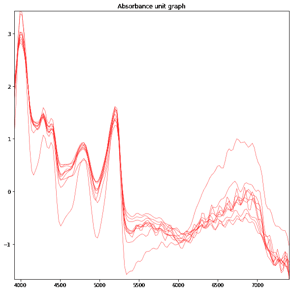

图 4 .样品 2 的 MSC 校正数据图；x 轴:波长，y 轴:吸光度单位

## Python 中的标准普通变量

与 MSC 不同，SNV 校正是在每个单独的光谱上进行的，不需要参考光谱。SNV 修正也可以分为两个概念步骤。

通过去掉其均值来对每个 Xi 频谱进行平均。将每个以平均值为中心的谱除以它自己的标准偏差:Xisnv =(Xi-Ximean)/sigma

```
def snv(input_data):
    """
        :snv: A correction technique which is done on each
        individual spectrum, a reference spectrum is not
        required :param input_data: Array of spectral data
        :type input_data: DataFrame

        :returns: data_snv (ndarray): Scatter corrected spectra
    """

    input_data = np.asarray(input_data)

    # Define a new array and populate it with the corrected data  
    data_snv = np.zeros_like(input_data)
    for i in range(data_snv.shape[0]): # Apply correction
    data_snv[i,:] = (input_data[i,:] - np.mean(input_data[i,:])) / np.std(input_data[i,:])

    return (data_snv)
```

通过调用上面的线图函数，进一步绘制 SNV 图

SNV 的结果:

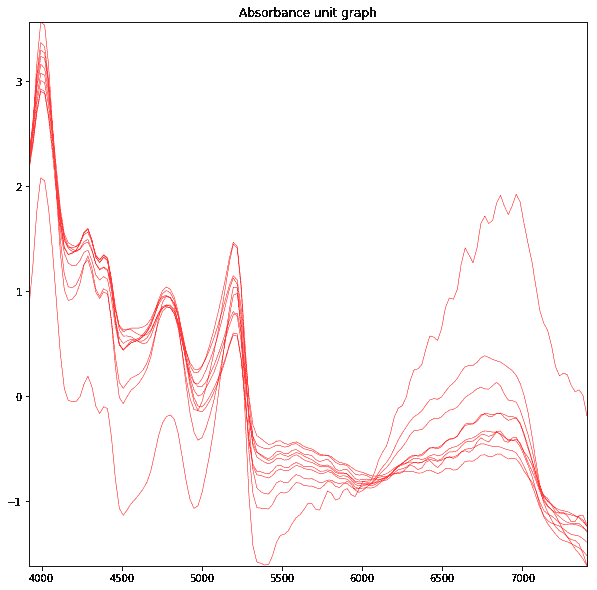

图 5 是样品 1 的 SNV 校正数据图；x 轴:波长，y 轴:吸光度单位


图 6 样品 2 的 SNV 校正数据图；x 轴:波长，y 轴:吸光度单位

对原始数据应用 MSC 和 SNV 后的结果:

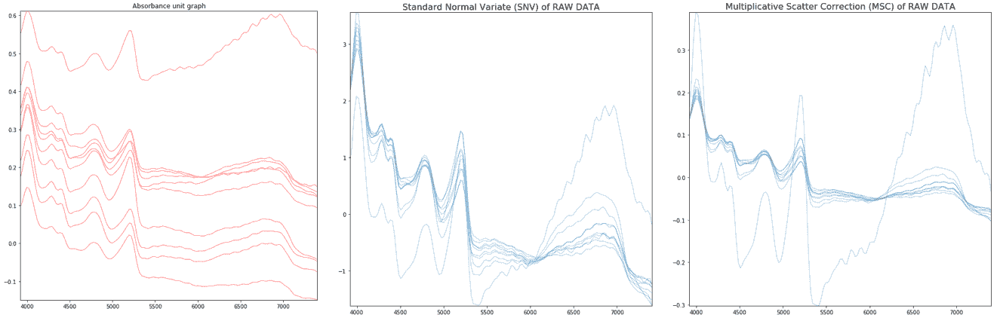

图 7\. a .原始光谱 b. SNV 光谱 c .样品 1 的 MSC 光谱

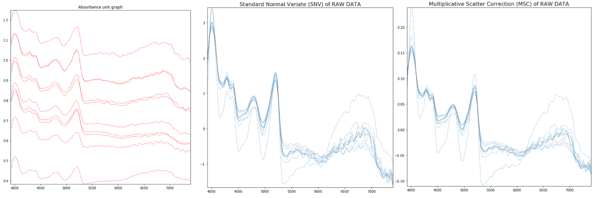

图 8\. a .原始光谱 b. SNV 光谱 c .样品 2 的 MSC 光谱

现在，结果被分散校正。MSC 中的异常值可以通过使用简单的 z 分数技术来消除。

## 分散校正数据的异常值检测

MSC(原始数据)的异常值相当低。因此，如果光谱中有超过 40%的点是异常值，我们就认为它是异常值

zscore =(individual sample-individual sample . median())/individual sample . STD()

定义 z 得分函数:

```
def zscorefunction(arrayMatrix, threshold=1):
    """
        :zscorefunction: Compute the z score of arrayMatrix     
        (Individual sample), relative to the sample median and   
         standard deviation. :param arrayMatrix: Array file containing spetral data of   
        one sample
        :type arrayMatrix: array :returns: The coordinates of the points which are 
        considered to be outliers. We are interested in x coordinate of the results. 
        Here, In our case, the x coordinate is the spectra number. - Example of the output:: output:(array([1,2,1,2,3,4]), array([1,5,8,70,85,143]))

            Read as, (spectra number, point in the spectra) 
            (1,1),(2,5),(1,8),(2,70),(3,85) and (4,143). 

            [1,2,1,2,3,4] are the spectra number of the sample 
            and [1,5,8,70,85,143] are the point in the spectra

            The 1st and 8th wavelength point in the 1st spectra 
            are outliers.similarly, The 5th and 70th wavelength   
            point in the 2nd spectra are outliers """
    # A z-score is the number of standard deviations away from a  
    mean for a data point. 
    zscore = (arrayMatrix - np.median(arrayMatrix))/   
    arrayMatrix.std()

    return (np.where(np.abs(zscore) > threshold))
```

z 得分函数返回被视为异常值的点的坐标。

```
def deleteOutliersSummary(X,Y,summary = True):
    """
        :deleteOutliersSummary: Calls the z score function to get   
        the outlier spectra numbers.We are interested in x 
        coordinate of the results. In our case, the x coordinate is 
        the spectra number.So, we apply the counter function on the 
        result to get the total count of outlier points for 
        spectra.and delete the spectra if the spectra has 75% of 
        its points as outliers :param X: Training spectral file (usually MSCTrain)
        :type X: array :param Y: Training target file      
        :type Y: array :returns: individualX (list) and y (list), 
        New spectral & target train files with outliers eliminated """ # A z-score is the number of standard deviations away from a 
    mean for a data point. 

    # We define a deleteSpectra where we store the Spectra number 
    with more than 75% (you can change this based on your MSC data)
    points as outliers deleteSpectra = []
    individualX = neoSpectraSensorData.getIndividualSamples(X)
    y= getMeanData.getMeanTarget(Y)
    out = 0
    noOut = 0
    sampleCount = len(individualX) for i in range(0,sampleCount):
        # call the function
        x = zscorefunction(individualX[i])[0]
        # print sample number and spectra number with its   
        corresponding number of outlier points

        if summary == True:
            # Counter gives the spectra number(index): number of  
            outlier points
            print("\nSAMPLE",i+1)
            print(Counter(x)) threshold = 0.75*X[1].shape[0]
        for j in range(0,individualX[i].shape[0]):
            # If the sepctra contains more than 75% of points as   
            outliers, delete the spectra

            if (Counter(x)[j] > threshold):
                deleteSpectra.append(j) # Delete the outlier spectra from the sample
        individualX[i] = np.delete(individualX[i], deleteSpectra, 0)
        y[i] = np.delete(y[i], deleteSpectra, 0)

        # If the sample has no outliers in all it's spectra then 
        display "No outliers detected"
        if deleteSpectra != []:
            out +=1
        else:
            noOut +=1

        if noOut == sampleCount:
            print("No outliers detected")

        if summary == True:
            print ("Delete Spectra:",deleteSpectra)
        del deleteSpectra[:]

    return(individualX,y)
```

输出:

计数器给出光谱数(指数):异常点的数量

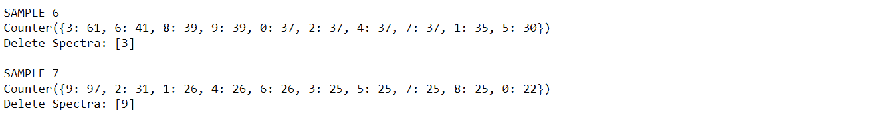

从 MSC 数据中剔除异常值后绘制数据:

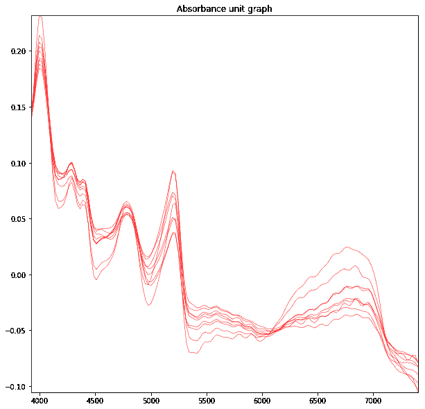

图 9 .从样品 1 的 MSC 数据中消除异常值后的图

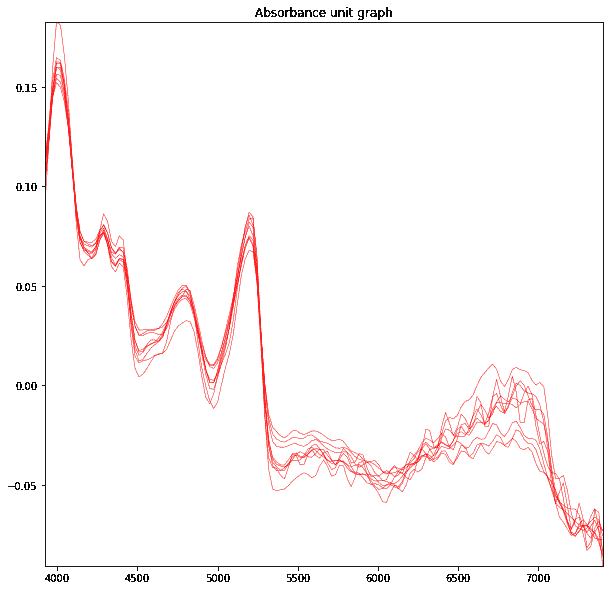

图 10 .消除样本 2 的 MSC 数据上的异常值后的图

这里您可以看到，在经过散射校正的数据中，异常值被消除了。现在，我们可以使用这些数据来建立模型。

## 最终结果:

原始数据—原始数据的异常值剔除

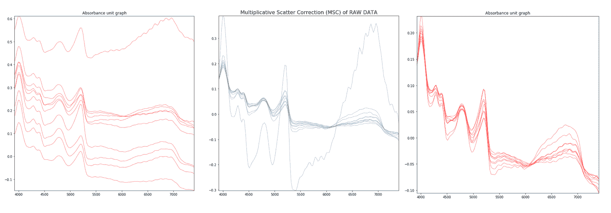

图 11 .原始数据— MSC 数据—样本 1 的 MSC 异常值消除


图 12 .原始数据— MSC 数据—样本 2 的 MSC 异常值消除

谢谢你的时间。希望对你有帮助。

[](https://www.buymeacoffee.com/shravanh)

参考:[https://nirpyresearch . com/two-scatter-correction-techniques-NIR-spectroscopy-python/](https://nirpyresearch.com/two-scatter-correction-techniques-nir-spectroscopy-python/)