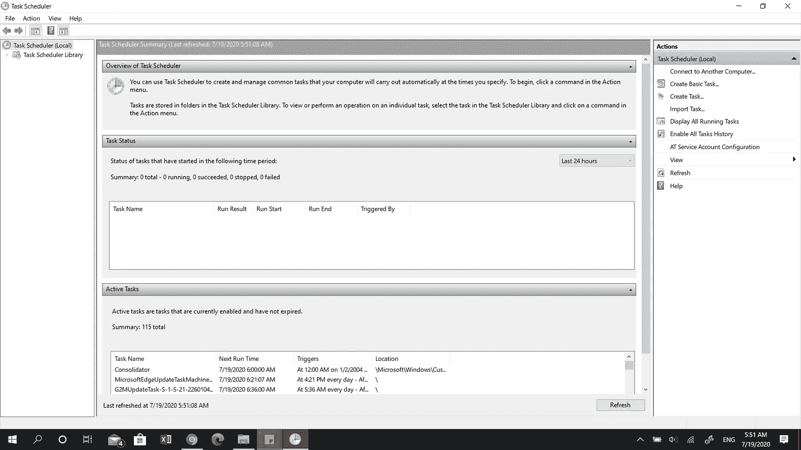
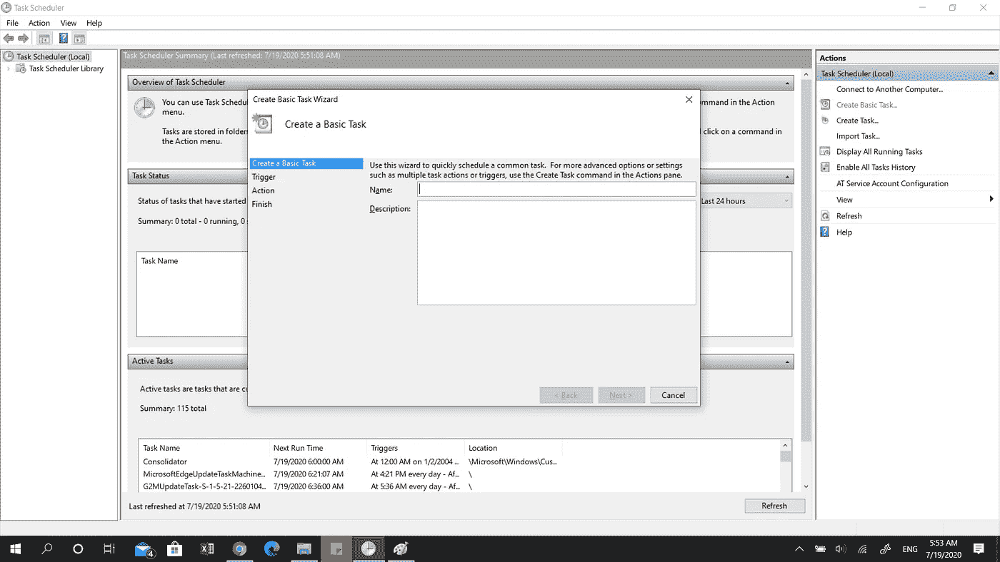
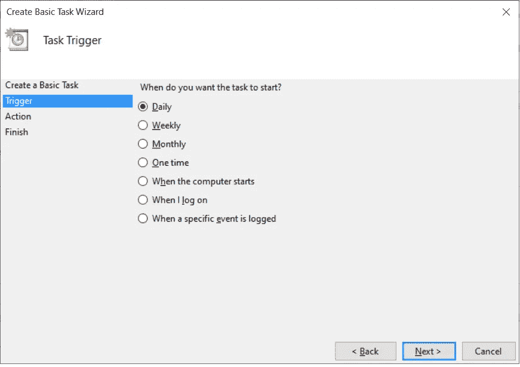
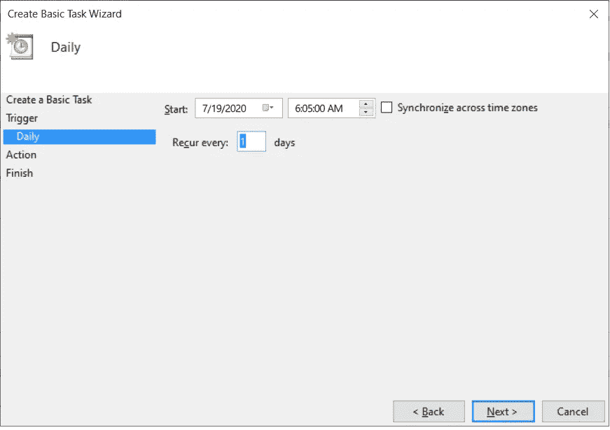
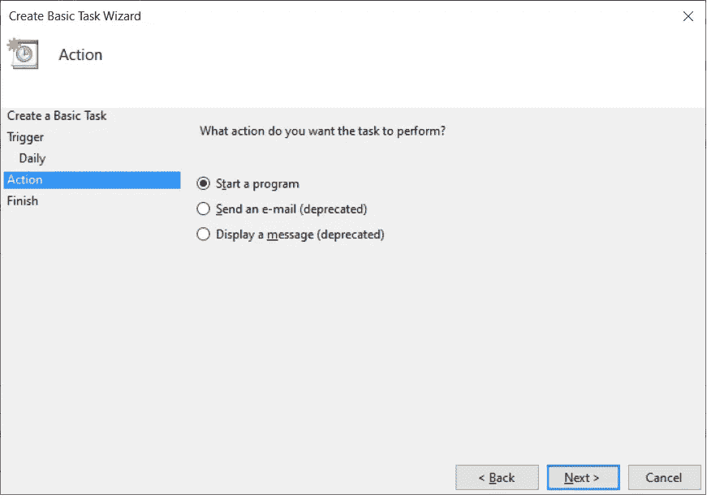
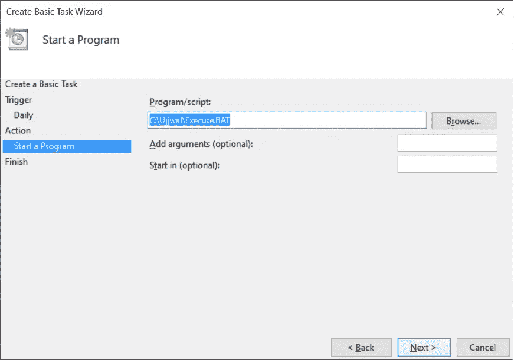

# 在 Windows 平台上调度 Python 脚本

> 原文：<https://towardsdatascience.com/schedule-your-python-scripts-on-windows-platform-4c0b756b81e9?source=collection_archive---------38----------------------->

## 触手可及的生产力


法比安·阿尔伯特在 [Unsplash](https://unsplash.com?utm_source=medium&utm_medium=referral) 上的照片

在开始本教程之前，让我们想一个场景:

您的经理给你打电话，告诉你，“*客户希望在 IST 时间每天早上 6 点之前刷新数据。请更改您的轮班时间，并确保客户端批处理完成后脚本执行”。*这是什么意思？这意味着，从今天开始，你将开始失去宝贵的睡眠、与家人和朋友在一起的时间，最重要的是，你将在一天中效率最低的时候执行一些随机脚本。

如果以上听起来很熟悉，你想把自己从这样的噩梦中拯救出来，请继续阅读。在本教程中，我们将学习在 Windows 平台上调度 Python 脚本。

# **首先要做的事情**

要实现我们的目标，我们需要三样东西:

*   **Python 脚本**—对于本教程，我已经编写了一个小的 Python 代码，让**从我的 Windows 文件夹位置读取一个“CSV”文件**。这个“CSV”文件**包含 2 列，每列都有随机数**。代码**添加两个列以创建一个新的列**并且**将 CSV 文件的这个新版本**保存在相同的文件夹位置。

```
**#### Importing the required library**
import pandas as pd**#### Reading csv file**
df = pd.read_csv("C:\\Ujjwal\\New_File_V1.csv")**#### Adding 2 columns**
df["Third_Column"] = df["Randome Numbers 1"] + df["Random Numbers 2"]**#### Exporting the data to same location**
df.to_csv("C:\\Ujjwal\\New_File_V2.csv",index = False)
```

*   **批处理文件** —批处理文件是一个带有“.”的**脚本文件。蝙蝠”扩展**。这些文件通常保存为简单的文本文件，包含可以在命令行界面(命令提示符)上执行的**命令。当命令提示符执行这些文件时，它通读文件中写入的命令，然后**逐行执行它们**。**
*   **调度器** —最后但同样重要的是，**我们需要一个调度器**，它能够**读取批处理文件**并且**在设定的时间执行其中写入的命令**。为此，我们将使用 **Windows 的任务调度器**会派上用场。

# 准备批处理文件

在上一节中，我们已经分享了我们计划安排的示例 Python 代码。所需的第二个组件是一个批处理文件。出于我们的目的，批处理文件将包含 2 个命令:

*   **Python 应用**的位置——这是 Python 应用(**)。exe”扩展名**，用于执行脚本。在我们的批处理文件中，我们将提供这个应用程序的位置作为第一个命令。在我的系统上，这个位置如下:

```
**#### Location of Python Executable**
C:\Users\Ujjwal\Anaconda3\python.exe
```

*   **Python 脚本**的位置——这是您想要调度的脚本。我们将提供这个脚本的**位置作为批处理文件的第二个命令。鉴于我们正在使用 Python 脚本，请确保文件夹位置中的反斜杠被正斜杠替换。我的脚本在 Windows 中的位置如下。**

```
**#### Windows Location**
C:\Ujjwal\Executable.py**#### Backslash replaced with forward slash**
C:/Ujjwal/Executable.py
```

*   **最终脚本** —最终的批处理脚本如下所示。在任何 Windows 位置，将该脚本保存在扩展名为. BAT 的文本文件中。

```
**#### Final Batch Script**
C:\Users\Ujjwal\Anaconda3\python.exe "C:/Ujjwal/Executable.py"
```

# 设置时间表

在这一步中，我们将设置计划来定期执行我们的任务。逐步过程如下:

*   **打开 Windows 任务计划程序** —进入 Windows 搜索，搜索任务计划程序，并将其打开。任务计划程序界面如下所示:



任务计划程序界面(图片由作者提供)

*   **创建新任务** —点击右窗格中的**创建基本任务**，创建新任务。将弹出一个新窗口，提示您填写任务名称和描述。界面将如下所示:



创建基本任务的新窗口(作者图片)

*   **选择周期** —填写任务名称和描述详细信息后，点击下一步。现在，系统会提示您选择**触发选项**，在这里我们可以**设置任务的周期**。出于我们的目的，我们选择每日执行。触发器选项的完整列表如下:



计划周期(图片由作者提供)

*   **选择计划时间** —选择任务频率后点击下一步。现在，系统将提示您选择希望触发计划的特定时间。界面屏幕如下所示:



选择计划时间(作者图片)

*   **创建动作** —选择执行时间后点击下一步。在这一步中，**调度器将提示您选择想要调度**的动作。选择**启动程序**。界面将如下所示:



选择动作(作者图片)

*   **选择批处理文件** —选择所需动作后点击下一步。现在，应用程序接口将询问您想要调度的节目的**位置。选择我们在上一节中创建的批处理文件。应用程序屏幕将如下所示:**



选择批处理文件位置(按作者排列的图像)

*   **最后** —就这样，点击下一步，完成。您的 Python 脚本将在每天的特定时间执行。

# 结束语

我相信有了上面的解决方案，你可以自动完成所有重复的任务。

我希望这篇教程是有启发性的，并且你学到了一些新的东西。请评论并分享您的反馈。

下次请继续关注更多有趣的话题。在此之前:

快乐学习！！！！