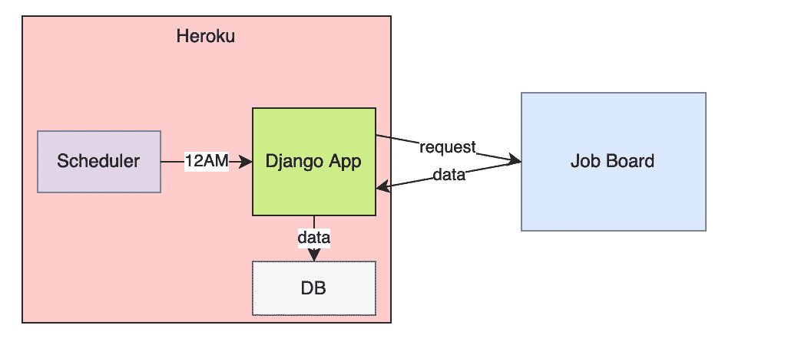
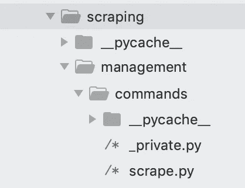
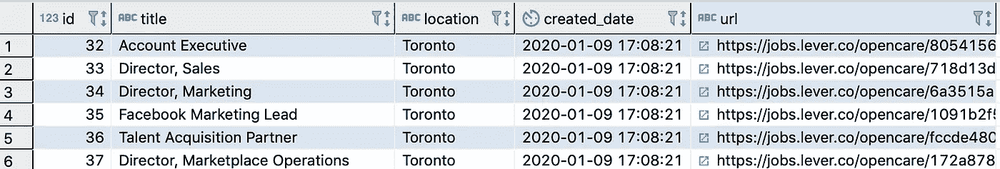
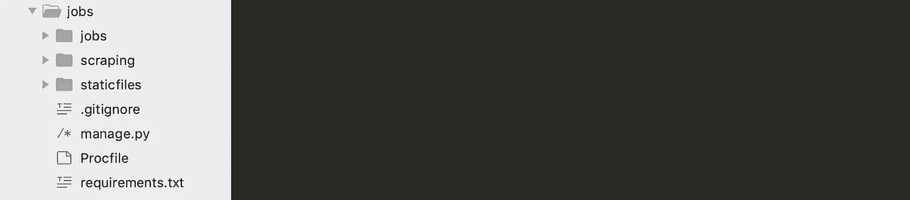
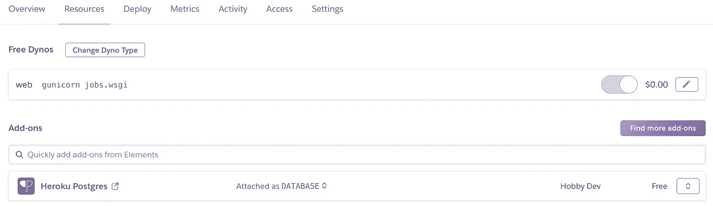
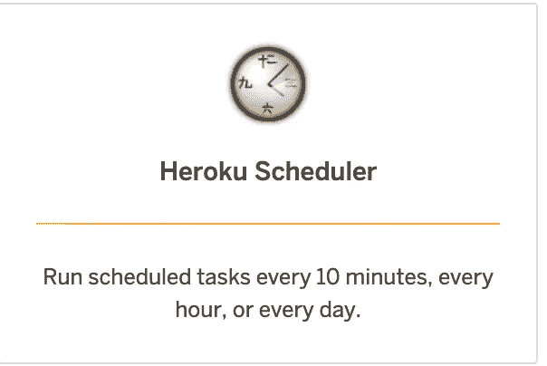
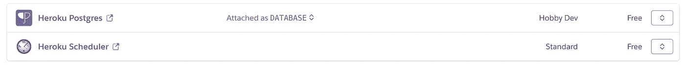
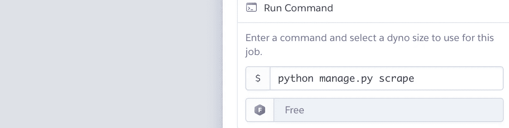

# Django 和 Heroku 安排的网页抓取

> 原文：<https://towardsdatascience.com/scheduled-web-scraping-with-django-and-heroku-e832e1363c7a?source=collection_archive---------3----------------------->

## 创建一个 django 应用程序，每天抓取求职公告板



我们经常需要大量的训练数据来进行机器学习，网页抓取可以是获取这些数据的一种方式。

但在过去，有一家公司是我非常想去工作的。他们目前没有数据科学的职位，但他们一有，我就想申请。

解决办法？每天查看他们的工作公告板，这样每当有新工作发布时，我都会得到通知。

让我们构建一个简单的 django 应用程序，部署到 Heroku，并每天创建一个工作公告板。

# 设置应用程序

为应用程序创建目录，并将`cd`放入其中。

```
mkdir jobs && cd jobs
```

在您喜欢的任何代码编辑器中打开它。我用的是 Sublime。

创建并启动我们的虚拟环境。然后安装我们需要的软件包。

```
python -m venv env
source env/bin/activate
pip3 install django psycopg2 django-heroku bs4 gunicorn
```

创建项目(django 版本的 web 应用程序)。

```
django-admin startproject jobs
```

`cd`进入项目，创建一个 app 进行抓取。

```
cd jobs
django-admin startapp scraping
```

# 创建工作模型

我们只需要在这个应用程序中定义一个模型，一个作业模型。这代表我们将收集的工作。

用以下内容覆盖`/scraping/models.py`。

```
from django.db import models
from django.utils import timezoneclass Job(models.Model):
    url = models.CharField(max_length=250, unique=True)
    title = models.CharField(max_length=250)
    location = models.CharField(max_length=250)
    created_date = models.DateTimeField(default=timezone.now) def __str__(self):
        return self.title class Meta:
        ordering = ['title'] class Admin:
        pass
```

在`/scraping/admin.py`中注册您的模型。这允许我们在 Django 的默认管理面板中查看记录(我们很快会谈到这一点)。

```
from scraping.models import Job
admin.site.register(Job)
```

将`scraping`添加到`/jobs/settings.py`中已安装的应用中。

```
INSTALLED_APPS = [
    'django.contrib.admin',
    'django.contrib.auth',
    'django.contrib.contenttypes',
    'django.contrib.sessions',
    'django.contrib.messages',
    'django.contrib.staticfiles',
    'scraping'
]
```

# 设置数据库

设置数据库。我喜欢 postgres，所以我们要用它。

此时，确保您之前已经在 mac 上用`brew`安装了 postgres 并启动了它(这超出了本文的范围)。

在命令行上为此项目创建一个数据库。您可以使用下面的命令打开 postgres 控制台。

```
psql -d template1
```

创建用户和数据库，然后退出。

```
create user django_user;
create database django_jobs owner django_user;
\q
```

在`/jobs/settings.py`中，更新`DATABASES`。在其他框架中，您可能希望专门针对开发环境来确定范围，但是在这里我们不会担心这个问题。不管怎样，它在 Heroku 上会起作用的(我们很快就会到达那里)。

注意，这些是我们在上面创建的用户名和数据库名。

```
DATABASES = {
    'default': {
        'ENGINE': 'django.db.backends.postgresql_psycopg2',
        'NAME': 'django_jobs',
        'USER': 'django_user',
        'HOST': '',
        'PORT': ''
    }
}
```

创建迁移，并从命令行迁移数据库。

```
python manage.py makemigrations
python manage.py migrate
```

这将创建一个名为`scraping_job`的表。这是一个 django 名称空间约定，因为它属于`scraping`应用程序。

现在创建一个超级用户，并在命令行中给它一个密码。

```
python manage.py createsuperuser --email admin@example.com --username admin
```

# **测试当前应用**

到目前为止，我们已经做了一些工作，但我们不知道是否有任何工作。我们先测试一下，然后再进一步。

在命令行上。

```
python manage.py runserver
```

然后在浏览器中导航至[http://127 . 0 . 0 . 1:8000/admin](http://127.0.0.1:8000/)。使用您刚刚创建的超级用户登录。

登录后，点击“抓取”下的“作业”，然后点击右上方的“添加作业”。现在填写一些编造的信息，然后点击“保存”。如果您可以看到您创建的作业，那么到目前为止一切都正常！

# 自定义 django-admin 命令

我们将设置一个定制的 django-admin 命令来抓取工作板。这是我们将在基础架构级别自动安排的内容，以便实现自动抓取。

在`/scraping`模块中，创建一个名为`/management`的目录，在`/management`中创建一个名为`/commands`的目录。然后在`/commands`中创建 2 个 python 文件，`_private.py`和`scrape.py`。



不在此处显示所有内容

将此代码放入`scrape.py`。

```
from django.core.management.base import BaseCommandfrom urllib.request import urlopen
from bs4 import BeautifulSoup
import jsonfrom scraping.models import Jobclass Command(BaseCommand):
    help = "collect jobs" # define logic of command
    def handle(self, *args, **options): # collect html
        html = urlopen('[https://jobs.lever.co/opencare'](https://jobs.lever.co/opencare')) # convert to soup
        soup = BeautifulSoup(html, 'html.parser') # grab all postings
        postings = soup.find_all("div", class_="posting") for p in postings:
            url = p.find('a', class_='posting-btn-submit')['href']
            title = p.find('h5').text
            location = p.find('span', class_='sort-by-location').text # check if url in db
            try:
                # save in db
                Job.objects.create(
                    url=url,
                    title=title,
                    location=location
                )
                print('%s added' % (title,))
            except:
                print('%s already exists' % (title,)) self.stdout.write( 'job complete' )
```

将代码放在这样的目录结构中，然后用一个`handle`函数定义一个`Command`类，告诉 django 这是一个定制的 django-admin 命令。

在这里，我们使用美丽的汤刮杠杆工作板，然后保存在我们的数据库中。我没有附属机构，但我选择的工作板是为一家名为 [Opencare](https://www.opencare.com/) 的出色公司设计的——如果他们发布了什么，你应该申请！

您现在可以从命令行运行它，如下所示。

```
python manage.py scrape
```

你会看到这个输出。


再运行一次，你会看到这个。


这是因为我们已经防止在上面的`scrape.py`代码中添加重复的作业记录。

如果您有一个数据库管理程序设置(如 [dbeaver](https://dbeaver.io/) ，您还可以检查数据库中的行。我们不会在这里深入讨论，但它应该看起来像下面这样。



# 部署到生产

现在让我们把这个放在 Heroku 上。

冻结您的需求，以便 Heroku 知道在部署时安装什么。

```
pip3 freeze > requirements.txt
```

在命令行上，运行`nano .gitignore`并添加如下。

```
.DS_Store
jobs/__pycache__
scraping/__pycache__
```

然后`ctrl+x`、`y`、`enter`保存并关闭(mac 上)。这可以防止部署不必要的文件。

在根目录下创建一个名为`Procfile`的文件，并将下面的内容粘贴到里面。这告诉 heroku 启动一个 web dyno，第二个命令迁移 db。

```
web: gunicorn jobs.wsgi
release: python manage.py migrate
```

文件树将看起来像这样。



确保你有一个 [Heroku](http://heroku create flask-ml-api-123) 账号，然后在命令行上用`heroku login`登录。

用你想要的任何名字创建一个应用程序。但它需要在 Heroku 上的所有应用程序中是唯一的。我跑了`heroku create django-scraper-879`，这里的 app 名字是`django-scraper-879`。但是你需要自己选择。

现在将这几行添加到 settings.py 的最底部。

```
import django_heroku
django_heroku.settings(locals())
```

在设置中更新`DEBUG`。不想在调试模式下部署到 prod。

```
DEBUG = False
```

用下面的添加文件到 git。

```
git init
git add . -A
git commit -m 'first commit'
```

现在用这个把我们的 app 推给 Heroku。

```
git push heroku master
```

# 计划作业

您可以使用`heroku run python manage.py scrape`从本地命令行手动运行该作业，但是每天都必须手动运行它会很烦人。

让我们自动化这一点。

登录你的 Heroku 控制台，点击“资源”，然后“查找更多附加组件”。



现在找到并点击这个附加组件。尝试用“ctrl+f”来输入“schedule ”,以帮助找到它。Heroku 有一大堆潜在的附件。看起来像下面。



现在将它添加到您的应用程序中，这样您就有了。



点击它，创建一个作业，`everyday at…`，`12am UTC`。不必要的 ping 网站是不好的！

输入您的命令并保存。



保存，我们就完成了！

现在只需等到 UTC 时间 12 点(或者你选择的任何时间),你的数据库就会被填充。

# 结论

我们在这里接触了很多东西。Django，Heroku，日程安排，网页抓取，Postgres。

虽然我用了想知道一家公司何时发布新工作的例子，但是有很多理由你可能想抓取一个网站。

*   电子商务公司希望监控竞争对手的价格。
*   高管招聘人员可能想知道公司何时发布职位空缺。
*   你或我可能想知道 Kaggle 上什么时候增加了一个新的比赛。

本教程只是为了说明什么是可能的。让我知道你是否已经用网络抓取在评论中建立了任何酷的东西。