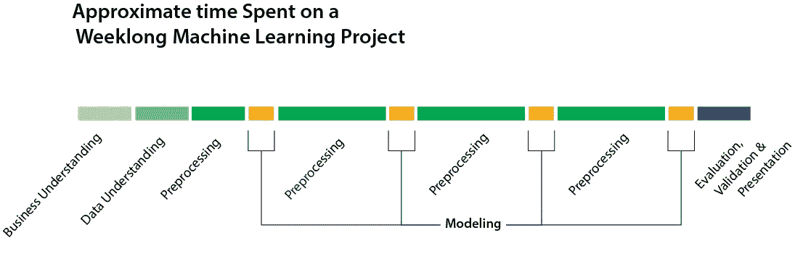
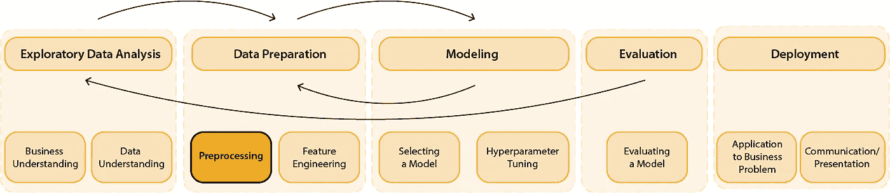
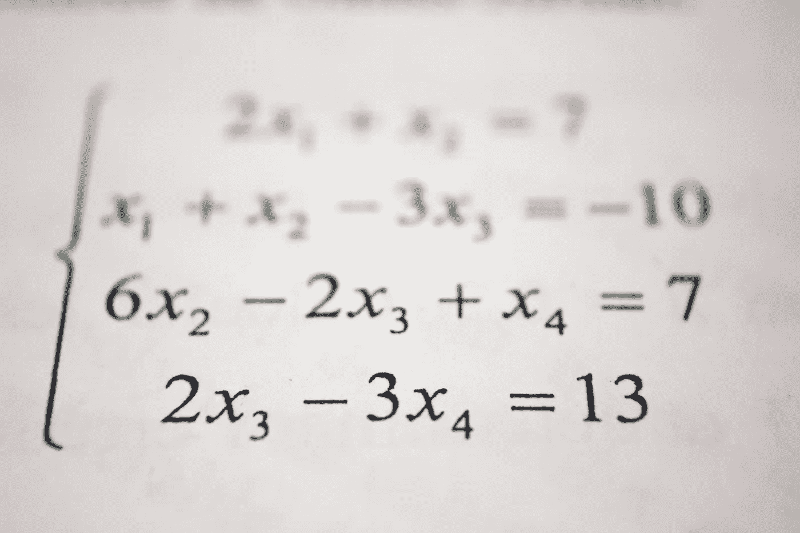
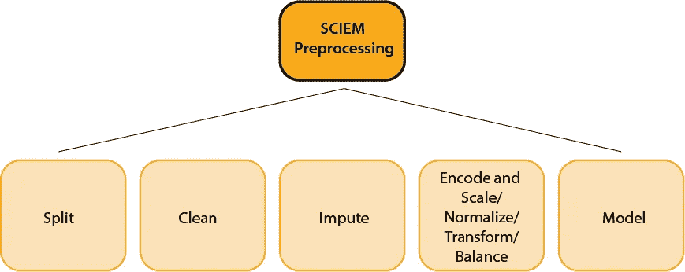

# SCIEM:数据预处理的操作顺序

> 原文：<https://towardsdatascience.com/sciem-an-order-of-operations-for-data-preprocessing-e3af0bf101b8?source=collection_archive---------39----------------------->

## 通过最小化调试时间来提高数据清理的效率。

CRISP-DM 流程的前 5 个步骤的循环最终看起来有点像上面的时间线。由于预处理可能会占用数据科学过程中的大部分时间，这可能会挤出用于业务理解、建模或评估结果的时间。建模只占项目时间的很小一部分，尽管它通常是人们想到数据科学时首先想到的事情。预处理会带来很大的时间负担，特别是对于大型数据集，或者从不同格式的许多来源编译的数据。

> 如何最大限度地减少预处理时间，使流程更加高效？

作者图片

在获取和导入数据之后，需要在建模之前进行预处理步骤，否则会导致错误。按照正确的顺序做这些事情可以通过减少错误来加速这个过程。就像数学中的 PEDMAS 一样，数据预处理的步骤有一个自然的顺序。下面是使用 Python 和 Pandas 预处理数据的操作顺序的新缩写。

> PEDMAS 之于数学，正如 SCIEM 之于数据科学。

安托万·道特里的照片

1.  **拆分**:列车试拆分
2.  **清洁**:杂清洁
3.  **输入**:输入缺失值
4.  **编码和缩放/标准化/规范化/转换/平衡:**对分类数据进行编码；根据需要缩放、标准化和转换数字数据。平衡是指纠正阶级不平衡。
5.  **模型:**训练机器学习算法

作者图片

为什么这些步骤会以这种顺序出现？

**训练-测试-分割** 在以任何方式操作数据之前，最好分割训练和测试数据。通常这是通过 [sklearn](https://scikit-learn.org/stable/modules/generated/sklearn.model_selection.train_test_split.html) 来完成的，对于大数据也可以用 [Spark](https://spark.apache.org/docs/latest/ml-tuning.html#train-validation-split) 来完成。如果可能的话，最好在查看数据之前就将其拆分。这防止了*数据泄露*，即来自测试数据的信息被用于训练模型。

**清洗** 这可能包括多种操作，例如:

*   删除不适用的列
*   删除重复项
*   基于筛选条件删除行
*   移除异常值
*   删除错误值
*   更改数据类型
*   拆分或组合字符串格式的数据
*   宁滨(将要素转换成组)
*   特征聚合
*   [离散化](/an-introduction-to-discretization-in-data-science-55ef8c9775a2)
*   重采样

如果在编码之前没有进行清理，调试过程将一次又一次地返回到这个步骤来解决错误，直到每个清理任务完成。

**输入缺失值** [输入缺失值](https://machinelearningmastery.com/handle-missing-data-python/)是指用选择的替代值如均值、中值或众数填充 NAN(非数字)值。输入必须在编码前完成，因为编码器不喜欢南的。

**One-Hot-Encoding**
这需要是最后一步，因为如果您试图对 NAN 值进行编码，或者如果列数据类型不一致，将会导致错误。这里有一个关于 [one-hot-encoding](https://machinelearningmastery.com/why-one-hot-encode-data-in-machine-learning/) 和[标签编码](https://pbpython.com/categorical-encoding.html)的资源。

作为数据理解的一部分，涉及基于领域知识手动缩小特征范围的特征选择应该在所有这些步骤之前进行。[使用算法](/the-5-feature-selection-algorithms-every-data-scientist-need-to-know-3a6b566efd2)的特征选择应在预处理后进行。

如果您对预处理的顺序或如何有一个更有效的预处理工作流有任何进一步的见解，请不要犹豫留下评论。还有其他可能影响订单的潜在步骤。SCIEM 是一个可以遵循的通用框架。

**参考文献:**

1.  Maksym Balatsko， [*关于预处理你想知道的一切:数据准备*](/all-you-want-to-know-about-preprocessing-data-preparation-b6c2866071d4) ，2019，走向数据科学。
2.  Jason Brownlee， [*如何用 Scikit 在 Python 中为机器学习准备你的数据——学习*](https://machinelearningmastery.com/prepare-data-machine-learning-python-scikit-learn/) ，2016，机器学习掌握。
3.  Syed Danish， [*使用 Scikit 学习 Python 中数据预处理实用指南*](https://www.analyticsvidhya.com/blog/2016/07/practical-guide-data-preprocessing-python-scikit-learn/) ，2016，Analytics Vidhya。
4.  Robert R.F. DeFilippi， [*用 Python 为数据科学清理和准备数据—最佳实践和有用的包*](https://medium.com/@rrfd/cleaning-and-prepping-data-with-python-for-data-science-best-practices-and-helpful-packages-af1edfbe2a3) ，2018，中。
5.  萨尔瓦多·加西亚，朱利安·卢恩戈和弗朗西斯科·埃雷拉，[《数据挖掘中的数据预处理](https://www.springer.com/gp/book/9783319102467) ，2015，施普林格。
6.  Tarun Gupta，[*Python 中的数据预处理*](/data-preprocessing-in-python-b52b652e37d5) *，* 2019，走向数据科学。
7.  Rohan Gupta，[面向数据科学的数据科学家离散化技术介绍](/an-introduction-to-discretization-in-data-science-55ef8c9775a2)，2019。
8.  [Ihab 易勒雅斯](https://www.cc.gatech.edu/~xchu33/)和[储旭](https://cs.uwaterloo.ca/~ilyas/)，[数据清理](https://amzn.to/2SARxFG)，2019，计算机械协会。
9.  问:伊森·麦卡勒姆(Ethan Mccallum)， [*《不良数据手册:清理数据，以便你可以重新开始工作》*](https://www.amazon.com/Bad-Data-Handbook-Cleaning-Back/dp/1449321887/ref=as_li_ss_tl?dchild=1&keywords=data+cleaning&qid=1588625525&s=books&sr=1-2&linkCode=sl1&tag=inspiredalgor-20&linkId=241d08898fc42f42ec67939296c96843&language=en_US) ，2012 年，奥赖利。
10.  Jason Osborne， [*数据清理最佳实践:收集数据前后需要做的所有事情的完整指南*](https://amzn.to/35wjsvx) ，2012 年，SAGE 出版社。
11.  Pranjal Pandey， [*数据预处理:概念*，2019](/data-preprocessing-concepts-fa946d11c825) ，走向数据科学