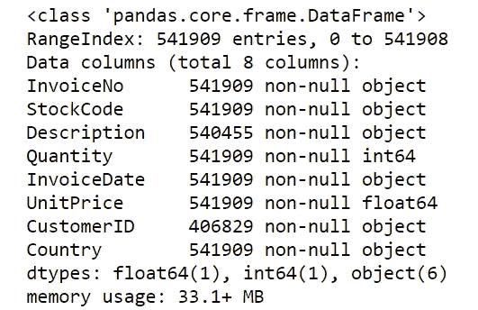
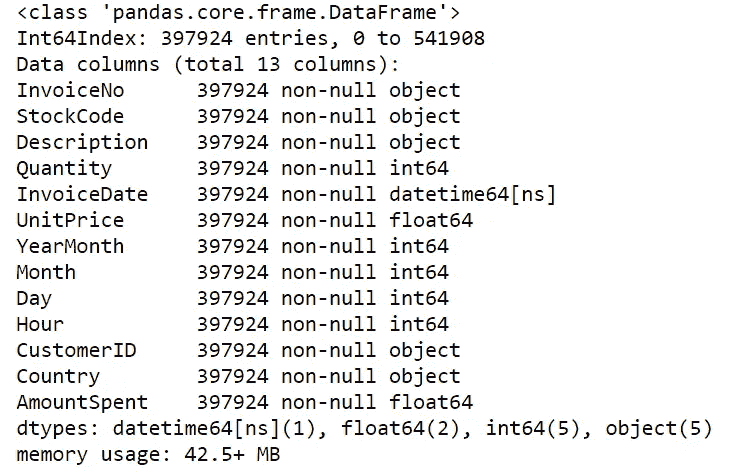
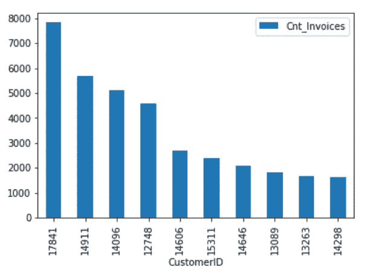
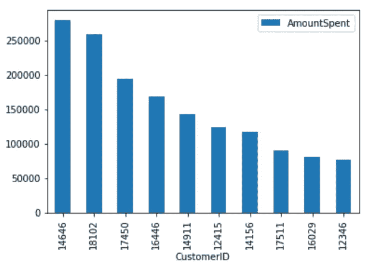
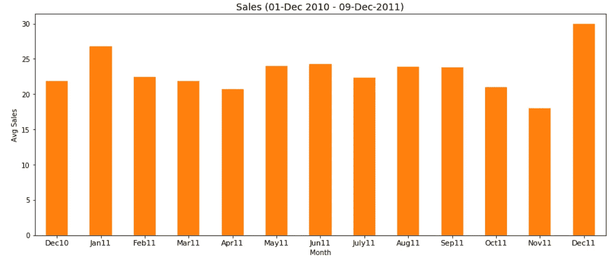
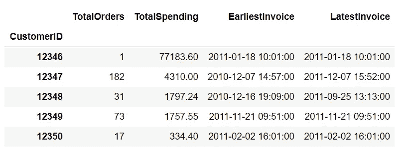

# 数据科学——一个“古老”的故事

> 原文：<https://towardsdatascience.com/science-of-data-an-old-story-d9db5e6cb00?source=collection_archive---------51----------------------->

## 为数据科学增添视角


Johannes Plenio 在 [Unsplash](https://unsplash.com?utm_source=medium&utm_medium=referral) 上拍摄的照片

我们(智人)与其他动物物种的主要区别之一是我们能够 ***想象******识别模式*** 并基于这种理解做出 ***可操作的决策*** 。这帮助我们度过了最艰难的环境，征服了这个星球。我们通过有效地“**处理**”我们可用的“**数据**来做到这一点。在早期，人类通过识别掠食者攻击他们的方式衍生出新的生存策略。我们的祖先以此为“**训练数据**”，发现了躲避捕食者攻击甚至反击的方法。同样，他们从自然过程中观察数据，如“天气变化”、“草药的药性”、“用火烹饪”等，并获得可操作的见解，以提升进化链。因此，数据总是以某种形式存在。人类一直在利用数据造福人类。“数据科学”可能是今天的流行语，但人类从史前时代就开始使用这种数据科学。事实上，数据科学让我们达到了今天的水平。用简单明了的英语来说，如果你需要定义*“数据科学”，它的意思无非是“**利用数据得出可操作的见解以使事情变得更好的科学**”。*

*在现代，“让事情变得更好”可能意味着“以更好的方式购物”、“更好地了解客户的行为”、“提出更好的建议”、“预测结果”等等。使用数据并在其上应用数据科学原理，有助于我们实现所有这一切，甚至更多。*

*为了对任何领域或概念建立牢固的理解，我们应该努力掌握该领域中使用的基本术语的含义。在数据科学领域，以下 3 个术语被过度使用:统计学、数据挖掘和机器学习。*

**

*[M. B. M.](https://unsplash.com/@m_b_m?utm_source=medium&utm_medium=referral) 在 [Unsplash](https://unsplash.com?utm_source=medium&utm_medium=referral) 上拍摄的照片*

# ***统计:***

*比方说，你经营一家杂货店，在那里销售一些产品。为了更好地了解你的企业是如何运作的，你记录下每天售出的产品数量。因为你有销售数据，你可以找出你每月的总销售额，比别人卖得多的前 10 个产品的列表，顶级客户的列表，一周的平均销售额或某一天的平均销售额等等。这些测量会让你知道你的生意做得怎么样。这就是简单统计学的意义。*

> *统计学就是收集、组织、总结、分析和解释数据的科学。*

*让我们用一个例子来理解它。 [UCI 机器学习库](http://archive.ics.uci.edu/ml/index.php)提供了一个数据集，其中包含一家总部位于英国的注册无店铺在线零售商在 2010 年 12 月 1 日至 2011 年 12 月 9 日之间发生的销售交易。(根据 UCI 机器学习知识库，这些数据是由公共分析小组主任陈大庆博士提供的。chend '@' lsbu.ac.uk，伦敦南岸大学工程学院，伦敦 SE1 0AA，英国。)*

*使用 ***统计*** 方法可以回答的一些有趣问题有:*

*   **完成交易的独立客户总数是多少？**
*   **订单数量最多的前 10 名客户是谁？**
*   **消费最高的前 10 名客户是谁？**
*   **每年每个月的平均销售额是多少？**

*这些问题的答案可能会让你对业务有所了解*

*Python 3/Jupyter Notebook 已经用于探索数据和回答上述问题。(最后已经提供了完整笔记本的 github 链接。然而，我们将在下面详细讨论代码的每一部分。)*

***让我们导入所需的 Python 库并将数据加载到 Pandas 数据框架中***

```
***#Import data
import pandas as pd
import matplotlib.pyplot as plt
%matplotlib inline
import seaborn as sns 
color = sns.color_palette()** **df_retail_sales = pd.read_csv(‘./input/data.csv’,encoding="ISO-8859–1")***
```

***检查关于该数据帧的信息***

```
***df_retail_sales.info()***
```

*输出是*

**

*数据由 8 个属性组成，定义如下:*

***InvoiceNo:** 代表唯一的订单号或交易号。
**库存代码:**代表已售出产品的唯一产品代码。
**描述:**描述已售出的产品
**数量:**其在交易中售出的产品数量
**发票日期:**交易日期
**单价:**其售出的 1 件产品的售价
**客户 ID:** 其代表进行交易的客户
**国家:**国家名称*

***让我们执行基本的数据清理任务**——删除属性为空值的行，删除数量列中为负值的行(负值对数量列没有任何意义)*

```
***df_retail_sales['InvoiceDate'] = pd.to_datetime(df.InvoiceDate, format='%m/%d/%Y %H:%M')****df_retail_sales = df_retail_sales[df_retail_sales.Quantity > 0]****retail_sales = df_retail_sales.dropna()***
```

*现在让我们做一些基本的 ***特征工程***——这是一种有趣的说法，即我们在数据中添加一个新列或修改一个现有列，这样会更有用。例如，在我们的例子中，我们可以添加一个新列**“amount spend”**，它将是**数量**和**单价**的乘积。我们还应该为**年**、**月**和**日**添加单独的列，这些列可以从 InvoiceDate 派生。这些将有助于我们计算年、月和日销售额的数据。(记住…..这就是基本统计学！)*

```
***retail_sales['AmountSpent'] = retail_sales['Quantity'] * retail_sales['UnitPrice']****retail_sales.insert(loc=6, column='YearMonth', value=retail_sales['InvoiceDate'].map(lambda x: 100*x.year + x.month))****retail_sales.insert(loc=7, column='Month', value=retail_sales.InvoiceDate.dt.month)****retail_sales.insert(loc=8, column='Day', value=(retail_sales.InvoiceDate.dt.dayofweek)+1)****retail_sales.insert(loc=9, column='Hour', value=retail_sales.InvoiceDate.dt.hour)***
```

*我们的新数据框架“retail_sales”如下所示:*

```
***retail_sales.info()***
```

**

*现在让我们试着回答我们的问题。*

# ****完成交易的唯一客户总数是多少？****

```
***retail_sales['CustomerID'].nunique()***
```

# ***4339***

# ***订单数量最多的前 10 名客户是谁？***

```
***orders = retail_sales.groupby(by=['CustomerID'], as_index=False)['InvoiceNo'].count()****orders.rename(columns={'InvoiceNo': 'Cnt_Invoices'}, inplace=True)****orders=orders.sort_values(by='Cnt_Invoices', ascending=False).head(10)****orders.plot(x="CustomerID", y=["Cnt_Invoices"], kind="bar")***
```

**

*按订单数量排名的前 10 名客户*

# **消费最高的前 10 名客户是谁？**

```
***spending = retail_sales.groupby(by=['CustomerID'], as_index=False)['AmountSpent'].sum()****spending.sort_values(by='AmountSpent', ascending=False).head(10)****spending.plot(x="CustomerID", y=["AmountSpent"], kind="bar")***
```

**

*按消费金额排名的前 10 名客户*

# *每个月的平均销售额是多少？*

```
***ax = retail_sales.groupby(‘YearMonth’)
[‘AmountSpent’].mean().sort_index().plot(‘bar’,color=color[1],figsize=(15,6))****ax.set_xlabel(‘Month’,fontsize=10)****ax.set_ylabel(‘Avg Sales’,fontsize=10)****ax.set_title(‘Sales (01-Dec 2010–09-Dec-2011)’,fontsize=14)****ax.set_xticklabels((‘Dec10’,’Jan11',’Feb11',’Mar11',’Apr11',’May11',’Jun11',’July11',’Aug11',’Sep11',’Oct11',’Nov11',’Dec11'), rotation=’horizontal’, fontsize=11)****plt.show()***
```

**

*每月平均销售额*

*以上是一些基本统计如何帮助理解和分析数据集的例子。更进一步，我们还可以通过研究各种属性的**分布**，找出它们之间的**关系**，从数据中发现有用的信息。*

**

*伊万·班杜拉在 [Unsplash](https://unsplash.com?utm_source=medium&utm_medium=referral) 上的照片*

***数据挖掘:***

*以零售销售数据为例，我们可以发现:*

1.  *忠诚的客户(经常购物)*
2.  *休眠客户(不经常购物)*
3.  *每个客户最早和最晚的订单日期。*
4.  *特定人群在一年中的特定日子购买的一组产品。*

> *数据挖掘是在大型数据仓库中自动发现有用信息的过程。*

*让我们为客户构建一个新的数据框架，并尝试找到一些此类信息*

```
*customer_data=retail_sales.groupby(‘CustomerID’).agg(
 # Get count of orders column for each customer
 TotalOrders=(‘InvoiceNo’, ‘count’),
 # Get total amount spent for each customer
 TotalSpending=(‘AmountSpent’, ‘sum’),
 # Get earliest order date for each customer
 EarliestInvoice=(‘InvoiceDate’, ‘min’),
 # Get latest order date for each customer 
 LatestInvoice=(‘InvoiceDate’, ‘max’)
)customer_data.head()*
```

**

*两个新属性:**最早发票**和**最新发票**可用于确定客户是忠诚的还是休眠的。如果这两个日期的差异很小，则顾客频繁购物，否则他处于休眠状态。*

*“总支出”列可用于挖掘大买家的信息。该信息可以与库存代码(产品)的计数相结合，以找出哪些产品销售更频繁。*

**

*由 [Clarisse Croset](https://unsplash.com/@herfrenchness?utm_source=medium&utm_medium=referral) 在 [Unsplash](https://unsplash.com?utm_source=medium&utm_medium=referral) 上拍摄的照片*

***机器学习:***

*比方说，您的客户向您提供他们购买的反馈。为了从这种反馈中获得可操作的见解，你编写一个计算机程序，将它作为输入，并给你一个客户对你的产品的感觉或看法的分数。这些观点可以帮助你了解客户的需求，你可以采取一些措施来满足客户。随着不同客户的购买倾向于增长，新的反馈不断出现，你的程序在感知客户情绪方面变得更好。这是机器学习。*

> *机器学习是计算机科学和人工智能的一个分支，旨在开发从数据中学习的系统，并在学习的基础上帮助做出决策和预测。*

## *简单明了地说， ***统计*** 技术被用来**训练**你的**机器**(或者你的电脑程序)去**学习**，从而帮助你**挖掘**你的数据，发现有用的**模式**和可操作的见解。*

*所讨论的示例代码可从 [Github](https://github.com/gauravkantgoel/Online-Retail-Sales) 获得*