# 从 A 到 Z 用 NumPy 进行科学计算

> 原文：<https://towardsdatascience.com/scientific-computing-with-python-daaaaddfa122?source=collection_archive---------47----------------------->

## 数据科学

## 关于 Numpy 你需要知道的


背景由[乔·塞拉斯](https://unsplash.com/@joaosilas?utm_source=medium&utm_medium=referral)于 [Unsplash](https://unsplash.com?utm_source=medium&utm_medium=referral)

[**Numpy**](https://numpy.org/)***数值 PYthon* 是 python 最强大的**数学库之一。它使我们能够高效和有效地进行计算。由于其惊人的能力，它比普通的 python 更好。****

*   **numpy 模块主要基于`ndarray`类，它允许**面向向量的编程**。**
*   **`ndarray`类允许实例化**多维向量**并用本地 python 指令处理它们，以简化科学计算。**
*   **该模块完全是用 C 语言编写的**调用函数的执行不通过虚拟机(就像 Python 的情况一样)，这允许我们**进行高性能的密集计算**。****
*   ****提供两种外观，一种是**过程外观**(函数和变量)，另一种是**面向对象外观**(类、属性、方法、特性……)。****

# ****认识“ndarray”:****

## ****实例化 ndarray:****

****可以调用类 a `ndarray`的构造函数来构造 n 维向量的实例。主要参数是:****

*   ******形状:**正整数元组，表示每个维度的元素数量**。******
*   ******dtype:** 表示数组元素的类型。因此，ndarray 是包含相同类型值的 n 维向量**。******

******重要提示:**你也可以使用`numpy.ndarray`创建一个数组，但这不是推荐的方式(数组的构造应该如下段所示)。****

```
****import numpy as np
np.ndarray((4,2), np.int)****
```

****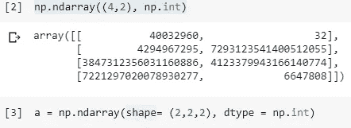****

****输出结果: [Google Colab](https://colab.research.google.com/drive/19XSdM6tVYrdgJJLXaCMuQ34OdZ2EvYRb#scrollTo=ZHDhekiURcl6&line=1&uniqifier=1)****

```
****a = np.ndarray(shape= (4,2), dtype = np.int)****
```

********

****输出结果: [Google Colab](https://colab.research.google.com/drive/19XSdM6tVYrdgJJLXaCMuQ34OdZ2EvYRb#scrollTo=jLKyXxvzRjBq&line=1&uniqifier=1)****

## ****ndarray 的功能:****

## ****生成 numpy 数组:****

****`np.array`:这个函数允许你**创建**并从 python iterable 初始化一个多维向量并返回`np.ndarray`。****

1.  ******一维** **向量**构造:****

```
****a = np.array([1,2,3, 3+3j])** 
*# L =[1,2,3, 3+3j]
# a = np.array(L)***
```

****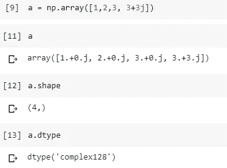****

****输出结果: [Google Colab](https://colab.research.google.com/drive/19XSdM6tVYrdgJJLXaCMuQ34OdZ2EvYRb#scrollTo=QkHN3jCqZyE9&line=1&uniqifier=1)****

****2.**矩阵**构造:****

****现在，参数是一个列表的**列表，其中**子列表**和**具有相同的大小**和**表示结果矩阵的行**。******

```
**m = np.array([[1,2,5], [3,2,5], [0, 3, 8]])**
*#L=[[1,2,5],
#  [3,2,5],
#  [0,3,8]]
#m = np.array(L)*
```

**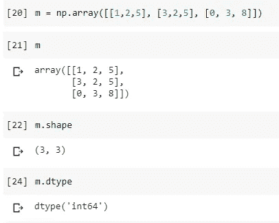**

**输出结果: [Google Colab](https://colab.research.google.com/drive/19XSdM6tVYrdgJJLXaCMuQ34OdZ2EvYRb#scrollTo=jk01uWz-oukk&line=1&uniqifier=1)**

**3.**三维矢量**构造:**

**列表的列表的列表…**

```
**a3 = np.array([[[1,2],[2,0]], [[0,1],[0,5]]])**
```

**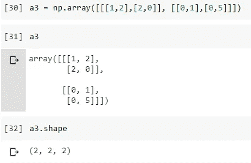**

**输出结果: [Google Colab](https://colab.research.google.com/drive/19XSdM6tVYrdgJJLXaCMuQ34OdZ2EvYRb#scrollTo=y_SokZYHo4mE&line=1&uniqifier=1)**

## **离散化函数:**

**离散化是我们将连续数据转换成离散形式的过程。这些函数返回一个一维向量，该向量是将一个区间(连续的)划分为一组有限的点而得到的。**

1.  ****功能:“arange”:****

**返回给定间隔内间隔均匀的值。**

```
**np.arange(5)**# *a vector of integers ranging from 0 to 4\. (the upper bound is excluded)***np.arange(0,1, 0.2)** *#division of the interval [0,1 [according to step 0.2*
**np.arange(1, 0, -0.1)** *#Negative step*
```

**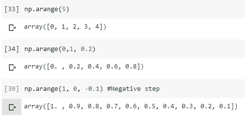**

**输出结果: [Google Colab](https://colab.research.google.com/drive/19XSdM6tVYrdgJJLXaCMuQ34OdZ2EvYRb#scrollTo=RU6SFKDPo_ED&line=2&uniqifier=1)**

> **`numpy.arange` 和`range python` 内置功能有什么区别？**

**Python 内置函数“range”只接受整数作为参数。**

```
**range(0, 1, 0.2)** *#Error*
```

**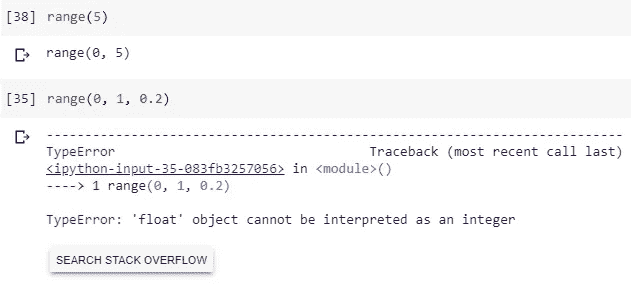**

**输出结果: [Google Colab](https://colab.research.google.com/drive/19XSdM6tVYrdgJJLXaCMuQ34OdZ2EvYRb#scrollTo=szziKNE_pSVk&line=1&uniqifier=1)**

**2.**功能:“linspace”:****

**返回指定间隔内等间距的数字。**

```
**a = np.linspace(0,1)** *#by default divides the interval into 50 equidistant points*
**b = np.linspace(0, 1, num = 10)**
```

**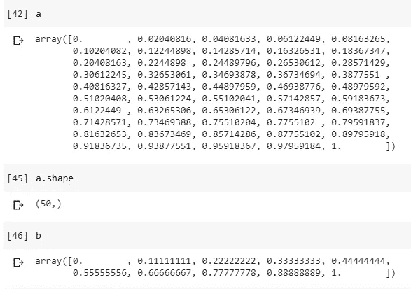**

**输出结果: [Google Colab](https://colab.research.google.com/drive/19XSdM6tVYrdgJJLXaCMuQ34OdZ2EvYRb#scrollTo=M0nI5Q2Wphmm&line=1&uniqifier=1)**

**3.**功能:“日志空间”:****

**返回在对数刻度上均匀分布的数字(默认情况下以 10 为基数)。**

```
**np.logspace(0,1)**
```

**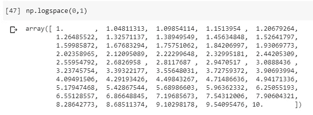**

**输出结果: [Google Colab](https://colab.research.google.com/drive/19XSdM6tVYrdgJJLXaCMuQ34OdZ2EvYRb#scrollTo=ymw4oPShpnyp&line=1&uniqifier=1)**

## **齐次 n 维向量:**

1.  ****功能‘0&1】:****

**返回给定形状和类型的新数组，用零填充。**

```
**np.zeros((2,3), dtype = np.bool)
np.zeros(shape = (10,))**
**np.ones((2,5,2))** *#3D*
**np.ones((3,3), dtype = np.complex)**
```

**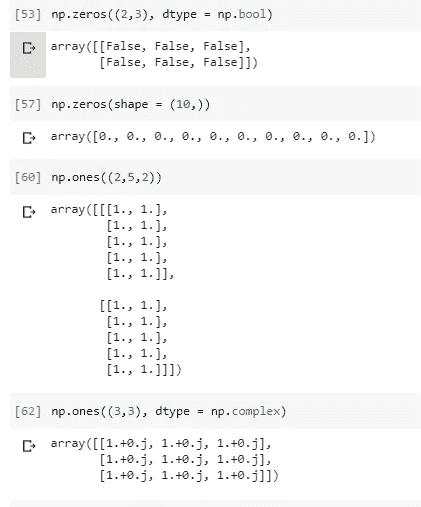**

**输出结果: [Google Colab](https://colab.research.google.com/drive/19XSdM6tVYrdgJJLXaCMuQ34OdZ2EvYRb#scrollTo=ZC_7ZhpOps2l&line=3&uniqifier=1)**

**2.**功能:“满”:****

**返回给定形状和类型的新数组，用相同的值填充。**

```
*#np.full(shape****,*** *fill_value****,*** *dtype=None****)* np.full((5,5), 3, np.int)
np.full((2,4), fill_value=3+2j, dtype=np.complex)**
```

**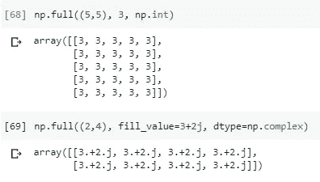**

**输出结果: [Google Colab](https://colab.research.google.com/drive/19XSdM6tVYrdgJJLXaCMuQ34OdZ2EvYRb#scrollTo=yp5qSHMDp2UV&line=1&uniqifier=1)**

**我们可以用`np.ones`作为`np.full`的等价物。**

```
**np.ones((2,4)) * (3+2j)
np.full((2,4),(3+2j))**
```

**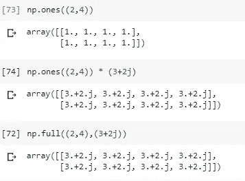**

**输出结果: [Google Colab](https://colab.research.google.com/drive/19XSdM6tVYrdgJJLXaCMuQ34OdZ2EvYRb#scrollTo=FYi_C7ecp9nC&line=1&uniqifier=1)**

## **矩阵函数:**

1.  ****单位矩阵:****

**线性代数中，**大小为 n 的单位矩阵**就是主对角线上有 1，其他地方有 0 的 n × n 方阵**矩阵**。**

```
**np.identity(5)** #I5
**np.identity(5, dtype = np.int)**
**np.identity(4, dtype = np.bool)**
```

**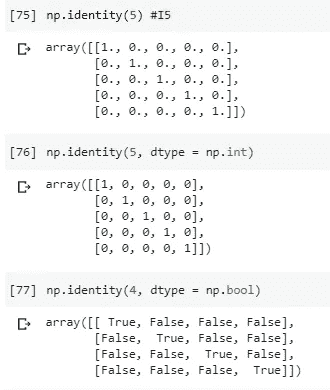**

**输出结果: [Google Colab](https://colab.research.google.com/drive/19XSdM6tVYrdgJJLXaCMuQ34OdZ2EvYRb#scrollTo=sxhoN4KNqD9r&line=3&uniqifier=1)**

**2.**功能‘眼’:****

**返回一个对角线上为 1，其他地方为 0 的二维数组。**

```
*#**np.eye****(****N****,*** *M=None****,*** *k=0****,*** *dtype=<class 'float'>)* #**N** : *int :*Number of rows in the output.
#**M** : *int, optional :*Number of columns in the output. If None, #defaults to *N*.
#**k** : *int, optional :*Index of the diagonal**np.eye(3)** *#np.identity(3)*
**np.eye(3,3,-1)** *#fill the first diagonal below the main diagonal with ones.*
**np.eye(3,3,1)** *#fill the first diagonal above the main diagonal with ones.*
**np.eye(5,10, 3, dtype = np.int)**
```

**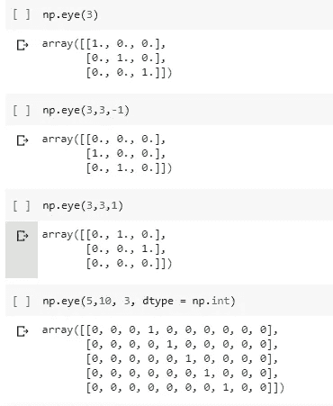**

**输出结果: [Google Colab](https://colab.research.google.com/drive/19XSdM6tVYrdgJJLXaCMuQ34OdZ2EvYRb#scrollTo=hSo4l5DlqMZt&line=1&uniqifier=1)**

**3.**功能‘诊断’:****

**diag 函数有两个参数:**

*   **安`ndarray`诉**
*   **整数 k(默认值= 0)。如果‘v’的维数是 1，则该函数构造一个矩阵，其中它的对角线数 k 由向量‘v’的元素构成。如果 a 是一个矩阵(维数为 2 ),那么该函数提取一维向量中第 k 条对角线的元素。**

**提取一条对角线或构造一个对角线数组。**

```
**np.diag([1,5,7])
a = np.ones((3,3)) * 5
np.diag(a)**
```

**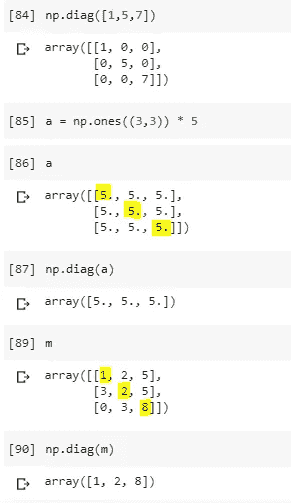**

**输出结果: [Google Colab](https://colab.research.google.com/drive/19XSdM6tVYrdgJJLXaCMuQ34OdZ2EvYRb#scrollTo=QvdqT-jNqTw1&line=1&uniqifier=1)**

**3.**函数‘from Function’:****

**通过对每个坐标执行一个函数来构造一个数组。
让我们创建一个基于其索引的向量。**

```
#*numpy.fromfunction****(****function****,*** *shape)*
**np.fromfunction(lambda i,j : i-j, (3,3))
np.fromfunction(lambda i, j : i == j, (5,5))**
```

**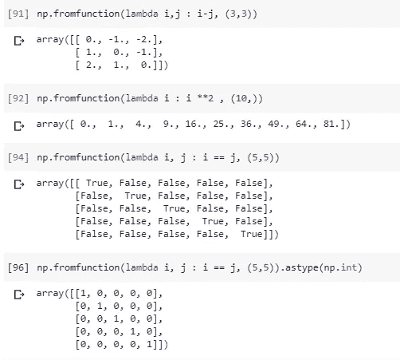**

**输出结果: [Google Colab](https://colab.research.google.com/drive/19XSdM6tVYrdgJJLXaCMuQ34OdZ2EvYRb#scrollTo=7sv7lDZCqgw0&line=1&uniqifier=1)**

> **`ndarray`和原生 python 迭代器有什么区别(和优势)？**

**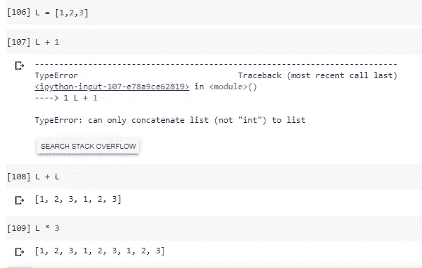****

输出结果: [Google Colab](https://colab.research.google.com/drive/19XSdM6tVYrdgJJLXaCMuQ34OdZ2EvYRb#scrollTo=YUdleuutqq3D&line=1&uniqifier=1)** **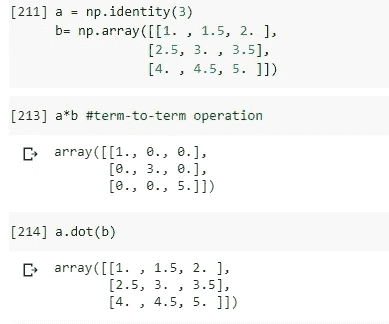****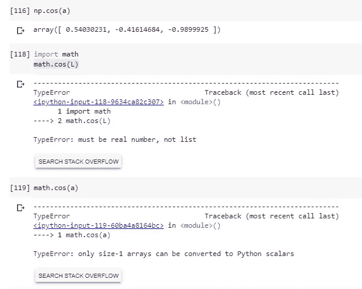**

**输出结果: [Google Colab](https://colab.research.google.com/drive/19XSdM6tVYrdgJJLXaCMuQ34OdZ2EvYRb#scrollTo=YUdleuutqq3D&line=1&uniqifier=1)**

**`ndarray`支持本地 Python 操作符(+、-、* …)，以及 numpy 模块中可用的一组“矢量化”数学函数(`numpy.cose`、`numpy.sin`、`anumpy.exp` …)。**

**4.**功能“矢量化”。****

**`numpy.vectorize`的目的是将不支持 numpy 的函数转换成可以操作(并返回)numpy 数组的函数**

**让我们构建一个函数`sign`，允许我们计算一个值的符号。**

**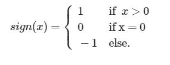**

**如果你对在 Jupyter 笔记本、Google Colab 或任何其他支持 LaTeX 数学写作的交互式笔记本中用 LaTex 写数学感兴趣，请查看这篇文章。**

```
def sign(x):
   if x == 0:
      return 0
   elif x > 0:
      return 1
   else:
      return -1
```

**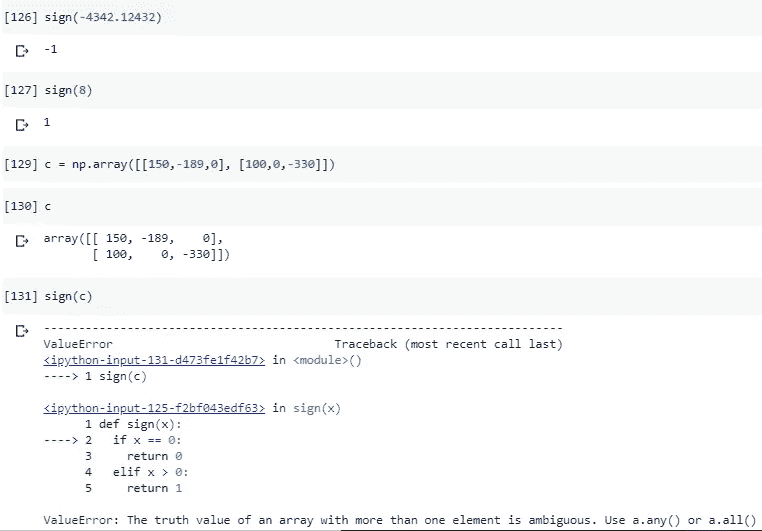**

**输出结果: [Google Colab](https://colab.research.google.com/drive/19XSdM6tVYrdgJJLXaCMuQ34OdZ2EvYRb#scrollTo=GOdwqPRmrDXE&line=1&uniqifier=1)**

```
vectorized_sign = np.vectorize(sign)
```

**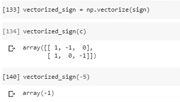**

**输出结果: [Google Colab](https://colab.research.google.com/drive/19XSdM6tVYrdgJJLXaCMuQ34OdZ2EvYRb#scrollTo=GOdwqPRmrDXE&line=1&uniqifier=1)**

****再比如:****

**我们来构建一个函数`xlogx`。**

**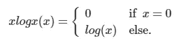**

**如果你对在 Jupyter 笔记本、Google Colab 或任何其他支持 LaTeX 数学写作的交互式笔记本中用 LaTex 写数学感兴趣，请查看这篇文章。**

```
import math
def xlogx(x):
   if x==0:
      return x
   else:
      return x * math.log(x)
```

**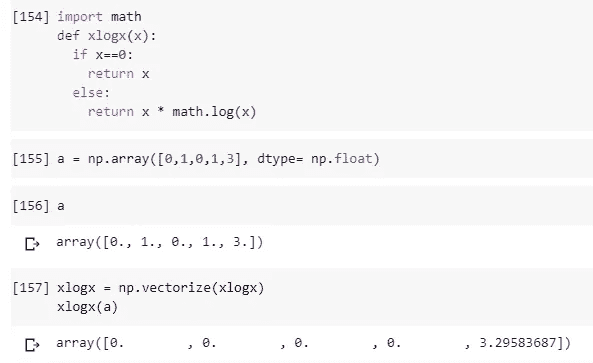**

**输出结果: [Google Colab](https://colab.research.google.com/drive/19XSdM6tVYrdgJJLXaCMuQ34OdZ2EvYRb#scrollTo=w41532fysAhN&line=1&uniqifier=1)**

# **ndarrays 的“有趣”特性:**

*   **属性(只读)，告诉我们向量元素的类型。**

**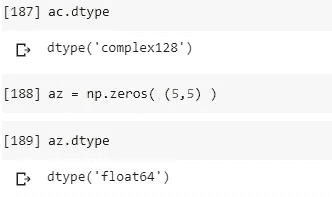**

**输出结果: [Google Colab](https://colab.research.google.com/drive/19XSdM6tVYrdgJJLXaCMuQ34OdZ2EvYRb#scrollTo=8Rpdo2IBsORH&line=3&uniqifier=1)**

*   **`numpy.size`返回数组中元素的个数。**

**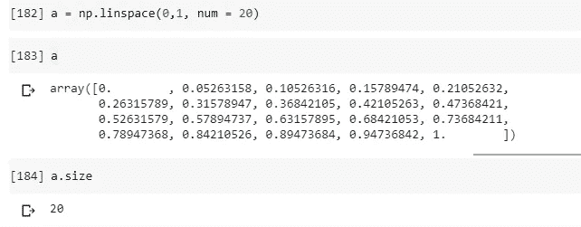**

**输出结果: [Google Colab](https://colab.research.google.com/drive/19XSdM6tVYrdgJJLXaCMuQ34OdZ2EvYRb#scrollTo=8Rpdo2IBsORH&line=3&uniqifier=1)**

*   **`numpy.ndim`返回数组维数。**

**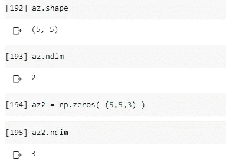**

**输出结果: [Google Colab](https://colab.research.google.com/drive/19XSdM6tVYrdgJJLXaCMuQ34OdZ2EvYRb#scrollTo=8Rpdo2IBsORH&line=3&uniqifier=1)**

*   **`numpy.shape`包含每个维度的元素数量的元组。该属性是可读/写的。**

****提醒:** *元组元素的乘积应该等于数组的大小。***

> **⟹形状属性允许你改变向量的形状，但不能改变它的总大小！！！**

```
a.shape = (5,4)
a.shape = (10,2)
```

**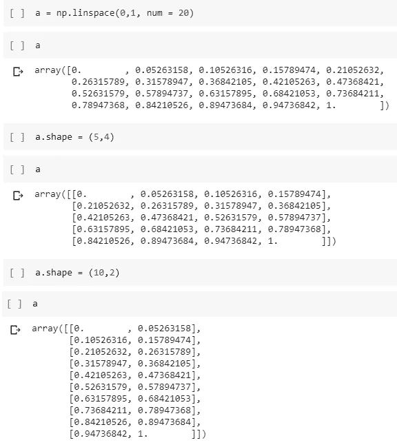**

**输出结果: [Google Colab](https://colab.research.google.com/drive/19XSdM6tVYrdgJJLXaCMuQ34OdZ2EvYRb#scrollTo=8Rpdo2IBsORH&line=3&uniqifier=1)**

****两个不变关系:****

**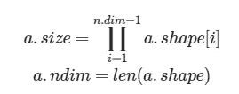**

**如果你对在 Jupyter 笔记本、Google Colab 或任何其他支持 LaTeX 数学写作的交互式笔记本中用 LaTex 写数学感兴趣，请查看[这篇文章](/write-markdown-latex-in-the-jupyter-notebook-10985edb91fd)。**

## **使用复杂系统:**

```
**z = np.array([[1, 3+3j],[2+1j,3+5j],[5j,5]])**
**z.real** *#Return the real part of the complex argument.*
**z.imag** *#Return the imaginary part of the complex argument.* **np.conj(z)** *#Return the complex conjugate.*
```

**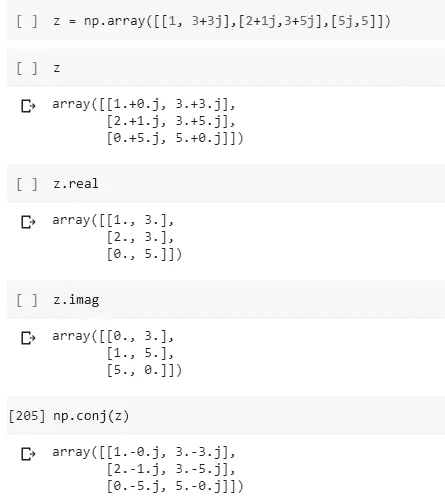**

**输出结果: [Google Colab](https://colab.research.google.com/drive/19XSdM6tVYrdgJJLXaCMuQ34OdZ2EvYRb#scrollTo=9__PgEHgta6z&line=1&uniqifier=1)**

# **ndarray 的一些预定义方法:**

## **ndarray.trace:**

**`trace`方法:允许计算尺寸为> 1 的`ndarray`的轨迹。
**提醒:**线性代数中，方阵 A 的迹(常缩写为 tr)定义为主对角线上元素的和。**

****

**数组维数应大于 1。**

**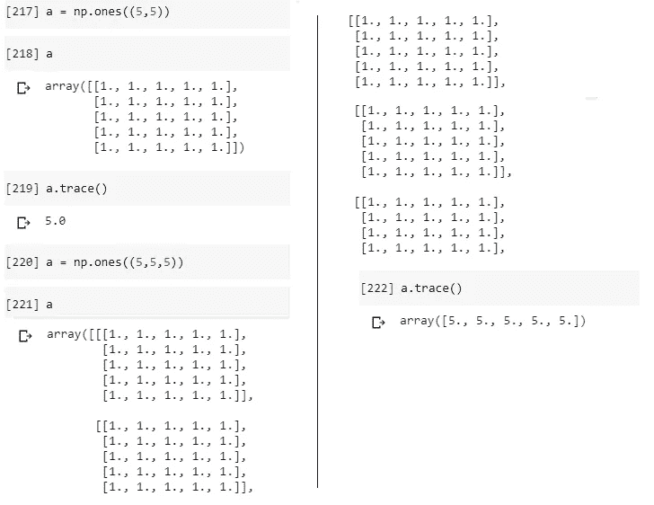**

**输出结果: [Google Colab](https://colab.research.google.com/drive/19XSdM6tVYrdgJJLXaCMuQ34OdZ2EvYRb#scrollTo=NFlpuinTt-bU&line=3&uniqifier=1)**

## **ndarray.reshape:**

**它返回包含新形式的源数组的`ndarray`类的新实例。**

```
a = np.arange(10)
b = a.reshape((2,5))
```

****

**输出结果: [Google Colab](https://colab.research.google.com/drive/19XSdM6tVYrdgJJLXaCMuQ34OdZ2EvYRb#scrollTo=NFlpuinTt-bU&line=3&uniqifier=1)**

**由`reshape`返回的向量不是初始向量的独立副本，而是与源共享相同的内存大小写。**

**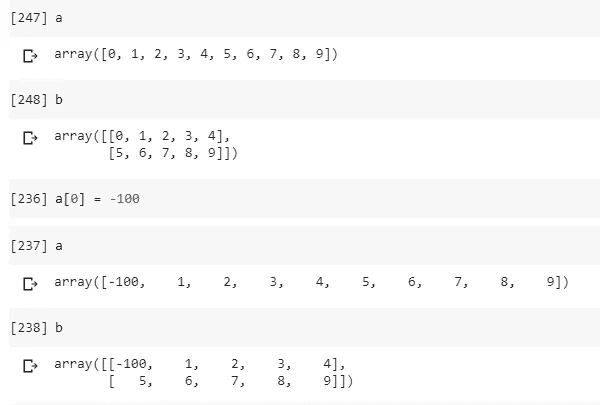**

**输出结果: [Google Colab](https://colab.research.google.com/drive/19XSdM6tVYrdgJJLXaCMuQ34OdZ2EvYRb#scrollTo=NFlpuinTt-bU&line=3&uniqifier=1)**

> **如何创建的独立副本？**

**我们使用`.copy()`方法。**

```
**c = a.reshape((2,5)).copy()***#create an independent copy of a*
```

## **ndarray.dot**

**点积的计算(对于一维向量)。维数≥ 2 的向量的矩阵乘法。**

```
v1 = np.array([1,2,3,4])
v2 = np.array([1,0,1,0])
v1.dot(v2) #dot productm = np.diag([1,2,3,4])
n = np.ones((4,4))
m.dot(n) #Matrix multiplication
```

**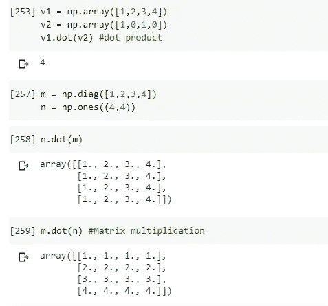**

**输出结果: [Google Colab](https://colab.research.google.com/drive/19XSdM6tVYrdgJJLXaCMuQ34OdZ2EvYRb#scrollTo=NFlpuinTt-bU&line=3&uniqifier=1)**

## **np.cross**

**返回两个向量(数组)的叉积。**

```
v1 = np.array([1,2,3])
v2 = np.array([1,0,1])v3 = np.cross(v1,v2)
v3.dot(v1)
```

**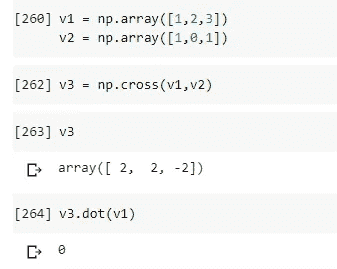**

**输出结果: [Google Colab](https://colab.research.google.com/drive/19XSdM6tVYrdgJJLXaCMuQ34OdZ2EvYRb#scrollTo=NFlpuinTt-bU&line=3&uniqifier=1)**

## **ndarray.astype**

**允许创建一个新实例，该实例包含与源 vector 相同的值，但被转换为参数指示的类型。**

**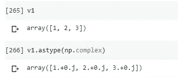**

**输出结果: [Google Colab](https://colab.research.google.com/drive/19XSdM6tVYrdgJJLXaCMuQ34OdZ2EvYRb#scrollTo=NFlpuinTt-bU&line=3&uniqifier=1)**

## **聚合方法:**

*   **`ndarray.sum`:返回给定轴上数组元素的和。**
*   **`ndarray.sum`:返回给定轴上数组元素的乘积。**
*   **`ndarray.max`:返回给定轴的最大值。**
*   **`ndarray.min`:返回给定轴的最小值。**
*   **`ndarray.mean`:返回给定轴上数组元素的平均值。**
*   **`ndarray.cumsum`:返回给定轴上元素的累积和。**
*   **`ndarray.cumprod`:返回给定轴上元素的累积积。**
*   **`ndarray.var`:返回数组元素沿给定轴的方差。**
*   **`ndarray.std`:返回数组元素沿给定轴的标准偏差。**
*   **`ndarray.argmin`:返回给定轴上最小值的索引。**
*   **`ndarray.argmax`:返回给定轴上最大值的索引。**

****重要提示:**列→轴=0。行→轴=1**

**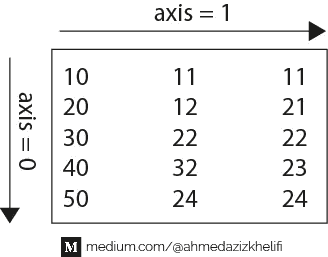**

```
a = np.array([[10, 11, 11], [20, 12, 21], [30, 22, 22], [40, 32, 23] , [50, 24, 24]])
```

**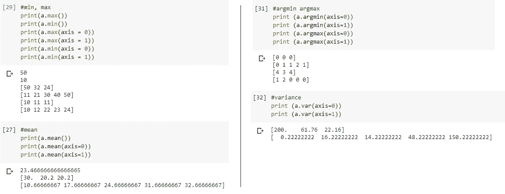**

**输出结果: [Google Colab](https://colab.research.google.com/drive/19XSdM6tVYrdgJJLXaCMuQ34OdZ2EvYRb#scrollTo=WfI0e-flF_jh&line=1&uniqifier=1)**

## **ndarrays 上的操作:广播**

**Numpy 解释形式为`a` *操作符* `b`的操作，其中`a`和/或`b`是类`darray`的实例，如下所示:具有最小尺寸的向量在最大向量中广播。让我们从例子开始:**

```
B = np.arange(1,4)
A = np.array([Agenerator + i for i in range(10,31,10)])#or we can simply create them with np.array
#A = np.array([ [11, 12, 13], [21, 22, 23], [31, 32, 33] ])
# B = np.array([1, 2, 3])
```

**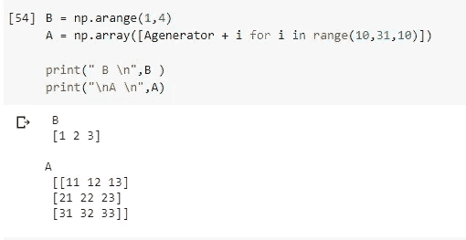**

**输出结果: [Google Colab](https://colab.research.google.com/drive/19XSdM6tVYrdgJJLXaCMuQ34OdZ2EvYRb#scrollTo=MX_7nQfO4__U&line=1&uniqifier=1)**

**与广播相乘:**

**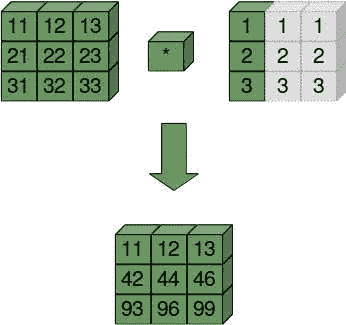**

**这张图说明了广播的工作方式:[来源](https://www.python-course.eu/numpy_numerical_operations_on_numpy_arrays.php#Broadcasting)**

**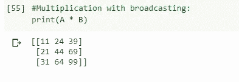**

**输出结果: [Google Colab](https://colab.research.google.com/drive/19XSdM6tVYrdgJJLXaCMuQ34OdZ2EvYRb#scrollTo=WPnAJ7rd5FR_&line=1&uniqifier=1)**

**另一个例子:**

**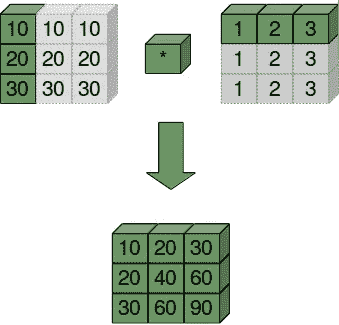**

**[来源](https://www.python-course.eu/numpy_numerical_operations_on_numpy_arrays.php#Broadcasting)**

```
b = np.arange(1,4)
a = (b * 10).reshape((3,1))
```

**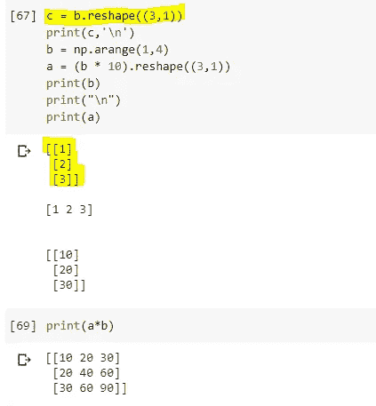**

**输出结果: [Google Colab](https://colab.research.google.com/drive/19XSdM6tVYrdgJJLXaCMuQ34OdZ2EvYRb#scrollTo=WPnAJ7rd5FR_&line=1&uniqifier=1)**

****广播规则:****

*   **Numpy 用左边的 1 填充较小维度的向量的形状，以便有两个相同维度的向量。**
*   **Numpy 从右边开始比较 a.shape 和 b.shape 中的整数对(index -1) →较小的公维。**
*   **二维 a.shape [i]和 b.shape [i]是相容的，如果:**

**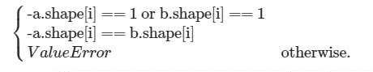**

**如果你对在 Jupyter 笔记本、Google Colab 或任何其他支持 LaTeX 数学写作的交互式笔记本中用 LaTex 写数学感兴趣，请查看这篇文章。**

# **索引数组:**

## **简单索引:**

> **索引数≤维度数。**

*   **1D :**

```
a = np.arange(5)
print("a[0]= ", a[0]) #first element
print("a[-1]= ", a[-1]) #last element
print("a[a.size]= ", a[a.size]) #error
```

**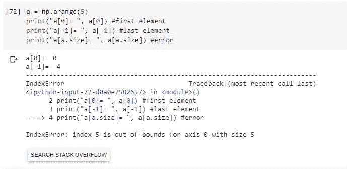**

**输出结果: [Google Colab](https://colab.research.google.com/drive/19XSdM6tVYrdgJJLXaCMuQ34OdZ2EvYRb#scrollTo=3xv-QsEuD-kv&line=2&uniqifier=1)**

*   ****2D** :**

**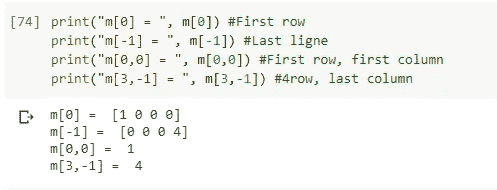**

**输出结果: [Google Colab](https://colab.research.google.com/drive/19XSdM6tVYrdgJJLXaCMuQ34OdZ2EvYRb#scrollTo=3xv-QsEuD-kv&line=2&uniqifier=1)**

## **切片:**

```
**#A[start:stop-1:step]**a = np.arange(5)
print(a[0:3])
print(a[::-1]) #reverse the order of the elements of a.
```

**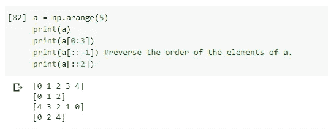**

**1D 切片。输出结果: [Google Colab](https://colab.research.google.com/drive/19XSdM6tVYrdgJJLXaCMuQ34OdZ2EvYRb#scrollTo=AHPsCxNbE5Qv&line=5&uniqifier=1)**

**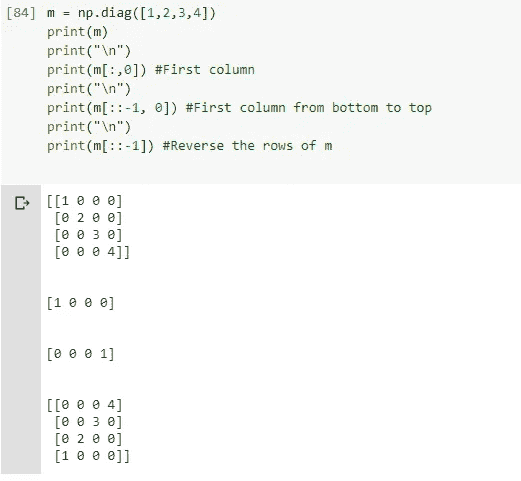**

**多维切片。输出结果: [Google Colab](https://colab.research.google.com/drive/19XSdM6tVYrdgJJLXaCMuQ34OdZ2EvYRb#scrollTo=AHPsCxNbE5Qv&line=5&uniqifier=1)**

****示例**:**

**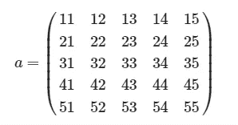**

**如果你对在 Jupyter 笔记本、Google Colab 或任何其他支持 LaTeX 数学写作的交互式笔记本中用 LaTex 写数学感兴趣，请查看这篇文章。**

1.  **创建`a`。**
2.  **应用切片从`a`中提取深绿色标记的部分。**

**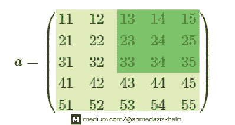**

```
a = np.fromfunction(lambda i, j : (i+1)*10 + (j+1), (5,5))
a[:3, 2:]
```

**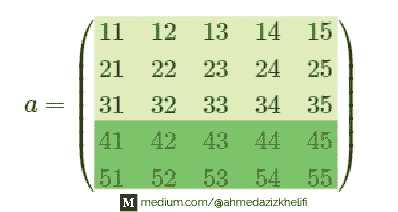**

```
a[3:]
```

****注**:更多例子请看 [Google Colab 笔记本](https://colab.research.google.com/drive/19XSdM6tVYrdgJJLXaCMuQ34OdZ2EvYRb#scrollTo=x70dv3uZIWww&line=3&uniqifier=1)。**

## **屏蔽:**

**当您希望根据某种标准提取、修改、计算或操作数组中的值时，就会出现屏蔽。让我们生成两个数组并使用布尔掩码。**

```
a = np.arange(25).reshape((5,-1)) # -1 >> python will automatically calculate ( or simply type .reshape((5,5))
c = a%2b = c == 0 #b is a boolean vector it can be used as a mask for the vector a
a[b] #gives the values which are overlayed with the elements which are True in b
```

****

**输出结果: [Google Colab](https://colab.research.google.com/drive/19XSdM6tVYrdgJJLXaCMuQ34OdZ2EvYRb#scrollTo=qF33ARl0PUHT&line=1&uniqifier=1)**

**我们可以使用`~`将`not`广播到数组元素中。**

*   **`~`不是**
*   **`&`和**
*   **`|`或**
*   **`%`mod**

**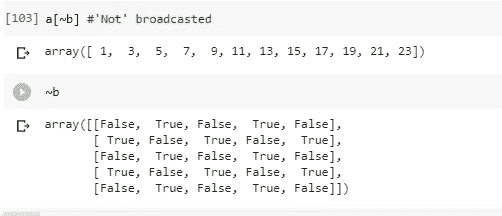**

**输出结果: [Google Colab](https://colab.research.google.com/drive/19XSdM6tVYrdgJJLXaCMuQ34OdZ2EvYRb#scrollTo=qF33ARl0PUHT&line=1&uniqifier=1)**

# **线性代数**

## **进口**

```
from numpy import linalg as alg#Let's generate some arrays:
d1 = np.diag([1,2,3])
d2 = np.array([[1,0,0],[2,0,0],[3,0,0] ])
d3 = np.array([[0,0,1], [0,1,0], [1,0,0]])
```

## **功能**

1.  ****函数' det':** 计算一个数组的行列式。**

```
alg.det(d1)
alg.det(d2)
```

****

**输出结果: [Google Colab](https://colab.research.google.com/drive/19XSdM6tVYrdgJJLXaCMuQ34OdZ2EvYRb#scrollTo=nodZw9gea-S2&line=1&uniqifier=1)**

**2.**函数' matrix_rank':** 计算一个数组的秩。**

```
alg.matrix_rank(d1)
alg.matrix_rank(d3)
```

****

**输出结果: [Google Colab](https://colab.research.google.com/drive/19XSdM6tVYrdgJJLXaCMuQ34OdZ2EvYRb#scrollTo=nodZw9gea-S2&line=1&uniqifier=1)**

**3.**函数‘inv’:** 计算一个数组的逆矩阵。**

```
print(d1)
print(alg.inv(d1))
```

****

**输出结果: [Google Colab](https://colab.research.google.com/drive/19XSdM6tVYrdgJJLXaCMuQ34OdZ2EvYRb#scrollTo=nodZw9gea-S2&line=1&uniqifier=1)**

**4.**函数‘matrix _ power’:** 将方阵提升到(整数)次幂`n`。**

```
alg.matrix_power(d1,2)
alg.matrix_power(d1,-1) # >> equivalent of alg.inv(d1)
```

****

**输出结果: [Google Colab](https://colab.research.google.com/drive/19XSdM6tVYrdgJJLXaCMuQ34OdZ2EvYRb#scrollTo=nodZw9gea-S2&line=1&uniqifier=1)**

**5.**函数‘eigvals’:** 计算一个数组的特征值**

```
alg.eigvals(d1)
```

****

**输出结果: [Google Colab](https://colab.research.google.com/drive/19XSdM6tVYrdgJJLXaCMuQ34OdZ2EvYRb#scrollTo=nodZw9gea-S2&line=1&uniqifier=1)**

**6.**函数‘EIG’:**
计算一个方阵的特征值和右特征向量。**

```
print(d1)
eigVal, eigVect = alg.eig(d1)
```

****

**输出结果: [Google Colab](https://colab.research.google.com/drive/19XSdM6tVYrdgJJLXaCMuQ34OdZ2EvYRb#scrollTo=nodZw9gea-S2&line=1&uniqifier=1)**

**7.**函数‘求解’:** 用两种不同的方法求解下列线性方程组:**

****

**如果你对在 Jupyter 笔记本、Google Colab 或任何其他支持 LaTeX 数学写作的交互式笔记本中用 LaTex 写数学感兴趣，请查看这篇文章。**

```
#First method (using alg.solve):
x = alg.solve(a,b)#Second method (using alg.inv):
inv_a = alg.inv(a)
x = inv_a.dot(b)
```

****

**输出结果: [Google Colab](https://colab.research.google.com/drive/19XSdM6tVYrdgJJLXaCMuQ34OdZ2EvYRb#scrollTo=nodZw9gea-S2&line=1&uniqifier=1)**

****资源:****

*   **[https://www . python-course . eu/numpy _ numerical _ operations _ on _ numpy _ arrays . PHP # Broadcasting](https://www.python-course.eu/numpy_numerical_operations_on_numpy_arrays.php#Broadcasting)**
*   **[https://docs . scipy . org/doc/numpy/reference/routines . Lina LG . html](https://docs.scipy.org/doc/numpy/reference/routines.linalg.html)**
*   **[https://towards data science . com/write-markdown-latex-in-the-jupyter-notebook-10985 EDB 91 FD](/write-markdown-latex-in-the-jupyter-notebook-10985edb91fd)**
*   **[https://www.python-course.eu/numpy_create_arrays.php](https://www.python-course.eu/numpy_create_arrays.php)**

****感谢阅读！😄****

**[](https://medium.com/@ahmedazizkhelifi)

查看**我的其他文章**，关注我的 [**中型**](https://medium.com/@ahmedazizkhelifi)** 

**[哈利菲艾哈迈德阿齐兹](https://medium.com/u/862a0903708d?source=post_page-----daaaaddfa122--------------------------------)**