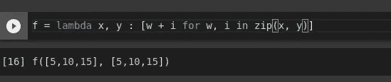

# 带 Lambda 的科学 Python

> 原文：<https://towardsdatascience.com/scientific-python-with-lambda-b207b1ddfcd1?source=collection_archive---------16----------------------->

## Python Lambda 函数的正确用法:Python 科学编程的最佳语法。


(图片由作者提供)

# 介绍

在过去的十年里，Python 编程语言已经进入了科学计算领域的许多人的脑海。这是有意义的，因为 Python 是一种动态的、易于理解的编程语言，其背后有一个重要的生态系统。尽管 Python 有能力担当这个角色，但是，Python 并不是为科学计算甚至统计而设计的。因此，与其他科学编程语言相比，Python 的语法往往有很大不同。

虽然有很多例子表明 Python 在语法上可能不是应用数学的好语言，但是 Python 确实有一些有趣和令人兴奋的技巧来抵消这种天生的劣势。这方面最酷的函数之一是**λ**函数。

Julia 编程语言让我喜欢的一点是语法表达式的使用。在 Julia 语言中使用这些表达式允许您在一行中非常容易地将不同的类型分派给不同的操作。这使得数学表达式非常简单，写起来就像在论文里一样。举例来说，这对于微分方程，尤其是积分方程来说非常有用。虽然在我看来，Julia 的实现当然更好，但 Python 中的 lambda 函数可以被认为是一个等价的函数。如果您也想了解 Julia 的实现，这里有一篇关于它的文章:

[](/how-to-use-syntactical-expressions-and-dispatch-in-julia-67ce155e4af9) [## 如何在 Julia 中使用语法表达式和调度

### 朱莉娅的面包和黄油:句法表达和多重调度

towardsdatascience.com](/how-to-use-syntactical-expressions-and-dispatch-in-julia-67ce155e4af9) 

# lambda 是什么意思？

lambda 函数是一个匿名函数，它将 Pythonic 表达式作为参数。将 lambda 视为应用程序是一个很好的方式。每当使用 lambda 时，它通常意味着我们希望将这个表达式应用于这个构造的类型。Lambda 还可以用来映射数据，在 for 循环中非常有价值。

在 Python 中，lambda 函数用于创建 Python 表达式，无需元解析。这很好，因为这也意味着我们避免了通常与执行随机代码行相关的危险——尤其是在 Python 中。然而，这个表达式也可以返回到一个变量，并在运行时环境中定义为一个函数。

# 使用λ

lambda 函数的用法类似于字典键。将键视为提供的变量或参数，将键下的数据视为调用键时要计算的表达式。

例如，让我们考虑 f(x) = x + 5:

```
x = [5,10,15]f = lambda x : [z + 5 for z in x]
```

我们想用 x 评估的表达式是`[z + 5 for z in x].`在这个循环中，我们简单地给列表 x 的每个元素加 5。每当我们把 x 放在冒号 `lambda x :`之前，我们就声明这些是将被提供来执行表达式的参数。最后，我们设置 f 等于 lambda 函数的返回——这将是一个接受参数 x 并执行算术`[z + 5 for z in x]`的函数。也就是说，f 现在被定义为这个函数:

```
print(f(x))
[10, 15, 20]
```

此外，我们可以创建一个带有多个参数的 lambda 函数。下面的函数将两个列表按元素相加:

```
f = lambda x, y : [w + i for w, i in zip(x, y)]
```



(图片由作者提供)

# 调度/λ

最后，在与我最喜欢的编程语言的比较中，Python 的 lambda 函数本质上扮演了与 dispatch 相同的角色，在一行代码中快速创建函数。尽管如此，我认为在代码之间画一个快速的比较可能是令人兴奋的。让我们使用两种语言中的两种方法创建一个正态分布，看看哪种方法更有效:

## 计算机编程语言

```
norm = lambda x : [i = (i-mean(x)) / std(x) for i in xt]norm(x)
```

## 朱莉娅

```
norm(x) = [i = (i-mean(x)) / std(x) for i in xt]norm(x)
```

从这两个例子中可以清楚地看出，这种方法在两种语言中的应用几乎没有什么不同。然而，Julia 版本的一个显著优点是，类型也可以被不同地分派和计算，例如，如果我们要通过 Julia 中的这个函数传递一个整数，我们会得到一个错误，因为我们不能遍历整数。对于 Python 来说也是如此。这两种语言的不同之处在于，当 x 的类型不是数组时，Julia 能够运行另一个完全独立的函数:

```
norm(x::Array) = [i = (i-mean(x)) / std(x) for i in xt]
norm(x::Int64) = (x - x) / std(x)
```

# 结论

尽管 Python 并不是一门在创建时就必须考虑科学计算的语言，但它确实非常适合这个角色。这种语言通过实现一些工具来做到这一点，这些工具使得利用语言内部的科学和数学语法变得更加容易。虽然 Python 的版本可能没有 Julian 实现好，但它表明 Python 是一种强大而通用的语言，可以在科学计算领域超越大多数其他语言。此外，lambda 是一个很好的工具，无论你是不是科学家，在用 Python 编程时牢牢掌握它是一件很好的事情。