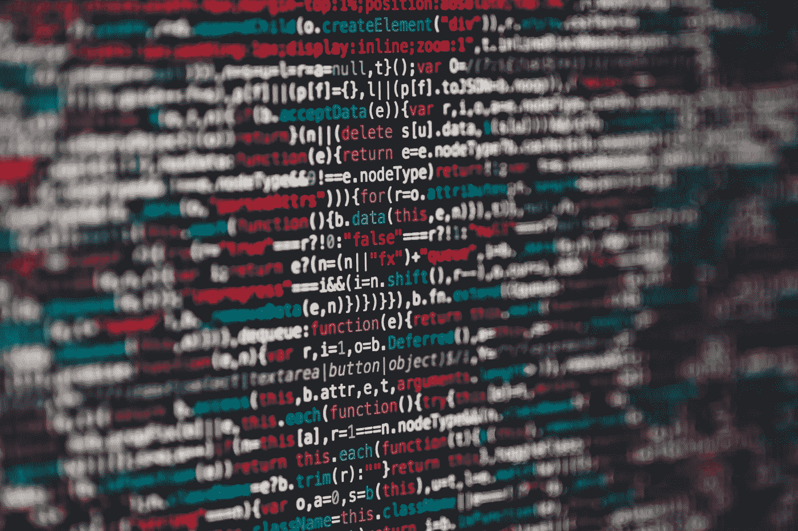

# 麻省理工学院的科学家利用人工智能发现了一种新的抗生素

> 原文：<https://towardsdatascience.com/scientists-at-mit-have-discovered-a-new-antibiotic-using-artificial-intelligence-e3a3921420fb?source=collection_archive---------37----------------------->

## 我们发现新抗生素的方式将随着这项新技术的出现而改变，这项新技术利用神经网络和人工智能的深度学习，在比传统方法短得多的时间内筛选出数百万种潜在的治疗分子。

弗兰基·查马基在 [Unsplash](https://unsplash.com/s/photos/artificial-intelligence?utm_source=unsplash&utm_medium=referral&utm_content=creditCopyText) 上拍摄的照片

麻省理工学院和布罗德研究所的一组研究人员利用人工智能技术揭示了一种分子，这种分子能够有效杀死目前威胁人类健康的一些最重要的病原体。

随着抗生素耐药性问题的日益严重，发现和开发新的抗生素变得越来越迫切。抗生素发现的传统方法可能非常昂贵和耗时，然而，这项新技术可以将时间框架从几年减少到几周。

由[马库斯·斯皮斯克](https://unsplash.com/@markusspiske)在 [Unsplash](https://unsplash.com/) 上拍摄

总的来说，这项技术并不新鲜，深度学习最著名的例子就是你可能放在口袋里随身携带的那个。苹果公司的 Siri 和亚马逊公司的 Alexa 都是神经网络的例子，你和它说话越多，它就能从你的声音中学到越多。

类似地，这个新程序首先提供了一个现有的约 2000 种分子的数据库，包括 FDA 批准的抗生素和其他化合物。然后，该团队能够训练神经网络识别其他能够杀死细菌的类似分子。他们让这个深度学习系统突出显示任何对测试细菌大肠杆菌具有抗菌活性的分子。

## 哈利辛

最初筛选的文库是“[药物再利用中心](https://www.broadinstitute.org/drug-repurposing-hub)”，其中包含超过 6000 个表征的分子。重复发现相同的化合物是传统药物发现方法的一个大问题。为了抵消这一点，只有与其他已知抗生素结构不同的化合物才会从测试库中取出。

经过反复的学习周期后，该系统能够识别出一个感兴趣的分子，该分子被预测对大肠杆菌具有非常高的效力，并且对人类具有低毒性。这个新分子被恰当地命名为 **Halicin** ，以*《2001:太空漫游》中的人工智能机器*命名。

然后，对 Halicin 进行了更常规的实验室测试，以发现它在杀死各种细菌物种方面的效率，并了解它使用哪种机制来做到这一点。人们发现，Halicin 会干扰细菌维持细胞壁梯度的能力，从而产生 ATP。ATP 是所有活细胞的能量货币，所以没有它，死亡是必然的。

在小鼠模型中，发现 Halicin 对一些最危险的耐药感染具有强大的抗菌活性，如*艰难梭菌*和泛耐药*鲍曼不动杆菌*。这两种细菌都被世卫组织列为病原体，我们迫切需要新的抗生素。

托比亚斯·菲舍尔在 [Unsplash](https://unsplash.com/) 上拍摄的照片

## 更大的数据库

在第一轮成功之后，科学家们转向了更大的化合物库。ZINC15 数据库包含超过 15 亿个分子，然而，只有 1.07 亿个被选中进行筛选。

在这些分子中，有 8 种被发现对至少一种选择进行测试的细菌物种具有活性，其中包括*金黄色葡萄球菌*和*肺炎克雷伯氏菌*等。整个过程只花了 4 天，当你考虑到能够用经验方法人工筛选的最大的库要小 10 倍，并且可能需要数年时，这是令人震惊的。

发现其中两种化合物对所有测试的物种都有广泛的活性。其中一种抗生素的结构不同于任何其他已知的抗生素，而且预计对人类的毒性很低。毫无疑问，这个分子将是该小组未来研究的重点。

## 影响

这种方法有机会彻底改变我们发现抗生素的方式。通过传统技术和颠覆性技术的结合，该团队能够确定一种抗生素，他们认为这可能是有史以来发现的最重要的抗生素之一(由 T21 布罗德研究所报道)。

这对科学的许多领域都有巨大的影响。或许最重要的是，这可以极大地帮助对抗抗生素耐药性。

从这个角度来看，halicin 有潜力治疗的鲍曼不动杆菌菌株目前对所有已知的抗生素都有耐药性，目前是部署在伊拉克和阿富汗的美国士兵的一个大问题。这种细菌对健康人的威胁很小，然而，那些免疫系统较弱或受伤的人明显更容易受到感染，导致医院中的高发病率。据认为，士兵的感染率很高，这是因为新兵在受伤后返回祖国之前要忍受不同的医疗环境。这导致士兵的总体死亡率上升。

由[托马什·弗兰科斯基](https://unsplash.com/@sunlifter)在 [Unsplash](https://unsplash.com/) 上拍摄的照片

## 将来的

就这项技术而言，这项研究背后的科学家强调，这只是一个开始。现在已经证明了这是一个多么强大的工具，人工智能方面可以不断改进，以便可以筛选更大的库。这可能会导致定期发现具有抗菌活性的分子。

还有机会定制深度学习算法，以精确定位可以杀死非常特定类型抗生素的分子。该团队希望，在未来，这可能会导致治疗方法的发展，可以通过静脉注射到精确的感染部位，从而不会干扰无害地生活在我们体内的细菌。

## 参考

*原始研究论文* — [抗生素发现的深度学习方法](https://www.cell.com/cell/fulltext/S0092-8674(20)30102-1?_returnURL=https%3A%2F%2Flinkinghub.elsevier.com%2Fretrieve%2Fpii%2FS0092867420301021%3Fshowall%3Dtrue)

[人工智能产生新抗生素](https://www.broadinstitute.org/news/artificial-intelligence-yields-new-antibiotic)

[药品再利用中心](https://www.broadinstitute.org/drug-repurposing-hub)

[介绍深度学习和神经网络—新手的深度学习(1)](/introducing-deep-learning-and-neural-networks-deep-learning-for-rookies-1-bd68f9cf5883)

[解释:神经网络](http://news.mit.edu/2017/explained-neural-networks-deep-learning-0414)

[物理性质对革兰氏阳性和革兰氏阴性病原体抗菌活性的趋势和例外](https://pubs.acs.org/doi/10.1021/jm501552x)

[现代战争中的不动杆菌](https://www.sciencedirect.com/science/article/abs/pii/S0924857912000763?via%3Dihub)

[与战斗相关感染的流行病学…:创伤和急救外科杂志](https://journals.lww.com/jtrauma/Abstract/2008/03001/Epidemiology_of_Infections_Associated_With.5.aspx)

[锌 15 —每个人的配体发现](https://www.ncbi.nlm.nih.gov/pmc/articles/PMC4658288/)