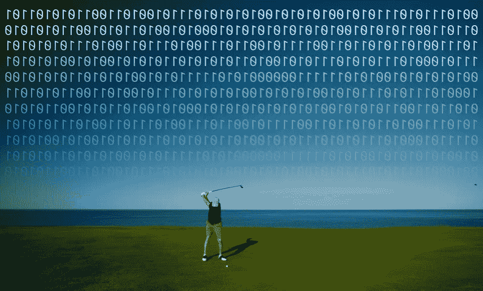
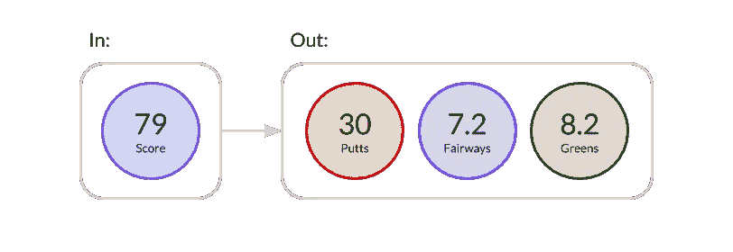
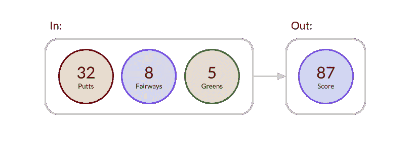
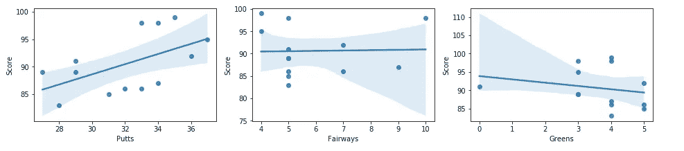
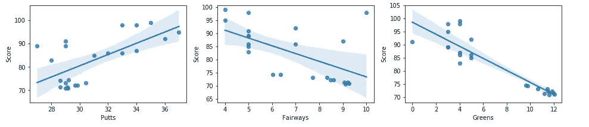
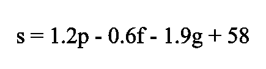
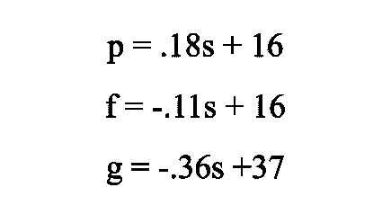

# Scikit-learn 预测高尔夫表现的线性回归

> 原文：<https://towardsdatascience.com/scikit-learn-linear-regression-for-predicting-golf-performance-c92f31b69f92?source=collection_archive---------64----------------------->

## 我如何建立一个简单的工具来帮助玩家理解他们使用数据的技能。



资料来源:Unsplash/andrewricegolf

作为努力提高我的高尔夫球水平的一部分，我在过去的一年里一直在跟踪我在比赛关键领域的数据。当我在一轮结束时计算我的分数时，我也会计算推杆数、果岭数和球道数。这并不需要太多的努力，但它可以告诉你很多关于你的游戏需要练习的地方。

在 General Assembly 上数据科学课程时，我决定将我的最终项目集中在我收集的数据上。我使用 Python 中的 Scikit-learn 库构建了一个线性回归模型，该模型可以预测您的高尔夫表现。并且，我将我构建的模型打包在一个简单的 Flask web 应用程序中，该应用程序可以部署到 Heroku 以方便访问。[可在 Github 上获得](https://github.com/mvrahas/scorepredictor)

我构建的模型侧重于两个主要用例…

**根据分数预测统计数据**

高尔夫球手通常会围绕他们想要打出的分数为自己设定目标。也许他们希望能够在资格赛中晋级，减少他们的障碍，或者只是打出他们个人的最好成绩。这个工具接受一个得分输入，并输出一个得分所需的平均统计预测。例如，如果你的目标是突破 80，这个工具可以给你具体的目标来实现它。



在模型中输入分数 79 时的示例输出。

**根据数据预测得分**

对于高尔夫球手来说，了解自己的技术水平很重要，这样他们就可以管理对高尔夫球场的期望，避免不必要的风险。这是帮助高尔夫球手计划比赛的有用工具。它以数据为输入，预测你最有可能投篮的得分。例如，如果你要去一个困难的球场，只希望打 5 个果岭，你可以生成一个得分预测，以了解你在那里可能会打出什么。



向模型中输入特定统计数据时的示例输出。

我们可以用数据来理解导致高分的行动。它可以帮助我们建立具体的目标，我们需要实现，以拍摄我们想要的分数。我们可以想出一个具体的计划来打出一个低分，而不是专注于短暂的挥杆想法，比如“低头”或“坚持到底”。例如，我们可以通过每次瞄准果岭的中心来制定击中更多果岭的具体计划。

# 构建模型

我用自己高尔夫比赛的数据开发了一个线性模型来预测数据和分数。我的数据集中的每个样本都代表我玩的一轮游戏，并对这一轮游戏进行统计。请参阅每个功能的以下定义…

*   得分(整数):一轮击球的总次数
*   果岭数(整数):规则中的果岭数(共 18 个)
*   推杆(整数):一轮推杆的总数
*   球道(INT):一轮比赛中击中球道的总数

在散点图上画出这些分数后，根据我对游戏的体验，这些趋势是有意义的。随着你推球次数的增加，你的分数也会上升。随着你击中果岭数量的增加，你的分数会下降。击中球道的次数和你的得分之间的相关性较小。



N=13 个样本

为了让数据代表更大范围的分数，我添加了来自 PGA 巡回赛数据集的样本。数据集中的每个样本都代表了一名职业巡回赛选手，以及他们在 2010 年至 2018 年期间在比赛各个领域的平均统计数据。原始数据集包含数千个值，但我随机抽取了 10 个值来代表得分范围在 69 到 75 之间的玩家。在将职业统计数据添加到我的个人数据集中之后，我重新创建了散点图。



N=23 个样本

因为统计数据似乎都与分数有线性关系，所以我选择用线性模型来拟合数据，这种模型训练速度快，解释简单，方差低，这意味着不管输入的数据是什么，它都会预测类似的结果。线性模型的缺点是，它可能比最先进的建模技术更有偏差。

```
from sklearn.linear_model import LinearRegression
from sklearn.model_selection import cross_validate, KFolddef fit_and_score_linear_model(data,target):

    # Define features
    features = ['Putts','Fairways','Greens']
    X = data[features]
    y = data[target]

    # Fit linear regression model
    lr = LinearRegression()
    lr.fit(X,y)
    y_pred = lr.predict(X)
    r2 = lr.score(X,y)

    # Cross validate model
    kf = KFold(n_splits = 5, shuffle=True, random_state=24)
    cv_results = cross_validate(lr,X,y,scoring='r2',cv=kf)

    print('r2 training: '+str(r2))
    print('r2 cross val: ' +str(cv_results['test_score'].mean()))

    return {'model':lr, 'predicted': y_pred}
```

我从 Scikit-learn 导入了线性回归模型，并构建了一个函数来用数据拟合模型，打印训练分数，并打印 5 倍的交叉验证分数。仅用我的个人数据运行该函数，我得到了以下准确度值…

```
r2 training: 0.5005286435494004
r2 cross val: -2.370294280122853
```

用我的个人数据结合专业数据运行该函数，我得到了以下准确度值…

```
r2 training: 0.9205079679115369
r2 cross val: 0.8118472290929108
```

加入职业高尔夫球手的数据后，R2 值显著增加。这可能是因为目标变量的差异更大，或者为模型学习正确的关系提供了更多的数据。在打印出我拟合的线性模型的系数后，我能够将下面的等式放在一起，以表示一名球员基于推杆、球道和果岭击球的总分。



为了创建一个基于输入 I 得分预测统计数据的工具，我用相同的数据拟合了多个不同的线性模型。我没有使用 Score 作为目标变量，而是使用它作为唯一的特征，将每个单独的 stat 作为目标变量。结果是推杆、球道和果岭的 3 个线性模型，分别以 0.44、0.33 和 0.83 的训练 R2 精度拟合数据。我又一次打印出了系数，将基于分数预测不同统计数据平均值的方程放在一起。



# 结论和后续步骤

这种模式在未来有几个方面可以改进或扩展。

更多数据-样本量较小，这导致在尝试交叉验证模型和寻找样本外精度时结果不一致。根据为我的 KFolds 交叉验证选择的数据子集，这些值会发生显著变化。

代表所有高尔夫球员-用于训练模型的数据仅代表我的技能和巡回赛职业的技能，在数据集中留下了很大的差距。该模型需要来自射击在 75-80 之间的高级玩家和射击超过 100 的初学者的额外样本。填补这一空白可以让我探索不同的模型，可能会导致更准确的预测。

一致的抽样方法——我的个人得分数据是以不同于职业得分数据的方式收集的。职业得分的每个样本都是多轮统计的平均值。我的每个分数样本代表了我玩的一个特定回合。取平均值可以消除数据中的重要差异，这些差异可用于做出更准确的预测。

更多功能—有可能创建/修改与分数更密切相关的功能。例如，不是所有的球场都有相同数量的球道。通过创建一个详细描述球场上球道数量的特征，我们可以将球道统计数据转换成一个百分比而不是一个绝对数字。