# 深度学习中的模型剪枝

> 原文：<https://towardsdatascience.com/scooping-into-model-pruning-in-deep-learning-da92217b84ac?source=collection_archive---------35----------------------->

## [生产中的机器学习](https://towardsdatascience.com/tagged/production-ml)

## 本文讨论深度学习背景下的剪枝技术。

这篇文章是我上一篇关于 [***量子化***](/a-tale-of-model-quantization-in-tf-lite-aebe09f255ca) 文章的后续。在本文中，我们将在深度学习的背景下讨论模型修剪的机制。模型修剪是一种丢弃那些不代表模型性能的权重的艺术。精心修剪的网络会产生更好的压缩版本，它们通常适用于设备上的部署场景。

文章的内容分为以下几个部分:

*   函数和神经网络中“无意义”的概念
*   修剪训练好的神经网络
*   不同模型之间的代码片段和性能比较
*   现代修剪技术
*   最后的想法和结论

(我们将要讨论的代码片段将基于 TensorFlow (2)和 [TensorFlow 模型优化工具包](https://www.tensorflow.org/model_optimization))

***注*** :文章镜像[此处](https://app.wandb.ai/authors/pruning/reports/Scooping-into-Model-Pruning-in-Deep-Learning--VmlldzoxMzcyMDg)。

# 函数中“无意义”的概念

神经网络是函数逼近器。我们训练他们学习函数，这些函数捕获了表达输入数据点的基本表示。神经网络的权重和偏差被称为其(可学习的) ***参数*** 。通常，权重被称为正在学习的函数的 ***系数*** 。

考虑下面的函数-

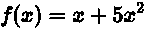

在上面的函数中，我们在 RHS 上有两项: *x* 和 x，系数分别是 1 和 5。在下图中，我们可以看到，当轻推第一个系数时，函数的行为没有太大变化。

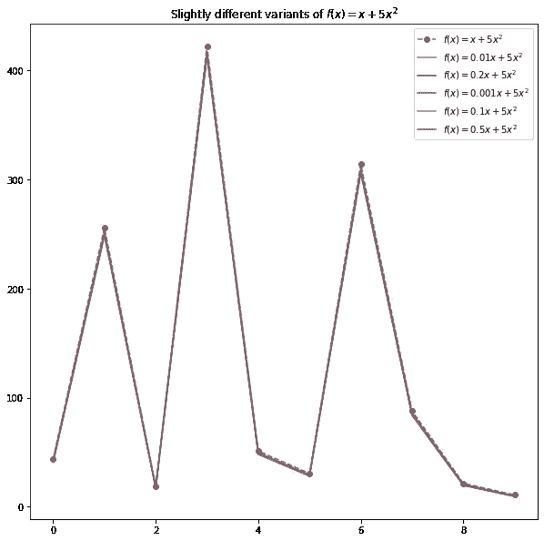

下面是原函数的不同变型中的系数，可称为*。丢弃这些系数不会真正改变函数的行为。*

# *神经网络的扩展*

*上述概念也可以应用于神经网络。这需要更多的细节来展开。考虑一个训练好的网络的权重。我们如何理解不重要的权重呢？这里的前提是什么？*

*要回答这个问题，请考虑梯度下降的优化过程。不是所有的权重都使用相同的梯度幅度来更新。给定损失函数的梯度是相对于权重(和偏差)取的。在优化过程中，用比其他权重更大的梯度幅度(正的和负的)来更新一些权重。这些权重被优化器认为是 ***显著的*** ，以最小化训练目标。接收相对较小梯度的权重可以被认为是 ***不重要的*** 。*

*训练完成后，我们可以逐层检查网络的权重大小，并找出重要的权重。这个决定是用几种试探法做出的-*

*   *我们可以按降序对权重大小进行排序，并选取队列中出现较早的权重。这通常与我们想要达到的稀疏水平(要修剪的权重的百分比)相结合。*
*   *我们可以指定一个阈值，其幅度高于该阈值的所有权重将被认为是重要的。这个方案可以有几种风格:*

***i.** 阈值可以是整个网络中最低的权重幅度。*

***二。**阈值可以是网络内部各层的局部权重值。在这种情况下，重要的权重被逐层过滤掉。*

*如果所有这些变得难以理解，不要担心。在下一节中，事情会变得更清楚。*

# *修剪训练好的神经网络*

*既然我们已经对所谓的重要权重有了相当多的了解，我们可以讨论基于 ***幅度的*** 修剪。在基于大小的剪枝中，我们认为权重大小是剪枝的标准。通过修剪，我们真正的意思是把不重要的权重归零。以下代码片段可能有助于理解这一点*

*(这段代码片段来自[此处](https://colab.research.google.com/github/matthew-mcateer/Keras_pruning/blob/master/Model_pruning_exploration.ipynb))*

*这里有一个图形表示，在 之后，权重 ***将会发生变化****

*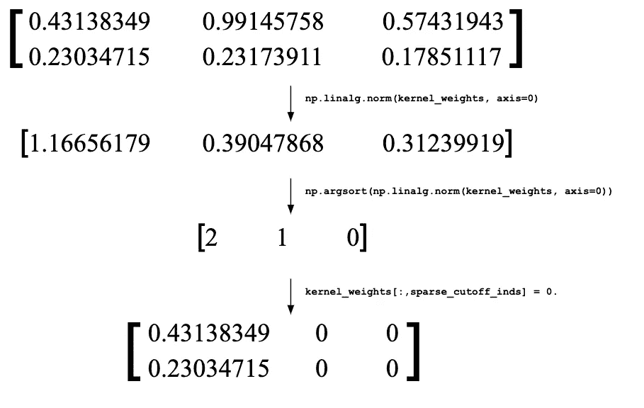*

*它也适用于偏见。值得注意的是，这里我们考虑接收形状为`(1,2)`的输入并包含 3 个神经元的整个层。在网络被修剪以补偿其性能的任何下降之后，重新训练网络通常是明智的。在进行这种再训练时，重要的是要注意，在再训练期间，被修剪的权重 ***不会被更新*** 。*

# *观看活动中的事物*

*废话少说！让我们来看看这些东西的作用。为了简单起见，我们将在 MNIST 数据集上测试这些概念，但是您也应该能够将它们扩展到更复杂的数据集。我们将使用一个浅层全连接网络，其拓扑结构如下-*

*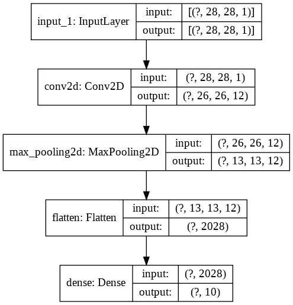*

*该网络总共有 20，410 个可训练参数。对这个网络进行 10 个纪元的训练可以让我们得到一个很好的基线-*

*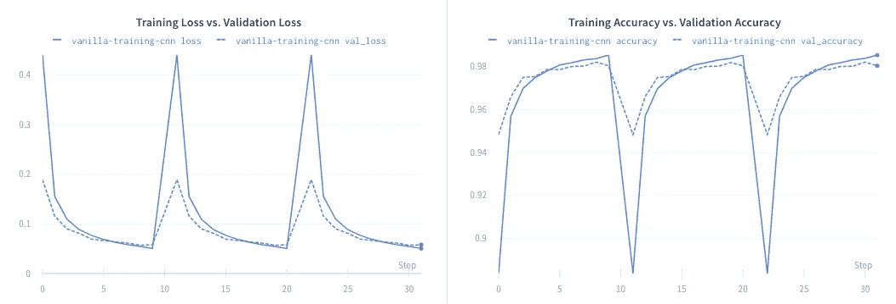*

*在这里与剧情[互动](https://app.wandb.ai/authors/pruning)*

*让我们现在修剪它！我们将使用`tensorflow_model_optimization`(别名为`tfmot`)。`tfmot`为我们提供了两种修剪方法:*

*   *选择一个训练有素的网络，用更多的训练来修剪它。*
*   *随机初始化一个网络，从头开始修剪训练它。*

*我们将对他们两个进行实验。这两种方法都应该包括一个修剪时间表，我们稍后将讨论这个时间表。以训练的形式修剪网络的基本原理是更好地引导训练目标，使得梯度更新可以相应地发生，从而以有效的方式调整未修剪的权重。*

***注意**在你的模型中修剪特定的层也是可能的，并且`tfmot`允许你这么做。查看本指南以了解更多信息。*

# *食谱 1:选择一个训练有素的网络，用更多的训练来修剪它*

*从现在开始，我们鼓励您跟随顶部提到的这个 Colab 笔记本。*

*我们将采用我们之前训练的网络，并从那里对其进行删减。我们将应用一个修剪计划，在整个训练过程中保持稀疏水平不变(由开发人员指定)。表达这一点的代码如下:*

*在我们开始训练它之前，修剪过的模型需要重新编译。我们以同样的方式编辑它，并打印它的摘要-*

*我们看到现在参数的数量已经改变了。这是因为`tfmot`为网络中的每个权重添加了不可训练的掩码，以指示给定的权重是否应该被删减。掩码为 0 或 1。*

*让我们训练它。*

*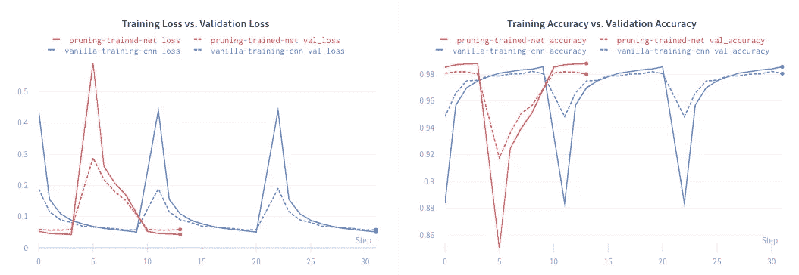*

*与剧情互动[这里](https://app.wandb.ai/authors/pruning)*

*我们可以看到，修剪模型并不影响性能。红线对应于修剪实验。*

***注意**:*

*   *修剪计划是必须指定的，以便在训练模型时实际修剪模型。我们还指定了`[UpdatePruningStep](https://www.tensorflow.org/model_optimization/api_docs/python/tfmot/sparsity/keras/UpdatePruningStep)`回调，以便它在训练期间负责修剪更新。*
*   *`[PruningSummaries](https://www.tensorflow.org/model_optimization/api_docs/python/tfmot/sparsity/keras/PruningSummaries)`提供了关于在训练期间如何保持稀疏度和幅度阈值的总结。你可以在这里看到一个这样的例子[。](https://tensorboard.dev/experiment/sRQnrycaTMWQOaswXzClYA/#scalars&_smoothingWeight=0)*
*   *将修剪计划视为一个超参数。`tfmot`提供了另一个现成的修剪计划- `[PolynomialDecay](https://www.tensorflow.org/model_optimization/api_docs/python/tfmot/sparsity/keras/PolynomialDecay)`。*
*   *您可能希望将修剪计划中的`end_step`参数设置为小于或等于您将为其训练模型的时期数。此外，您可能需要试验一下`frequency`参数(它表示应该应用修剪的频率),以便获得良好的性能和期望的稀疏性。*

*我们还可以通过编写如下测试来验证`tfmot`是否达到了目标稀疏度:*

*在修剪过的模型上运行它应该为所有被修剪的层产生`True`。*

# *诀窍 2:随机初始化一个网络，通过从头开始训练来修剪它*

*在这种情况下，除了我们不是从一个已经训练好的网络开始，而是从一个随机初始化的网络开始之外，一切都保持不变。*

*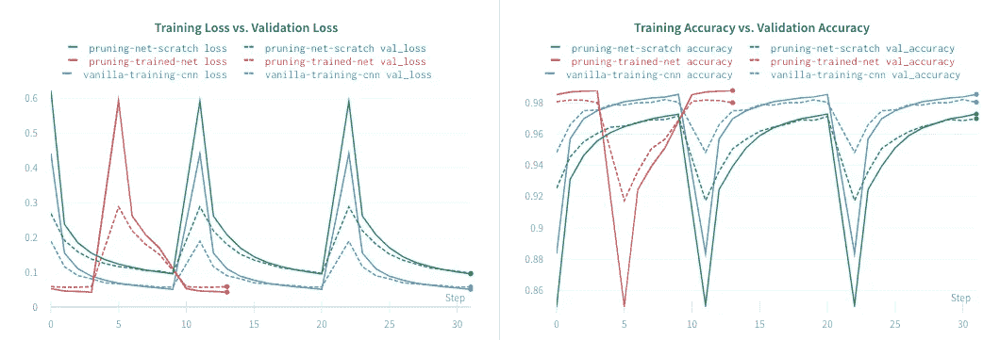*

*在这里与剧情[互动](https://app.wandb.ai/authors/pruning)*

*绿线对应于从头修剪实验。我们可以观察到其他两个模型的性能有所下降，但这是意料之中的，因为我们不是从一个已经训练好的模型开始的。*

*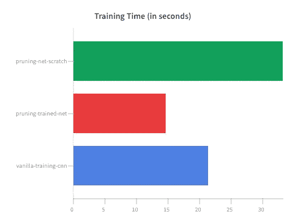*

*在这里与剧情[互动](https://app.wandb.ai/authors/pruning)*

*当我们通过从头开始训练来修剪网络时，通常会花费最多的时间。这也是预期的，因为网络正在计算如何最好地更新参数，以便达到目标稀疏度水平。*

*所有这些都很好，但是为了能够真正体会到修剪的力量，我们需要挖掘得更深一些:*

*   *导出同一网络的修剪和未修剪的变体，压缩它们，并记录它们的大小。*
*   *量化它们，压缩它们的量化版本，记录它们的大小，并评估它们的性能。*

*让我们在下一节处理它。*

# *性能赋值*

*我们将使用标准的`zipfile`库将模型压缩成`.zip`格式。当序列化修剪后的模型时，我们需要使用`[tfmot.sparsity.keras.strip_pruning](https://www.tensorflow.org/model_optimization/api_docs/python/tfmot/sparsity/keras/strip_pruning)`，它将删除由`tfmot`添加到模型中的修剪包装器。否则，我们将无法在修剪后的模型中看到任何压缩优势。*

*然而，压缩常规 Keras 模型保持不变。*

*`file`应该是一个已经序列化的 Keras 模型的路径(修剪的和常规的)。*

*在下图中，我们可以看到压缩模型的重量比常规的 Keras 模型轻，但它们仍然有很好的性能。*

*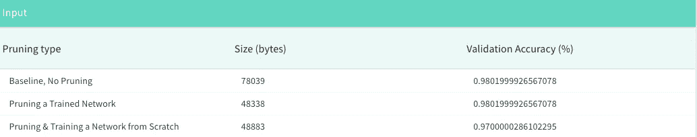*

*我们可以使用 TensorFlow Lite 量化我们的模型，在不影响性能的情况下进一步减小它们的大小。**注意**在将**修剪后的模型**传递给 TensorFlow Lite 的转换器时，您应该在剥离修剪包装后传递它们。本报告更详细地讨论了量化。*

**

*除了精度测量之外，**压缩比**是另一种广泛使用的技术，用于测量特定修剪算法的功效。压缩比是剪枝网络中剩余参数分数的倒数。*

*这种量化也被称为**训练后量化**。因此，这里有一个简单的方法供您遵循，以优化您的部署模型:*

*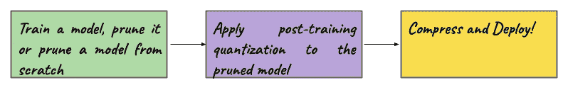*

*在下一节中，我们将学习一些现代的修剪食谱。如果你想更多地追求模型优化领域，这些想法将值得进一步探索。*

# *一些现代修剪食谱*

*让我们从以下激励性问题开始这一部分:*

1.  *当我们重新训练一个修剪过的网络时，如果将 ***个未修剪的权重*** 初始化为它们原来的初始幅度会怎么样？如果你从一个已经训练好的网络(比如网络 A)中得到一个修剪过的网络，考虑网络 A 的这些初始大小。*
2.  *当在具有预训练网络的迁移学习机制中执行 ***基于幅度的*** 修剪时，我们如何决定权重的重要性？*

## *赢得门票的机会*

*弗兰克尔等人在他们关于彩票假说的开创性论文中对第一个问题进行了大量的探索。因此，在修剪了一个已经训练好的网络之后，具有上述初始化的子网被称为优胜标签。*

*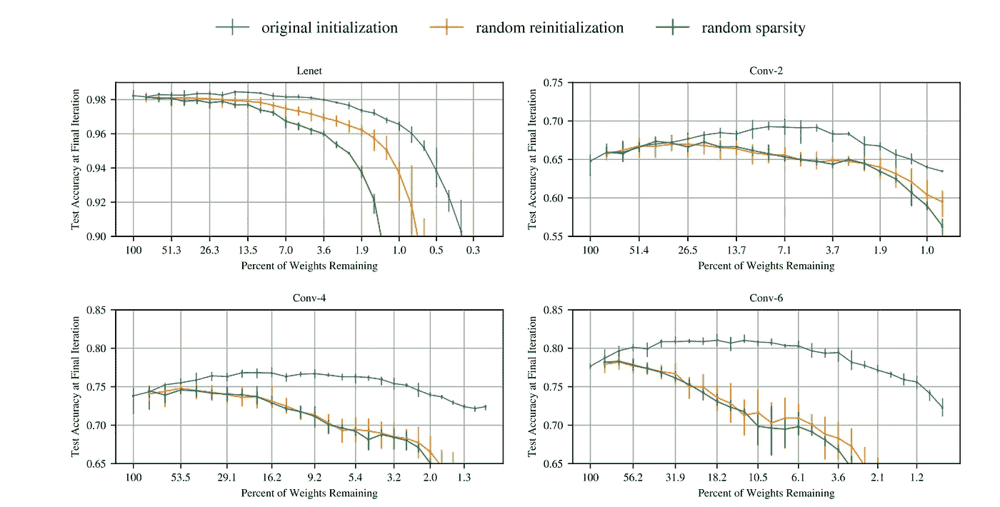*

*来源:原始文件*

*作为这种方法背后的基本原理，您可以推断在网络的初始训练期间，参数的特定初始化引导了优化过程。现在，在优化领域反应良好的权重(意味着它们比其他权重走得更远)实际上最终赢得了彩票。因此，为了让它(重新)训练得更好，如果我们将权重初始化为它们最大的初始大小，优化过程就会很好地利用它们。感谢 Yannic Kilcher 的[这个漂亮的解释](https://www.youtube.com/watch?v=ZVVnvZdUMUk)。*

*这篇论文提供了大量不同的实验来支持这个假设，绝对值得一读。*

## *彩票假说的系统探索*

*在最初的彩票假设论文中，Frankle 等人只研究了如果幸存的权重在重新训练之前被重新初始化到它们的最大初始幅度，修剪后的网络如何表现。就在彩票假说[在 2019](https://www.youtube.com/watch?v=s7DqRZVvRiQ) 上提出后，周等人发表了一篇关于[解构彩票](https://arxiv.org/abs/1905.01067)的论文，研究了在修剪过程中处理存活和未存活的权重的不同方法。还提出了 ***supermasks*** 基本都是可以学习的面具。*

*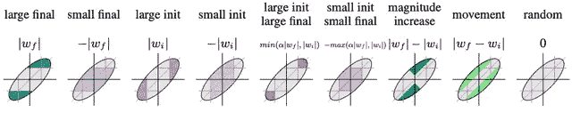*

*来源:原始文件*

## *彩票假说的推广*

*为了能够将彩票假设扩展到像 ImageNet 这样的数据集，Frankle 等人发表了一篇关于[线性模式连通性](https://arxiv.org/abs/1912.05671)的论文，这是彩票假设的一种推广。它提出了权重回卷作为一种潜在的方式来初始化修剪网络的幸存权重。之前，我们用它们的最大初始星等来初始化它们。权重倒带所做的是，它将幸存的权重倒带到原始网络训练中的某个地方。换句话说，幸存的权重被初始化为来自原始网络训练的时段 5 的幅度。*

**

*来源:原始文件*

*扩展这个想法，Renda 等人发表了一篇关于[学习速率倒回](https://openreview.net/forum?id=S1gSj0NKvB)的论文，该论文适用于在重新训练修剪过的网络时倒回学习速率表。作者还提出这是微调的替代方案。*

*所以，这些令人兴奋的想法主要是围绕着 ***基于幅度的*** 修剪发展而来的。在最后一节中，我们将看到一种比基于数量的剪枝更好的剪枝方法，特别是对于迁移学习机制。*

## *基于权重移动的修剪*

*在他们关于[移动修剪](https://arxiv.org/abs/2005.07683)的论文中，Sanh 等人提出了一种基于幅度的修剪的替代方法，该方法专门用于处理迁移学习任务的预训练模型的修剪。*

*基于幅度的剪枝与我们之前已经讨论过的重要性概念正相关。在这种情况下，这里的重要性简单地表示权重的绝对大小。这些数值越低，意义越小。现在，当我们尝试使用一个在不同数据集上预先训练的模型进行迁移学习时，这种重要性实际上可以改变。优化源数据集时重要的权重对于目标数据集可能不重要。*

*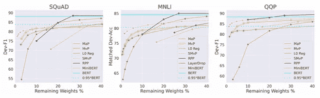*

*来源:原始文件*

*因此，在迁移学习过程中， ***将*** 移向零的预训练权重实际上可以认为相对于目标任务是不显著的，而 ***将*** 移得更远的权重可以认为是显著的。这就是这种方法的名字来源于——***移动*** 修剪。再次感谢 Yannic 的[精彩解说](https://www.youtube.com/watch?v=nxEr4VNgYOE)。*

# *结论、致谢和最后的想法*

*如果坚持到最后，太好了！我希望这份报告让你对深度学习中的修剪有一个公平的想法。我要感谢(谷歌的)拉结尔和云璐，他们为我提供了关于`tfmot`的重要信息和一些关于修剪本身的额外想法。*

*我想在这方面进一步探讨的一些想法是:*

*   *如果我们可以在训练和再训练网络时使用有区别的修剪时间表呢？*
*   *在进行幅度修剪时，周等人向我们展示了在修剪后的网络中处理幸存权重的初始化的不同方式。我们可以学习一种有效的方法来系统地将它们结合起来吗？*

*在撰写本报告时(2020 年 6 月)，最近的修剪方法之一是 [SynFlow](https://arxiv.org/abs/2006.05467) 。SynFlow *不需要任何数据*来修剪网络，它使用*突触显著性分数*来确定网络中参数的重要性。*

*我愿意通过 Twitter ( [@RisingSayak](http://twitter.com/RisingSayak) )听取你的反馈。*

# *参考*

****(排名不分先后)****

*   *Matthew Mcateer 在 Keras 中的模型修剪探索*
*   *[官方](https://www.tensorflow.org/model_optimization/guide/pruning/pruning_with_keras)`[tfmot](https://www.tensorflow.org/model_optimization/guide/pruning/pruning_with_keras)`[Keras 修剪指南](https://www.tensorflow.org/model_optimization/guide/pruning/pruning_with_keras)*
*   *[剖析修剪过的神经网络](http://www.jfrankle.com/dissecting-pruned-neural-nets.pdf)作者 Frankle 等人。*
*   *[彩票假说解释视频](https://www.youtube.com/watch?v=ZVVnvZdUMUk)作者 Yannic Kilcher*
*   *[运动修剪解说视频](https://www.youtube.com/watch?v=nxEr4VNgYOE)作者 Yannic Kilcher*