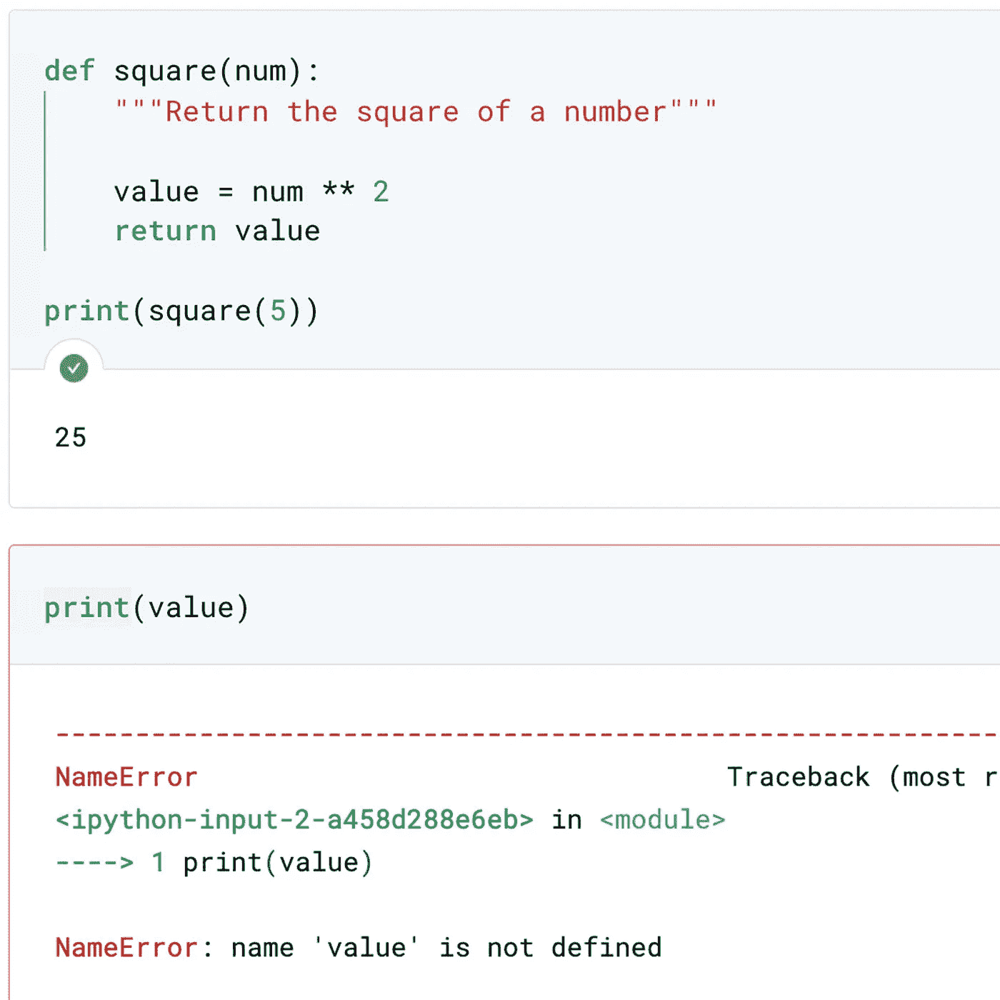
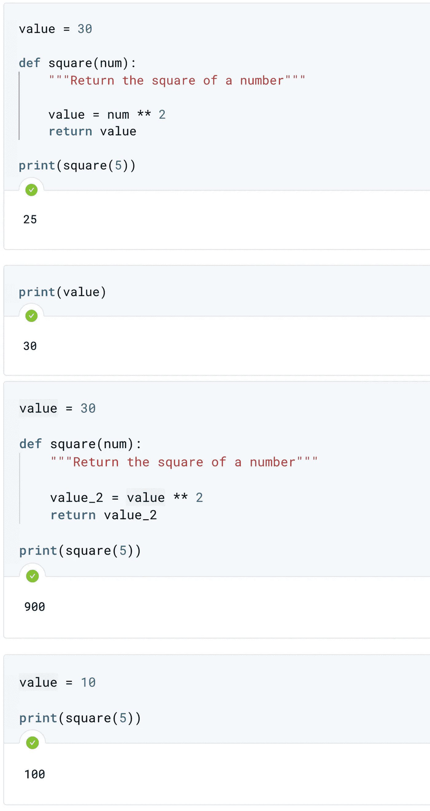
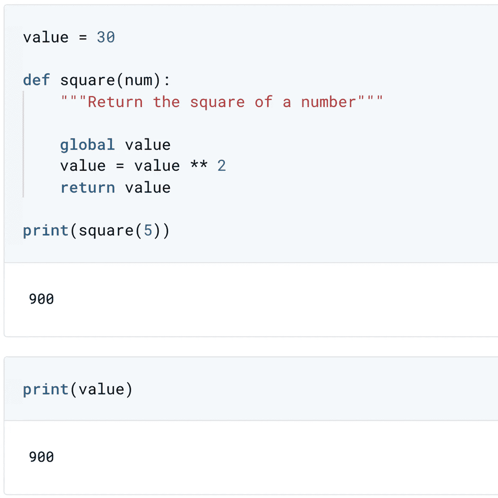
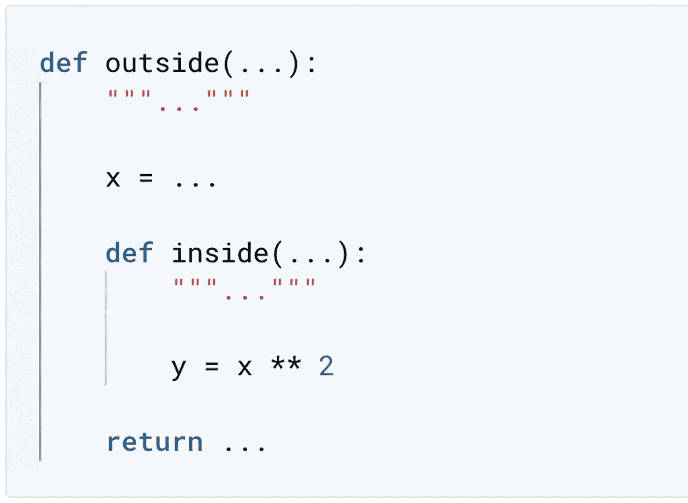
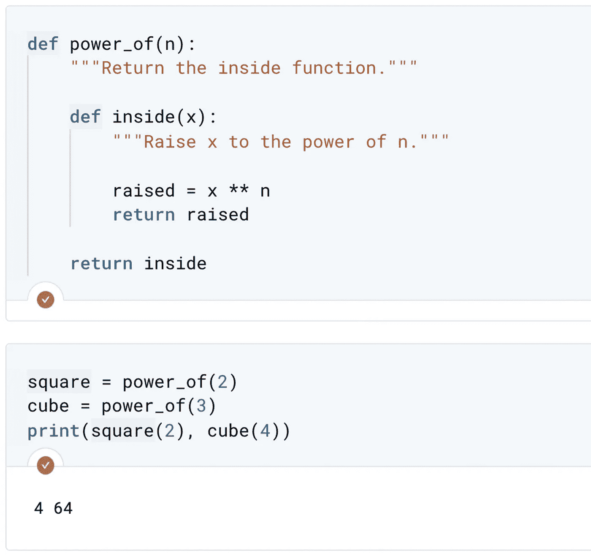
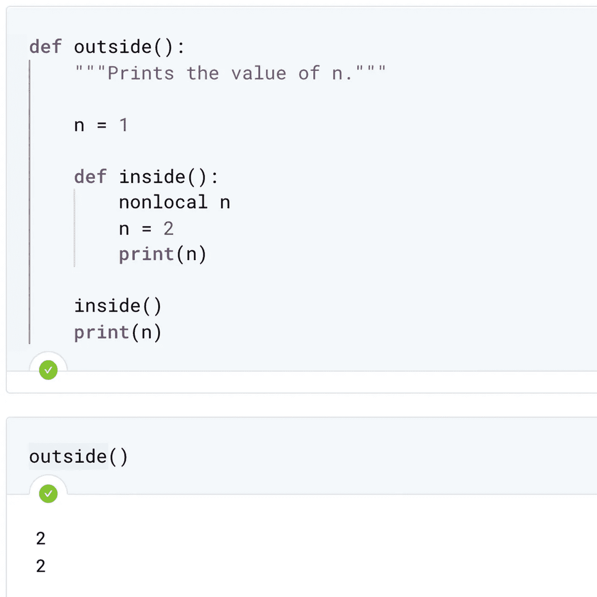

# 变量范围和 LEGB 规则

> 原文：<https://towardsdatascience.com/scope-of-variable-and-legb-rule-4d44d4576df5?source=collection_archive---------44----------------------->


变量范围和 LEGB 规则。图片由[作者](https://medium.com/@wiekiang)

## 给 PYTHON 开发者的提示

## **变量**的**范围**是指你可以看到或者访问**变量**的地方

一开始，我假设您知道如何定义自己的函数，但不仅如此，您还知道如何编写具有多个参数的函数，并且可以使用元组返回多个值。

## 先决条件

如果你不熟悉定义自己的函数，下面的文章会给你更多的信息。

[](/writing-your-own-functions-40d381bd679) [## 编写自己的函数

### 数据科学家需要具有特定功能的函数

towardsdatascience.com](/writing-your-own-functions-40d381bd679) 

我们现在将在用户定义函数的上下文中讨论作用域的概念。你已经在你的程序中定义了变量。到目前为止，您一直在使用这些变量，没有任何问题。然而，如果你记得不是你定义的所有对象在程序中的任何地方都是可访问的，那就更好了。这就是作用域的概念，它告诉你程序的哪一部分一个对象或者一个变量可以被访问。

**变量或对象，如程序中定义的函数，都有名称，函数也是如此。**

有几种类型的范围。第一个是**全局范围**，这意味着它是在脚本的主体中定义的。第二个是**局部范围**。局部作用域意味着它是在函数中定义的。一旦函数执行完毕，局部范围内的任何变量都会终止，这意味着在函数定义之外不能再访问这些变量。

第三个是**内置范围**。这由 Python 提供的预定义内置模块中的变量组成，比如 print 和 sum。最后一个是**封闭函数**，我们将在后面的嵌套函数部分讨论这一点。

让我们来看一个例子。



本地范围。图片作者[作者](https://medium.com/@wiekiang)

我们定义函数，然后调用它。如果我们试图在函数执行之前或之后访问变量名`value`，该变量是不可访问的。这是因为它仅在函数的局部范围内被定义。变量`value`没有被全局定义。

如果我们在定义和调用函数之前全局定义变量会怎么样？



全球范围。图片由[作者](https://medium.com/@wiekiang)

简而言之，任何时候我们调用全局范围内的变量，它都会访问全局范围内的变量名。然而，每当我们在函数的局部范围内调用变量时，它将首先在局部范围内查找。这就是为什么调用`square(5)`返回的结果是 25 而不是 30。

如果 Python 在局部范围内找不到变量，那么它会在全局范围内寻找。例如，我们在函数方块中访问一个全局定义的变量`value`。请注意，访问的全局值是调用函数时的值，而不是定义函数时的值。因此，如果我们重新分配`value`并调用该函数，我们会看到`value`的新值被访问。

很明显，当我们引用一个变量时，首先搜索局部范围，然后是全局范围。如果变量在局部和全局范围内不存在，则到达内置范围。如果我们想在函数调用中改变一个全局变量的值呢？这就是关键字 global 派上用场的地方。



内置范围。图片作者[作者](https://medium.com/@wiekiang)

在函数定义中，我们使用关键字`global`，后跟我们希望访问和更改的全局变量的变量名。比如这里我们把`value`改成它的平方。之后，我们将调用`value`变量。我们看到，通过运行函数 square，全局值确实被平方了。

## 嵌套函数

如果我们有一个在函数`outside`中定义的函数`inside`，并且我们在`inside`函数中引用了一个变量名`x`会怎么样？答案很直观。Python 搜索`inside`函数的局部范围。如果没有找到那个变量，它就搜索`outside`函数的范围，这个函数被称为封闭函数，因为它封闭了`inside`函数。如果 Python 在封闭函数的作用域中找不到那个变量，它只会搜索全局作用域，然后是内置作用域。



嵌套函数。图片作者[作者](https://medium.com/@wiekiang)

**为什么我们要嵌套一个函数？**

有一些很好的理由。假设我们想在一个函数中多次执行一个过程。例如，我们想要一个函数，它接受三个数字作为参数，并对每个数字执行相同的函数。一种方法是将计算写出来三次，但是如果您想经常执行它，这是不可伸缩的。相反，我们可以在函数定义中定义一个内部函数，并在需要的地方调用它。这称为嵌套函数。

**我们来看另一个例子。**



嵌套函数示例。图片作者[作者](https://medium.com/@wiekiang)

`inside`函数的语法与任何其他函数的语法相同。在这个例子中，我们定义了一个函数`power_of`，它包含一个名为`inside`的内部函数。现在看看`power_of`返回什么:它返回内部函数`inside`。`power_of`接受一个参数并创建一个函数`inside`，该函数返回任意数字的 n 次方。这有点复杂，当我们执行函数`power_of`时会更精确。

将数字 2 传递给`power_of`会创建一个对任意数字求平方的函数。同样，将数字 3 传递给`power_of`会创建一个对任意数字进行立方的函数。

一个有趣的细节是，当我们调用函数`square`时，它会记住值`n=2`，尽管`power_of`定义的封闭范围和`n=2`所在的局部范围已经执行完毕。这是一个细微的差别，在计算机科学的圈子里被称为闭包，你不应该太担心。然而，这是值得一提的，因为你可能会遇到它。



封闭范围内的变量。图片由[作者](https://medium.com/@wiekiang)

转到我们对作用域的讨论，您可以在函数定义中使用关键字`global`来创建和更改全局变量；类似地，在嵌套函数中，可以使用关键字`nonlocal`在封闭范围内创建和更改变量。

在这个例子中，我们修改了`inside`函数中`n`的值。因为我们使用了关键字`nonlocal`，它改变了封闭范围内`n`的值。这就是为什么调用`outside`函数会打印出函数`inside`中确定的`n`的值。

## 结论

变量引用搜索:

*   局部范围
*   封闭函数
*   全球范围
*   内置范围

这被认为是 LEGB 规则，其中 L 代表局部，E 代表封闭，G 代表全局，B 代表内置。此外，请记住，定义变量将只创建或更改局部名称，除非它们在使用关键字 global 或关键字 nonlocal 的全局或非局部语句中声明。

```
**Other Interesting Articles**#1 [Function Arguments: Default, Keyword, and Arbitrary](/function-arguments-default-keyword-and-arbitrary-9588b5eaaef3)#2 [Writing Your Own Functions](/writing-your-own-functions-40d381bd679)#3 [Python: Procedural or Object-Oriented Programming?](/python-procedural-or-object-oriented-programming-42c66a008676)#4 [Data Science with Python: How to Use NumPy Library](/data-science-with-python-how-to-use-numpy-library-5885aa83be6b)#5 [Do you have the Software Engineer and Data Scientist skills?](/do-you-have-the-software-engineer-and-data-scientist-skills-probably-not-7e8fb069e067)
```

## **关于作者**

Wie Kiang 是一名研究员，负责收集、组织和分析意见和数据，以解决问题、探索问题和预测趋势。

他几乎在机器学习和深度学习的每个领域工作。他正在一系列领域进行实验和研究，包括卷积神经网络、自然语言处理和递归神经网络。

*连接上*[*LinkedIn*](https://linkedin.com/in/wiekiang)