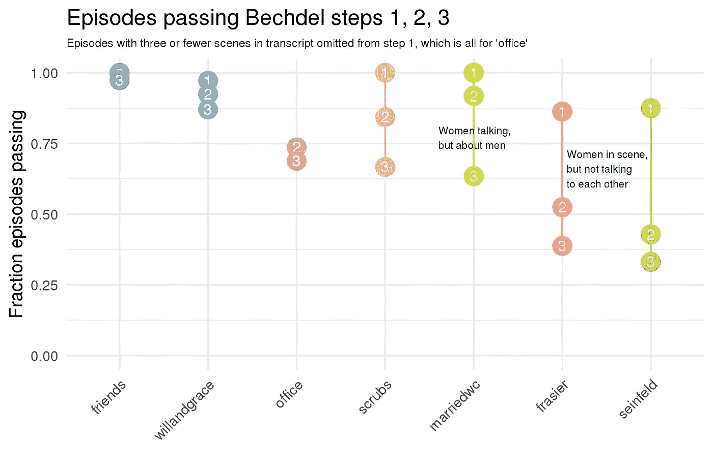
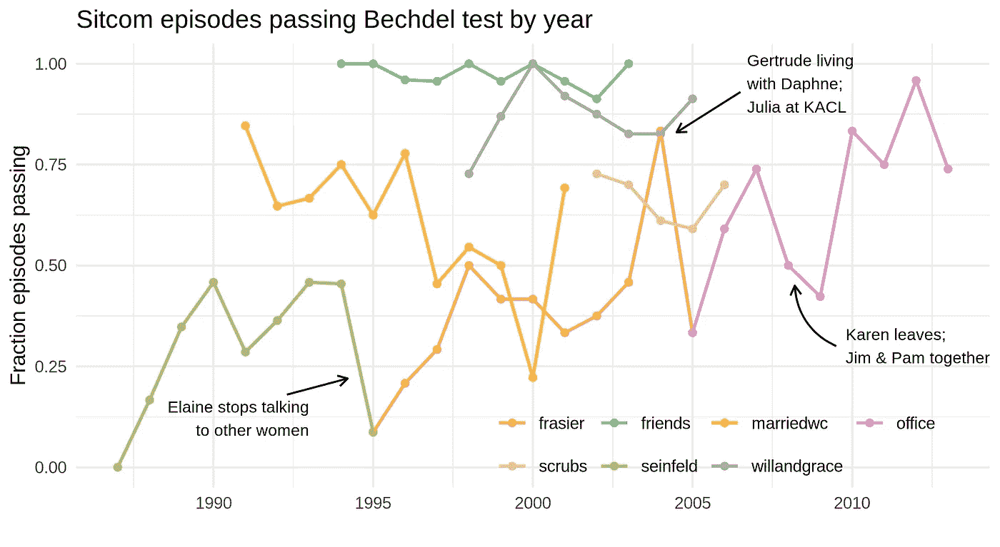
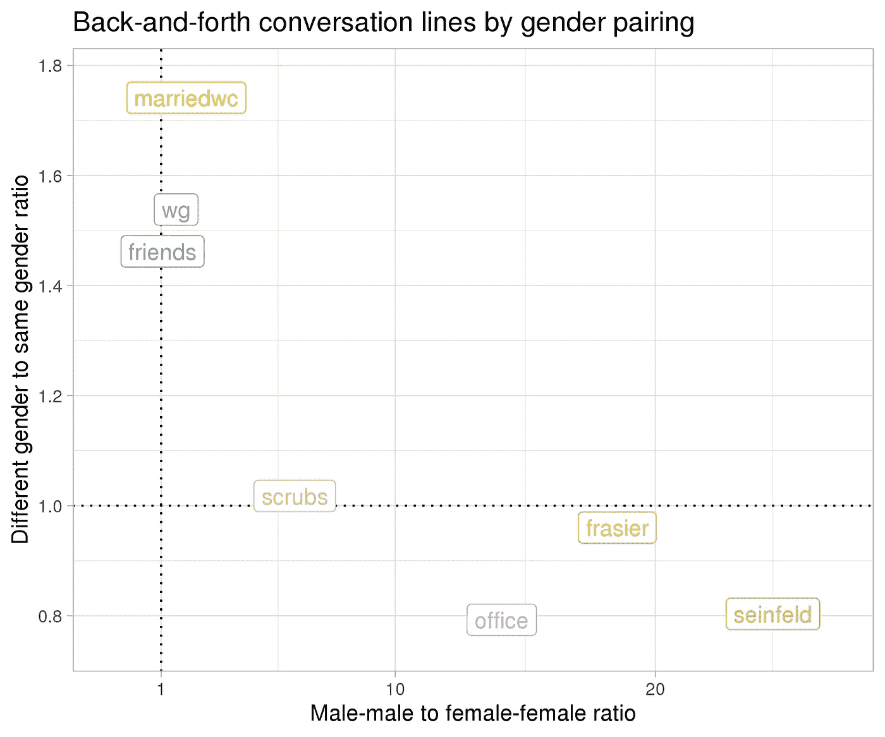
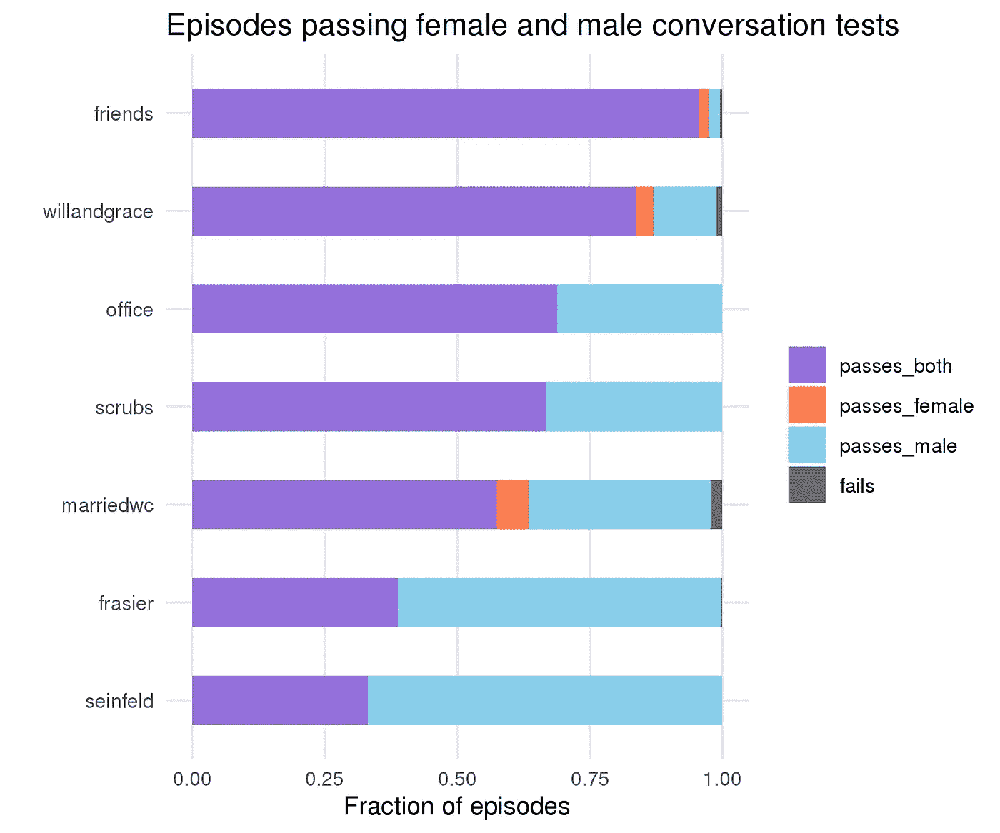

# 在 Bechdel 测试中给情景喜剧打分

> 原文：<https://towardsdatascience.com/scoring-sitcoms-on-the-bechdel-test-41659d90d045?source=collection_archive---------29----------------------->

## 性别不平等躲不过 NLP

贝克德尔测试(BT)，检查媒体中女性中心主义的基本水平，在其他地方已经被电影和[的众包手动方法](http://www.bechdeltest.com)彻底覆盖[，但据我所知，除了在非常选定的情况下](https://fivethirtyeight.com/features/the-dollar-and-cents-case-against-hollywoods-exclusion-of-women/)或[的高水平](https://www.marieclaire.com/culture/news/a29305/game-of-thrones-sexism-bechdel-test/)[之外](https://www.entitymag.com/the-bechdel-test-television-shows-pass/)。在获得了数百集情景喜剧的脚本后，我可以有计划地对这些情景喜剧的每一集进行测试，来比较这些节目，并跟踪它们运行过程中的变化。

我使用的数据和之前的文章中介绍的一样:过去 30 年中七部主要情景喜剧的大部分剧集的脚本。计算每一个场景和每一集的 BT 所需的信息可以从这些抄本中获得，只需要再做一点工作。你可以在这里看到这篇文章和前一篇文章[的大部分代码。](https://github.com/viva-ronaldo/sitcoms-nlp-posts)

该测试由三个部分组成:

1.  场景中必须有两个女性角色。这很简单，因为抄本通常包含场景指示符。在某些情况下，我的处理不能挑选场景中断，或者抄本不包含任何；这些情节每个都被视为一个长场景，这使得通过第一步变得更容易，但与正确检测场景相比，通过其他步骤只是稍微容易一些。为了识别女性字符，我从数据集中所有说话字符的列表中手动选择姓名，包括主要字符和次要字符，但不包括像“女服务员”这样的未命名字符。
2.  女性角色必须互相交谈。这可能是指一对一的谈话，但在情景喜剧中，一个场景中往往会出现一大群角色。为了通过这一步，我寻找了一个三行序列， **A-B-A** ，显示了两个女性角色之间可以构成对话的最少来回次数。
3.  角色们必须谈论除了男性角色以外的事情。如果前后三行中的任何一行提到任何主要男性角色的名字，男性代词如“他”或“他的”，或者其他男性标识符的短列表中的任何一个，如“男人”、“男朋友”、“爸爸”或“先生”，则这一步失败。这种方法可能无法捕捉到一些情况，其中谈话的主题，广义地说，是一个男性角色，但出现了一个三行序列，没有提到他的名字或代词；但是如果一个男性出现在场景中的任何地方，就抛弃整个场景似乎太苛刻了，因为场景经常会涉及不同角色群体之间的多次对话。

每一步都按场景计算，并汇总到情节级别。我们可以通过测试步骤来查看每个节目的结果。(没有正确检测到场景中断的剧集被排除在步骤 1 的计算之外；这适用于所有的办公室插曲，所以没有第一步的要点。)

《老友记》在 BT 上表现最好，几乎每一集都通过了全面测试。威尔和格蕾丝也得分很高，通过格蕾丝-凯伦和在较小程度上凯伦-罗萨里奥的对话。已婚并有孩子的人(佩吉-马西和佩吉-凯利)和实习医生(主要是埃利奥特-卡拉)在第二步和第三步之间，这意味着他们经常有女性角色相互交谈，但在许多情况下，这只是关于男性角色。

《宋飞正传》的主要演员中只有一个女性角色，所以在这次测试中肯定会表现不佳；然而，几乎 90%的剧集都通过了第一步。这通常发生在伊莱恩与场景中的一个次要女性角色短暂重叠的时候。它的通过率在第二步和第三步急剧下降。弗雷泽的表现同样糟糕；虽然它的主要演员中有两个女性角色，罗兹和达芙妮的互动相对较少(这一对的对话只有 14%通过了 BT)。

将结果按节目和季节分类，并对照播出年份，有一些上升趋势的迹象。办公室在运行期间提高了通过率，宋飞和弗雷泽也是如此，但最后几季除外。结了婚有了孩子就往另一个方向走了。由于通过测试的一集通常只由一对说话者完成，结果对每一季的情节弧线很敏感，这些弧线会影响谁出现在场景中以及女性常客与谁相处的时间更长，如图中更易识别的情况所示。

接下来的情节进一步探索了男女角色在每一集里是如何互动的。它使用上面确定的相同行作为两个字符之间来回的一部分，并根据所涉及的一对字符的性别对这些行求和:女性-女性、男性-男性或男性-女性。

《老友记》、《威尔与格蕾丝》和《已婚有儿》中，不同性别角色之间的对话多于同性。这是每个性别可参与故事情节的主要人物数量的函数:在威尔和格蕾丝的极端情况下，如果人物被分成两对，唯一允许同性对话的组合是威尔-杰克和格蕾丝-凯伦，而其他两个可能的配对涉及不同性别的对话。不同性别的角色之间有很多台词会增加通过 BT 的难度；从这个角度来说，最好把男性角色集中在一个故事情节/场景中，女性角色集中在另一个故事情节/场景中。

《宋飞正传》、《弗雷泽》和《办公室》中的男性主角比女性主角多，所以不可避免地男性对话比女性对话多得多。然而，这并不是说这些节目充满了没有女性参与的男性与男性的对话:从 y 轴上没有低于 0.8 的节目这一事实可以看出，这些节目中男性与女性的对话和男性与男性的对话一样多，或者几乎一样多。

最后，虽然我们可以猜测结果会是什么，但我计算了测试的男性对等物:两个男性角色必须谈论女性角色以外的事情。这个测试通过的频率要高得多:几乎每部剧的每一集都通过(蓝色加紫色，如下):

然而,《老友记》、《威尔和格蕾丝》、《已婚并育有子女》确实展示了一些通过 BT 但*没有*男性版(橙色)的剧集。也有少数剧集没有通过任何一项测试(灰色)。如上所述，当故事情节将不同性别的角色配对在一起时，这种情况就会发生。除了《老友记》、《威尔与格蕾丝》和《已婚并育有子女》,其他剧集的男性角色数量不平衡，因此不太可能没有男性-男性故事情节。