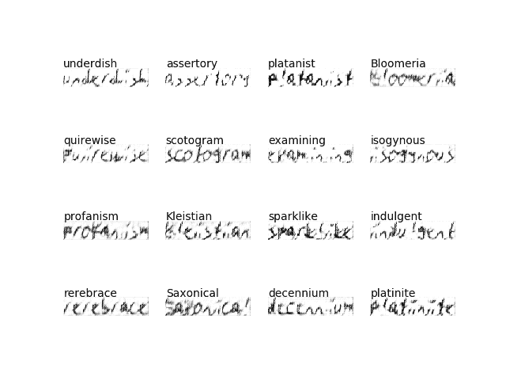
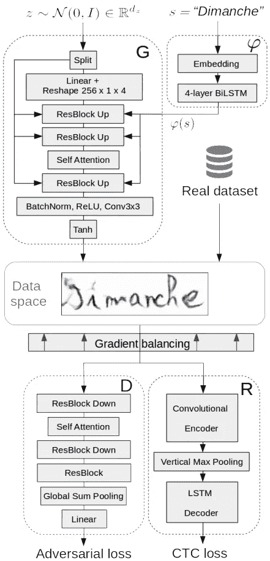
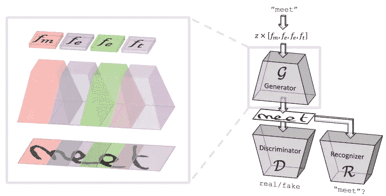
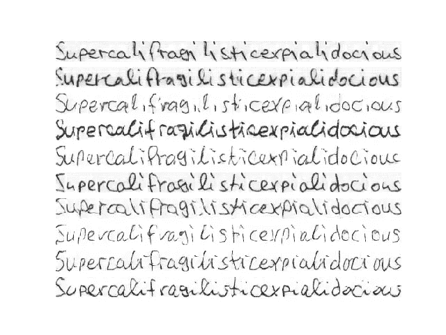
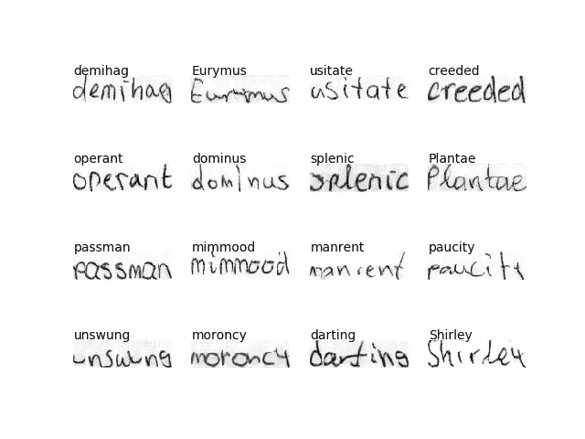
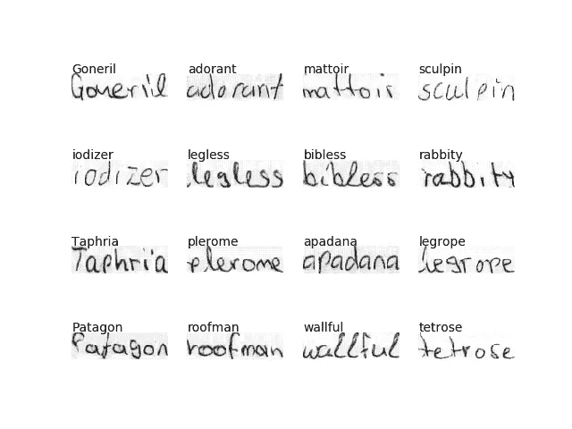
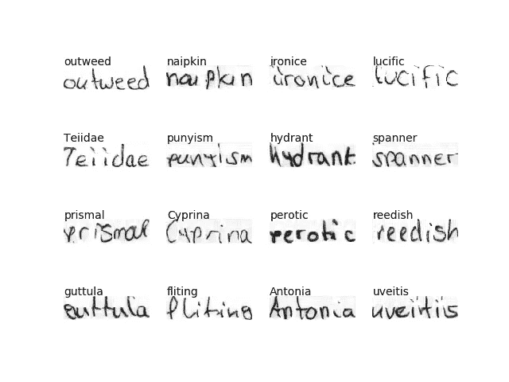

# ScrabbleGAN——对手写文本图像的生成

> 原文：<https://towardsdatascience.com/scrabblegan-adversarial-generation-of-handwritten-text-images-628f8edcfeed?source=collection_archive---------20----------------------->

## 文本生成教程(TensorFlow 2)


照片由[莫里茨·施米特](https://unsplash.com/@moroo)在 [Unsplash](https://unsplash.com/photos/UsTERdf7yEY) 上拍摄

# **1。动机**

本文介绍了一个用于对手写文本图像生成的[开源项目](https://github.com/Nikolai10/scrabble-gan)，它建立在【1，2】中提出的思想之上，并利用了生成对手网络(GANs【3】)的力量。尽管 GANs(特别是 cgan[4]和变体)在研究社区中受到了很多关注，但到目前为止，很少有人关注基于序列的图像生成(不要与文本到图像学习任务(如[5]或[6])相混淆)。此外，最近的工作([1，2])没有共享它们的源代码/评估代码，这使得清晰的比较变得困难，因为并不总是清楚哪个组件导致了改进。在这项工作中，模型/软件在 [IAM 手写数据库](http://www.fki.inf.unibe.ch/databases/iam-handwriting-database)上进行评估，并提供给社区进行进一步实验。



ScrabbleGAN:第 1 和第 15 纪元之间的训练进度(IAM 手写数据库)

***注:*** *本文不是为了解释最先进的机器学习算法，而是为了突出这个项目中所做的设计决策。技术细节在*[*GitHub repo*](https://github.com/Nikolai10/scrabble-gan)*中有很好的记录，可以在各自的参考文献中找到。*

# 2.背景/相关性

在许多机构(如医疗保健或金融机构)中，手写仍然是数据收集的主要方法。虽然光学字符识别(OCR)现在通常被认为已经解决了，但是(离线)手写识别(HWR)仍然具有挑战性，因此使自动数据处理变得复杂。与印刷文本相比，手写在风格上有很大不同(众所周知，手写就像指纹一样独一无二，不会弄错)，因此需要大规模的训练数据。因此，由于 GANs 的流行和成功，越来越多的工作集中在扩展现有数据集上。在接下来的部分中，介绍了两篇最近的论文(本文非常依赖于它们)。

在[1]中，作者训练了一个辅助分类器 GAN (AC-GAN [7])，以便扩展两个基准数据集(法语、阿拉伯语)。这里的主要思想是将每个单词嵌入到一个 128 维的特征向量中(类似于[5])，然后将该向量馈入 BigGAN [8]网络架构。为了控制生成的图像的文本内容，训练 CRNN [9]作为辅助分类器。源自 R 和 D 的梯度被平衡(考虑到它们不同的幅度),并最终反向传播到 G:



[来源](https://arxiv.org/pdf/1903.00277.pdf)

尽管他们的工作显示出有希望的结果，但是仍然存在一些限制，这些限制在[2]中进行了阐述:

*   **生成任意长度的 word 图像:**
    在[1]中，所有图像都被(白色)填充到相等的大小，同时保持原始的纵横比——超过给定阈值(128×512)的图像被移除。因此，在所有的单词长度上，只能生成相同大小的单词图像。在[2]中，G、D 和 R 都遵循完全卷积范式，这潜在地允许生成完整的句子。
*   **解开生成过程/嵌入:** 不是像[1]中那样从整个单词表示中生成图像，而是单独生成每个字符(因此 *Scrabble* )，使用 CNN 的重叠感受域属性来考虑附近字母的影响。这主要是因为手写是一个局部过程，每个字母只受其前一个和后一个字母的影响。因此，G (D)可以被视为相同的类条件生成器(真实/虚假分类器)的串联:



[来源](https://arxiv.org/pdf/2003.10557.pdf)

*   **去除 R 中的循环头** 作者[2]发现，更好的 R 不一定带来更好的整体(代)性能。这是因为 CRNN 网络中的 RNN 层学习隐含的语言模型，从而能够识别正确的字符，即使它没有被清楚地书写。因此，为了迫使 R 仅基于视觉特征做出决策，移除了递归头部。

# 3.方法学

在这项工作中，使用了[功能 API](https://www.tensorflow.org/guide/keras/functional) 和[定制训练循环](https://www.tensorflow.org/tutorials/customization/custom_training)。大致结构基于 TensorFlow 教程关于[深度卷积生成对抗网络](https://www.tensorflow.org/tutorials/generative/dcgan)；下一节重点介绍了主要区别。

## 加载并准备数据集

首先，IAM 手写(单词)数据库被转换成以下格式:

```
*res/data/iamDB/words-Reading/
    ├── Bucket 1
        ├── img_i.png
        ├── img_i.txt
        ├── ...
    ├── Bucket 2
        ├── ...
    ├── Bucket n*
```

其中*桶 x* 保存转录长度为 *x* 的所有样本，并且 *img_i.txt* 包含 *img_i.png.* 的基本事实注释(转录)

为了减少噪声，在本工作中只考虑正确分割的单词([a-zA-Z])([表示为“ok”](http://www.fki.inf.unibe.ch/DBs/iamDB/data/ascii/words.txt))。此外，大小为> *的字 bucket_size (* 此处为 10 *)* 被忽略，以断言 len(bucket)>>batch _ size。总之，这种预处理策略产生了 80.377 个独特的训练样本。

所有图像都被重新整形，以匹配[2]: (32，16)提出的每个字符的纵横比。例如，转录长度为 10 的单词具有形状(32，160) px。

最后，与 [DCGAN-Tutorial](https://www.tensorflow.org/tutorials/generative/dcgan) 类似，图像被规范化为[-1，1]，标签通过 char_vector(此处为:“abc…zA…Z”)进行编码:例如，“auto”变成[0，20，19，14]。

在每个训练步骤，一批随机单词沿着其编码的转录(相同随机桶的)被产生给相应的模型。

## 创建模型

从根本上说，ScrabbleGAN 是著名的 BigGAN 和 CRNN 架构的混合体。尽管有一些 BigGAN 的开源实现(例如 [BigGAN-Pytorch](https://github.com/ajbrock/BigGAN-PyTorch) ， [resnet_biggan](https://github.com/google/compare_gan/blob/master/compare_gan/architectures/resnet_biggan.py) )，但据我所知，目前还没有“官方”的 TF2 实现。因此，我决定自己在 Tf2 中重写一个简化版的 [google/compare_gan](https://github.com/google/compare_gan) 。与原始作品相似，代码可通过 [Gin](https://github.com/google/gin-config) 进行配置:

```
...
setup_optimizer.r_lr = 2E-4
setup_optimizer.beta_1 = 0.0
setup_optimizer.beta_2 = 0.999
setup_optimizer.loss_fn = @hinge
setup_optimizer.disc_iters=1
...
shared_specs.kernel_reg = @spectral_norm
...
shared_specs.g_bw_attention = 'B3'              
shared_specs.d_bw_attention = 'B1'
...
shared_specs.embed_y = (32, 8192)
```

CRNN-模型基于 [CRNN-Tf2](https://github.com/Nikolai10/crnn-tf2) 。所有模型都是利用第 2 节所述的完全卷积范例实现的，以允许灵活的输入和输出形状。最终的“ScrabbleGAN”模型是通过将这些模型堆叠在一起而获得的(复合模型)。

为了简洁起见，感兴趣的读者可以参考 [GitHub repo](https://github.com/Nikolai10/scrabble-gan) 了解更多信息。

## 定义损失和优化器

在这项工作中，基于[compare _ gan/gans/loss _ lib . py](https://github.com/google/compare_gan/blob/master/compare_gan/gans/loss_lib.py)，考虑了“非饱和”和“铰链”损耗。对于 CRNN 部分，照常使用 [CTC 损耗](https://www.tensorflow.org/api_docs/python/tf/keras/backend/ctc_batch_cost)。

## 定义训练循环

训练循环从生成器接收一组随机种子和来自随机单词列表(这里: [macOS 单词列表](https://superuser.com/questions/136236/where-on-disk-does-the-macos-system-wide-dictionary-store-the-list-of-words-i-ad))的转录作为输入开始，以产生一组假图像。D(实数)和 R(实数)是分开计算的，而 D(虚数)和 R(虚数)现在是通过复合模型计算的。然后为这些模型中的每一个计算损失，并且梯度被用于更新鉴别器、识别器和复合模型。例如，后者更新如下:

```
recognizer.trainable = **False** discriminator.trainable = **False** gradients_of_generator = gen_tape.gradient(g_loss_balanced, composite_gan.trainable_variables)
generator_optimizer.apply_gradients(zip(gradients_of_generator, composite_gan.trainable_variables))
```

> 注意:在这项工作中，没有梯度平衡导致最好的结果(更多信息可以在各自的参考文献[1，2]中找到)。)

与[1，2]类似，R 只在真实图像上训练，以防止它学习如何识别生成的(和潜在的虚假)图像。

# 4.结果

所有实验(不同的模型配置)都是使用[AWS p 3.2x 大型实例](https://aws.amazon.com/de/ec2/instance-types/p3/)进行的；每个模型被训练 15 个时期。以下是一些直观的结果:



与[2]的比较:来自电影《欢乐满人间》的单词“supercalifragilisticepialidocious”(34 个字母)



更多的例子



更多例子 II



更多例子 III

## 参考

1.  E.Alonso，B. Moysset，R. Messina，[基于序列的手写文本图像对抗生成](https://arxiv.org/pdf/1903.00277.pdf) (2019)，arXiv:1903.00277
2.  南 Fogel，H. Averbuch-Elor，S. Cohen，S. Mazor，R. Litman， [ScrabbleGAN:半监督变长手写文本生成](https://arxiv.org/pdf/2003.10557.pdf) (2020)，arXiv:2003.10557
3.  I. J. Goodfellow，J. Pouget-Abadie，M. Mirza，B. Xu，D. Warde-Farley，S. Ozair，a .，Y. Bengio，[生成性对抗性网络](https://arxiv.org/abs/1406.2661) (2014)，arXiv:1406.2661
4.  米（meter 的缩写））米尔扎，s .奥辛德罗，[条件生成对抗网](https://arxiv.org/abs/1411.1784) (2014)，arXiv:1411.1784
5.  南 Reed，Z. Akata，X. Yan，L. Logeswaran，B. Schiele，H. Lee，[生成性对抗性文本到图像合成](https://arxiv.org/pdf/1605.05396.pdf) (2016)，arXiv:1605.05396
6.  T.乔，张，徐，陶， [MirrorGAN:通过重新描述学习文本到图像的生成](https://arxiv.org/abs/1903.05854) (2019)，arXiv:1903.05854
7.  A.Odena，C. Olah，J. Shlens，[使用辅助分类器的条件图像合成 GANs](https://arxiv.org/pdf/1610.09585.pdf) (2016)，arXiv:1610.09585
8.  A.Brock，J. Donahue，K. Simonyan，[用于高保真自然图像合成的大规模 GAN 训练](https://arxiv.org/abs/1809.11096) (2018)，arXiv:1809.11096
9.  B.石，x .白，c .姚，[基于图像序列识别的端到端可训练神经网络及其在场景文本识别中的应用](https://arxiv.org/pdf/1507.05717.pdf) (2015)，arXiv:1507.05717