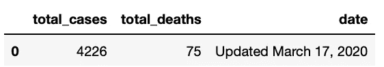
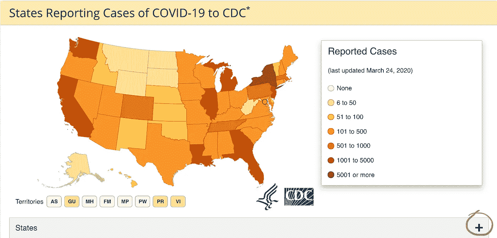
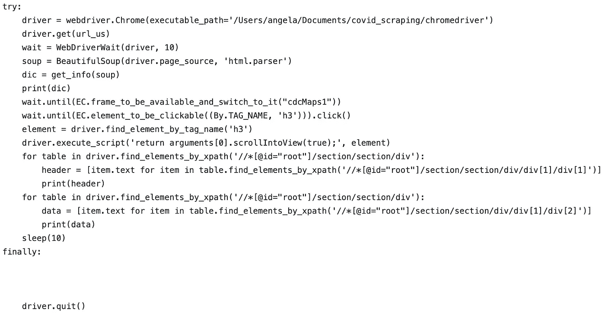
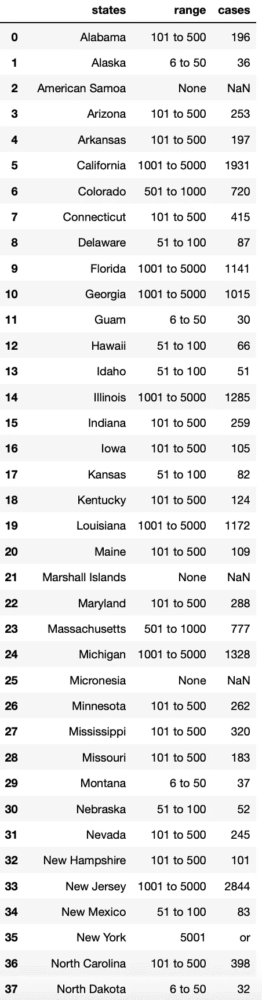
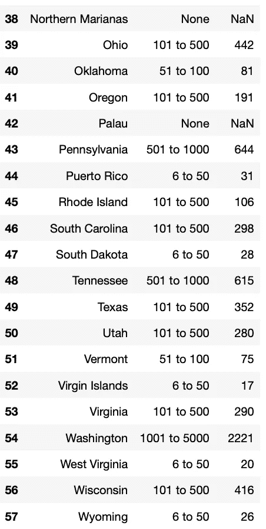

# 刮疾控中心为新冠肺炎病例

> 原文：<https://towardsdatascience.com/scrape-cdc-for-covid-19-cases-a162924073ad?source=collection_archive---------33----------------------->

## 如何为已确认的新冠肺炎病例抓取 javascript 生成的表格


鉴于最近发生的事件，我认为获取美国各州确诊病例的数据是个好主意。虽然，CDC 网站因为没有及时更新和落后于实际传播和病例而受到了一定的批评，但由于它是确诊病例的唯一官方来源，它仍然是每天收集数据的一个很好的来源。

我们需要几个库:常见的请求、漂亮的 soup 和 selenium，因为 CDC 网站上的表格是 javascript 生成的。此外，除了 selenium 之外，我们还需要一个驱动程序，我更喜欢 chrome，因为使用 Chrome 更容易检查网站。你可以在这里下载 chromedriver [，确保下载与你的 chrome 浏览器兼容的版本。也正则表达式来清理数据和熊猫创建一个数据帧，并保存为 csv。](https://chromedriver.chromium.org/downloads)

```
import re
import pandas as pd
import requests
from selenium import webdriver
from bs4 import BeautifulSoup
from selenium.webdriver.support.ui import WebDriverWait
from selenium.webdriver.support import expected_conditions as EC
from selenium.webdriver.common.by import By
```

让我们从用 chrome 驱动程序的显式路径声明 url 和驱动程序变量开始。美丽的汤将解析通过驱动程序的 page_source 和 get_info 函数将返回一个字典与总美国案件和更新日期。

```
url = '[https://www.cdc.gov/coronavirus/2019-ncov/cases-in-us.html'](https://www.cdc.gov/coronavirus/2019-ncov/cases-in-us.html')driver = webdriver.Chrome(executable_path='/path/to/chromedriver')
    driver.get(url)
wait = WebDriverWait(driver, 10)
soup = BeautifulSoup(driver.page_source, 'html.parser')
dic = get_info(soup)
print(dic)
```

下面是获取这些数据的函数:

```
def get_info(info):
    date = info.find('span', class_="text-red").text
    summary = info.find('div', class_ = "2019coronavirus-summary").find_all('li')
    for i in summary:
        dic = {
            'total': summary[0].text,
            'deaths': summary[1].text,
            'jurisdictions': summary[2].text
        }
    dic['date'] = date
    return dic
```

请记住，例如，如果类名发生变化，函数可能需要更改。该函数的输出:

```
{'total': 'Total cases: 44,183',
 'deaths': 'Total deaths: 544',
 'jurisdictions': 'Jurisdictions reporting cases: 54 (50 states, District of Columbia, Puerto Rico, Guam, and US Virgin Islands)',
 'date': 'Updated March 24, 2020'}
```

我在 3 月 17 日第一次运行刮刀，我们来比较一下:



美国新冠肺炎病例总数

天哪，这些数字太可怕了，仅在 7 天内，冠状病毒病例数上升了 10 倍，死亡人数上升了 8 倍。认为这些数字可能落后于确诊病例的实际数量，并且有大量患有冠状病毒症状的人由于处于低风险群体而无法进行测试。但是我跑题了，所以为了得到美国各州的病例数，我们需要点击一个按钮来展开表格，用绿色圈起来的那个:



由于这是一个 iframe 对象，我们需要切换到 frame，等待数据变得可见，然后我们需要向下滚动页面，以便我们可以收集我们正在寻找的数据:

```
wait.until(EC.frame_to_be_available_and_switch_to_it("cdcMaps1"))
wait.until(EC.element_to_be_clickable((By.TAG_NAME, 'h3'))).click()
element = driver.find_element_by_tag_name('h3')
driver.execute_script('return arguments[0].scrollIntoView(true);', element)
for table in driver.find_elements_by_xpath('//[[@id](http://twitter.com/id)="root"]/section/section/div'):
        header = [item.text for item in table.find_elements_by_xpath('//[[@id](http://twitter.com/id)="root"]/section/section/div/div[1]/div[1]')]
        print(header)
for table in driver.find_elements_by_xpath('//[[@id](http://twitter.com/id)="root"]/section/section/div'):
        data = [item.text for item in table.find_elements_by_xpath('//[[@id](http://twitter.com/id)="root"]/section/section/div/div[1]/div[2]')]
        print(data)
```

在上面的代码片段中，在驱动程序向下滚动查看表格后，它通过 xpath 收集表格标题和数据抓取。Xpaths 不容易改变，这允许构建更健壮的 scraper 脚本，selenium 允许我们这样做。不要忘记退出 webdriver，即使你的代码引发了异常，这里是完整的代码:



该查询的结果将是一个需要清理并保存到 csv 中的列表。3 月 24 日的数字是:



2019 年 3 月 24 日州级新冠肺炎案件



2019 年 3 月 24 日州级新冠肺炎案例(续)

谢谢你的时间和阅读我的帖子。一如既往，我们随时欢迎您的反馈和建议。