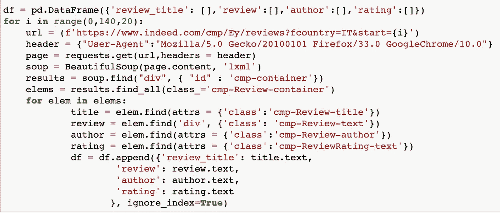
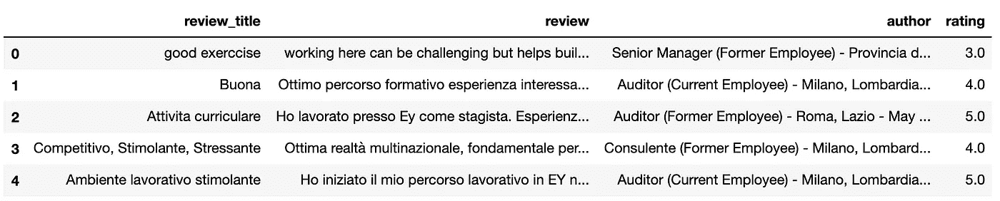
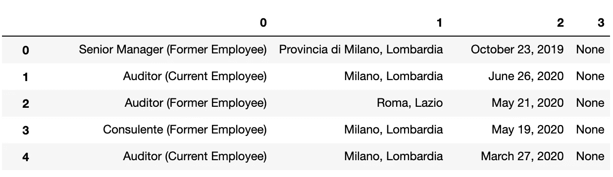
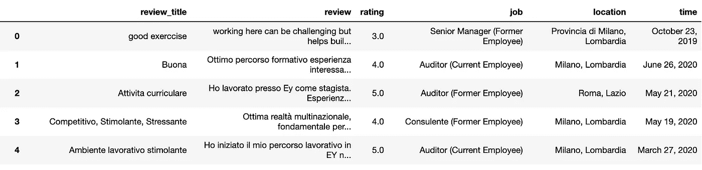

# 在 2 分钟内从 Indeed 上刮下公司评论和评级

> 原文：<https://towardsdatascience.com/scrape-company-reviews-ratings-from-indeed-in-2-minutes-59205222d3ae?source=collection_archive---------23----------------------->

## 网络抓取，数据科学

## 网上搜集员工在线评论


来源:来自 [pixabay](https://pixabay.com/vectors/data-black-green-wallpaper-2453751/) 的 ranjithsiji

在本教程中，我将向你展示如何使用 [Anaconda](https://www.anaconda.com/) Jupyter 笔记本和 [BeautifulSoup](https://www.crummy.com/software/BeautifulSoup/) 库来执行网络抓取。

我们将从 Indeed platform 收集公司评论和评级，然后将它们导出到 [Pandas](http://pandas.pydata.org/) library dataframe，再导出到一个. CSV 文件。

让我们直接进入正题，然而，如果你正在寻找一个理解网络抓取的指南，我建议你阅读来自 [Dataquest](https://www.dataquest.io/blog/web-scraping-tutorial-python/) 的这篇文章。

让我们从导入我们的 3 个库开始

```
from bs4 import BeautifulSoup
import pandas as pd
import requests
```

然后，让我们去 indeed 网站查看我们想要的信息，我们将针对安永公司的页面，你可以从以下链接查看

```
[https://www.indeed.com/cmp/Ey/reviews?fcountry=IT](https://www.indeed.com/cmp/Ey/reviews?fcountry=IT)
```

根据我的位置，国家是意大利，但你可以选择和控制，如果你想。

在下一张图中，我们可以看到我们可以处理和收集的多种信息:

1-评论标题

2-审查机构

三级

4-审核者的角色

5-审查者的位置

6-审查日期

然而，你可以注意到第 4，5 和 6 点都在一条线上，将被刮到一起，这可能会给一些人造成一点混乱，但我的建议是先刮，然后再解决问题。所以，让我们试着这样做。


在知道了我们要刮什么之后，我们需要弄清楚我们需要刮多少，我们是不是只想要 1 条评论？1 页评论还是所有页面评论？我猜答案应该是全页！！

如果您向下滚动页面，转到第 2 页，您会发现该页的链接如下所示:

```
[https://www.indeed.com/cmp/Ey/reviews?fcountry=IT&start=](https://www.indeed.com/cmp/Ey/reviews?fcountry=IT&start=40)20
```

然后试着进入第 3 页，你会发现链接变成了如下:

```
[https://www.indeed.com/cmp/Ey/reviews?fcountry=IT&start=4](https://www.indeed.com/cmp/Ey/reviews?fcountry=IT&start=40)
```

看起来我们这里有一个模式，第 2 页=20，第 3 页= 40，然后第 4 页= 60，对吗？一直到第 8 页= 140

让我们回到编码，从定义你想要的数据帧开始。

```
df = pd.DataFrame({‘review_title’: [],’review’:[],’author’:[],’rating’:[]})
```

在下一段代码中，我将创建一个 for 循环，从 0 开始，跳到 20，在 140 停止。

1-在 for 循环中，我们将向 web 服务器发出一个`GET`请求，它将为我们下载给定网页的 HTML 内容。

2-然后，我们将使用 BeautifulSoup 库来解析这个页面，并从中提取文本。我们首先必须创建一个`BeautifulSoup`类的实例来解析我们的文档

3-然后通过检查 html，我们从网页中选择类，在抓取时使用类来指定我们想要抓取的特定元素。

4-然后我们可以通过将结果添加到之前创建的数据框架中来结束。

***“我加了一张图下来说明代码应该是怎样的，以防你复制的时候加错了一些空格”***

```
for i in range(10,140,20):
     url = (f’[https://www.indeed.com/cmp/Ey/reviews?fcountry=IT&start={i}'](https://www.indeed.com/cmp/Ey/reviews?fcountry=IT&start={i}'))
     header = {“User-Agent”:”Mozilla/5.0 Gecko/20100101 Firefox/33.0 GoogleChrome/10.0"}
     page = requests.get(url,headers = header)
     soup = BeautifulSoup(page.content, ‘lxml’)
     results = soup.find(“div”, { “id” : ‘cmp-container’})
     elems = results.find_all(class_=’cmp-Review-container’)
     for elem in elems:
         title = elem.find(attrs = {‘class’:’cmp-Review-title’})
         review = elem.find(‘div’, {‘class’: ‘cmp-Review-text’})
         author = elem.find(attrs = {‘class’:’cmp-Review-author’})
         rating = elem.find(attrs = {‘class’:’cmp-ReviewRating-text’})
         df = df.append({‘review_title’: title.text,
          ‘review’: review.text,
        ‘author’: author.text,
          ‘rating’: rating.text
            }, ignore_index=True)
```



完成了。让我们检查一下数据框

```
df.head()
```



现在，一旦刮，让我们试着解决我们的问题。

请注意，作者可能有 3 个不同的信息，用(-)分隔

所以，让我们把它们分开

```
author = df[‘author’].str.split(‘-’, expand=True)
```



现在，让我们重命名这些列并删除最后一列。

```
author = author.rename(columns={0: “job”, 1: “location”,2:’time’})del author[3]
```

然后，让我们将这些新列连接到原始数据框架，并删除旧的 author 列

```
df1 = pd.concat([df,author],axis=1)
del df1[‘author’]
```

让我们检查一下新的数据框架

```
df1.head()
```



让我们重新组织这些列并删除任何重复的内容

```
df1 = df1[[‘job’, ‘review_title’, ‘review’, ‘rating’,’location’,’time’]]
df1 = df1.drop_duplicates()
```

最后，让我们将数据帧保存到 CSV 文件中

```
df1.to_csv(‘EY_indeed.csv’)
```

现在，您应该对如何从 Indeed 中提取数据有了很好的理解。一个很好的下一步，如果你对网络抓取有点熟悉，你可以选择一个网站，自己尝试一些网络抓取。

快乐编码:)