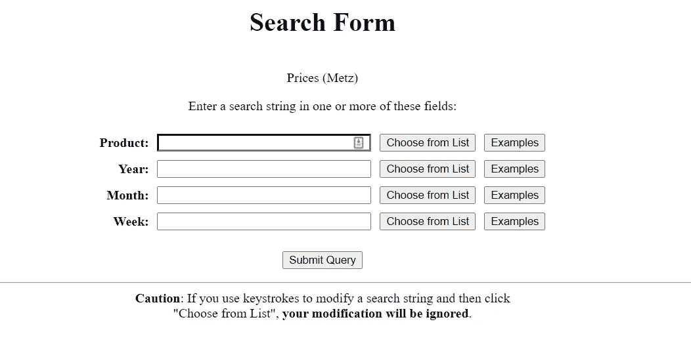
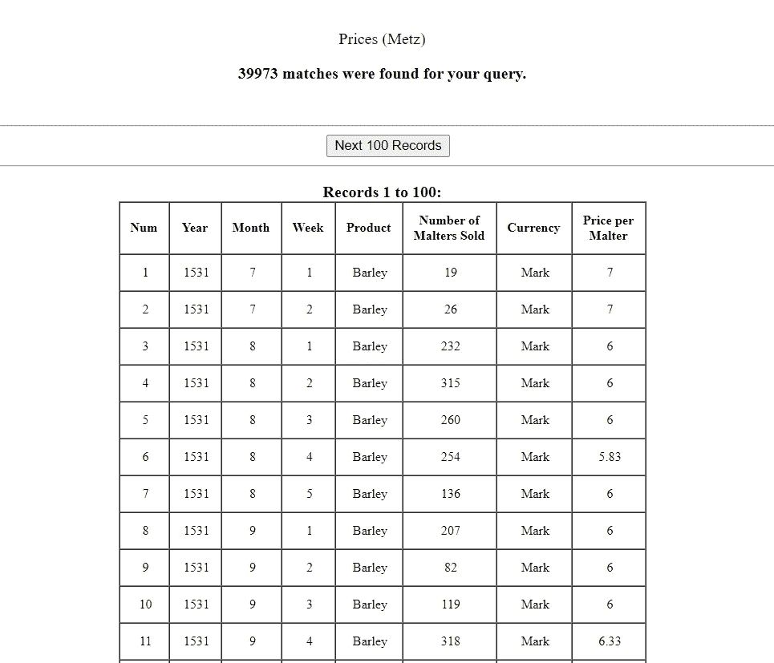
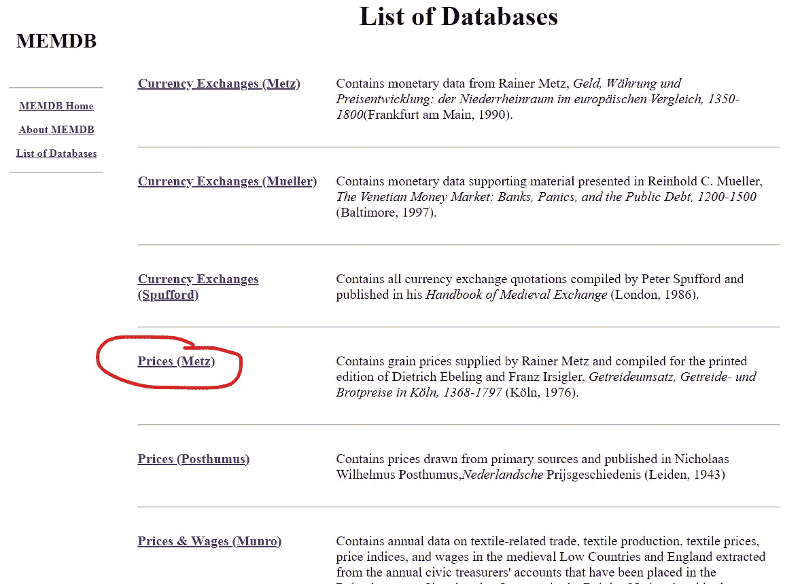
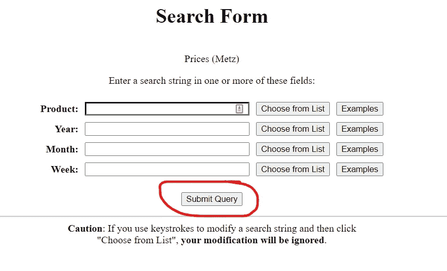
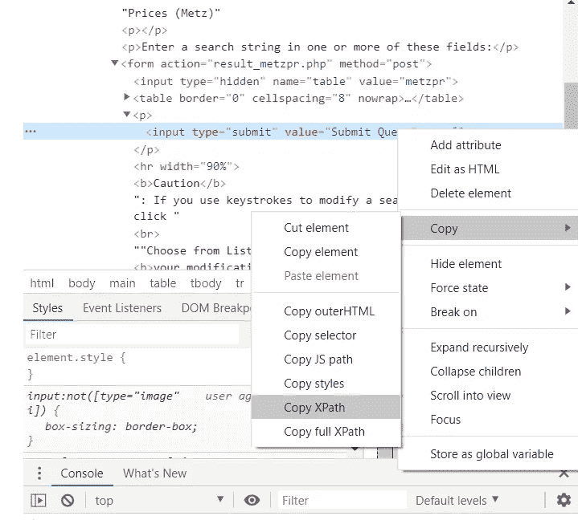
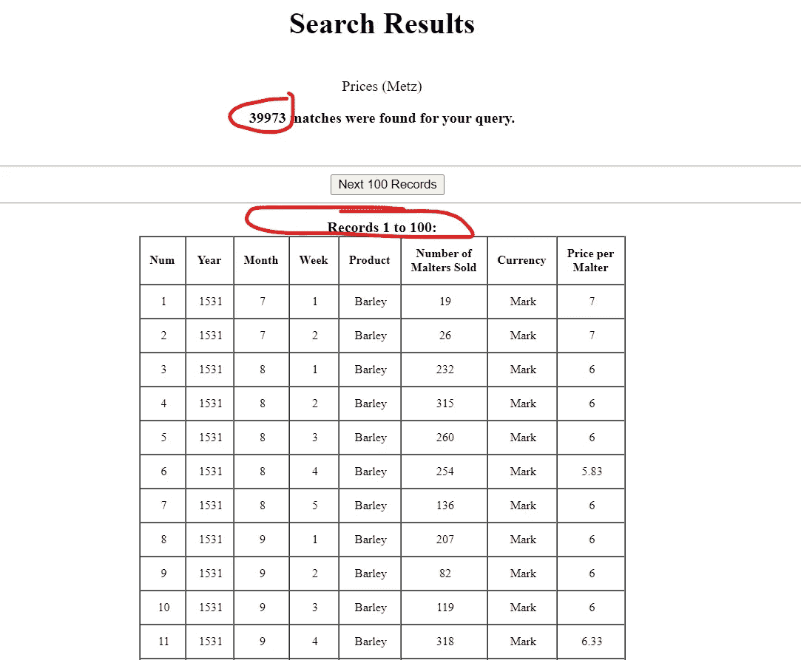
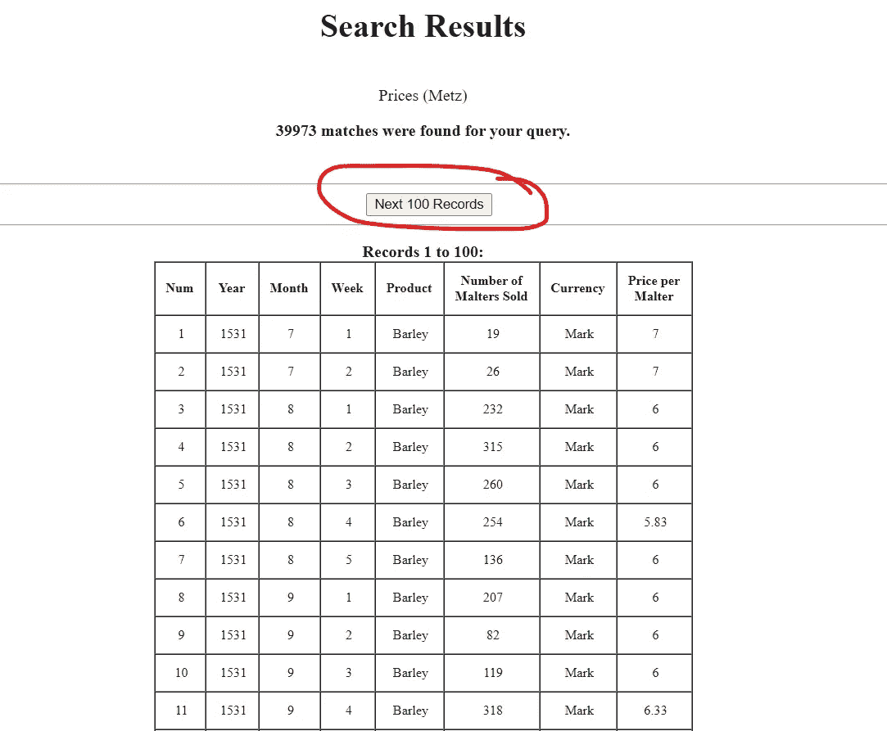
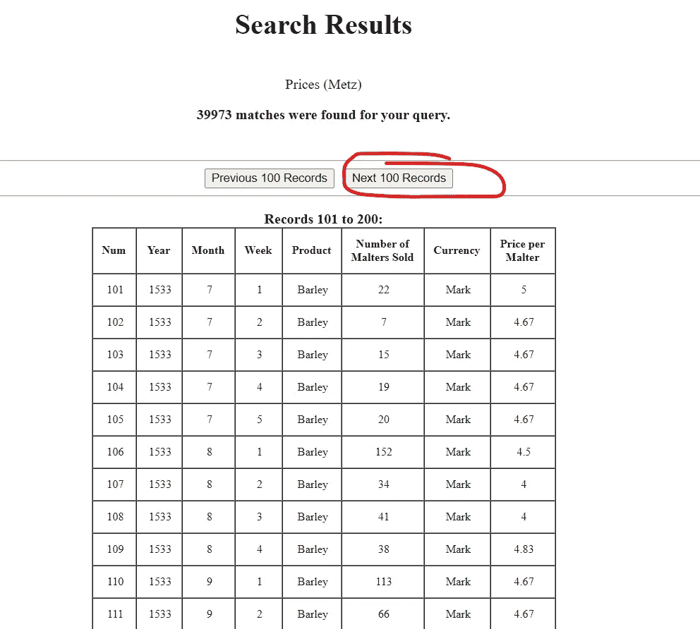
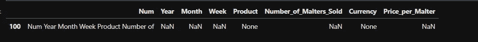

# 从古代网站上搜集中世纪的资料

> 原文：<https://towardsdatascience.com/scrape-medieval-data-from-an-ancient-website-684d9653f34a?source=collection_archive---------70----------------------->

## 使用 Selenium 和 Python 从过时和异常的网站中提取数据


安娜·格鲁在 [Unsplash](https://unsplash.com/s/photos/medieval?utm_source=unsplash&utm_medium=referral&utm_content=creditCopyText) 上的照片

**TLDR；你可以使用 Selenium 和 Python 来清理过时的网站。尽管这个例子看起来很深奥，但是在处理那些很难从他们的平台或奇怪配置的 Sharepoints 导出数据的数据供应商时，可以使用相同的原则。
如果你想访问 Jupyter 笔记本，你可以从我的 [GitHub 账户](https://github.com/Carobert85/Scrape-medieval-data-from-an-ancient-website)下载**

# 介绍

获取数据往往是数据科学的 yada-yada-yada 阶段。数据库通常是 IT 基础架构中最古老的部分，访问它们可能相当具有挑战性。

在某种程度上，每个数据专业人员都必须从古董数据库中提取信息。

罗格斯大学的中世纪和早期现代数据库(MEMDB)就是这样一个数据库。

# 了解网站

这个特殊的网站是在 90 年代中期建立的，当时的假设是合理的。我们的样本数据将是 MEMDB 中的 [Prices (Metz)](http://www2.scc.rutgers.edu/memdb/search_form_metzpr.php) 数据库。

它的接口(如下)充当了一个 web 接口，我假设它是一个 SQL server。



作者照片

搜索框充当我们查询的参数，然而，我更感兴趣的是将所有数据放入 pandas 数据框架中，这样我可以更有效地操作它。

如果我们只单击按钮 submit query，它就相当于 SQL:

```
SELECT * FROM PRICES(METZ)
```

这将我们带到下一个网页:



作者照片

由于 90 年代中期的带宽限制，网站一次只返回 100 行数据。

更重要的是，共享 url 实际上并不调用数据库，你需要点击一个链接才能做到这一点，所以像 Beautiful Soup 这样更有效的网络抓取工具将无法工作。

幸运的是，我们可以使用 Python 的 Selenium 模块来抓取这些数据！

# 零件清单:

*   硒
*   浏览器驱动(我用的是 Chrome 驱动)
*   对 HTML 的基本理解
*   熊猫
*   浏览器检查工具

有关安装说明，您可以访问 [Selenium 文档](https://selenium-python.readthedocs.io/installation.html)。

# 步骤 1:导入模块

```
#webscraper tool
from selenium import webdriver#Technically unneccesary, but I like to time how long some operations take
from datetime import datetime# For cleaning up data
import pandas as pd
```

# 第二步:设置驱动程序并导航到我们想去的网站

这里我们定义了我们试图抓取并打开的网站的根目录

```
# Instantiates the driver
driver = webdriver.Chrome()#I set the root of all the databases as the base for selenium so I #can recycle the code to scrape the other databases
home = '[http://www2.scc.rutgers.edu/memdb/database_list.html'](http://www2.scc.rutgers.edu/memdb/database_list.html')#Tells selenium to go to the base url
driver.get(home)
```

# **第三步:浏览网站**

我们面临的一大挑战是，引导这个网站的 HTML 是古老的。幸运的是，我们需要点击的第一个链接确实有可识别的链接文本，所以我们可以告诉 selenium 找到链接文本。



作者图片

```
#This is the name of the link text in the first link
first_link = 'Prices (Metz)'#This is the command that tells Selenium to click the first link:
driver.find_element_by_link_text(first_link).click()
```

不幸的是，这是我们最后一次看到像标准 HTML 这样的东西

我们现在在数据库交互工具中，需要单击“提交查询”按钮:



作者图片

要点击“提交查询”按钮，我们需要使用 find_element_by_xpath 函数。我们可以通过使用浏览器检查器，使用“元素选择工具”选择按钮，并使用复制 xpath 功能来找到 xpath:



作者图片

## 导航到该表的代码如下:

```
#found by using the copy xpath tool in the browser inspector
second_link = '/html/body/main/table/tbody/tr/td[2]/form/p/input'#clicks the button
driver.find_element_by_xpath(second_link).click()
```

# 步骤 4:设置循环

现在我们实际上在表中。



作者图片

通过查看表的顶部，我们知道两件事，我们知道数据库中有多少行数据(39，973)以及一次将显示多少行(100)。

39，973/100 = 399.73，四舍五入到 400。我们知道我们需要遍历这个表的 400 个版本。

我们还需要一个文件来保存我们的信息。

我们将使用内置的 python 函数 open 来创建一个新的空。txt 文件。

```
# name of our text file
filename = 'Metz_prices_demo.txt'
# creates .txt file
file_object  = open(filename, "w+")
```

我们还需要设置一个计数器，并设置要追加的文本文件。
我还在这里包含了一个时间戳，因为这是我们的 while 循环的开始，我想知道运行它需要多长时间:

```
# Starts our counter for our while loop
counter = 0
# Sets our file to have table data appended to it
export = open(filename, 'a')
# Optional, but I like to time how long certain functions take
start = datetime.now()
```

## while 循环由两部分组成:

*   从页面获取表格数据并将其附加到。txt 文件
*   让我们进入下一页的部分

## 第一部分:

我们根据我们知道必须循环的页数来设置 while 循环。

然后，我们使用代码检查工具来查找表的 xpath，就像我们以前做的一样。

然后，我们将表数据加载到一个变量中，并将该数据写入我们的。txt 文件，并创建一个新行以使以后的数据处理更容易:

```
# While loop that goes through each page and saves the data
while counter < 401:
    # The location of the table on every page
    table_loc = '/html/body/form/main/table/tbody/tr/td[2]/p[3]/table/tbody'
    # The selenium function that gets the data from the table and loads it into a variable
    page_text = driver.find_element_by_xpath(table_loc).text
    # The function that writes the table data into our .txt file
    export.write(page_text + '\n')
```

## 第二部分:

现在页面的数据已经复制到文件中，我们需要移动到下一页；但是有一个问题。移动到下一页有两种 html 格式。

在第一页上，只有一个按钮，因为只有一条路可走。



作者图片

在第二页以及除最后一页之外的所有其他页面上，我们有两个按钮，因为我们可以前进或后退:



作者图片

两种格式的 xpaths 略有不同:

*   /html/body/form/main/table/tbody/tr/TD[2]/center[3]/input
*   /html/body/form/main/table/tbody/tr/TD[2]/center[3]/input[2]

幸运的是，我们可以通过一个 try 块来解决这个问题，该块将尝试单击更常见的按钮配置，如果失败，将恢复到不太常见的配置:

```
try:
        # More common page layout
        button_path = '/html/body/form/main/table/tbody/tr/td[2]/center[3]/input[2]'
        driver.find_element_by_xpath(button_path).click()
    except:
        # Less common page layout
        button_path = '/html/body/form/main/table/tbody/tr/td[2]/center[3]/input'
        driver.find_element_by_xpath(button_path).click()
    # Adds 1 to the counter
    counter += 1
```

## 完整的 while 循环:

```
# Starts our counter for our while loop
counter = 0
# Sets our file to have table data appended to it
export = open(filename, 'a')
# Optional, but I like to time how long certain functions take
start = datetime.now()# While loop that goes through each page and saves the data
while counter < 401:
    # The location of the table on every page
    table_loc = '/html/body/form/main/table/tbody/tr/td[2]/p[3]/table/tbody'
    # The selenium function that gets the data from the table and loads it into a variable
    page_text = driver.find_element_by_xpath(table_loc).text
    # The function that writes the table data into our .txt file
    export.write(page_text + '\n')
    try:
        # More common page layout
        button_path = '/html/body/form/main/table/tbody/tr/td[2]/center[3]/input[2]'
        driver.find_element_by_xpath(button_path).click()
    except:
        # Less common page layout
        button_path = '/html/body/form/main/table/tbody/tr/td[2]/center[3]/input'
        driver.find_element_by_xpath(button_path).click()
    # Adds 1 to the counter
    counter += 1# Timestamps the end of the loop
end = datetime.now()
# Calculates the duration of the loop
duration = end - start#Prints the duration
print(duration)
```

# 步骤 5:将数据加载到 Pandas 中进行清理

现在我们已经将数据加载到一个. txt 文件中，我们可以将它加载到 Pandas 来清理它。

我们有三个主要的数据清理问题需要解决:

1.  每 100 行中有一行带有标题
2.  我们需要正确配置我们的列名
3.  如果我们设置我们的计数器运行太多次，我们将有一些重复的行

幸运的是，建立这个数据库的人知道他们在做什么，并给了我们一个方便的名为“Num”的索引列

## 正在加载。txt 转换成数据帧:

因为标题与数据行的格式略有不同，所以我们应该手动设置列名

```
column_names = ['Num', 'Year', 'Month', 'Week', 'Product', 'Number_of_Malters_Sold', 'Currency', 'Price_per_Malter']
```

然后我们将使用 pd.read_csv()函数，它可以读取许多文本文件格式。通过基本的实验，我发现列分隔符是两个空格，我们需要跳过文件的前 3 行来加载数据。

```
# Opens the .txt, uses the two space delimeter, skips the first 3 #rows, and sets the column names to the list of names above
df = pd.read_csv('Metz_prices_demo.txt', sep = '  ', skiprows = 3, names = column_names, header = None)
```

## 删除无关的列标题:

使用 iloc 函数快速检查一下数据帧，会发现每 100 行就有一个标题

```
#Shows a header row that we need to clean
df.iloc[[100]]
```



幸运的是，数据库工程师知道他在做什么，我们可以通过从数据帧中移除所有在“Num”列中有字母的行来轻松移除这些。

```
# Removes all rows from the dataframe where the contents of the 'Num' column have letters in them
df = df[~df['Num'].str.contains("[a-zA-Z]").fillna(False)]
```

## 删除重复行:

我们的最后一个挑战是删除任何可能进入数据帧的重复行，这通常是由于将 while 限制设置得太高。同样，我们可以使用方便的“Num”列，因为作为数据库的索引，不应该有重复的数字。为了整洁起见，我们还应该重置数据帧的索引

```
# Removes duplicate rows that we might have accidentally grabbed from the data
df.drop_duplicates(subset = ['Num'], keep = 'first', inplace = True)
df.reset_index(inplace = True)
```

# 结论

Selenium 在自动化繁琐的数据获取任务方面有很多价值，尤其是在异常的 web 环境中。

如果你想看到整个 Jupyter 笔记本，或者抓住最后。csv 你可以从我的 [GitHub 账户获得。](https://github.com/Carobert85/Scrape-medieval-data-from-an-ancient-website)

[注册我的月度时事通讯，获得我这个月读过的最好的文章，以及最近的文章。](https://carobert.substack.com/p/coming-soon?r=3s7o7&utm_campaign=post&utm_medium=web&utm_source=copy)

# 关于作者:

Charles Mendelson 是 PitchBook 的营销数据分析师。在过去的五年里，他一直在销售和营销机构工作，并在许多工作面试中取得了成功(但失败的机会更多)。他还获得了哈佛扩展学校的心理学硕士学位。如果你在寻找一个会议或研讨会的演讲者，或者如果你想问任何问题，你可以在 LinkedIn 上联系他:他有时会在那里发表文章。

参考资料:
[1]货币交易所(梅斯)包含 Rainer Metz 的货币数据， *Geld，whrung und Preisentwicklung:der Niederrheinraum im europischen Vergleich，1350-1800*(法兰克福，1990 年)。