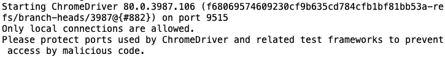
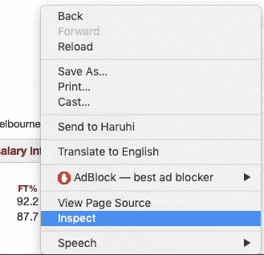
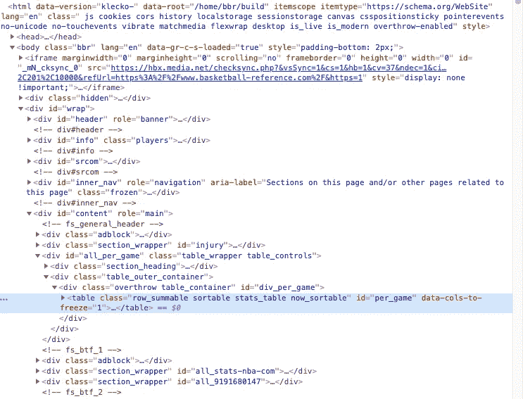
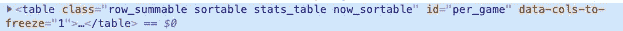

# 用 Python 抓取表格数据

> 原文：<https://towardsdatascience.com/scrape-tabular-data-with-python-b1dd1aeadfad?source=collection_archive---------19----------------------->

## 如何在 Python 中使用 BeautifulSoup，Selenium，Pandas 来抓取 NBA 球员的数据？


马库斯·斯皮斯克在 [Unsplash](https://unsplash.com?utm_source=medium&utm_medium=referral) 上的照片

O 执行机器学习项目的瓶颈之一是数据集组装。

数据集合的方式因数据类型而异，其中从 web 上抓取表格数据集是最典型的来源之一。我已经用了很长时间来高效地获取我需要的尽可能多的数据。

我用 NBA 球员的数据作为原始数据写了一段时间关于机器学习技术的文章。我最常被问到的一个问题是，我是否可以分享这些数据，因为人们喜欢玩这些数据。

亚洲有句老话，

> 给一个人一条鱼，你可以喂他一天；教一个人钓鱼，你就喂了他一辈子。

所以，在这篇文章中，我想和你分享如何用 Python 从网上抓取表格数据。

除了标准步骤，我还会介绍我遇到的实际**问题**以及解决这些问题的**解决方案**。

## 准备工具

```
pip install beautifulsoup4 
pip install selenium
pip install requests
pip install pandas
```

上面的代码显示了完成这项工作所需的四个 python 包的安装，大多数时候它们已经足够了。

成功安装这些包后，只需将它们导入到 python 环境中。

```
import requests
from bs4 import BeautifulSoup
from selenium import webdriver
import pandas as pd
```

如果您使用*谷歌 Chrome* 作为您的默认浏览器，请确保 ***chromedriver*** 在您的 ***路径*** 中是可执行的。如果没有，你可能会遇到和我一样的问题，错误信息如下。

> 消息:“chromedriver”可执行文件需要位于路径中

要解决这个问题，只需从[https://sites.google.com/a/chromium.org/chromedriver/home](https://sites.google.com/a/chromium.org/chromedriver/home)下载 ***chromedriver*** 并将其放入可执行路径或将其当前位置添加到系统 path 变量中。

要将其位置添加到 PATH 中，请打开~/。输入 bash_profile

```
vi ~/.bash_profile
```

然后将下面一行添加到文件的末尾，

```
# add chromedriverexport PATH="/Users/yourdirectorytoCHROMEDIRVER:$PATH"
```

要检查 ***chromedriver*** 是否可执行，只需在终端中键入 *chromedriver* 就可以看到来自软件包的消息，



由[宇峰](https://medium.com/@jianan.jay.lin)运行 chromedriver

到目前为止，我们已经有了所有需要的工具。

## 检查网页

首先，我们需要找到一个目标页面。我将使用来自 [***篮球-参考***](https://www.basketball-reference.com/) 的 NBA 球员统计页面作为本教程的示例。这是我的目标页面的 URL:

```
URL = [https://www.basketball-reference.com/players/i/irvinky01.html](https://www.basketball-reference.com/players/i/irvinky01.html)
```

为了从特定的网页中抓取数据，我们需要从开发者的角度了解它的结构。右键点击页面，左键点击' ***检查*** '按钮，如下图。



通过[玉峰](https://medium.com/@jianan.jay.lin)检查页面视图

然后你会在右边看到如下图的网页脚本。



通过[玉峰](https://medium.com/@jianan.jay.lin)检查页面视图

上面显示的信息很难让人读懂，但是仔细检查后，您可能会发现一些模式。

例如，页面上的表格总是以 **<表… >** 开始，以**</表>** 结束(在上图中以蓝色突出显示)。这些表格正是我想要的。

## 擦桌子

现在，我们将使用 Beautifulsoup 从页面中删除这些表格。从页面中获取所有表格的标准方法是，

```
page = requests.get(URL)
soup = BeautifulSoup(page.content, 'html.parser')
tables = soup.find_all("table")
```

其中***requests . get(URL)***基本上是从页面中获取信息***beautiful soup(page . content，' html.parser')*** 是解析信息。

然后我们可以将 ***find_all*** 函数应用于 ***soup*** 中解析的信息。***soup . find _ all(" table ")***正在收集以 **<表>** 开始，以**</表>** 结束的所有信息块。

对于变量**表**中的每一个*表*，通常情况下，表头从第**<>**开始，所有行的表格单元格都从 **< td >** 开始。因此，可以在下面的代码中提取该表并将其转换为 **pandas** 数据帧。

```
table = tables[0]
tab_data = [[cell.text for cell in row.find_all(["th","td"])]
                        for row in table.find_all("tr")]
df = pd.DataFrame(tab_data)
```

生成的数据帧如下:


由[玉凤](https://medium.com/@jianan.jay.lin)创作的 df

要将第一行移到标题，只需键入

```
df.columns = df.iloc[0,:]
df.drop(index=0,inplace=True)
```

为了以与第一个表相同的方式获取页面中的所有表( **tables[0]** )，我创建了一个字典，并使用每个表的属性‘id’作为 for 循环中的键。

```
tabs_dic = {}

for table in tables:
    tab_name = table['id']

    tab_data = [[cell.text for cell in row.find_all(["th","td"])]
                        for row in table.find_all("tr")]
    df = pd.DataFrame(tab_data)
    df.columns = df.iloc[0,:]
    df.drop(index=0,inplace=True)

    #df = df.loc[df.Season != ""]
    tabs_dic[tab_name] = df
```

我之所以能够通过 **table['id']** 提取牌桌 id，是因为 *'id'* 是牌桌的一个属性，是 ***'per_game'*** 如下图，



表属性由[郁风](https://medium.com/@jianan.jay.lin)

这样，我应该将所有的 *pandas 数据帧*格式的表存放在大字典 **tabs_dic** 中。

然而，我遇到了一个问题…

## 抓取多个表的问题

当我第一次尝试调查玩家页面上的牌桌号时，我发现了这个问题，我只从上面刮到了**一张**牌桌！！！

我确实用了 **find_all("table")** 如前面代码所示，怎么可能漏掉除了第一个以外的所有其他表呢？！

我检查了页面上的表的类型，发现从我的抓取中逃脱的表是 javascript 中的表。

然后，硒被用来解决这个问题。

```
driver = webdriver.Chrome()
driver.get(URL)
soup = BeautifulSoup(driver.page_source,'html')
driver.quit()
tables = soup.find_all('table')
```

上面的代码解决了这个问题，成功地获得了 75 个表格。

我又糊涂了，因为 75 对我来说太多了。我一遍又一遍地检查网页，发现即使有些块以开头，它们也只存放一两个值，不是我想要的表。

因此，我进一步修改了代码，根据表的 ***类*** 属性选择页面上的几个表类。

```
tables = soup.find_all('table',{"class":["row_summable sortable stats_table now_sortable","suppress_all sortable stats_table now_sortable","sortable stats_table now_sortable","suppress_glossary sortable stats_table now_sortable"]})
```

其中 ***类的*** 信息是以字典格式传递给函数的。

最后一共弄了 22 桌。

## 从篮球参考资料中抓取 NBA 球员数据的功能

要求球员的统计数据是我最频繁的操作之一，所以我写了一个大函数供将来使用。

```
def get_all_tabs_of_player_page(URL = '[https://www.basketball-reference.com/players/i/irvinky01.html'](https://www.basketball-reference.com/players/i/irvinky01.html')):
    driver = webdriver.Chrome()
    driver.get(URL)
    soup = BeautifulSoup(driver.page_source,'html')
    driver.quit()
    tables = soup.find_all('table',{"class":["row_summable sortable stats_table now_sortable","suppress_all sortable stats_table now_sortable","sortable stats_table now_sortable","suppress_glossary sortable stats_table now_sortable"]})
    tabs_dic = {}

    for table in tables:
        tab_name = table['id']

        tab_data = [[cell.text for cell in row.find_all(["th","td"])] for row in table.find_all("tr")]
        df = pd.DataFrame(tab_data)
        df.columns = df.iloc[0,:]
        df.drop(index=0,inplace=True)

        tabs_dic[tab_name] = df

    return tabs_dic
```

网页抓取是一项强大的技能，尤其是对于有兴趣将机器学习技术应用于 ***一些有趣的领域*** 的人来说。

例如，刮削技能是我写的关于机器学习和篮球的所有后续帖子的基础。

[](/whos-the-mvp-of-nba-this-season-3e347c66a40a) [## 谁是本赛季 NBA 的最有价值球员？

### 一个案例研究，展示一个机器学习项目从开始到结束的样子。

towardsdatascience.com](/whos-the-mvp-of-nba-this-season-3e347c66a40a) [](/present-the-feature-importance-of-the-random-forest-classifier-99bb042be4cc) [## 给出了随机森林分类器的特征重要性

### 如何建立一个随机森林分类器，提取特征重要性，并漂亮地呈现出来。

towardsdatascience.com](/present-the-feature-importance-of-the-random-forest-classifier-99bb042be4cc) [](/end-to-end-project-of-game-prediction-based-on-lebrons-stats-using-three-machine-learning-models-38c20f49af5f) [## 使用三种机器学习模型基于勒布朗数据的端到端游戏预测方案

### 综合指导一个二元分类问题使用三个不同的分类器，包括逻辑…

towardsdatascience.com](/end-to-end-project-of-game-prediction-based-on-lebrons-stats-using-three-machine-learning-models-38c20f49af5f) 

通常，在获得我们想要的数据后，下一步是建模部分之前的**数据可视化**。然而，数据可视化超出了本文的范围。有兴趣的可以参考我关于它的一个帖子:

[](/hands-on-guidance-of-data-visualization-in-r-package-ggplot2-of-nba-players-stats-d812ed272d66) [## NBA 球员统计数据 R 包“ggplot2”中数据可视化的实践指导

### 应用于 NBA 数据的 R 数据可视化工具“ggplot2”的 6 分钟之旅。

towardsdatascience.com](/hands-on-guidance-of-data-visualization-in-r-package-ggplot2-of-nba-players-stats-d812ed272d66) 

**就是这样！干杯！现在您应该知道如何用 Python 抓取表格数据了。**

## 参考资料:

1.  【https://www.crummy.com/software/BeautifulSoup/bs4/doc/# 
2.  [https://www.basketball-reference.com/](https://www.basketball-reference.com/)
3.  [https://stack overflow . com/questions/46305314/using-beautiful soup-to-scrape-tables-with-comment-tags](https://stackoverflow.com/questions/46305314/using-beautifulsoup-to-scrape-tables-within-comment-tags)
4.  [https://sites . Google . com/a/chrome . org/chrome driver/downloads](https://sites.google.com/a/chromium.org/chromedriver/downloads)


塞勒斯·克罗桑在 [Unsplash](https://unsplash.com?utm_source=medium&utm_medium=referral) 上拍摄的照片