# 用 10 个简单的步骤搜集 1000 篇新闻文章

> 原文：<https://towardsdatascience.com/scraping-1000s-of-news-articles-using-10-simple-steps-d57636a49755?source=collection_archive---------0----------------------->

## 如果你遵循这 10 个简单的步骤，使用 python 进行网络抓取是非常简单的。


迈克尔·波德格在 [Unsplash](https://unsplash.com/) 上的照片

**网页抓取系列:使用 Python 和软件**

**Part-1:** [不使用软件抓取网页:Python](https://medium.com/@TechyKajal/scraping-1000s-of-news-articles-using-10-simple-steps-d57636a49755)

**第二部分:** [利用软件抓取网页:octoporse](https://medium.com/@TechyKajal/dataset-creation-for-beginners-using-software-4795ee119f6d)

**目录**

**1。**简介

**1.1** 为什么写这篇文章？

谁应该阅读这篇文章？

**2。**概述

**2.1** 网页设计和 HTML 简介

**2.2** 使用 PYTHON 中的 BeautifulSoup 进行网页抓取

**3。**建议&结论

**3.1** 完整代码

# 介绍

# 为什么是这篇文章？

这篇文章的目的是使用 Python 从不同的网站收集新闻文章。一般来说，网络搜集包括访问大量网站并从这些网站收集数据。然而，我们可以限制自己从单一来源收集大量信息，并将其用作数据集。

> 网络抓取是一种用于从网站提取大量数据的技术，通过这种技术，数据被提取并以表格(电子表格)格式保存到您计算机中的本地文件或数据库中。

因此，当我在**假新闻检测系统**上进行我的机器学习项目时，我有动力去做网络搜集。每当我们开始一个机器学习项目时，我们首先需要的是一个数据集。虽然您可以在网上找到许多包含各种信息的数据集，但有时您希望自己提取数据并开始自己的调查。我需要一个数据集，但我无法根据需要在任何地方找到它。

资料来源:giphy.com

因此，这促使我相应地为我的项目制作我自己的数据集。这就是我如何从零开始做我的项目。我的项目基本上是基于将不同的新闻文章分为两大类**假的** & **真的**。

## 假新闻数据集

对于这个项目，第一个任务是获得一个已经标记有“*假*的数据集，因此这可以通过从一些经过验证的&认证新闻网站抓取数据来实现，我们可以依赖这些数据来获取新闻文章的事实，而获得真正的“*假新闻*确实是一个非常困难的任务。
***我浏览这些新闻网站来获取我的假新闻数据集***

*   Boom Live
*   Snopes
*   政治事实
*   所有方面

但是老实说，我最终还是从一个网站上搜集数据，即 Politifact。
有很强的理由这样做，当你浏览上面列出的链接时，你会得出结论，我们需要一个已经标记了类别的数据集，即“**假的**”，但我们也不希望我们的新闻文章以这样的形式修改。我们希望提取一篇原始新闻文章，其中没有任何指定数据集中给定新闻文章是否“虚假”的关键字。
因此，例如，如果您通过链接“BoomLive.in ”,您会发现指定“FAKE”的新闻文章并不是其实际形式，而是根据事实核查小组的一些分析进行了修改。因此，这种在 ML 模型训练中修改过的文本每次都会给我们一个有偏见的结果，而我们使用这种数据集制作的模型将导致一个哑模型，它只能预测带有关键字的新闻文章，如“假的”，“做了吗？”，“是吗？”并且在新的测试数据集上不会有很好的表现。
这就是为什么我们使用 **Politifact** 来搜集我们的“假新闻数据集”。

## 真实新闻数据集

第二项任务是创建一个"**真实新闻**"数据集，因此，如果您从诸如" TOI "、"今日印度"、" TheHindu" &等如此之多的可信或经过验证的新闻网站上搜集新闻文章，这是很容易的……因此，我们可以相信这些网站列出的是事实/实际数据，即使不是，我们也会假设它们是真实的，并相应地训练我们的模型。
但是对于我的项目，我只从一个网站(即 Politifact.com)抓取**真实**和**虚假**的数据，因为我从它那里得到了我所需要的，而且当我们使用 python 抓取数据时，建议一次只使用一个网站。虽然您可以通过运行一个外部 for 循环在一个模块中抓取特定网站的多个页面。

# 世卫组织应该读读这篇文章？

无论谁在从事需要收集成千上万数据的项目，这篇文章绝对适合你😃。不管你是否有编程背景，因为很多时候，除了来自不同背景的程序员之外，其他人也需要数据来完成他们的项目、调查或其他任何目的。

但是非程序员发现理解任何编程语言都很困难，所以我将通过介绍一些软件让他们也能轻松地放弃，他们可以轻松地从这些软件中抓取大量的任何类型的数据。

虽然使用 python 抓取并不困难，如果你在阅读这篇博客的时候跟着我的话😎，你唯一需要关注的是网页的 HTML 源代码。一旦你能够理解网页是如何用 HTML 编写的，并且能够识别你感兴趣的属性和元素，你就可以抓取任何网站。

对于非程序员来说，如果你想用 python 做网页抓取，只需要主要关注 HTML 代码，python 的语法并没有那么难理解，它只是一些你需要记住和理解的库、函数和关键字。所以我试着用透明的方式解释每一步，我希望在这个系列的最后，你将能够了解不同类型的网页布局。

# 概观

这篇文章涵盖了第一部分:**使用 PYTHON 的新闻文章 web 抓取。**我们将创建一个脚本，从不同的报纸中抓取最新的新闻文章并存储文本，然后将这些文本输入到模型中，以获得对其类别的预测。

# 网页设计和 HTML 简介:

如果我们希望能够从网站中提取新闻文章(或者，事实上，任何其他类型的文本)，第一步就是要知道网站是如何工作的。

*我们将通过一个例子来理解这一点:*

当我们将一个 URL 插入网络浏览器(如 Google Chrome、Firefox 等)并访问它时，我们看到的是三种技术的结合:

**HTML(超文本标记语言):**它是给网站添加内容的标准语言。它允许我们在网站上插入文本、图片和其他东西。一句话，HTML 定义了互联网上每个网页的内容。

CSS(层叠样式表):这种语言允许我们设置网站的视觉设计。这意味着它决定了网页的风格/外观，包括颜色、布局和字体。

**JavaScript:** JavaScript 是一种动态的计算机编程语言。它允许我们使内容和风格交互&提供了客户端脚本和用户之间的动态接口。

注意这三种都是编程语言。它们将允许我们创建和操作网页设计的每一个方面。

让我们用一个例子来说明这些概念。当我们访问 Politifact 页面时，我们会看到以下内容:

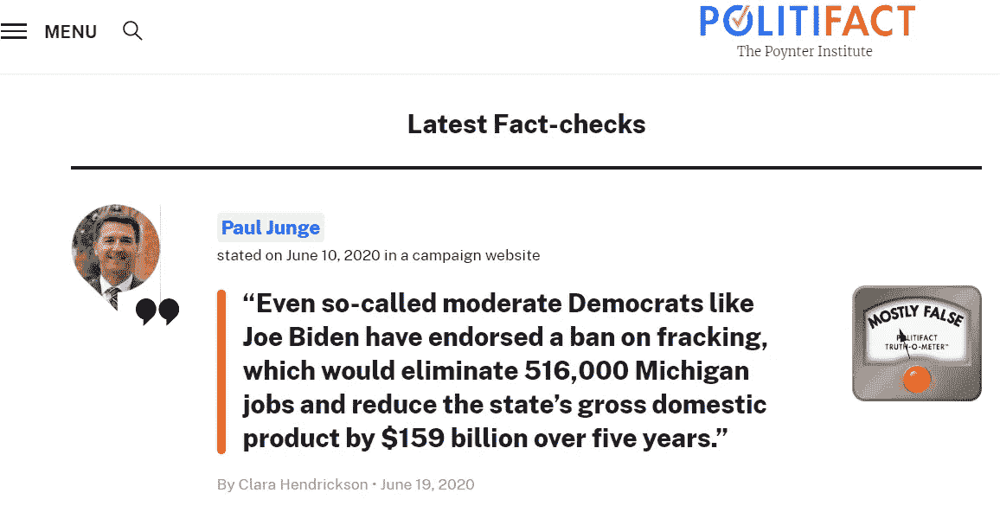

截图来自 Politifact 网站

如果我们禁用了 **JavaScript** ，我们将无法再使用此弹出窗口，正如您所见，我们现在看不到视频弹出窗口:

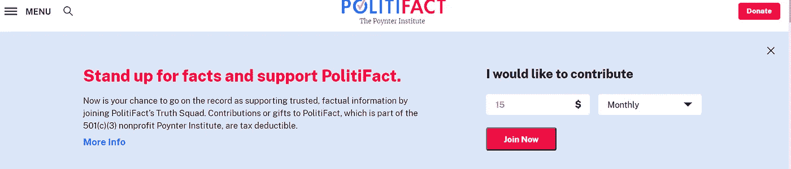

截图来自 Politifact 网站

如果我们在 inspect 窗口中使用 ctrl+F 找到 CSS 元素，然后将其从网页中删除，我们将会看到如下内容:

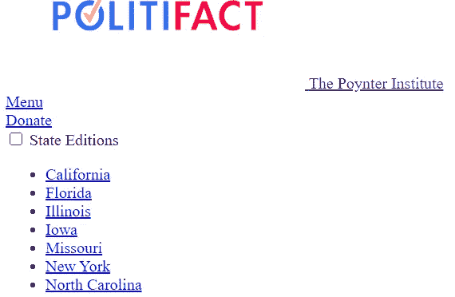

截图来自 Politifact 网站

所以，现在，我会问你一个问题。

> ***如果想通过抓取网页内容，需要从哪里查找？***

**所以，在这一点上，我希望你们都清楚我们需要搜集什么样的源代码。是的，你是绝对正确的，如果你正在考虑 HTML 的话😎**

**所以，执行 web 抓取方法之前的最后一步是理解 HTML 语言。**

****HTML****

****HTML** 语言是一种*超文本标记语言*，它定义了网页的内容，由元素和属性构成，为了抓取数据，你应该熟悉检查那些元素。**

*   **一个元素可以是一个标题、段落、分部、锚定标签等等…**
*   **一个属性可以是标题是粗体字母。
    这些标签用开始符号`<tag>`和结束符号`</tag>`
    表示，**

**`<p>This is paragraph.</p>
<h1><b>This is heading one in bold letters</b></h1>`**

# **使用 PYTHON 中的 BeautifulSoup 进行网页抓取**

**说够了，给我看看代码。**

****

**资料来源:giphy.com**

## **步骤 1:安装软件包**

**我们将首先开始安装必要的软件包:**

**1.`beautifulsoup4`
要安装它，请在您的 python 发行版中键入以下代码。**

```
**! pip install beautifulsoup4**
```

> ***bs4 包下的 BeautifulSoup 是一个库，用于以一种非常简单方便的方式将 HTML & XML 文档解析为 python，并通过使用标签和属性来识别元素来访问元素。***

**它非常容易使用，但非常强大的软件包提取任何类型的数据从互联网上只有 5-6 行。**

**2.`requests`**

**要安装它，请在 IDE 中使用以下命令，或者在命令外壳中使用不带感叹号的命令。**

```
**! pip install requests**
```

> **为了给 BeautifulSoup 提供任何页面的 HTML 代码，我们需要请求模块。**

**3.`urllib`
要安装它，使用以下命令:**

```
**! pip install urllib**
```

> ***urllib 模块是 python 的 URL 处理模块。它用于获取 URL(统一资源定位符)***

**虽然，在这里我们使用这个模块是为了不同的目的，来调用像这样的库:**

*   **time(使用它我们可以调用 sleep()函数来延迟或暂停执行给定的秒数。**
*   **sys(此处用于获取异常信息，如错误类型、错误对象、关于错误的信息。**

## **步骤 2:导入库**

**现在我们将导入所有需要的库:
1。`BeautifulSoup`
要导入它，在您的 IDE 上使用以下命令**

```
**from bs4 import BeautifulSoup**
```

> **这个库帮助我们获得我们想要处理的任何页面的 HTML 结构，并提供访问特定元素和提取相关信息的功能。**

**2.`urllib`
要导入它，键入以下命令**

```
**import urllib.request,sys,time**
```

*   **urllib.request:它有助于定义帮助打开 URL 的函数和类**
*   **urllib.sys:它的函数和类帮助我们检索异常信息。**
*   **urllib.time : Python 有一个名为 time 的模块，它提供了几个有用的函数来处理与时间相关的任务。其中最受欢迎的功能之一就是 sleep()。**

**3.`requests`
要导入它，只需在本库关键字前键入 import 即可。**

```
**import requests**
```

> ***该模块允许我们使用 python 向 web 服务器发送 HTTP 请求。(HTTP 消息由从客户端到服务器的请求和从服务器到客户端的响应组成。)***

**4.`pandas`**

```
**import pandas as pd**
```

> ***这是一个高级数据操作工具，我们需要它来可视化我们的结构化抓取数据。***

**将使用这个库来制作 DataFrame(这个库的关键数据结构)。数据帧允许我们存储和操作观察行和变量列中的表格数据。**

```
**import urllib.request,sys,time
from bs4 import BeautifulSoup
import requests
import pandas as pd**
```

## **第三步:提出简单的请求**

**通过`request`模块，我们可以获取 HTML 内容并存储到`page`变量中。
发出一个简单的 get 请求(只是获取一个页面)**

```
**#url of the page that we want to Scarpe
#+str() is used to convert int datatype of the page no. and concatenate that to a URL for pagination purposes.URL = 'https://www.politifact.com/factchecks/list/?page='+str(page)#Use the browser to get the URL. This is a suspicious command that might blow up.page = requests.get(url)**
```

> ***既然，* `*requests.get(url)*` *是一个可疑的命令，可能会抛出一个异常，我们就在 try-except block 中调用它***

```
**try:
     # this might throw an exception if something goes wrong.
     page=requests.get(url)      # this describes what to do if an exception is thrown 
except Exception as e:    

    # get the exception information
    error_type, error_obj, error_info = sys.exc_info()      

    #print the link that cause the problem
    print ('ERROR FOR LINK:',url)

    #print error info and line that threw the exception                          
    print (error_type, 'Line:', error_info.tb_lineno)

    continue**
```

**出于分页的目的，我们还将使用外部 for 循环。**

## **步骤 4:检查响应对象**

**一、看服务器发回什么响应码(对
检测 4XX 或 5XX 错误有用。**

```
**page.status_code**
```

****输出:****

**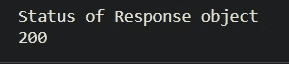**

**HTTP 200 OK 成功状态响应代码表示请求已经成功。**

**二。以文本形式访问完整的响应(在一个大字符串中获取页面的 HTML)**

```
**page.text**
```

****输出:****

**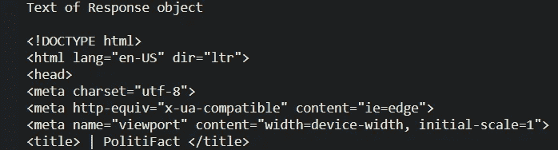**

**它将以 Unicode 返回响应对象的 HTML 内容。
**备选:****

```
**page.content**
```

****输出:****

**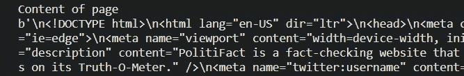**

****输出:****

**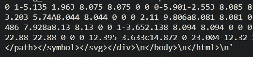**

**然而，它将以字节为单位返回响应的内容。**

**三。在响应中查找特定的文本子字符串。**

```
**if "Politifact" in page.text:
         print("Yes, Scarpe it")**
```

**四。检查响应的内容类型(查看是否得到了 HTML、
JSON、XML 等)**

```
**print (page.headers.get("content-type", "unknown"))**
```

****输出:****

**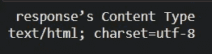**

## **步骤 5:延迟请求时间**

**接下来使用时间模块，我们可以调用值为 2 秒的 sleep(2)函数。这里，它向 web 服务器发送请求的时间延迟了 2 秒。**

```
**time.sleep(2)**
```

> ***sleep()函数在给定的秒数内暂停当前线程的执行。***

## **步骤 6:从 HTML 中提取内容**

**现在您已经发出了 HTTP 请求并获得了一些 HTML 内容，是时候解析它了，这样您就可以提取您正在寻找的值。**

****A)使用正则表达式**
完全不建议使用正则表达式来查找 HTML 内容。**

**但是，正则表达式对于查找特定的字符串模式仍然很有用，比如价格、电子邮件地址或电话号码。**

**对响应文本运行正则表达式，以查找特定的字符串模式:**

```
**import re  # put this at the top of the file
...
print(re.findall(r'\$[0-9,.]+', page.text))**
```

****输出:****

****

****B)使用 BeautifulSoup 的对象汤**
Beautiful Soup 是一个用于从 HTML 和 XML 文件中提取数据的 Python 库。它与您喜欢的解析器一起工作，提供导航、搜索和修改解析树的惯用方式。它通常可以为程序员节省数小时或数天的工作**

```
**soup = BeautifulSoup(page.text, "html.parser")**
```

**下面列出的命令将查找所有具有特定属性“o-listicle__item”的标签，例如`<li>`**

```
**links=soup.find_all('li',attrs={'class':'o-listicle__item'})**
```

****检查网页**
为了能够理解上面的代码，你需要检查网页&请跟着做:
1)转到上面列出的 URL
2)按 ctrl+shift+I 检查它。
3)这是你的“检查窗口”的样子:**

**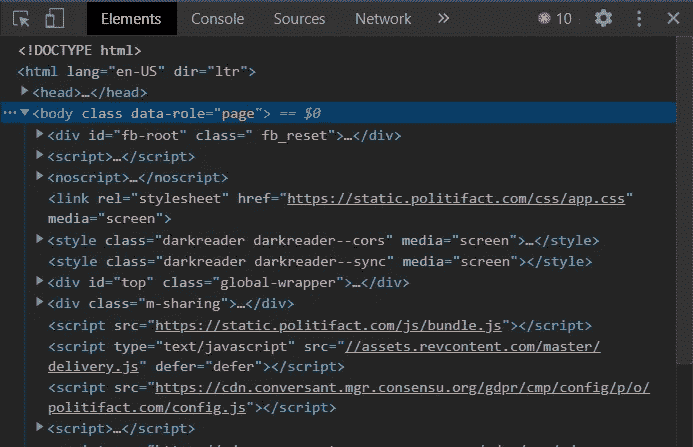**

*   **按 ctrl+shift+C 选择页面中的元素进行检查，或者转到“检查”窗口标题中最左边的箭头。**

**4)用于在检查窗口中获取上述特定元素和属性**

*   **首先，尝试进入网页的每个部分，并在 inspect 窗口中查看变化，您将很容易理解网页如何工作，以及哪个元素是什么，哪个特定属性对网页有贡献。**
*   **完成上述步骤后，现在我假设你能理解上述元素`<li>`及其属性的工作原理。**
*   **因为我需要某篇文章的新闻部分，所以我通过选择 inspect 窗口中的 inspect 元素选项转到该文章部分，它将在网页上突出显示该文章部分，并在 Inspect 窗口中突出显示其 HTML 源代码。瞧啊。✨**

**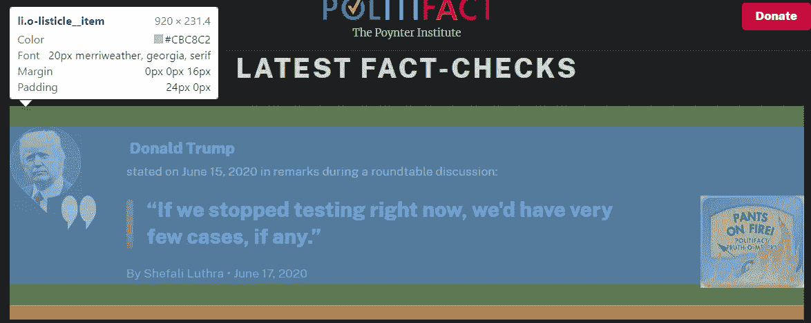**

> ***你能在你的机器上找到相同的标签吗？***

**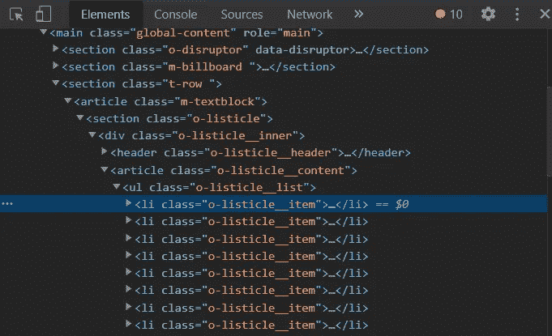**

**如果是的话，你已经完全理解了我在代码中使用的所有 HTML 标签。**

**继续我的代码:😅**

```
**print(len(links))**
```

> **这个命令将帮助你检查给定页面上有多少新闻文章。
> 相应地帮助你理解，为了提取大量数据，你需要对你的循环进行分页到什么级别。**

## **步骤 7:查找元素和属性**

*   **查找页面上的所有锚标签(如果您正在构建一个爬虫，并且需要找到下一个要访问的页面，这很有用)**

```
**links = soup.find_all("a")**
```

*   **它将在`<li>`标签下找到一个 div 标签，其中 div 标签应该包含列出的或特定的属性值。这里的“j”是一个 iterable 变量，它对给定页面上列出的所有新闻文章的响应对象“Links”进行迭代。**

```
**Statement = j.find("div",attrs={'class':'m-statement__quote'})**
```

*   **text.strip()函数将返回包含在该标记中的文本，并从文本字符串对象中去除任何类型的额外空格，' \n '，' \t '。**

```
**Statement = j.find("div",attrs={'class':'m- 
   statement__quote'}).text.strip()**
```

> ***好极了！🌟我们已经刮出了第一个属性，即数据集的语句***

*   **在同一个 division 部分，它将寻找锚标记并返回超文本链接的值。同样，strip()函数用于组织我们的值，以便我们的 CSV 文件看起来不错。**

```
**Link=j.find("div",attrs={'class':'m-statement__quote'}).find('a')['href'].strip()**
```

*   **要获取日期属性，您需要先检查网页，因为它包含一个字符串。所以在没有指定索引的情况下调用文本函数，你会得到类似这样的结果**

**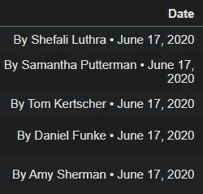**

*   **但是除了日期之外，我们不需要文本，所以我使用索引。尽管您可以稍后使用一些正则表达式组合来清理您的属性。“footer”是包含所需文本的元素。**

```
**Date = j.find('div',attrs={'class':'m-statement__body'}).find('footer').text[-14:-1].strip()**
```

*   **在这里，除了 get()之外，我做了和以前一样的事情，get()提取传递的属性(即 title)的内容**

```
**Source = j.find('div', attrs={'class':'m-statement__author'}).find('a').get('title').strip()**
```

*   **因为，对于我的项目，我需要一个没有被改变的数据集，而且，我需要知道成千上万的文章，哪篇文章属于我的训练数据的哪个类别。没有人可以手动操作。所以，在这个网站上，我确实找到了已经贴有标签的文章，但是文本是不可检索的，因为它包含在图像中。对于这种特定的任务，您可以使用 get()来有效地检索特定的文本。这里，我将' alt '作为属性传递给 get()，它包含我们的标签文本。**

```
**Label = j.find('div', attrs ={'class':'m-statement__content'}).find('img',attrs={'class':'c-image__original'}).get('alt').strip()**
```

**在下面的代码行中，我将所有的概念放在一起，并尝试获取数据集的五个不同属性的详细信息。**

```
**for j in links:
        Statement = j.find("div",attrs={'class':'m-statement__quote'}).text.strip()
        Link=st.find('a')['href'].strip()
        Date = j.find('div',attrs={'class':'m-statement__body'}).find('footer').text[-14:-1].strip()
        Source = j.find('div', attrs={'class':'m-statement__author'}).find('a').get('title').strip()
        Label = j.find('div', attrs ={'class':'m-statement__content'}).find('img',attrs={'class':'c-image__original'}).get('alt').strip()
        frame.append([Statement,Link,Date,Source,Label])
upperframe.extend(frame)**
```

## **步骤 8:制作数据集**

**将每个属性值附加到每个文章的空列表“框架”中**

```
**frame.append([Statement,Link,Date,Source,Label])**
```

**然后，将此列表扩展为每页的空列表“upperframe”。**

```
**upperframe.extend(frame)**
```

## **步骤 9:可视化数据集**

**如果你想在木星上可视化你的数据，你可以使用 pandas DataFrame 来实现。**

```
**data=pd.DataFrame(upperframe, columns=['Statement','Link','Date','Source','Label'])
data.head()**
```

## **步骤 10:制作 CSV 文件并保存到你的机器上**

****A)打开&写入文件**下面的命令将帮助你编写 CSV 文件，并将其保存到你的机器上保存你的 python 文件的同一个目录下**

```
**filename="NEWS.csv"
    f=open(filename,"w")
    headers="Statement,Link,Date, Source, Label\n"
    f.write(headers)
    ....
        f.write(Statement.replace(",","^")+","+Link+",
"+Date.replace(",","^")+","+Source.replace(",","^")+","+Label.replace(",","^")+"\n")**
```

**这一行将把每个属性写到一个文件中，用'^'.替换所有的'，'**

```
**f.write(Statement.replace(",","^")+","+Link+","+Date.replace(",","^")+","+Source.replace(",","^")+","+Label.replace(",","^")+"\n")**
```

**因此，当您在命令 shell 上运行这个文件时，它会在您的。py 文件目录。打开它时，如果你在抓取时没有使用 strip()，你可能会看到奇怪的数据。所以不要用 strip()检查它，如果你不用'，'替换'^'，它看起来也会很奇怪。
所以，用这些简单的步骤替换它:**

*   **打开您的 excel 文件(。csv 文件)**
*   **按 ctrl+H(将出现一个弹出窗口，询问“查找内容并替换为”)**

**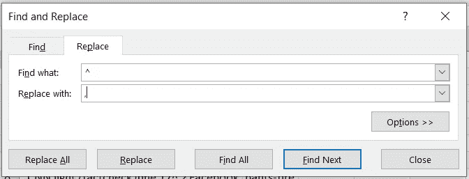**

*   **给'**'取值给'**找什么**字段，给'**中的'**，**'取值替换为**'字段。****
*   ****按全部替换****
*   ****点击关闭&哇哦！😍您已经完成了让数据集保持完美形式的工作。不要忘记在完成两个 for 循环后用下面的命令关闭文件，****

```
****f.close()****
```

****如果已经使用文件写入方法创建了数据集，则反复运行相同的代码可能会引发错误。****

******B)使用 to_csv()**
将数据帧转换为 csv 文件因此，除了这种冗长的方法，您可以选择另一种方法:to_csv()也用于将数据帧转换为 csv 文件，并且还提供一个属性来指定路径。****

```
****path = 'C:\\Users\\Kajal\\Desktop\\KAJAL\\Project\\Datasets\\'
data.to_csv(path+'NEWS.csv')****
```

****为了避免歧义并允许代码的可移植性，您可以使用:****

```
****import os
data.to_csv(os.path.join(path,r'NEWS.csv'))****
```

****这将正确地将您的 CSV 名称附加到您的目标路径。****

# ****建议和结论****

****虽然我建议使用第一种方法，即打开文件，写入文件，然后关闭文件，但我知道实现起来有点冗长和俗气，但至少它不会像 to_csv 方法那样给你提供模糊的数据。****

****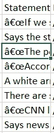****

****请看上图，它是如何提取语句属性的不明确数据的。
因此，与其花费数小时手动清理数据，我建议多写几行第一种方法中指定的代码。现在，你已经完成了。✌️****

> *******重要提示:*** *如果您尝试复制粘贴我的源代码来抓取不同的网站&运行它，它可能会抛出一个错误。事实上，它肯定会抛出一个错误，因为每个网页的布局是不同的&为此，你需要做出相应的改变。*****

# ****完整代码****

******数据集:******

****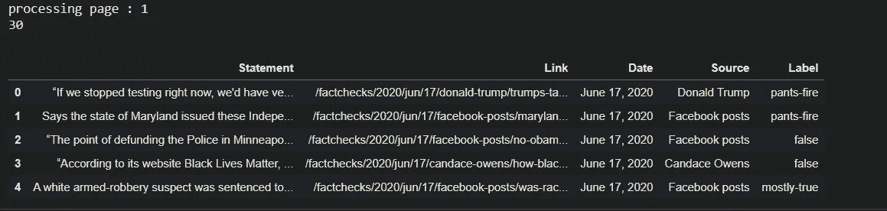****

****这篇文章是网络搜集系列的第一部分，对于那些没有技术背景的人来说，可以在这里阅读这个系列的第二部分[。](https://medium.com/@TechyKajal/dataset-creation-for-beginners-using-software-4795ee119f6d)****

****所以，如果我的博客帖子对你有所帮助，而你此刻觉得很慷慨，请不要犹豫，请给我买杯咖啡。☕😍****

****[](https://www.buymeacoffee.com/techykajal)****

****是的，点击我。****

```
****And yes, buying me a coffee **(and lots of it if you are feeling extra generous)** goes a long way in ensuring that I keep producing content every day in the years to come.****
```

****我希望你会觉得有用，喜欢我的文章。😇请随时分享你的想法，如果你有任何疑问，请打电话给我。您可以通过以下方式联系我:****

1.  ****订阅我的 [**YouTube 频道**](https://www.youtube.com/channel/UCdwAaZMWiRmvIBIT96ApVjw) 视频内容即将上线 [**这里**](https://www.youtube.com/channel/UCdwAaZMWiRmvIBIT96ApVjw)****
2.  ****跟我上 [**中**](https://medium.com/@TechyKajal)****
3.  ****在 [**LinkedIn**](http://www.linkedin.com/in/techykajal) 上连接并联系我****
4.  ****跟随我的博客之旅:-【https://kajalyadav.com/】****
5.  ******成为会员:-[**https://techykajal.medium.com/membership**](https://techykajal.medium.com/membership)******

******查看我的其他博客:******

******[](/8-ml-ai-projects-to-make-your-portfolio-stand-out-bfc5be94e063) [## 8 ML/AI 项目，让您的投资组合脱颖而出

### 有趣的项目想法与源代码和参考文章，也附上一些研究论文。

towardsdatascience.com](/8-ml-ai-projects-to-make-your-portfolio-stand-out-bfc5be94e063) [](https://medium.com/datadriveninvestor/predicting-us-presidential-election-using-twitter-sentiment-analysis-with-python-8affe9e9b8f) [## 基于 Python 的推特情感分析预测美国总统大选

### 修订数据科学基础的有趣项目，从数据集创建到数据分析再到数据可视化

medium.com](https://medium.com/datadriveninvestor/predicting-us-presidential-election-using-twitter-sentiment-analysis-with-python-8affe9e9b8f)******