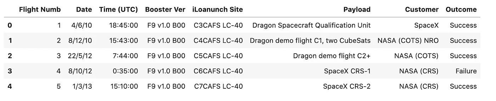
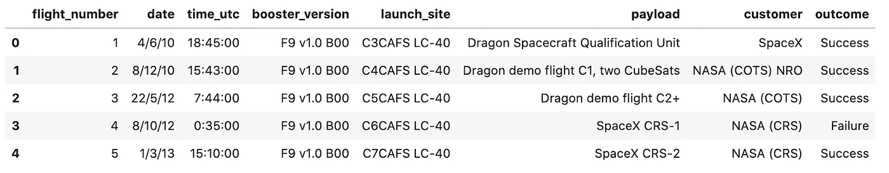
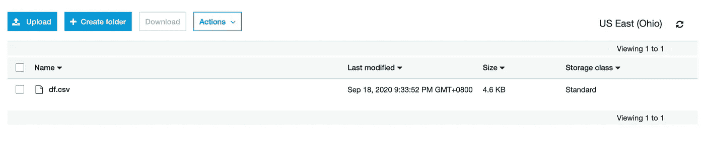

# 在 PDF 中抓取表格，然后在 Python 中测试数据质量

> 原文：<https://towardsdatascience.com/scraping-a-table-in-a-pdf-reliably-and-then-test-data-quality-6718bb91d471?source=collection_archive---------22----------------------->

## 如何在 Python 中抓取 PDF 中的表格，对数据进行质量单元测试，然后上传到 S3。


蒂姆·莫斯霍尔德在 [Unsplash](https://unsplash.com/s/photos/spacex?utm_source=unsplash&utm_medium=referral&utm_content=creditCopyText) 上的照片

# 介绍

假设您需要将一些数据接收到您的数据仓库中，在与您的利益相关者进一步讨论之后，这些数据的来源是一个 PDF 文档。幸运的是，使用一个名为 [tabula-py](https://pypi.org/project/tabula-py/) 的 Python 包很容易做到这一点。在这篇文章中，我将带你了解如何抓取嵌入在 PDF 文件中的表格，使用 [Great Expectations](https://github.com/great-expectations/great_expectations) 对数据进行单元测试，如果有效，将文件保存在 AWS 的 S3 中。你可以在 [Github](https://github.com/AshHimself/etl-pipeline-from-pdf) 上找到这篇文章的完整源代码，或者在 [Google Colab](https://colab.research.google.com/drive/1Vh9sWzbfXC2CDC6OlJkHGUCwG95LjGyr?usp=sharing) 上找到一个工作示例。

# 0) **所需依赖关系**

在编写任何代码之前，让我们安装所有必需的包。

```
pip install tabula-py
pip install great_expectations
pip install boto3
```

# 1)所需进口

```
from tabula import read_pdf
import great_expectations as ge
import boto3
from io import StringIO
```

# **2)阅读 PDF 文件**

下面我有两个 PDF 文件，其中包括一些与 SpaceX 发射相关的数据。一个是干净的预期格式，另一个是有意的错误，我们将在单元测试数据输出时使用。

```
clean = "https://raw.githubusercontent.com/AshHimself/etl-pipeline-from-pdf/master/spacex_launch_data.pdf"messy = "https://raw.githubusercontent.com/AshHimself/etl-pipeline-from-pdf/master/spacex_launch_mess_data.pdf"source_pdf = read_pdf(clean, lattice=True, pages=”all”)df = source_pdf[0]
```

# 3)审查数据

让我们来看看我们的数据，看看 tabula-py 只用一行代码就工作得有多好！

```
df.head()
```



相当令人印象深刻！唯一值得注意的问题是，这些标题在数据库中不能很好地工作，所以让我们稍微清理一下。

```
#Rename the headers
fields = {‘Flight Numb’: ‘flight_number’, ‘Dr ate’: ‘date’,’Time (UTC)’: ‘time_utc’,’Booster Ver’:’booster_version’,’iLoanunch Site’:’launch_site’}df = df.rename(columns=fields) #rename columns
df.columns = map(str.lower, df.columns) ##lower case is nicer
```



到目前为止，我们已经从 PDF 中抓取了表格，并将其保存在熊猫数据框中，如果我们愿意，我们可以将数据框保存到 S3 的 CSV 文件中。然而，如果这个 PDF 的格式改变了，如果有人改变了域名，我们如何保证数据将可靠地保存在 S3？

# 4)断言数据

为了测试我们的数据，我们将使用一个名为 [Great Expectations](https://github.com/great-expectations/great_expectations) 的神奇包。我甚至不会触及这个包的表面，所以我强烈建议检查一下！。

如果我们现在运行代码，使用我们的[预期 pdf](https://github.com/AshHimself/etl-pipeline-from-pdf/raw/master/spacex_launch_data.pdf) ，它应该通过所有断言。然而，看看[凌乱的 pdf](https://github.com/AshHimself/etl-pipeline-from-pdf/raw/master/spacex_launch_messy_data.pdf) 。我特意添加了一些重复的 flight_number 行，并重命名了输出列。如果我们使用混乱的 PDF 再次运行*(从第 2 节*更新 PDF 源文件)，上面的代码应该返回“一些断言已经失败:(”。validation_results 的输出也相当详细，但是您可以在这里查看完整的输出。

```
{“Expected Column Position”: 7,”Expected”: “outcome”,”Found”: “mission outcome”}
```

像这样在 ETL 管道中进行一些基本的测试可以很容易地帮助确保数据质量的一致性和可靠性。

# 5)在 S3 保存我们的数据

教您如何设置具有正确权限的 S3 存储桶超出了本文的范围，所以我假设您知道如何做或者知道如何解决这个问题。

```
AWSAccessKeyId=’your_access_key_id’
AWSSecretKey=’your_secret_key’bucket = ‘scrape-pdf-example’ # your S3 bucketcsv_buffer = StringIO()s3 = boto3.client(‘s3’, aws_access_key_id=AWSAccessKeyId, aws_secret_access_key=AWSSecretKey)df.to_csv(csv_buffer) #save our dataframe into memory
s3_resource = boto3.resource(‘s3’)
s3_resource.Object(bucket, ‘df.csv’).put(Body=csv_buffer.getvalue()) #push CSV to S3
```

来自 [Stefan](https://stackoverflow.com/questions/38154040/save-dataframe-to-csv-directly-to-s3-python) 的代码片段！

搞定了。你现在应该在你的 S3 桶中有一个 CSV 文件，如果你愿意，它可以被其他 AWS 服务 *(Glue，Redshift 等)接收。*



> 您在生产中测试过数据的质量吗？

# 结束语

使用 [AWS 服务 Textract](https://aws.amazon.com/textract/) 服务或其他 Python 包可以轻松实现上述代码，但对我来说，Tabula 在处理简单和更复杂的 PDF 文档时效果很好，这些文档包含多个表格和更复杂的表格结构。

总的来说，数据质量和测试数据至关重要，但却常常被忽视。像 [DBT](https://docs.getdbt.com/docs/building-a-dbt-project/tests/) 和[马提利翁](https://www.matillion.com/resources/blog/assert-unit-test-components-validating-objects-in-matillion-etl/)这样的解决方案提供了测试/断言你的数据的功能，使这个过程变得非常容易。你使用什么工具？

将最终输出保存到 S3 显然是可选的。我只是选择这样做，因为未来的文章将利用 S3 的 CSV 文件作为起点。

*关于我:对万物数据充满热情，活在* ***商业*** *，* ***数据*** *，* ***机器学习*** *。想聊天可以在*[*LinkedIn*](https://www.linkedin.com/in/ashleygsmith/)*上联系我！*