# 利用 IBM 的 Watson Discovery 搜集和查询黑客新闻

> 原文：<https://towardsdatascience.com/scraping-and-querying-hacker-news-with-ibms-watson-discovery-50d5241e559?source=collection_archive---------37----------------------->

沃森最初是 IBM 设计的一个 AI 系统[，用来赢得](/the-games-that-ai-won-ff8fd4a71efc) *Jeopardy！*电视节目。为了成功，沃森必须查询一个庞大的知识库来回答节目中的问题(或质疑答案)。这个知识库包括 DBPedia、WordNet 和 Yago。节目结束后，沃森被分拆成多个产品，包括沃森发现、沃森文本到语音、沃森语音到文本、沃森助手和沃森知识工作室等。Watson Discovery 可用于查询文档，以找到回答您可能有的问题的相关段落/文章/段落。在本文中，我将向您展示如何使用 Watson Discovery 从 Y Combinator 的黑客新闻中获取信息，这将有助于回答有关黑客新闻主题的问题，但您可能希望将它重新用于您想要查询的其他文档。

如果你熟悉刮削，你可能会意识到即使刮削并不困难，它也会非常耗时。无论您的文档是 PDF、Word、PowerPoint、Excel、PNG、TIFF、JPG、JSON 还是 HTML，Watson Discovery 都能为您完成这项任务。Discovery 在抓取网站时可以节省大量时间，因为它会抓取该网站的主页，以及其他页面和外部网站的链接。这使得将它应用于黑客新闻成为一项简单的任务。

# 注册一个免费的 IBM Cloud 帐户

IBM 的沃森主要生活在云上，允许它扩展(和缩小)以满足你的工作需求。从为一个 [IBM 云账户](https://cloud.ibm.com/registration?cm_sp=Cloud-Home-_-LeadspaceReg-IBMCloud_CloudHome-_-LSReg)歌唱开始。跟随本教程学习所需的资源是免费的，但是为了完全公开，我确实为 IBM 工作。

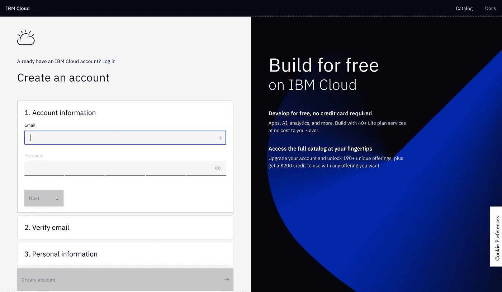

然后你应该会收到一封激活你账户的邮件，这样做，你就可以开始了！

# 调配 Watson 发现的实例

现在当你登录时，你可能会被下面看到的一切淹没。我建议您点击顶部横幅中的目录按钮。

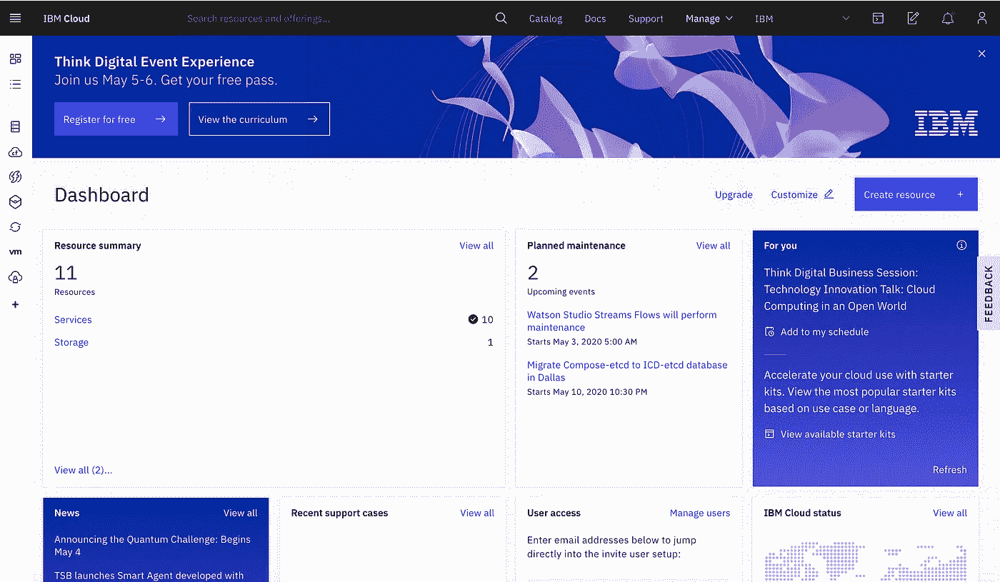

您可以浏览 IBM 提供的服务，但我们将在 AI 选项卡下使用 Discovery。单击“Discovery ”,我们可以对其进行资源调配。

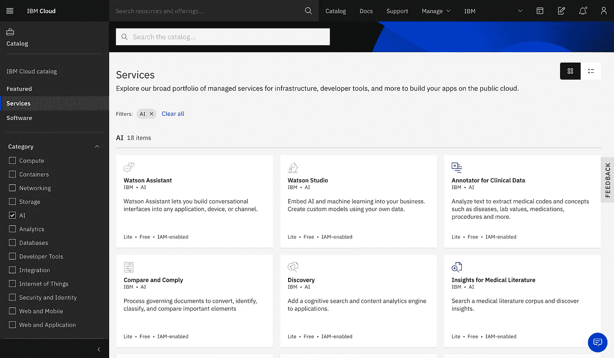

现在我们可以选择选择一个精简(免费)版本或高级版本。出于我们的目的，我们只需要 lite，因为我们可以用它获得 1000 个文档的目录，这应该是我们查询黑客新闻的目标所需的全部内容。

# 启动沃森探索

通过点击左上角的汉堡包图标，并点击资源列表按钮，这将显示您已经创建的所有服务的列表。

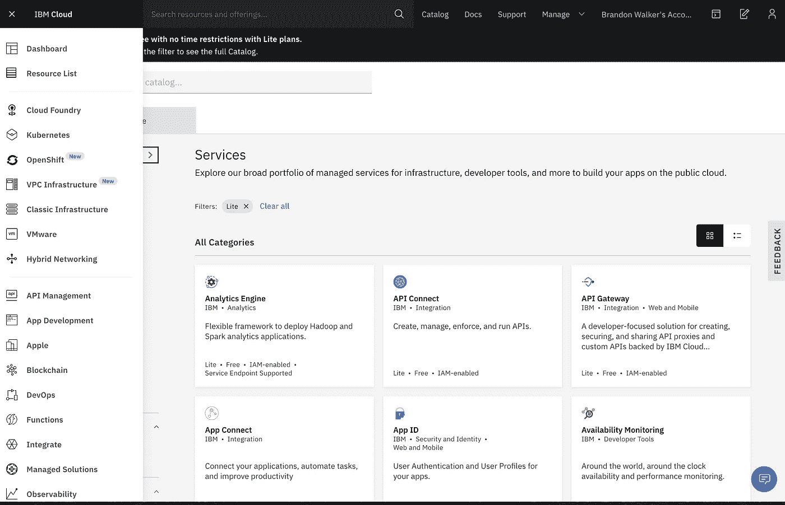

在 services 选项卡下，选择您的发现实例，我的实例仍具有随机生成的默认名称。

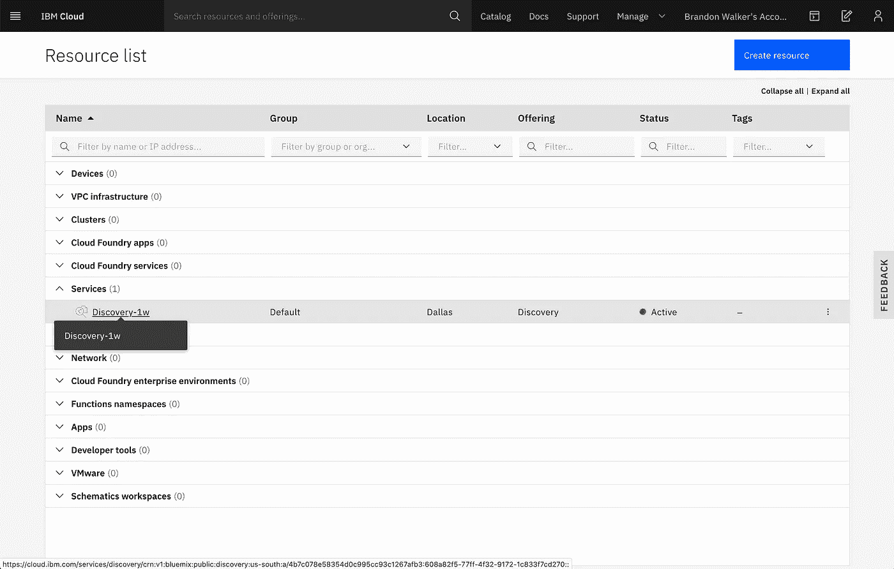

现在单击页面中间的蓝色按钮“启动 Watson Discovery”。

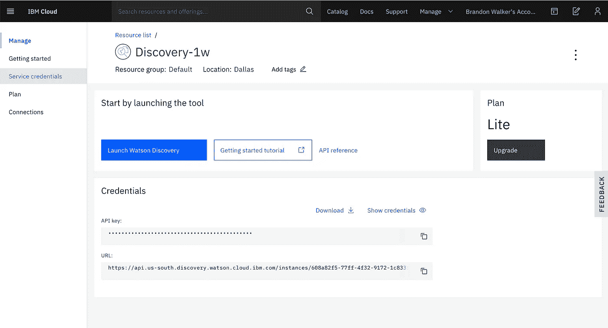

# 创建文档集合

当你启动沃森发现，你会注意到已经有一些数据，称为沃森发现新闻。

[Watson Discovery News](https://discovery-news-demo.ng.bluemix.net/?cm_mc_uid=12759271150515849146816&cm_mc_sid_50200000=77641831584981047388&cm_mc_sid_52640000=40195941584981047392) 包含最近的新闻文章，让您快速了解一家公司的:

*   过去两个月的头条新闻
*   那些文章中提到的顶级实体(人、主题、公司)
*   新闻中的舆情走向
*   媒体大量报道的反常时期
*   最常见配对实体的趋势(共同提及)

我们不会使用沃森探索新闻，但它是你的一个选择。相反，单击“连接数据源”按钮。现在，您将看到一个可供选择的数据源选项列表，我们将单击 Web Crawl，因为有关黑客新闻的文章存储在 Web 上。

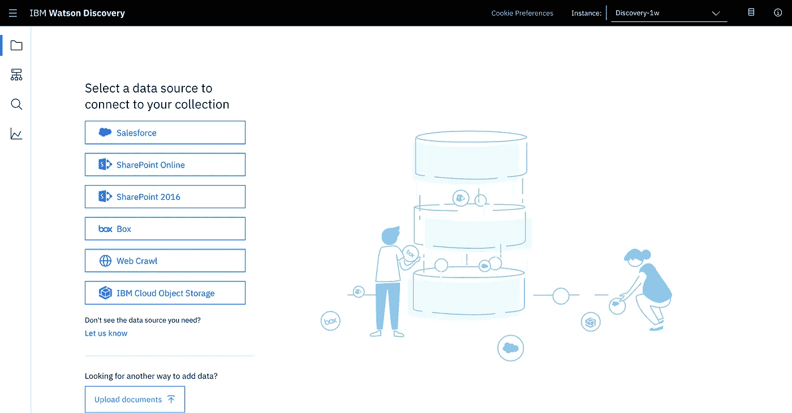

现在，我们可以添加我们想要抓取的网站以及我们希望抓取的频率。

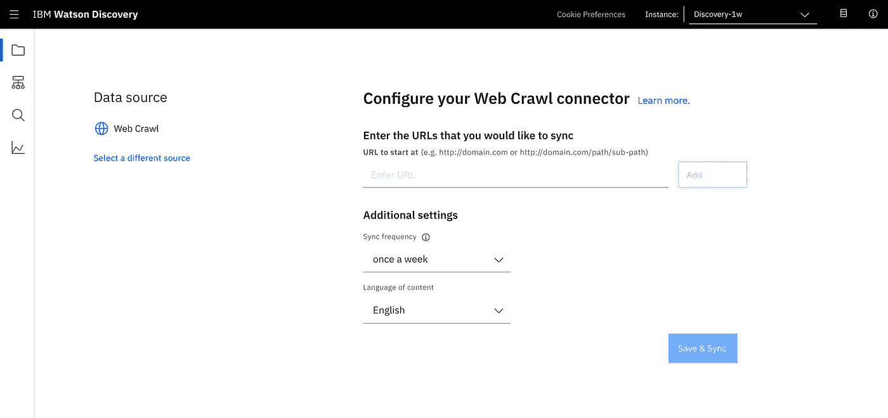

我添加了前 10 页的黑客新闻，我设置了每天一次的频率，并将语言内容保留为英语。

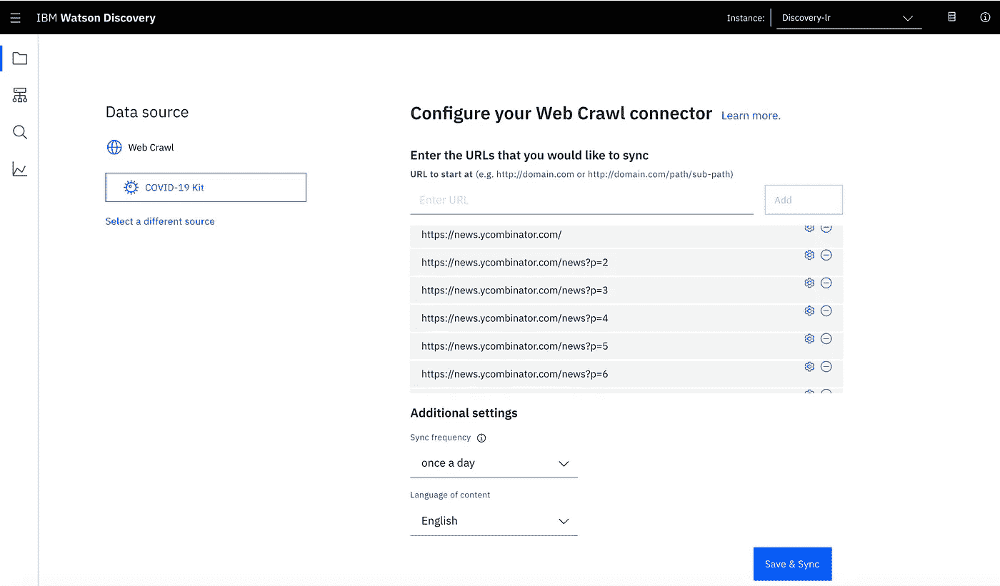

按下保存和同步按钮后，Watson Discovery 将开始检索您输入的 URL 上的文本以及这些 URL 链接到的页面上的文本。

# 查询文档

等了一会儿后，网络爬行已经完成，我可以看到它已经收集了 657 个文档，0 个失败。现在，我将单击页面左侧的放大镜，转到查询构建器。

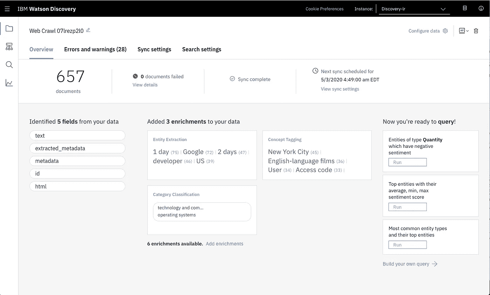

在这里，您可以看到发现、搜索文档的一些主要功能。单击搜索文档开始编写一些查询。

您的查询可以使用两种格式编写，发现查询语言或自然语言。自然语言更接近谷歌搜索，而发现查询语言感觉更像正则表达式。首先，我将展示自然语言。我正在搜索关于编程语言 Go 的信息，因为我对学习它很感兴趣。

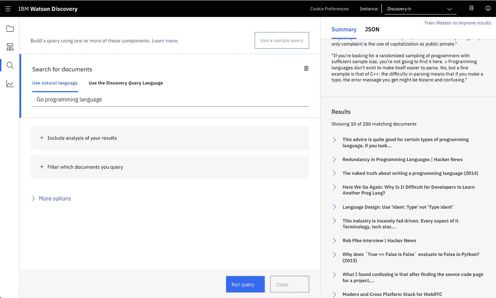

这将返回一些与我查询的内容相关的文本和段落，其中包含关于 Go 的有趣信息。当我在 Discovery 查询语言下搜索时，我可以要求在满足特定条件时返回信息。在下面的例子中，我要求文本必须包含单词 data science，我得到了一些关于自由职业者工作和 SQL 的文档。

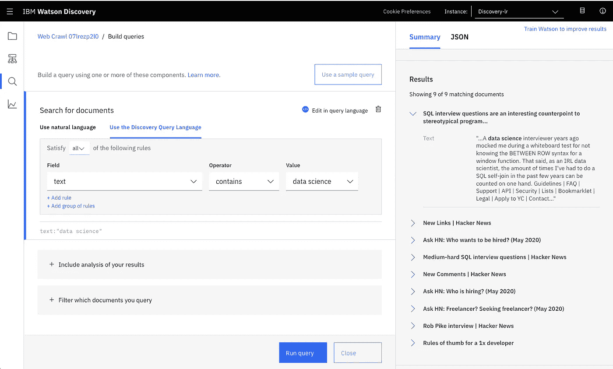

为了更好地增强 Discovery 查询语言，您可能希望使用 Field 下的选项，这将允许您查找与预先定义的概念和实体相关的信息，要求文件类型是特定的，按网页制作日期过滤，或在 HTML 中查找内容。

很可能您会想要使用 Discovery 提供的许多其他功能。我建议查看:

*   [用于发现的 API](https://cloud.ibm.com/apidocs/discovery)
*   向查询中添加自定义停用字词
*   向查询中添加同义词
*   [提高自然语言查询的准确性](https://cloud.ibm.com/docs/discovery?topic=discovery-improving-result-relevance-with-the-tooling)

包含所有这些特性的教程对于一篇文章来说是超载的，所以我将把我对其他用例的一些想法留给您。

# 个人项目想法

## 教程查找器

将网络爬虫设置到像 bookdown.org[这样有大量高质量信息的网站可以帮助你快速找到你想要解决的问题的相关资料。你甚至可以把自己的课本上传成 pdf 格式，然后进行查询。](https://bookdown.org/)

## 工作板刮刀

你可以设置一个 Watson Discovery 网页抓取功能来抓取几个招聘信息，然后使用自然语言查询，你就有希望找到一份最适合你的工作。例如，您可以要求工作描述包含单词“远程”、“java”和“数据科学家”，但不包含单词“excel”

# 业务用例想法

## 搜索求职者的简历

有了求职者的简历，你可以搜索你认为最重要的技能。为单词设置同义词也非常有用，这样当你寻找具有深度学习经验的候选人时，你可以获得 PyTorch 和 TensorFlow 返回的简历。

## 面向员工的内部搜索引擎

能够用谷歌搜索信息是很棒的，但是当你想搜索你的个人或公司文件时，你就不能用谷歌了。Watson Discovery 可以作为文档的搜索引擎，使您能够找到查询的答案，并在查找信息时节省时间。伍德赛德能源公司在下面的视频中就是这么做的。

## 面向客户的聊天机器人集成

当聊天机器人不知道你可能有的问题的答案时，与它交谈可能会令人沮丧。使用 Watson Discovery 增强聊天机器人是一种很好的方式，可以在您没有对特定问题的答案进行预编程的情况下回答客户可能提出的问题。如果你创建一个由 Watson Assistant 驱动的聊天机器人，这很容易做到。