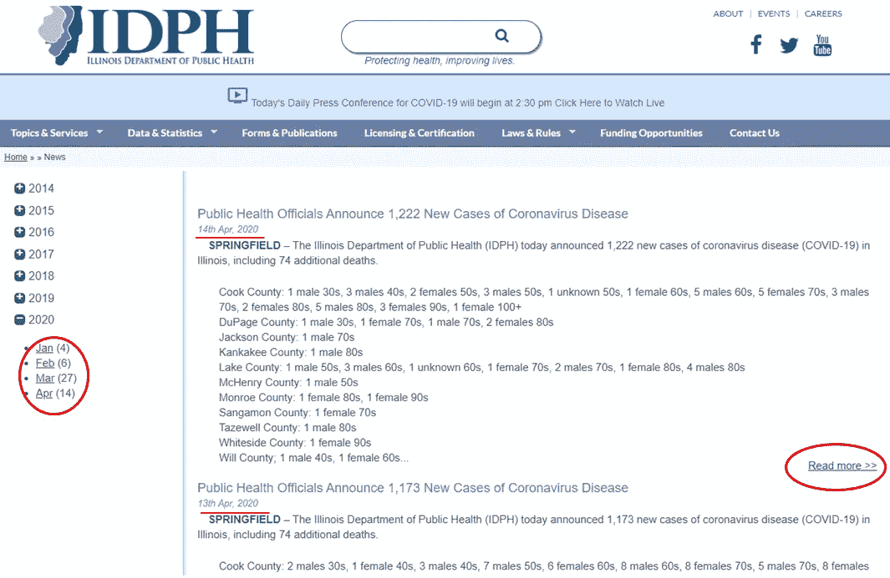
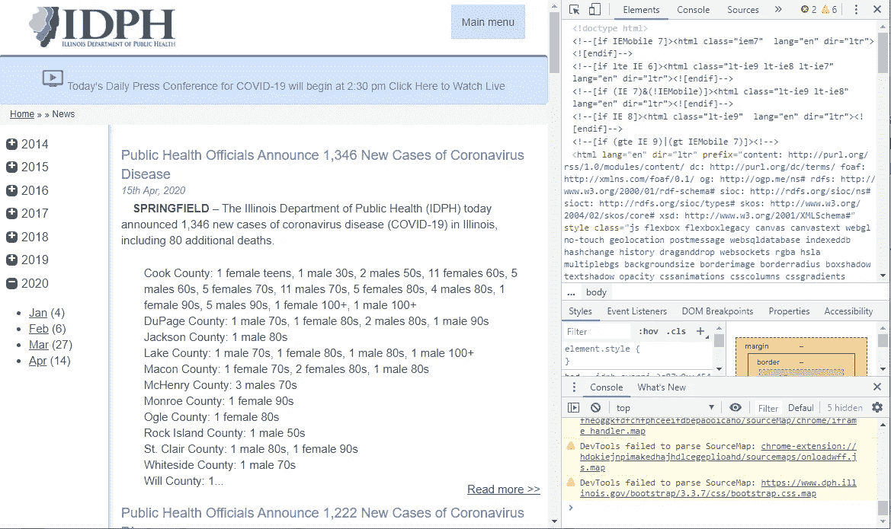
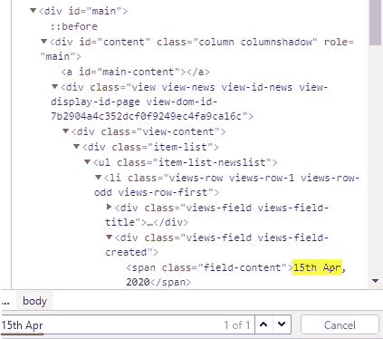
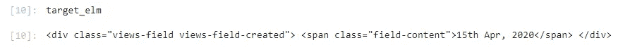
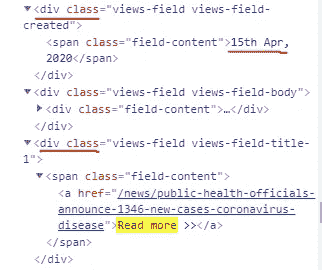
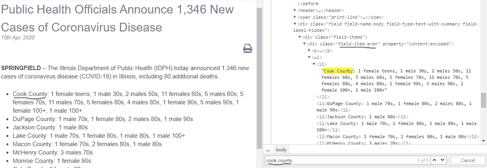
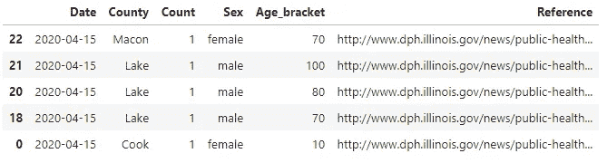
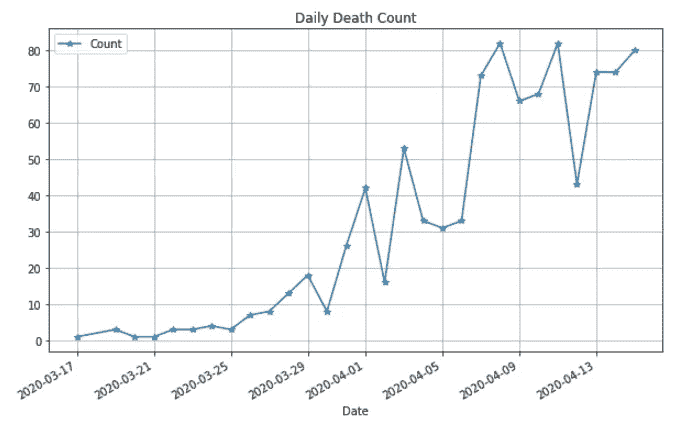
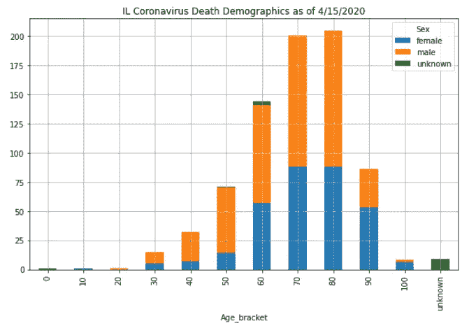

# 用美汤刮去冠状病毒死亡人口统计

> 原文：<https://towardsdatascience.com/scraping-coronavirus-death-demographics-with-beautiful-soup-9df7488fe84c?source=collection_archive---------41----------------------->

## 网页抓取教程

马库斯·斯皮斯克在 [Unsplash](https://unsplash.com/s/photos/scraping-web?utm_source=unsplash&utm_medium=referral&utm_content=creditCopyText) 上的照片

随着冠状病毒在全球蔓延，详细的数据对于人们了解这种病毒变得至关重要。许多优秀的数据源已经发布了可供研究使用的数据(本文中的[综述，以及本文](/a-short-review-of-covid-19-data-sources-ba7f7aa1c342)中的[中与 GIS 相关的综述)。但是，大部分数据来源集中在不同地点的确诊/死亡/康复计数和检测计数。如果您想要其他信息，例如性别和年龄等死亡人口统计信息，该怎么办？](/covid-19-gis-resource-summary-debcba2a000b)

在本教程中，我们将浏览[伊利诺伊州卫生部每日新闻](https://www.dph.illinois.gov/news/202004)网页，使用 Python 和 Beautiful Soup library 获取冠状病毒死亡人口统计数据。

# 1.调查网页的逻辑结构

首先，我们知道伊利诺伊州卫生部(IDPH)有每日简报，其中包含死亡人口统计数据。让我们以 2020 年 4 月为例，访问以下网页

> [https://www.dph.illinois.gov/news/202004](https://www.dph.illinois.gov/news/202004)

快速浏览可以发现以下信息:

*   该网址以<yyyymm>的格式按年月组织。</yyyymm>
*   这个网页包含每月的所有每日报告，最新的报告在最上面。每条每日新闻都可以用相应的日期串来标识，格式为<ddmmyyyy>。</ddmmyyyy>
*   每日新闻只有一个部分显示在这个网页上。完整的每日报告实际上在右下角的“阅读更多”链接中。

# 2.准备汤品

因为我们知道 HTTP 地址，所以我们可以很容易地用漂亮的 soup 构造一个 Soup 对象。

# 3.查找相关信息

## 3.1 确定切入点

大多数现代网络浏览器都提供了查看网页源代码的基本工具。以 Chrome 为例，可以使用<f12>键调出侧面的 DevTools 控制台，如下图:</f12>

乍一看，右边的内容让人望而生畏，尤其是对于不熟悉 HTML 的人来说。怎么才能在这一大堆乱七八糟的东西中找到相关的信息呢？

好消息是，在大多数情况下，我们不必知道网页的完整结构。例如，由于在步骤#1 中我们已经确定日期字符串指定了新闻的位置，我们可以使用 Ctrl-F 搜索日期字符串“15th Apr ”,以快速定位感兴趣的部分:

如果您将鼠标悬停在“4 月 15 日”上，左侧网页上的相应部分将会高亮显示。这确认了代码位置。

在确认了逻辑位置之后，我们可以使用`find_all`函数在 soup 对象中复制它，以找到所有的 **div** ，并使用其 **span** 具有正确字符串的那个。

运行上面的代码后，我们可以打印 target_elm 来确认它是否是包含“2020 年 4 月 15 日”的元素:

## 3.2 找到从入口点到兴趣点的相对路径

正如我们在#1 中讨论的，详细的每日报告实际上在另一个位置，在“阅读更多”链接下。我们可以使用相同的技巧找到相对路径，即在 DevTools 控制台中搜索“Read more ”:

方便的是，包含“Read more”链接的元素和包含“15th Apr”字符串的元素属于同一个`parent`。因此，我们可以使用 soup 元素的`parent`属性来导航结构，然后使用`.a.get('href')`来获得超链接。

在获得日期的详细报告的超链接之后，我们可以请求新的网页，并相应地创建新的 soup 对象:

然后我们可以打开实际的每日报告页面，并使用相同的技巧，搜索“Cook County”来定位代码的相关部分。正如我们所看到的，详细的分解是在一个无序列表中(

标签)，在一个 **div** 类“field-item even”下。

# 4.提取信息

找到列表后，我们可以通过使用`find_all`函数搜索< li >标签来迭代列表，然后使用`.text`属性获取相应的文本。

一旦我们得到诸如“1 男 30”这样的字符串，我们就可以从字符串中提取计数/性别/年龄信息。然后我们可以将它们放入熊猫数据框中进行进一步分析。

上面代码中的核心分析是我们必须实现的`extract()`函数。基本思想很简单——我们可以将字符串分成三个子字符串，然后相应地提取计数、性别和年龄。

然而，现实要复杂得多，也容易出错，就像任何网页抓取一样。因为新闻文本是由人类生成的，尽管格式相对稳定，但仍有许多细微差别可能会发生变化。仅举几个例子:

*   在 2020 年 3 月 22 日之前，死亡人口统计日报的格式不太结构化。
*   有时“年龄”部分不以“s”结尾。比如“1 男 100+”。更糟糕的是，有时它使用“青少年”或“婴儿”这样的词来指定年龄。
*   有“未知”和“不完整”的条目。
*   有时死亡计数“1”会被忽略。
*   ……

毕竟，完整的实现可以在这个 [GitHub repo](https://github.com/jianxu305/nCov2019_analysis) 中的`utils.parse_IL_death_demographic()`中找到。作为一条支持信息，我在输出数据框中添加了新闻页面的链接，以便在必要时可以快速验证结果。最终的输出数据帧如下所示:

# 5.绘制死亡人口统计图

经过以上努力，我们从《IDPH 日报》中获得了死亡人口统计数据框架。这样网页抓取就完成了。但是在宣布胜利之前检查结果总是一个好主意。Pandas `pivot_table()`提供了聚集数据的灵活方式。例如，我们可以看看每日死亡人数时间序列:

上述情节很容易被新闻来源所证实，这使我们对我们的结果有了一些信心。

最后，我们可以看看死亡人口统计。按年龄和性别划分的堆积条形图是一个很好的表示。这可以通过将数据框旋转到另一个方向来轻松实现:

# 最后注意:

一般来说，网页抓取并不健壮，因为网页会在你不知道的情况下改变。因此，我们总是更喜欢更健壮的 API。但是当这不可用时，网络搜集可以作为另一个获取数据的途径。

# 承认

我要感谢我的朋友 David Tian，他是一名机器学习工程师，他对本文提出了宝贵的建议。看看他有趣的自驾* [DeepPiCar](/deeppicar-part-1-102e03c83f2c) *博客。