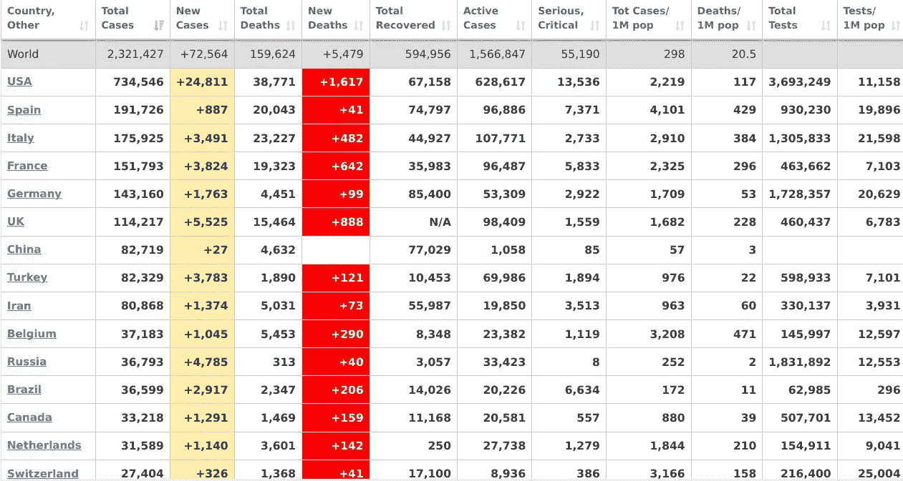
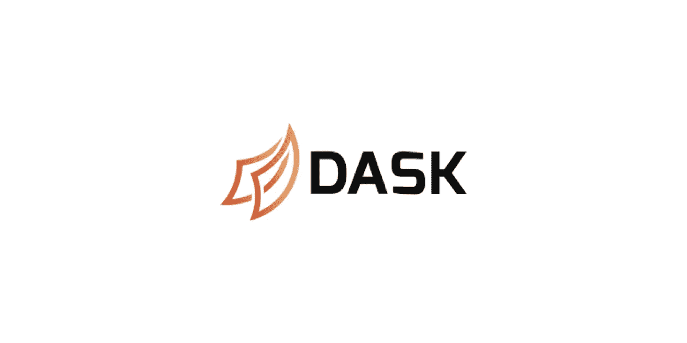
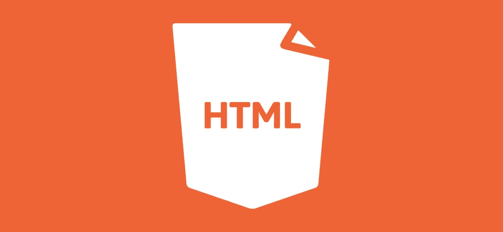
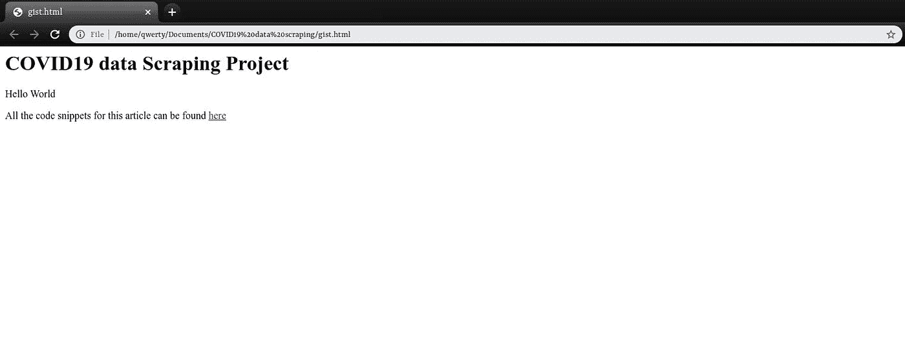
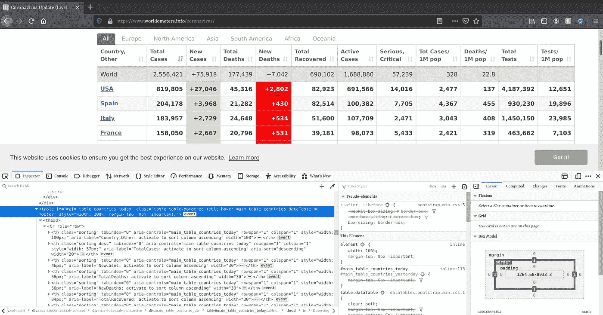
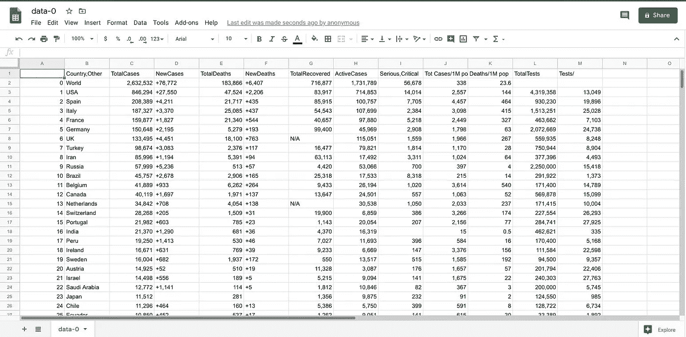

# 使用 Python 抓取 COVID19 数据

> 原文：<https://towardsdatascience.com/scraping-covid19-data-using-python-80120eb5eb66?source=collection_archive---------29----------------------->


乔希·希尔德在 [Unsplash](https://unsplash.com?utm_source=medium&utm_medium=referral) 上的照片

通过各种尝试来抑制 COVID19 对世界的影响，各种研究工作和创新措施依赖于从正确的数据中获得的洞察力。帮助创新所需的大部分数据可能无法通过[应用编程接口(API)](https://en.wikipedia.org/wiki/Application_programming_interface) 或类似于“*的文件格式获得。CSV*’等待下载，但只能作为网页的一部分访问。所有代码片段都可以在这里找到。

[**Web scraping**](https://en.wikipedia.org/wiki/Web_scraping) 是一个术语，用来描述使用程序或算法从 Web 中提取和处理大量数据。无论您是数据科学家、工程师，还是分析大量数据集的任何人，从 web 上抓取数据的能力都是一项有用的技能。

[Worldometers](https://www.worldometers.info/coronavirus/) 在全球拥有可靠的 COVID19 数据来源。在本文中，我们将学习如何使用 python 将下面描述的 COVID19 数据从网页抓取到站点的 [Dask dataframe](https://docs.dask.org/en/latest/dataframe.html) 。



来自 [Worldometer](https://www.worldometers.info/coronavirus/) 的 COVID19 病例报告

# **为什么是 Dask dataframe？**



[Pandas](https://pandas.pydata.org/) 已经成为 [Python](https://www.python.org/) 编程语言中用于数据争论和分析的最流行和最受欢迎的数据科学工具之一。由于算法和本地内存限制，熊猫在大数据方面有自己的局限性。

然而， [Dask](https://dask.org/) 是一个开源的免费的 Python 库。Dask 提供了在**性能和可伸缩性**方面扩展 Pandas、 [Scikit-Learn](https://scikit-learn.org/stable/) 和 [Numpy](https://numpy.org/) 的方法。在本文的上下文中，数据集必然会不断增加，这使得 Dask 成为理想的工具。

# 网页的元素


照片由 [Pankaj Patel](https://unsplash.com/@pankajpatel?utm_source=medium&utm_medium=referral) 在 [Unsplash](https://unsplash.com?utm_source=medium&utm_medium=referral) 上拍摄

在我们深入研究网络抓取之前，让我们先弄清楚网页和网站的区别。一个**网页**可以被认为是一个单独的实体，而一个**网站**是多个网页的组合。在网站 HTTP 中，通过浏览器访问网页，并使用 DNS 协议来访问它。网站中的内容根据网页而变化，而网页包含更具体的信息。

网页有四(4)个基本元素，它们是:

1.  结构
2.  功能
3.  内容
4.  美学

上面列出的元素，属于但不限于这些可编程组件，如[**HTML**](https://html.com/)**—包含页面的主要内容， [**CSS**](https://developer.mozilla.org/en-US/docs/Web/CSS) —添加样式使页面看起来更好，最后[**JS**](https://developer.mozilla.org/en-US/docs/Learn/Getting_started_with_the_web/JavaScript_basics)**—JavaScript 文件为网页添加交互性。****

****当我们执行 web 抓取时，我们感兴趣的是从 web 页面的主要内容中提取信息，这使得很好地理解 HTML 变得很重要。****

# ****超文本标记语言(HTML)****

********

****来自 [Logolynx](https://www.logolynx.com/topic/html) 的 HTML 徽标****

****超文本标记语言(HTML)是一种创建网页的语言。HTML 不像 Python 那样是一种编程语言，相反，它是一种告诉浏览器如何布局内容的标记语言。****

****让我们快速浏览一下 HTML，这样我们就有足够的知识来有效地抓取。HTML 由称为标签的元素组成。****

********

****HTML 代码的外观****

****这是 HTML 网页的基本语法。每一个`<tag>`在网页里面服务一个区块。`head`标签包含了关于页面标题的数据，而 HTML 文档的可见部分在`body`标签之间。`p`标签定义了一个段落，标签内的任何文本都显示为一个单独的段落。最后，从我们的代码片段来看。我们添加了两个`a`标签，允许输入链接，并告诉浏览器呈现另一个网页的链接。标签的`href`属性决定了链接的位置。如需标签的完整列表，请点击 **查看 [**。**](https://developer.mozilla.org/en-US/docs/Web/HTML/Element)******

**另外，HTML 标签有时会带有`id`和`class`。属性为一个 HTML 标签指定了一个唯一的 id，这个值对于 HTML 文档来说必须是唯一的。`class`属性用于为同一个类的 HTML 标签定义相等的样式(CSS 操作)。**

# **下载用于网络抓取的网页**

**要抓取一个网页，我们需要做的第一件事是下载页面。我们可以使用 Python [请求库](https://2.python-requests.org/en/latest/)下载页面。在我们使用它之前，我们必须安装它。在终端上，下面的代码将安装这个库。**

```
pip install requests
```

**请求库将向 web 服务器发出一个`GET`请求，它将为我们下载给定网页的 HTML 内容。**

**运行我们的请求后，我们得到一个[响应](https://2.python-requests.org/en/master/user/quickstart/#response-content)对象。这个对象有一个`status_code`属性，指示页面是否下载成功。`200`中的`status_code`表示页面下载成功。以`2`开头的状态码通常表示成功，要了解更多关于状态码的信息，请点击链接[。](https://developer.mozilla.org/en-US/docs/Web/HTTP/Status)**

# **HTML 解析**

**解析简单地说就是在语法的指导下把句子结构分解成成分。因此，“HTML 解析”意味着接受 HTML 代码，并从其各种标签中提取相关信息。解析内容的计算机程序称为解析器。在本文中，我们将使用' [**BeautifulSoup**](https://www.crummy.com/software/BeautifulSoup/) '库来解析我们下载的 HTML 文档并帮助正确提取。在我们使用它之前，我们必须安装它。在终端上，下面的代码将安装这个库。**

```
pip install beautifulsoup4
```

**一旦安装了“BeautifulSoup”包，您就可以开始通过 BeautifulSoup 对象解析 HTML 文档了。**

**这里使用了“lxml”解析器，因为它可以处理不完整的 html，并且被广泛使用。**

# ****检查 HTML 网页****

**为了从网页中充分提取内容，我们必须检查网页以识别其属性和标签。通过右键单击网页上的任意位置并选择“检查”来检查网页在本文的上下文中，我们正在寻找与“已报告冠状病毒病例”更新表相关的属性和标签。这就是结果的样子。**

****

**HTML 检查**

# ****提取表格****

```
<table id="main_table_countries_today" class="table table-bordered table-hover main_table_countries dataTable no-footer" style="width: 100%; margin-top: 0px !important;">
```

**检查之后，属性“id”被识别出来，并将用于过滤 HTML 文档以获得所需的表格元素。**

# ****从提取的表格中获取文本****

**可以看出，提取的表格中嵌入了必不可少的 HTML 标签。本文的目标是从网页中取出一个表格，并将其转换成数据帧，以便使用 Python 进行操作。为此，我们首先以列表形式逐行获取所需的数据(文本),然后将该列表转换为 dataframe。**

**值得注意的是，标签`td`、`tr`、`th`分别代表表格的列、行和表头。**

# ****转换成 Dask 数据帧****

**下一步是将该列表转换成 Dask 数据帧，以便进行数据操作和清理。如前所述。由于数据每天都在增加，建议使用 Dask 数据框架，它可以更有效地处理大数据。我们将创建一个 pandas 数据帧，并将其转换为 dask 数据帧以实现可伸缩性。生成的表格需要一些清晰的格式。**

# **导出到 csv 以供将来使用**

**逗号分隔值( **CSV** )是一种广泛使用的文件格式，它将表格数据(数字和文本)存储为纯文本。它的流行和可行性是由于大量的程序和应用程序支持 csv 文件。**

**当视图显示从 [Worldometers](https://www.worldometers.info/coronavirus/) conoravirus 病例报告网页中成功提取的表格时，生成“csv”**

****

**我希望这篇文章有助于进一步的研究工作和创新，收集数据来抑制疫情。感谢阅读，并保持安全！**

****

**由[凯利·西克玛](https://unsplash.com/@kellysikkema?utm_source=medium&utm_medium=referral)在 [Unsplash](https://unsplash.com?utm_source=medium&utm_medium=referral) 上拍摄的照片**