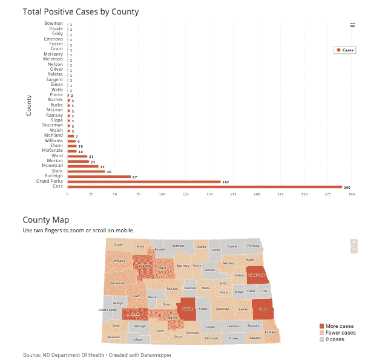
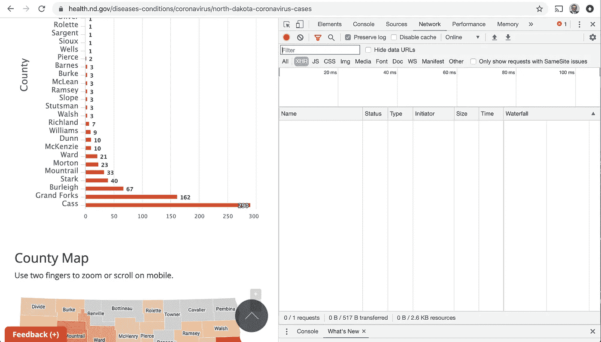
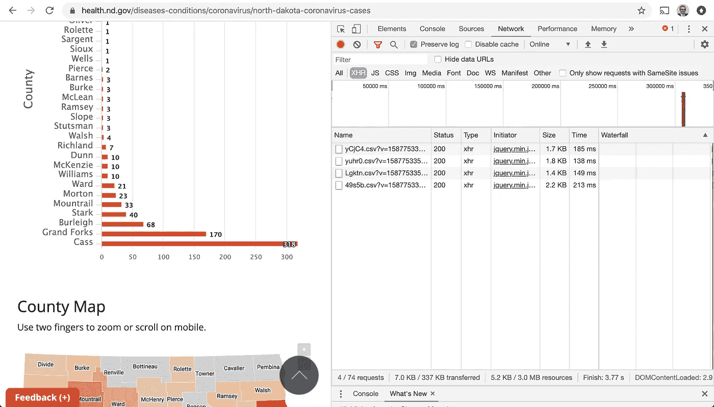
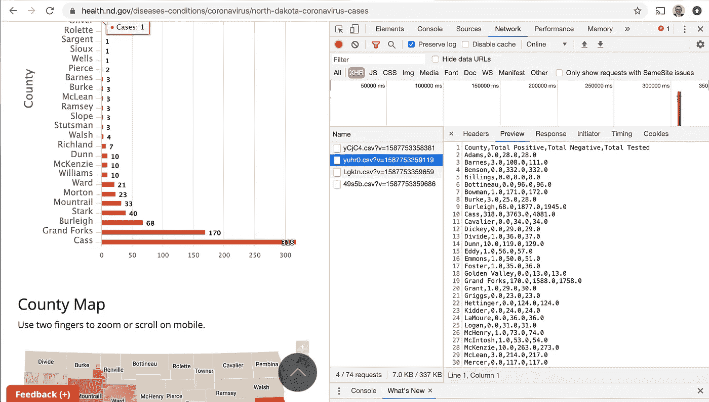
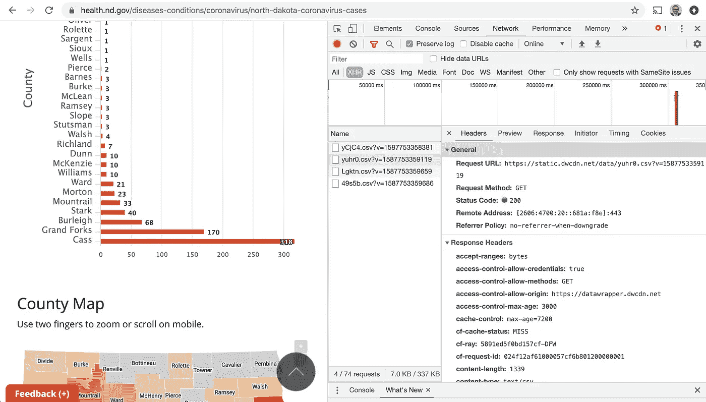
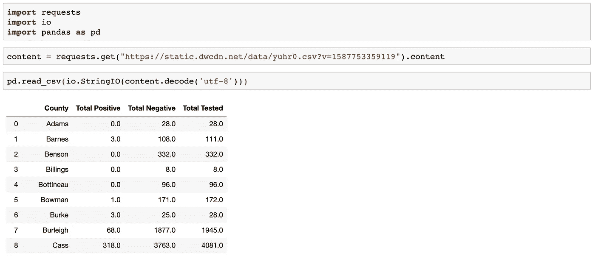
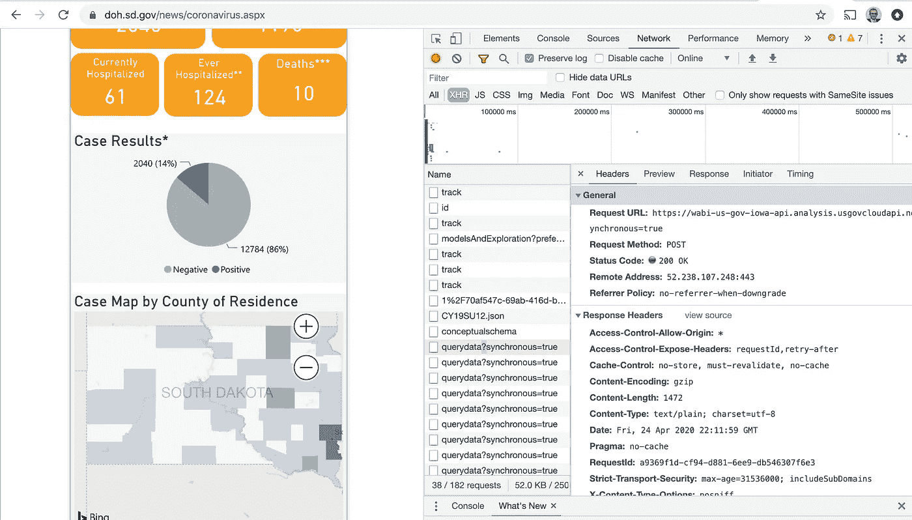
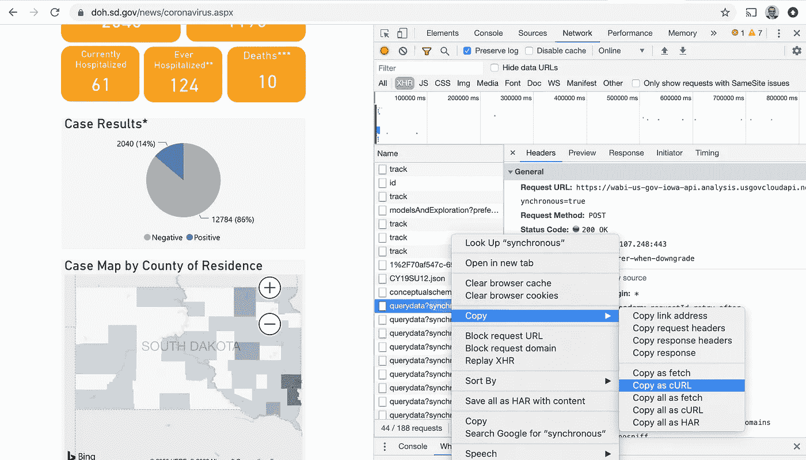
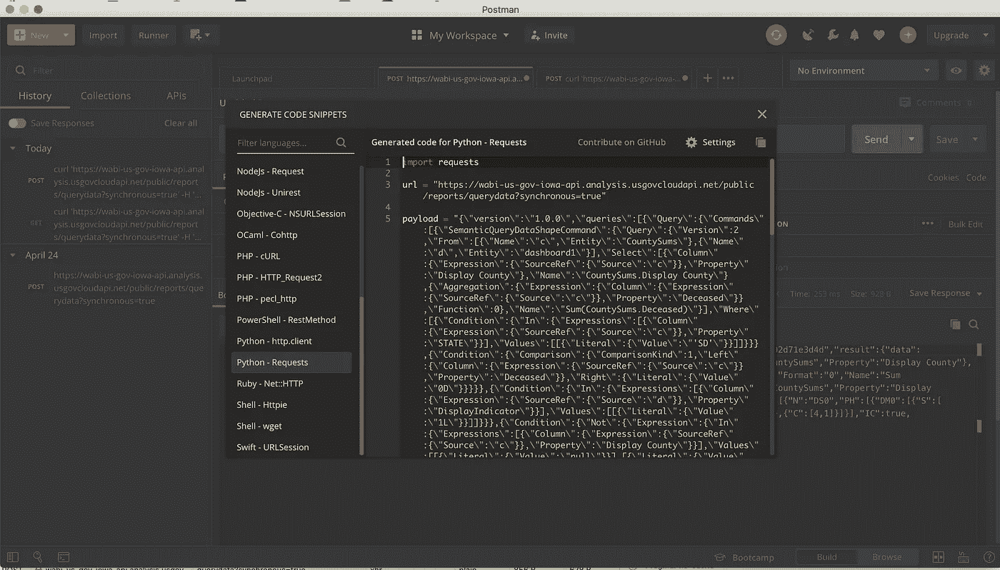

# 抓取网络流量中的数据

> 原文：<https://towardsdatascience.com/scraping-data-via-network-requests-4d5a89fb1626?source=collection_archive---------17----------------------->

在这一点上，我已经看到了许多关于如何使用 BeautifulSoup 或类似工具抓取数据的教程，但您可能没有考虑过从您感兴趣的网站抓取网络流量来获取数据。

# 为什么要刮网络流量？

您可能已经知道 http 请求为 web 提供了动力，您的浏览器发出了对某个网页的请求，并返回了该网页的数据。这不是对一个页面的单独请求，而是对不同数据的许多请求，这些数据被放在一起，形成您在浏览器中看到的内容。假设你在一个社交网站上发了一个帖子，然后你的朋友评论了这个帖子。您的浏览器只请求与您的帖子相关的数据，而不是请求重新加载整个页面来显示您朋友最近的评论。这减少了必须请求的数据量，最终用户不必经历整个页面被重新加载。这对于抓取数据来说是幸运的，因为您经常需要的数据可能在您可以捕获的请求中。

# 检查网络流量

为了从请求中抓取数据，在浏览器中检查网络流量是很有用的。比方说，你想获得北达科他州冠状病毒的数据，并决定删除北达科他州卫生部的网站。你很难抓取它，因为数据包含在一些交互式小部件(如下图)中，而不是像 HTML 表那样容易抓取的东西。

[北达科他州卫生部](https://www.health.nd.gov/diseases-conditions/coronavirus/north-dakota-coronavirus-cases)

首先，您可以在页面上的任意位置单击鼠标右键，然后在 Mac 上单击“检查”或 Cmd+Option+i，在 Windows 上单击 Cmd+Shift+C。这将在你的浏览器中打开开发者工具，我正在使用谷歌浏览器，所以你的开发者工具可能看起来不同。单击网络选项卡将其打开。然后选择 XHR (XMLHttpRequests)。现在重新加载页面。

现在您可以看到，有一些数据通过网络传输。在本例中，包含北达科他州各县数据的是 4 个 CSV。这比用 BeautifulSoup 刮页面方便多了。

# 访问数据

在这里，您可以单击其中一个 CSV 来查看数据(如下所示)，但是您可能希望采用一种更加程序化的方法，不需要任何手动步骤。

通过单击 Headers 选项卡，您可以看到获取这些数据是通过一个特定 url 上的 GET 请求完成的。我们可以获取这个 url，并在程序中发出这个请求。

使用 python 的 request、io 和 pandas 包，您可以从代码中请求有问题的 CSV。

这种方法可以使您拥有北达科他州新冠肺炎的数据可视化，显示与北达科他州卫生部一样最新的数据，而不必运行可能因页面布局的变化而频繁中断的刮刀。

# 发布请求中的数据

北达科他州冠状病毒数据相当容易访问，因为它保存在一个相对简单的 GET 请求中。让我们考虑一下南达科他州卫生部网站上的南达科他州冠状病毒数据。让我们从导航到开发者工具的网络流量窗格的相同过程开始。

如您所见，我们无法通过简单的 GET 请求轻松提取 CSV。我们需要的数据包含在名为 querydata 的第一个请求中。同步=真。这里，您需要用请求中正确的头和数据发出 POST 请求。右键单击它并导航到选项复制为卷曲。

现在，您可以将复制的内容粘贴到命令行中并运行它。您将得到一些很长的 JSON，可以通过解析找到您想要的数据。这是查找您可能感兴趣的数据的有用工具。

把 JSON 放在一个容易看到的地方可能会对你有用，你可以试着把这些都复制并粘贴到像 [jsonformatter](https://jsonformatter.curiousconcept.com/) 或【jsonprettyprint.net】T4 这样的网站上，它们可以帮助你直观地解析数据。

# 将 cURL 转换为 python

即使你很擅长使用 cURL，阅读起来也会很棘手，很容易出错。有很多在线资源可以帮助你使用 cURL 并用你选择的编程语言重写它，比如[trillworks.com](https://curl.trillworks.com/)，但是我建议你使用 [Postman](https://www.postman.com/) 。Postman 是一个很棒的免费应用程序，可以帮助你使用(和构建)API。由于 API 在处理数据中起着如此重要的作用，如果你真的想从事数据方面的职业，这是一个很好的学习工具。

下面，我画了 cURL 到 python 的转换，这是我选择的语言，Postman 已经帮我处理好了。

# 使用硒

Selenium 是一个流行的框架，用于在浏览器中运行自动化测试，实际上它可以用来抓取数据。从 Selenium Desired Capabilities 实现中，您可以提取您编写的自动化软件所访问的站点的请求。

希望这能让你看到一种更有效的收集数据的方法！