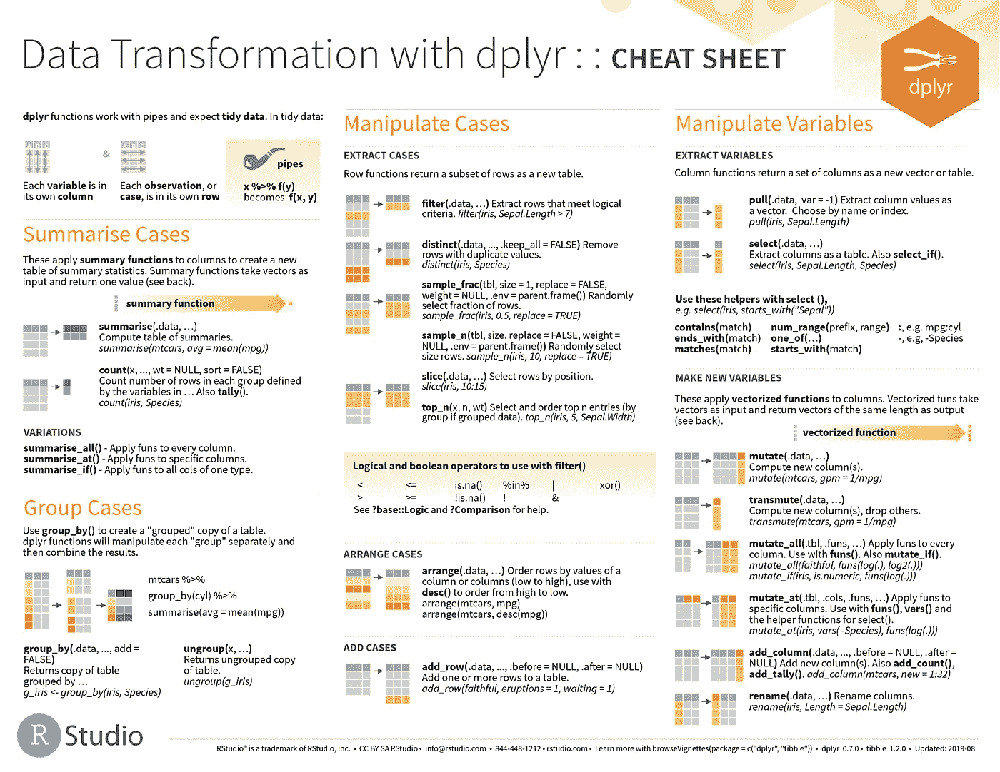

# 在 R 中抓取、下载和存储 pdf

> 原文：<https://towardsdatascience.com/scraping-downloading-and-storing-pdfs-in-r-367a0a6d9199?source=collection_archive---------18----------------------->

## 网页抓取 pdf

## 嵌套擦伤，以避免按钮点击



来源:https://rstudio.com/resources/cheatsheets/

“汇流”一词的意思是事物的汇合或融合，通常指河流。我在西弗吉尼亚州长大，靠近 [Gauley 河](https://www.nps.gov/gari/index.htm)(为你椽子准备的世界级白水)和 [Meadow 河](https://en.wikipedia.org/wiki/Meadow_River)(小嘴鲈鱼的天堂)。汇流这个词也很恰当地描述了我作品中的思想潮流是如何汇聚的。我的工作融合了统计学、数据科学和公共政策。如果是这些河流，数据科学无疑是最小的。虽然现在称自己为“数据科学家”很时髦，但我不是数据科学家。然而，我确实使用了数据科学家的许多工具、技术和流程。

我研究公共政策，因此，我没有形式和度量一致的数据(例如，对你们经济学家来说是美元和美分)。因此，有一天我正在使用机器学习技术对文本进行分类，第二天我正在为这些分类建立测量模型，之后我可能会为与数据相关的一些方面建立一个极端事件模型。所有这些意味着我做了很多数据科学家，特别是那些 Tidyverse 说服者，称之为“数据争论”的事情——清理、组织和转换数据以供分析。

我经常忘记需要处理数据的各种命令。RStudio 为数据科学和统计的各种包和过程提供了一套很好的备忘单。它们以 pdf 海报的形式出现，就像你在会议上看到的那样。我的问题是，我经常在西弗吉尼亚州的旅馆工作，那里的互联网连接是一个挑战，背景是高利河峡谷的轰鸣声。这意味着我经常搜索和下载我认为可能需要的备忘单。因为备忘单会不时更新，所以我冒着在本地存储过期备忘单的风险。这一切促使我考虑编写一个简短的脚本来访问所有 RStudio 备忘单并将其下载到本地。关于代码…

# 加载有用的库

至少对于那些使用 r 的人来说，`tidyverse`是这些类型操作的主力，特别是，`rvest`是读取和解析 HTML 的主要工具。最后，`stringr`提供了一致的处理文本字符串的方法——在抓取 URL 列表时非常有用。

```
library(tidyverse)
library(rvest)
library(stringr)
```

# 抓取链接和下载文件

下面的代码行通过识别和读取包含 RStudio Cheatsheets 的 pdf 的 Github 存储库的 HTML 来开始抓取。

```
page <- read_html("https://www.github.com/rstudio/cheatsheets")
```

如果您访问该存储库，您会发现单击表格中的一个 pdf 文件并不会单独生成相关的备忘单。它将我们带到存储库的第二级页面，并在代码编辑器中打开文件。获取文件以便在工作中引用意味着单击代码编辑器顶部菜单栏上的下载按钮。当然，没有什么刮擦练习是真正简单的。要获取文件，我们需要找到一种绕过“点击”下载按钮的方法。明确地说，一些脚本允许我们“点击”按钮，但是我在`jsonlite`中找到的那些比我在这里做的更复杂(虽然更有效)。

```
raw_list <- page %>% *# takes the page above for which we've read the html*
  html_nodes("a") %>%  *# find all links in the page* html_attr("href") %>% *# get the url for these links* str_subset("\\.pdf") %>% *# find those that end in pdf only* str_c("https://www.github.com", .) %>% *# prepend the website to the url* **map**(read_html) %>% *# take previously generated list of urls and read them*
  **map**(html_node, "#raw-url") %>% *# parse out the 'raw' url - the link for the download button*
  **map**(html_attr, "href") %>% *# return the set of raw urls for the download buttons*
  str_c("https://www.github.com", .) %>% *# prepend the website again to get a full url*
  walk2(., basename(.), download.file, mode = "wb") *# use purrr to download the pdf associated with each url to the current working directory*
```

我利用存储库主页上的链接来访问、记录和获取与每个备忘单的下载按钮相关联的链接列表。这种解决方法不需要为每个按钮编写一个“点击”按钮的脚本。这个脚本不是最高效的，但是您最终会在本地工作目录中找到所有优秀的 RStudio 备忘单。

前置很重要，因为每个对`read_html`的调用都需要完整的 URL。反过来，`html_nodes`和`html_attr`中的解析依赖于已经读取了 HTML。来自`stringr`的字符串折叠函数`str_c`使这变得容易。对于解析，我们使用 Tidyverse 包`purrr`中的`map`函数。

# 重要花絮

*   在最初的抓取中，`str_subset("\\.pdf")`告诉 R 返回所有带有 pdf 的链接。否则，您将获得整个存储库的链接，包括开发文件。
*   `map(html_node, "#raw-url")`告诉 R 查找与每个备忘单的下载按钮相关联的 URL。您可以通过使用 Google 的选择器小工具来识别这个标签——在上面搜索例子以及如何识别标签。
*   `purrr::walk2`将`download.file`函数应用于每个生成的原始链接。的“.”告诉它使用前一个命令中的数据(原始 URL)。`basename(.)`告诉它给下载的文件一个 URL 的基本名称(例如，“purrr.pdf”)。
*   根据您的 pdf 阅读器，您可能需要添加`mode = "wb"`。否则，文件可能会显示为空白、损坏或无法正确呈现。更多信息参见`download.file()`命令的文档。

# 老派

请注意，Tidyverse 的`walk2`和许多其他伟大的功能本身并不必要。下面的 for 循环是上面的`walk2`的老式实现。这里，`download.file`应用于`raw_list`中的每个 URL(URL 在这里只是对象`raw_list`中每一行的标签)。

```
for (url in raw_list){ download.file(url, destfile = basename(url), mode = "wb") }
```

# 包扎

因此，对于需要“点击按钮”的地方来说，这不是最有效的代码，但是它用最少的包和对`json`或其他语言的了解就完成了工作。现在我们已经完成了，我还可以说在 [RStudio 的](https://rstudio.com/resources/cheatsheets/)资源页面上可以找到备忘单。在那里，它们会更容易抓取，当然你可以点击下载。我经常向学生提及它们，因为它们是数据分析和统计教学的重要资源。

*原载于 2020 年 4 月 10 日 https://www.samuelworkman.org*[](https://www.samuelworkman.org/blog/scraping-up-bits-of-helpfulness/)**。**