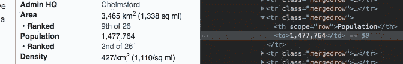
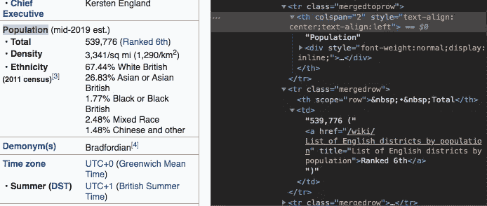

# 从维基百科上搜集信息

> 原文：<https://towardsdatascience.com/scraping-from-all-over-wikipedia-4aecadcedf11?source=collection_archive---------51----------------------->

## 如何自动从多页中抓取


莎伦·麦卡琴在 [Unsplash](https://unsplash.com?utm_source=medium&utm_medium=referral) 上的照片

上周，我写了一篇关于如何从维基百科的一个表格中收集数据的文章([这里有一个链接让你了解](/using-beautifulsoup-on-wikipedia-dd0c620d5861?source=friends_link&sk=ba9fd2d3ddd3d5dc2fab2433f6848b81))。在这篇文章中，我从这一页的[上的一个表格中搜集了数据，上面有参赛者的姓名、年龄、职业，以及他们来自英国烘焙大赛第一季的地方。最终的结果是下面的字典:](/using-beautifulsoup-on-wikipedia-dd0c620d5861?source=friends_link&sk=ba9fd2d3ddd3d5dc2fab2433f6848b81)

```
{'Annetha Mills': [30, '/wiki/Essex'],
 'David Chambers': [31, '/wiki/Milton_Keynes'],
 'Edward "Edd" Kimber': [24, '/wiki/Bradford'],
 'Jasminder Randhawa': [45, '/wiki/Birmingham'],
 'Jonathan Shepherd': [25, '/wiki/St_Albans'],
 'Lea Harris': [51, '/wiki/Midlothian'],
 'Louise Brimelow': [44, '/wiki/Manchester'],
 'Mark Whithers': [48, '/wiki/Wales'],
 'Miranda Gore Browne': [37, '/wiki/Midhurst'],
 'Ruth Clemens': [31, '/wiki/Poynton,_Cheshire']}
```

如您所见，参赛者的全名是关键字，值是包含他们年龄的列表和包含他们家乡的维基百科页面 url 的 url 片段。现在，我可以很容易地得到这个城镇的名字，然后就到此为止。然而，如果我打算在收集的数据上运行某种模型，那就没什么用了。当您收集用于模型的数据时，可以收集的实际数字数据越多越好。因此，与其只收集一个地方的名称，不如收集一些关于这个地方的统计数据，比如人口或密度，会更有用。

当然，这些信息不会直接出现在 GBBO 的维基上，因为那与那个特定的页面无关，这也是为什么他们会链接到这个城镇的页面上。因此，这意味着如果我们想收集这些信息，我们必须自己去每一页搜集这些信息。你可以浏览每一个城镇页面，然后手动操作，但这很快就会变得乏味。这就是为什么我开发了一个脚本，可以自动进入每个页面并抓取信息。这样，实际的执行速度会更快，效率也会更高。

首先，下面是我编写的收集城镇人口和密度的完整函数:

现在我们要回到那里，解释这里到底发生了什么。

第二行我有下面的字典:

```
stats_dict = {'density':None, 'pop':None}
```

如果你看到最后，列表中返回的第二项是 stats_dict。通过使用空值字典，我们可以确保在页面上出现异常的情况下，我们仍然可以得到一些信息，并且可以从那里对有问题的单个项目进行故障诊断。

第四行如下:

```
if type(url_snippet) == str:
```

这确保了被传递的值是一个字符串，因为如果不是，函数的其余部分显然不能工作。第 5–8 行如下

```
area_url = 'https://en.wikipedia.org{}'.format(url_snippet)          area_page = requests.get(area_url)         
area_soup = BeautifulSoup(area_page.content)
```

它们创建完整的 url，请求 url，并制作我们将用于抓取信息的汤。

下一行是 for 循环，所有人口和密度的发现都在它下面

```
for item in area_soup.find_all('th'):
```

这实质上是说查看所有标记为“th”的项目，这是人口和密度信息通常放在下面的地方。第 11–17 行是关于查找密度信息，第 19–26 行是关于查找人口信息。以下是我如何找到密度信息的解释:

第 11 行和第 12 行如下:

```
if 'Density' in item.text:                
    if item.find_next_sibling().text:
```

这是在最初的 for 循环之后，查找所有标记为“th”的项目，所以这表示如果标记为标题的内容的文本是“density”，这意味着查找标记为 Density 的标题。下一行是说如果标记为 density 的东西的兄弟有文本，那么执行以下操作。

注意:通过这个过程，你会注意到有很多 if 语句。这是因为不同页面的格式偶尔会有细微的差异。对于页面浏览者来说，这并没有真正减少他们的体验。然而，当你处理一个脚本时，一个稍微不同的安排对你来说可能意味着一个错误。所以，你要做很多，“如果这个东西存在，就这么做”而不是只告诉函数做某件事。

以下几行是:

```
density_str = item.find_next_sibling().text                    
for elem in density_str.split():                        
    if "/km" in elem:
```

回到上一个 if 语句，这里的第一行是说，“现在我们知道这个东西存在，这个东西就是包含密度信息的字符串。”接下来的两行将文本分割成所有单独的部分，然后取包含每公里的人的信息的部分，因为我们希望确保我们的单位与我们得到的数字一致。下面两行实际上提取了数据(第一行溢出了一点):

```
d = int([item for item in re.split("(\d*,?\d*)",elem) 
if len(item)>1][0].replace(',','')) stats_dict['density'] = d
```

第一行是实际访问数字的内容。简而言之，它使用 regex 来拆分文本，如果该项可以拆分，则获取列表中的第一项，即数字本身，然后将文本中的逗号替换为空，然后将最后一个数字从字符串转换为整数。下一行返回到最初为空的字典，并使用前一行中收集的数字更新密度条目。

瞧，我们有了我们的密度！现在来看人口，我发现这个问题有点棘手，因为格式的变化比密度的变化要多一些。

```
if 'Population' in item.text:
```

像密度一样，我们开始寻找被标记为标题、文本为“人口”的项目然而，在这之后，我们开始偏离获得城镇密度的道路。在我们进入代码本身之前，我想确切地说明为什么它看起来比您最初认为的要复杂一些:

这是安娜莎·米尔斯的家乡埃塞克斯的维基百科页面:



[https://en.wikipedia.org/wiki/Essex](https://en.wikipedia.org/wiki/Essex)

在这里，我们基本上看到了我们在密度中看到的，我们正在搜索的数字在兄弟姐妹的文本中。然而，这并不是它一贯的格式。如果我们看看布拉德福德，爱德华“艾德”金伯的家乡:



[https://en.wikipedia.org/wiki/Bradford](https://en.wikipedia.org/wiki/Bradford)

母体的数目在父代的兄弟文本中。因此，我们的下一行有点不同:

```
if item.find_next_sibling() is None:
     stats_dict['pop'] = re.split('(\d*,\d*)',item.parent.find_next_sibling().text)[1]
```

实质上，如果该项没有兄弟，就找到父项，找到父项的兄弟，然后从父项的兄弟中获取文本，将其拆分，并找到编号。这个数字现在是 stats_dict 中的 population(pop)条目的值。那么下一个条件如下:

```
elif item.find_next_sibling().text.startswith('%'):
     pass
```

在这种情况下，如果该项目有一个兄弟，但兄弟的文本以百分号开头，只需忽略它，因为它不会有您要寻找的信息。最后，如果该项有一个同级，并且该同级的文本不以百分号开头，则我们得到以下内容:

```
else:
     pop_str = item.find_next_sibling().text
     stats_dict['pop']= int(pop_str.split()[0].replace(',',''))
```

这远没有以前复杂。基本上，获取该项的兄弟，获取它的文本(pop_str)，拆分该文本，获取拆分列表中的第一项(包含数字的项)，去掉数字中的逗号，然后将其转换为整数。现在在 stats_dict 中被指定为“pop”值。我们终于有了回报声明:

```
return [url_snippet.split('/')[-1], stats_dict]
```

这将返回一个列表，其中第一项只是初始 url 片段中的地名。我在事件密度中保留这个名称，或者弹出一个 None 值。如果真的发生这种情况，我可以自己去看页面，然后手动抓取。列表中的第二项是包含密度和人口信息的 stats_dict。

现在我们已经有了一个函数，是时候使用它了。

我上一篇文章的最终产品，即本文开头所示的词典，将被命名为“参赛者姓名年龄城镇”

前三行表示对于字典值中的每个列表，城镇是该列表中的最后一项，现在应该使用 area_stats 函数扩展该列表，该函数将返回一个关于该地点的地名和统计信息的列表。最后，现在我们有了所有的区域统计数据，我们可以取出 url 片段。所有这些让这本字典:

```
{'Annetha Mills': [30, '/wiki/Essex'],
 'David Chambers': [31, '/wiki/Milton_Keynes'],
 'Edward "Edd" Kimber': [24, '/wiki/Bradford'],
 'Jasminder Randhawa': [45, '/wiki/Birmingham'],
 'Jonathan Shepherd': [25, '/wiki/St_Albans'],
 'Lea Harris': [51, '/wiki/Midlothian'],
 'Louise Brimelow': [44, '/wiki/Manchester'],
 'Mark Whithers': [48, '/wiki/Wales'],
 'Miranda Gore Browne': [37, '/wiki/Midhurst'],
 'Ruth Clemens': [31, '/wiki/Poynton,_Cheshire']}
```

到这本字典里:

```
{'Annetha Mills': [30, 'Essex', {'density': 427, 'pop': 1477764}],
 'David Chambers': [31, 'Milton_Keynes', {'density': 2584, 'pop': 229941}],
 'Edward "Edd" Kimber': [24, 'Bradford', {'density': 1290, 'pop': '539,776'}],
 'Jasminder Randhawa': [45, 'Birmingham', {'density': 4262, 'pop': '1,141'}],
 'Jonathan Shepherd': [25, 'St_Albans', {'density': 8140, 'pop': 147373}],
 'Lea Harris': [51, 'Midlothian', {'density': 260, 'pop': '91,340'}],
 'Louise Brimelow': [44, 'Manchester', {'density': 4735, 'pop': '552,858'}],
 'Mark Whithers': [48, 'Wales', {'density': 148, 'pop': '278,000'}],
 'Miranda Gore Browne': [37, 'Midhurst', {'density': 1467, 'pop': 4914}],
 'Ruth Clemens': [31, 'Poynton,_Cheshire', {'density': 1089, 'pop': 14260}]}
```

现在，我们实际上有了一些有用的区域统计数据，我们不必逐个梳理每个页面来查找这些信息！