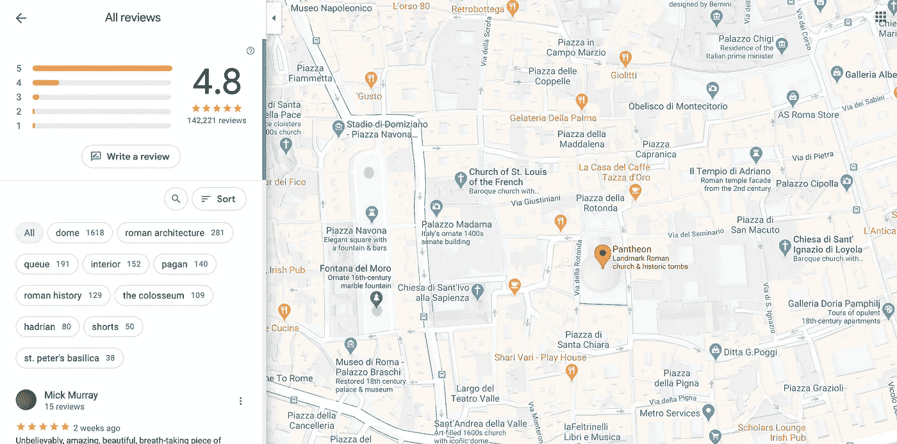
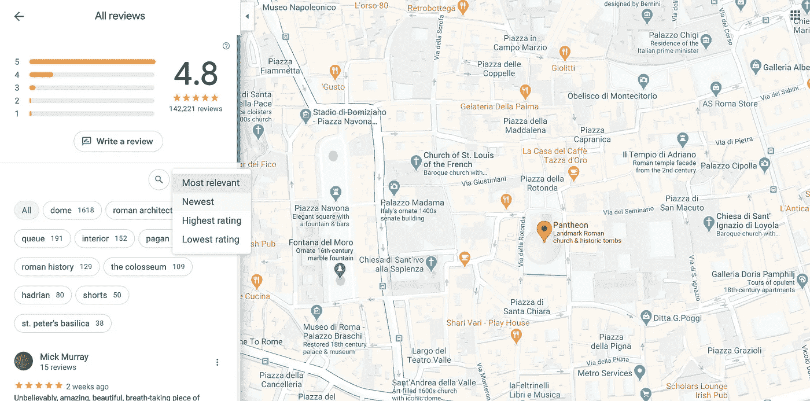
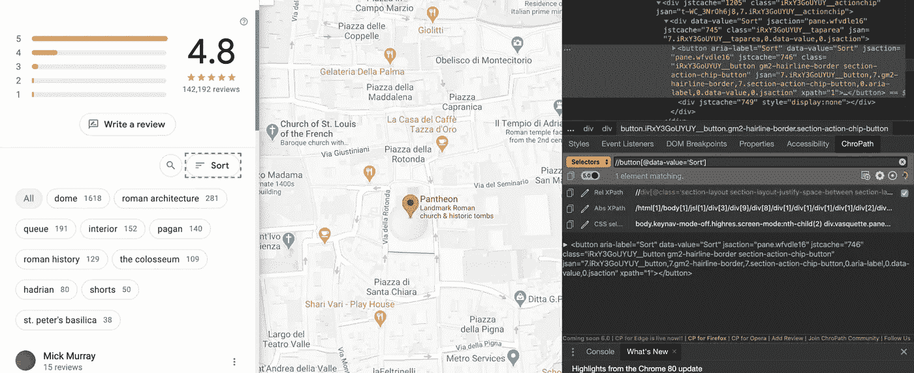
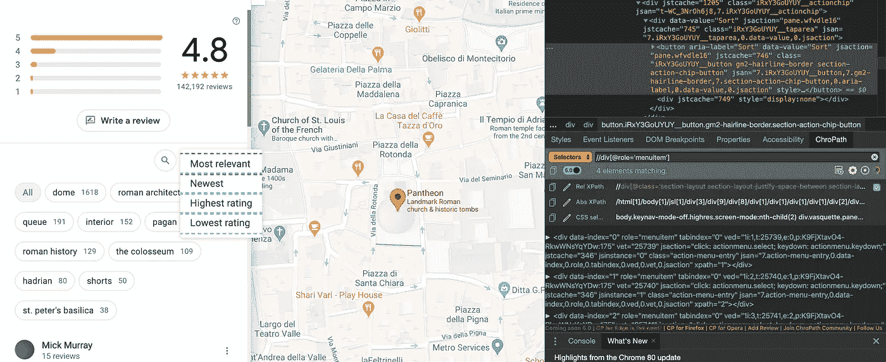

# 用 Python 抓取谷歌地图评论

> 原文：<https://towardsdatascience.com/scraping-google-maps-reviews-in-python-2b153c655fc2?source=collection_archive---------3----------------------->

## 使用 BeautifulSoup 和 Selenium 抓取最新评论


照片由[亨利·佩克斯](https://unsplash.com/@hjkp?utm_source=medium&utm_medium=referral)在 [Unsplash](https://unsplash.com?utm_source=medium&utm_medium=referral) 上拍摄

在这篇文章中，我想和你分享一些关于如何使用 **Python** **Selenium** 和 **BeautifulSoup** 库来应用数据抓取的知识:这两个工具以正确的方式结合起来允许定义一组 API 来从几乎任何网站收集数据。

**注意:**从网站收集的任何数据都可能受到版权保护，这意味着未经所有者同意不得重复使用，并且不得明确用于商业目的。

本文的主要目标是展示如何作为编码练习收集数据，以及如何为研究和/或个人项目构建数据集。

在这个简短的免责声明之后，我们可以开始了吗？

先从工具说起。

## 蟒蛇

Anaconda 是一个框架，它使用虚拟环境的概念，以透明的方式帮助维护每个项目的 Python 库依赖关系:您创建一个环境，在其中安装每个库，并根据您的需要激活/停用该环境，而不会干扰其他项目的依赖关系。你可以在这里下载[。](https://www.anaconda.com/distribution/)

这个工具不是强制性的，它可以由任何虚拟环境库(例如:virtualenv)代替，但如果您想在这里介绍的管道末端添加进一步的步骤，如数据清理、数据分析和机器学习，它可能是有用的。此外，您也可以通过 pip 安装所描述的库。

无论如何，要创建我们的抓取环境，请运行以下代码:

```
conda create --name scraping python=3.6
conda activate scraping 
```

## 硒

Selenium 是一个为 web 应用程序自动测试而构建的框架:它的 API 允许我们模拟点击、滚动和网站上发生的任何其他交互。因此，它对于抓取网站也非常有用:点击和滚动会触发页面的变化，从而加载更多的数据(或其他类型的数据)。

该库是用 Java、Python、C#、JavaScript 和许多其他语言编写的:在本文中，我们将使用 Python 实现来加载目标 web 页面，并生成检索附加信息所需的所有交互。

要安装 Selenium，请运行命令:

```
conda install -c conda-forge selenium
```

我们还需要安装我们想要使用的浏览器的 web 驱动程序。webdriver 是自动运行浏览器实例的软件，Selenium 将在其上工作。

我决定使用**的谷歌 Chromedriver** ，你可以从[这里](https://chromedriver.chromium.org)下载，但是任何驱动都可以正常工作。

**注意:**我们将在后面看到的手动测试必须使用我们在这一步选择的浏览器来运行。

## 美丽的声音

[BeautifulSoup](https://www.crummy.com/software/BeautifulSoup/bs4/doc/) 是一个解析 HTML 和 XML 文件的原生 Python 库:它帮助导航树的节点，以非常直观的方式访问属性和特性。

对我们来说，主要用途是解析经过 Selenium 处理的 HTML 页面，将信息提取为原始文本，并将其发送给进一步的处理。

要在我们的 conda 环境中安装库，运行命令:

```
conda install -c anaconda beautifulsoup4
```

好了，现在我们应该准备好开始定义我们的抓取模块了！

目标示例将显示如何收集**最新的** **Google Maps 评论**:我们将定义一个导航到特定兴趣点(从现在开始是 POI)并检索其相关最新评论的 scraper。

## *1。初始化*

作为第一步，我们需要初始化我们的网络驱动。该驱动程序可以配置多个选项，但目前我们仅将英语设置为浏览器语言:

```
options = Options()
options.add_argument("--lang=en")
driver = webdriver.Chrome(chrome_options=options)
```

## 2.URL 输入

然后，我们需要提供我们的目标页面:当我们想要抓取 Google Maps 评论时，我们选择一个 POI 并获得直接指向评论的 url。在这一步中，驱动程序只需打开页面。



总经理评估的目标页面示例

这种类型的 URL 相当复杂:我们需要手动将其从浏览器复制到一个变量中，并将其传递给驱动程序。

```
url = [https://www.google.it/maps/place/Pantheon/@41.8986108,12.4746842,17z/data=!3m1!4b1!4m7!3m6!1s0x132f604f678640a9:0xcad165fa2036ce2c!8m2!3d41.8986108!4d12.4768729!9m1!1b1](https://www.google.it/maps/place/Pantheon/@41.8986108,12.4746842,17z/data=!3m1!4b1!4m7!3m6!1s0x132f604f678640a9:0xcad165fa2036ce2c!8m2!3d41.8986108!4d12.4768729!9m1!1b1)driver.get(url)
```

## 3.单击菜单按钮

现在，我们要提取*的* *最新的*评论，而页面默认设置呈现*最相关的*评论。我们需要点击“排序”菜单，然后点击“最新”标签。



这就是 Selenium(和编码技能)真正发挥作用的地方:我们需要找到按钮，单击它，然后单击第二个按钮。为此，我使用了 Selenium 提供的 XPath 搜索方法:这比 CSS 搜索更容易，这也要感谢 [Chropath](https://autonomiq.io/chropath/) ，这是一个浏览器扩展，它将 XPath 解释器添加到浏览器开发工具中。

这样，我们*检查*页面以测试表达式，直到我们突出显示所需的元素:



第一个按钮的 XPath 表达式测试



第二个按钮的 XPath 表达式测试

不幸的是，这还不够。Google Maps 网站(和许多其他现代网站一样)主要是使用 AJAX 实现的:网站的许多部分是异步加载的**，这意味着如果 Selenium 在加载页面后立即查找按钮，它们可能不会被加载。**

**但是在那种情况下我们也有解决办法。Selenium 实现了*等待功能*:在某些条件被验证之后或者在最大超时时间过去之后执行点击。等到元素在页面上出现并可点击，就解决了前面的问题。**

**该部分的代码是:**

```
wait = WebDriverWait(driver, 10)
menu_bt = wait.until(EC.element_to_be_clickable(
                       (By.XPATH, '//button[[@data](http://twitter.com/data)-value=\'Sort\']'))
                   )  
menu_bt.click()
recent_rating_bt = driver.find_elements_by_xpath(
                                     '//div[[@role](http://twitter.com/role)=\'menuitem\']')[1]
recent_rating_bt.click()
time.sleep(5)
```

**Sleep 函数被添加到这个块的末尾，因为点击触发了一个 AJAX 调用来重新加载评论，因此我们需要在进入下一步之前等待…**

## **4.审查数据提取**

**现在，我们终于达到了目标，**评论数据**。我们将页面发送到 BeautifulSoup 解析器，它帮助找到正确的 HTML 标签、div 和属性。**

**首先，我们确定了 review 的包装器 div:find _ all 方法创建了一个 div 元素列表，这些元素具有特定的属性。在我们的例子中，列表包含页面上的评论的 div。**

```
response = BeautifulSoup(driver.page_source, 'html.parser')
rlist = response.find_all('div', class_='section-review-content')
```

**对于每个评论，我们解析它的信息:评级星、文本内容(如果有的话)、评论日期、评论者姓名、评论 id。**

```
id_r = r.find('button', 
              class_='section-review-action-menu')['data-review-id']
username = r.find('div', 
                  class_='section-review-title').find('span').texttry:
    review_text = r.find('span', class_='section-review-text').text
except Exception:
    review_text = Nonerating = r.find('span', class_='section-review-stars')['aria-label']
rel_date = r.find('span', class_='section-review-publish-date').text
```

## **5.卷动**

**最后但同样重要的是:该页面已经加载了 20 篇评论，但是如果不向下滚动页面，其他评论就不可用。**

**Selenium API 中没有直接实现滚动，但是它们允许执行 JavaScript 代码并将其应用于页面的特定元素:我们标识可以滚动的 div 对象，并运行简单的 JS 代码行来滚动到页面底部。**

```
scrollable_div = driver.find_element_by_css_selector(
 'div.section-layout.section-scrollbox.scrollable-y.scrollable-show'
                     )
driver.execute_script(
               'arguments[0].scrollTop = arguments[0].scrollHeight', 
                scrollable_div
               )
```

**正如你所看到的，在这个简短的教程中，我试图解释从谷歌地图上抓取评论的核心要素，但同样的概念也适用于许多现代网站。复杂性很高，我在这里没有考虑所有的细节:如果你想有一个完整的例子，检查我在 Github [这里](https://github.com/gaspa93/googlemaps-scraper)的知识库。**

**感谢您的阅读。让我知道你对它的想法，如果你有任何问题！**