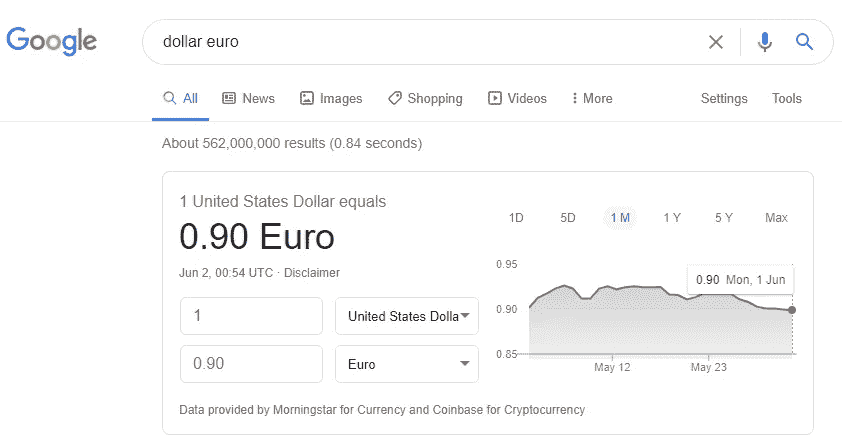
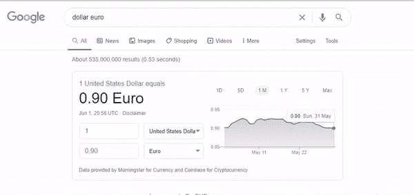
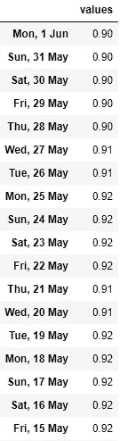

# 用 Python 抓取交互式折线图

> 原文：<https://towardsdatascience.com/scraping-interactive-charts-with-python-2bc20a9c7f5c?source=collection_archive---------15----------------------->

## 带着*硒*穿过生产线


【www.freepik.com free pik 制作的 T2 商业照片

假设你想知道今天美元对欧元的表现。快速的谷歌搜索就能搞定，只需输入:“美元欧元”。你会看到这样一个交互式图表:


为了查看整个周期的值，您需要沿线移动光标，同时包含值和日期的标签会立即更新。

现在假设您想从这个图表中获取所有数据，并为自己创建一个数据库。如果标签中的值一直变化，如何从整行中刮出数据？既然你能看见它，你能刮它，就一定有办法。

如果你要手动完成，你要做的是沿着这条线移动光标，同时在 Excel 表格中输入每个值，或者甚至在笔记本上手写。在这篇文章中，我们将看到如何让 selenium 做同样的事情。我们将让它像人一样工作，遍历行并记录值。

虽然我们使用的是 Google 的图表，但是这里实现的逻辑可以适用于任何类似的图表。

我们基本上使用的是*硒*、*熊猫、*和*日期时间*模块。好了，在我们导入所有我们要用的东西后，让我们直接打开连接并抓取页面。

然后我们实例化 *action* 对象，我们将使用它来移动屏幕上的光标，以及 *search_bar* 和 *search_button* 对象，我们将使用它们来执行我们的搜索。完成后，只需使用 *send_keys* 方法编写搜索，并使用 *click* 方法点击搜索按钮。我们将使用 *WebDriverWait* ,以便它等待元素被完全加载到页面中:

现在让我们找到图表元素，并获取它在页面上的大小和位置。这很重要，这样我们就知道将光标移动到哪里。为此，我们还将使用 *WebDriverWait* 。

运行我们到目前为止所做的一切，这样您就可以看到以下输出:

```
{'x': 514, 'y': 262}
{'height': 134, 'width': 301}
```

现在我们有了这个信息，我们可以用它来移动光标到对象的最右边，使用*move _ to _ element _ with _ offset*。此方法将鼠标移动指定元素的偏移量。偏移量是相对于元素的左上角的，所以我们需要将对象的整个长度作为 *xoffset* 来传递。由于不需要在 y 轴上移动，*yooffset*可以设置为零:

如果我们使用 *move_to_element* 来代替，光标将被移动到元素的中心。

现在我们的光标在这里:



请注意图表最右边的光标。

然后我们得到第一个日期值对:

我们现在只需要光标继续向左移动。为此，我们需要设置:

*   光标移动的速度；
*   光标移动的截止日期。

我们将使用*动作*对象的 *move_by_offset* 方法将光标从其最后一个已知位置移动到下一个位置。无限循环将使光标移动到我们设置的截止日期。当日期超过极限时，我们称之为*突破*。

这是我们预期的行为:



很酷吧。！每次光标向左移动，它都会从标签中抓取一个新的值和日期。就像人类移动鼠标做笔记一样！

如果你在谷歌的一个图表中这样做，并且你改变了图表的时间范围，比如说，到年，一些日期可能会被跳过。这些日期即使手动也无法访问。可能是因为 x 轴对于这么小的图表来说变得太大了。

此外，重要的是要明确节奏是由反复试验决定的。如果速度太小，光标将需要很长时间才能移动到图表中的下一个日期。如果太大，它可能会跳过日期。

然而，不可避免的是，有时光标仍然会在同一个日期，即使它刚刚移动。因此，最好将数据存储在字典中，并用它来丢弃重复的数据。当我们完成抓取时，我们可以将这个字典转换成一个数据帧。这是完整的代码:

这是我们刚刚收集的数据:



最后一个警告:如果你正在观察光标在这条线上的移动，你会注意到它在每一次循环中都回到了起点。即使 *selenium* 保持最后的位置，也会发生这种情况，但是您也可以注意到，光标在每个新循环中以我们建立的*速度*继续向左移动。所以，一切都按计划进行。

嗯，就是这样。我希望你喜欢它，这可能是有用的。如果你有问题，有建议，或者只是想保持联系，请随时通过 [Twitter](https://twitter.com/_otavioss) 、 [GitHub](https://github.com/otavio-s-s/data_science) 或 [Linkedin](https://www.linkedin.com/in/otavioss28/) 联系。