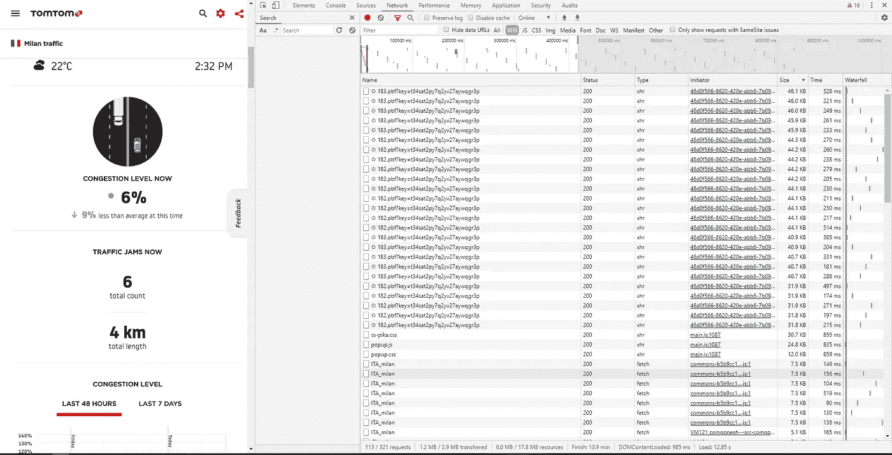

# 用 3 行代码一步一步地抓取实时交通数据

> 原文：<https://towardsdatascience.com/scraping-live-traffic-data-in-3-lines-of-code-step-by-step-9b2cc7ddf31f?source=collection_archive---------9----------------------->

## 了解如何用最少的代码在 python 中 web 抓取实时更新的图表。


来源:TomTom。

鉴于最近的疫情，决策者实施的封锁措施已经停止了大部分经济活动。由于经济数据的滞后性，在数据中衡量消费者的实时行为并不总是容易的。事实上，数据往往至少有一个月的时滞，因此很难评估人们是否真的在四处走动。因此，政府、科学家和经济学家等一直在关注**高频数据**，这些数据提供了自限制实施以来全球经济运动如何变化的实时视图。TomTom 提供的流量数据是衡量活动进展的一个流行指标。该数据涵盖 57 个国家的 416 个城市，并计算整个道路网络上所有车辆的行驶时间。在 TomTom 的网站上，平均拥堵程度以实时交通图的形式显示。我选择了米兰:


米兰 TomTom 交通指数。来源:[汤姆汤姆。](https://www.tomtom.com/en_gb/traffic-index/milan-traffic/)

我们可以将鼠标悬停在图表上以获得每个单独的数据点，但无法从网站上下载数据。所以有两个选择:

1.  **花** **个小时**悬停在每个点上，记录每个数值…
2.  刮吧！

**检查数据**

在任何网站上，网站在加载页面时都会加载一系列不同的信息，这是很常见的。这可能包括 cookies、数据文件、图像等等。我们可以通过**检查**页面来了解内幕。在 Chrome 中，按下' **Ctrl+shift+I '就可以轻松做到这一点。**将出现一个窗口，显示已加载到页面中的所有数据。我们想要的选项卡是弹出窗口顶部显示的*网络*选项卡。



检查 TomTom 米兰交通网页。

如果你看不到所有的数据，点击' **Ctrl+R'** ,重新加载页面，观察所有数据的加载。在*名称*选项卡上，你会看到许多不同的文件类型:*。js，。json，。svg，。otf* 等等。那么我们如何知道哪一个包含我们图表的底层数据呢？首先，我们需要通过 *XHR* 进行**过滤。这是 *XML HTTP 请求*的简称。使用这种格式载入网页上的数据是很常见的。然后我们可以按大小**过滤**——底层数据通常是页面中包含的最大文件之一(可能以千字节而不是字节为单位)。最后，通常情况下，源数据会以*的形式出现。json* 文件。这代表了 *Javascript 对象符号*，这是存储大量数据的常用方式。**

然而，查看我们的数据集，并不能立即看出 *json* 文件在哪里。下一步，让我们看看*型*柱。因为我们已经通过 *xhr* 进行了过滤，所以我们应该在这个列中只看到 *xhr* 类型。说到这里，我们顺着栏目往下看，可以看到**既** *xhr* **又** *fetch* 。*获取*类型意味着该数据从 API 或*自动处理接口加载。*用*获取*类型查看数据，这个特定对象的文件名是*“ITA _ Milan”。* **看来我们已经得到了我们的数据！**我们可以通过在新标签中打开它来检查它是否正确。当我们打开新选项卡时，我们看到这确实是我们想要的数据，在链接下面:[*【https://api.midway.tomtom.com/ranking/live/ITA_milan】*](https://api.midway.tomtom.com/ranking/live/ITA_milan)*，*这是从 API *中检索的。*太好了——现在让我们将这些数据加载到 python 中，并开始清理它们以复制实时图表。

**检索和清理数据**

首先，*请求*是我们将用来加载数据的模块。在我们之前找到的 url 上使用 requests.get()，我们可以将该文件显示为一个 *json* ，并使用 python 中的 *json* 模块对其进行解包(是的，只使用了三行代码):

```
%matplotlib inline
import matplotlib.pyplot as plt
import pandas as pd
import json
import requests# retrieve json file
url_ = "[https://api.midway.tomtom.com/ranking/live/ITA_milan](https://api.midway.tomtom.com/ranking/live/ITA_milan)"
italy_req = requests.get(url)
italy_json = italy_req.json()
```

这为我们提供了以下输出:

```
{'data': [{'JamsDelay': 13.5,'TrafficIndexLive': 6,'TrafficIndexHistoric': 17,'UpdateTime': 1586608290000,'JamsLength': 1.4,'JamsCount': 4},{'JamsDelay': 4.2,'TrafficIndexLive': 6,'TrafficIndexHistoric': 17,'UpdateTime': 1586609190000,'JamsLength': 0.4,'JamsCount': 2},{'JamsDelay': 5.8,'TrafficIndexLive': 6,'TrafficIndexHistoric': 18,'UpdateTime': 1586610090000,'JamsLength': 0.4,'JamsCount': 2},
```

这个文件可能看起来有点混乱，有很多不同的标点和括号。它比看起来简单——*JSON*文件实际上是一个名为*‘数据’*的字典，其中包含一个字典列表。所以为了得到我们想要的信息。(“Time”和“TrafficIndexLive”)，我们要调用每个想要检索的点的键。例如，要获得实时流量指数的第一个值，我们需要输入以下内容:

```
italy_json["data"][0]["TrafficIndexLive"]
```

然后，我们可以将字典中的每个条目添加到一个列表中，将每个列表转换为熊猫数据帧中的一列:


实时交通数据帧。

使用字典和一点点数据清理，我们已经做到了！让我们通过绘制图表来验证数据是否与实时图表相匹配:


米兰实时交通。

我们做到了！在几行代码中，我们能够从一个图表中检索数据，否则我们无法访问这些数据。原来他们说的是真的:看得见就刮！

***感谢阅读！*** *如果您有任何见解，请随时发表评论。包含我用来做这个项目的源代码的完整 Jupyter 笔记本可以在我的* [*Github 资源库中找到。*](https://github.com/nathanwilthomas/tomtom_live_traffic_scrape)

参考资料:

[1] TomTom，2020。《米兰交通报道*》*。可在:[https://www.tomtom.com/en_gb/traffic-index/milan-traffic/](https://www.tomtom.com/en_gb/traffic-index/milan-traffic/)

*免责声明:本文表达的所有观点均为本人观点，与* ***和*** *先锋或任何其他金融实体没有任何关联。我不是一个交易者，也没有用本文中的方法赚钱。这不是财务建议。*