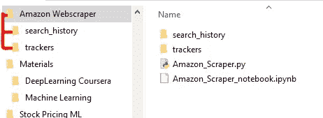
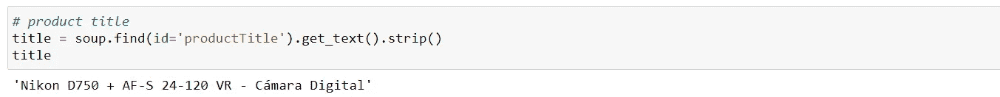
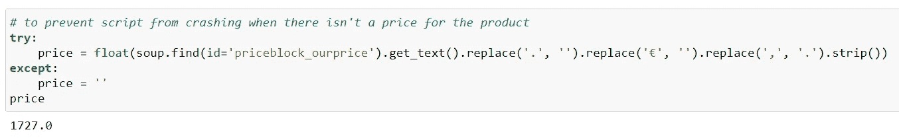
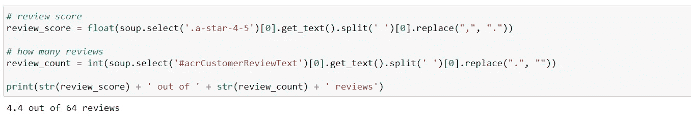
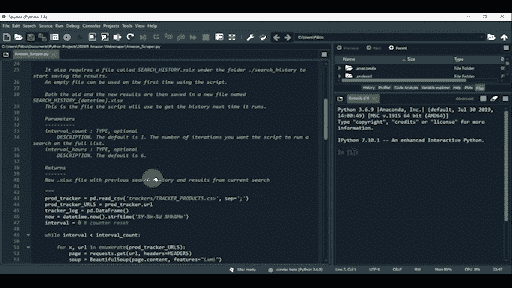
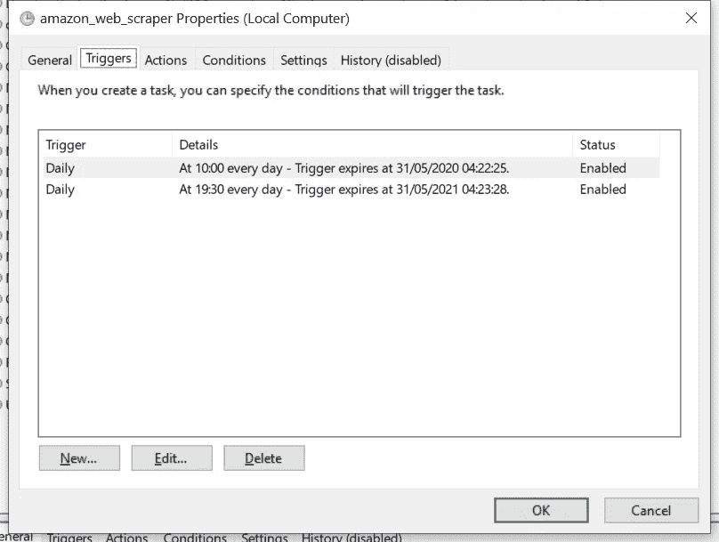
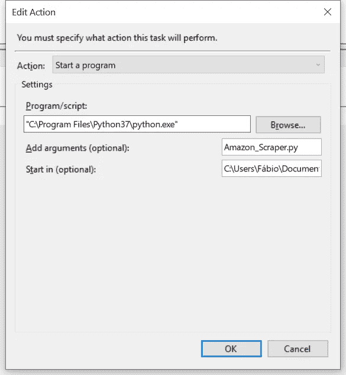

# 抓取亚马逊商店以生成价格警报

> 原文：<https://towardsdatascience.com/scraping-multiple-amazon-stores-with-python-5eab811453a8?source=collection_archive---------3----------------------->

## 只需几行 Python 代码，您就可以构建自己的 web 抓取工具来监控多个商店，这样您就不会错过很多东西了！

对那些亚马逊交易保持警惕！(照片由[加里·本迪格](https://unsplash.com/@kris_ricepees?utm_source=medium&utm_medium=referral)拍摄)

# 我怎么会在这里？

我认为有一点是公平的，我们都有一个来自亚马逊的书签产品页面，我们疯狂地刷新它，希望价格能下降。

好吧，也许不是*疯狂地*，但肯定是一天几次。

我将向您展示如何编写一个简单的 Python 脚本，它可以**从他们的任何商店抓取亚马逊产品页面，并检查价格**，等等。我努力使它保持简单，如果你已经知道基本的东西，你应该能够顺利地跟上。以下是我们将在这个项目中做的事情:

*   创建一个 **csv 文件，其中包含我们想要的产品**的链接，以及我们愿意购买的价格
*   用 **Beautiful Soup** 编写一个函数，该函数将**循环遍历 csv 文件中的链接**并检索关于它们的信息
*   **将所有东西**存储在一个“数据库”中，并随时跟踪产品价格，这样我们就可以看到历史趋势
*   **安排脚本在一天中的特定时间运行**
*   *Extra* —当价格低于你的限额时，创建电子邮件提醒

> 我还在编写一个脚本，它采用搜索词而不是产品链接，并返回所有商店中最相关的产品。如果你觉得这可能有用，请在评论中告诉我，我会写另一篇关于它的文章！
> 
> **更新**:我刚刚制作了一个全程视频！检查一下，让我知道你节省了多少:)

# 永恒的愿望清单…

将你的爱好扩展到更专业的领域，最悲哀的事情通常是需要购买更好的设备。以摄影为例。购买一台新相机是一个可以显著影响你睡眠时间的决定。众所周知，购买新镜头也会产生类似的效果——至少我是这么认为的！不仅技术方面非常相关，需要一些研究，而且你也希望得到尽可能好的价格。

研究完成后，就该在我们知道的每一个网店里搜索选中的型号了。

将你知道的商店数量乘以选择的型号数量，你就会得到我的浏览器上打开的标签的大概数量。大多数情况下，我最终会再次访问亚马逊……就我而言，因为我在欧洲，这通常涉及到搜索意大利、法国、英国、西班牙和德国等国家的亚马逊商店。我发现同样的产品有非常不同的价格，但更重要的是，每个市场都有特定的偶尔交易。我们不想错过这个机会…

> 这就是了解一点 Python 可以为您省钱的地方。字面意思！

我开始测试一些网页抓取来帮助我自动完成这项任务，结果发现每个商店的 HTML 结构都差不多。这样我们就可以**在所有的**中使用我们的脚本来快速获得所有商店的所有价格。

*如果你想访问我的其他网络抓取文章——以及媒体上的几乎所有内容——你考虑过订阅吗？你会大力支持我的工作！*

 [## 阅读媒体上的每一个故事！

### 作为一个媒体会员，你的会员费的一部分会给你阅读的作家，你可以完全接触到每一个故事…

medium.com](https://medium.com/@fneves/membership) 

# 入门指南

我以前写过几篇关于网络抓取的文章，解释了漂亮的汤是如何工作的。这个 python 包非常容易使用，你可以查看 [***我写的这篇文章***](/looking-for-a-house-build-a-web-scraper-to-help-you-5ab25badc83e?source=---------11------------------) 是为了从房屋列表中收集价格。简而言之，Beautiful Soup 是一个工具，您可以使用它从 HTML 页面中访问特定的标签。即使你以前没有听说过它，我打赌你一看到代码就能明白它在做什么。

您需要一个名为 TRACKER_PRODUCTS.csv 的文件，其中包含您想要跟踪的产品的链接。本 Github 库中提供了一个模板。每次运行后，scraper 将结果保存在一个名为“search _ history _[随便什么日期]”的不同文件中。xlsx”。这些是 *search_history* 文件夹中的文件。您也可以在存储库中找到它。

这是我们需要的文件夹和文件结构

由于我不想让事情变得过于复杂，我将首先使用 Jupyter 笔记本向您展示代码输出。但是最后，我们会给这段代码一些类固醇，并在一个 **Amazon_Scraper.py** 文件中把它变成一个不错的函数。最重要的是，我们将创建一个计划任务来不时地运行它！

## 我们需要的就是汤

让我们从笔记本视图开始。在你的 Jupyter 笔记本上使用下面的代码片段，这样你就可以看到代码的每一部分是做什么的。

这里最不为人知的包大概就是 *glob* 了。这是一个很好的包，它允许你在一个文件夹中获得文件名列表之类的东西。请求将负责获取我们在跟踪列表中设置的 URL。美丽的汤是我们这次挑战的网络抓取工具。如果你需要安装它们中的任何一个，简单的 pip/conda 安装就可以了。有很多资源可以帮助你，但通常情况下， [Python 包索引](https://pypi.org/)页面会有。

需要 HEADERS 变量来传递 *get* 方法。我在上面提到的其他文章中也讨论了它，但是当使用*请求*包访问 URL 时，您可以将它视为您的身份证。它告诉服务器你正在使用哪种浏览器。你可以在这里阅读更多关于这个[的内容。](http://www.networkinghowtos.com/howto/common-user-agent-list/)

现在可以从 [**存储库**](https://github.com/fnneves/amazon_webscraper) 中获取名为 TRACKER_PRODUCTS.csv 的 csv 文件，并将其放在文件夹“trackers”中。

然后我们把它放进美味的汤里。这将使 HTML 变得更加“容易理解”，(巧妙地)命名为 ***汤*** *。*

新鲜的王子回归让你开心！

## 应该挑哪些食材？

我们从简单的东西开始，比如产品的名称。虽然这几乎是多余的，但是一旦我们检查了 excel 文件，给出一些关于产品的细节是一件好事。

我添加了其他字段，如评论分数/计数和可用性，不是因为它们与购买决策相关，而是因为我对这些东西有点强迫症，我更喜欢有“有一天会有用”的变量……看到特定产品的评论分数的变化可能会很有趣。也许不会，但无论如何我们会保留它！

每当你看到 ***soup.find*** 的时候，就意味着我们正在试图使用页面的 HTML 标签(比如 div，或者 span 等等)来寻找页面的元素。)和/或属性(名称、id、类别等。).与 ***soup.select*** 一样，我们使用的是 CSS 选择器。你可以在浏览器上使用 Inspect 功能并导航页面代码，但我最近发现了一个非常方便的 Chrome 扩展，名为 **SelectorGadget** ，我强烈推荐它。这使得找到正确的代码更加容易。

> 在这一点上，如果你觉得很难理解选择器是如何工作的，我鼓励你**阅读这篇** [**文章**](/looking-for-a-house-build-a-web-scraper-to-help-you-5ab25badc83e?source=---------11------------------) **，在那里我会更详细地解释一下**。

下面你可以看到每个部分返回的内容。如果您刚开始使用 web 抓取，但仍然不完全理解它是如何工作的，我建议您将代码分成几部分，慢慢弄清楚每个变量在做什么。

我总是在网络抓取文章中写这个**免责声明**，但是如果你几个月后阅读这篇文章，这里的代码可能不再正确工作了——例如，如果亚马逊改变页面的 HTML 结构，这可能会发生。

如果发生这种情况，我会鼓励你去解决它！一旦**你分解代码，使用我的例子**这真的没什么大不了的。只需要修复你的代码正在获取的选择器/标签。你可以在下面留言，我会尽力帮你。

## (反)构汤

获得我们产品的名称应该是小菜一碟。价格部分更具挑战性，最后，我不得不添加几行代码来纠正它，但是在这个例子中，这部分就足够了。

您将在脚本的最终版本中看到，我还为在美国商店购物的读者添加了获取美元价格的功能！

这导致了 try/except 控件的增加，以确保我每次都得到正确的字段。在编写和测试 web scraper 时，我们迟早会面临同样的选择。

我们可能会浪费 2 个小时来获取每次都能得到页面正确部分的 HTML 片段，而不能保证这是可能的！或者我们可以简单地即兴创作一些错误处理条件，这将**让我们更快地使用工作工具**。

我并不总是这样或那样做，但是当我写代码的时候，我确实学到了更多的注释。这真的有助于提高代码的质量，甚至当你想回去重新开始以前的项目时。

这是运行中的脚本

# 奇迹发生的地方

正如你所看到的，获得单独的成分是非常容易的。测试完成后，是时候编写一个合适的脚本了，它将:

1.  从 csv 文件中获取 URL
2.  使用 while 循环抓取每个产品并存储信息
3.  在 excel 文件中保存所有结果，包括以前的搜索

要编写这个，您需要您最喜欢的代码编辑器(我使用 Spyder，它随 Anaconda 安装一起提供— *旁注:版本 4 非常好*)并创建一个新文件。我们就叫它 **Amazon_Scraper.py** 。

对我们在上面看到的零碎内容有一些补充，但我希望评论有助于使它变得清楚。这个文件也在 [**资源库**](https://github.com/fnneves/amazon_webscraper) 中。

## 跟踪产品

关于文件 TRACKER_PRODUCTS.csv 的几点说明，这是一个非常[简单的文件](https://github.com/fnneves/amazon_webscraper/tree/master/trackers)，有三列(“url”、“code”、“buy_below”)。**您可以在这里添加想要监控的产品 URLs】。**

> 你甚至可以把这个文件放在你同步的 Dropbox 文件夹的某个部分(之后用新的文件路径更新脚本)，这样你就可以用你的手机随时更新它。如果您将脚本设置为在服务器或您家中的笔记本电脑上运行，它将在下次运行时从文件中选择新产品链接。

## 搜索历史

SEARCH_HISTORY 文件也是如此。第一次运行时，您需要将一个空文件(在 [**存储库**](https://github.com/fnneves/amazon_webscraper) 中找到)添加到文件夹“search_history”中。在上面脚本的第 116 行中，当定义 *last_search* 变量时，我们试图在搜索历史文件夹中找到**最后一个文件**。**这就是为什么你也需要在这里映射你自己的文件夹**。只需将文本替换为运行这个项目的文件夹(在我的例子中是“Amazon Scraper”)。

## 价格预警

在上面的脚本中，第 97 行有一个区域，如果价格低于你的限制，你可以用它来发送一封带有某种警告的电子邮件。

每当你的价格达到目标时，就会发生这种情况。

它出现在 try 命令中的原因是，并不是每次我们从产品页面获得实际价格时，逻辑比较都会返回一个错误——例如，如果产品不可用。

我不想让脚本变得太复杂，所以我把它从最终代码中去掉了。然而，你可以在 [**这篇文章**](/if-you-like-to-travel-let-python-help-you-scrape-the-best-fares-5a1f26213086) 中拥有来自一个非常相似项目的代码。

我在脚本中留下了一个带有购买警告的打印指令，所以您只需要用电子邮件部分替换它。就当是你的作业吧！

# 设置运行脚本的计划任务

亲爱的 Mac/Linux 读者，这部分将只讨论 Windows 中的调度程序，因为这是我使用的系统。对不起 Mac/Linux 用户！我 100%肯定这些系统也有替代方案。如果你能在评论里让我知道，**我会在这里加上**。

设置一个自动化任务来执行我们的小脚本并不困难:

**1** —首先打开“任务计划程序”(只需按下 windows 键并输入)。然后选择“创建任务”并选择“触发器”选项卡。我每天 10 点和 19 点 30 分跑步。

**2** —接下来你移动到动作选项卡。在这里，您将添加一个操作，并为“程序/脚本”框选择 Python 文件夹位置。我的位于程序文件目录中，正如你在图片中看到的。

**3** —在 arguments 框中，您要键入我们的函数文件名。

**4** —我们将告诉系统在我们的文件 Amazon_Scraper.py 所在的文件夹中启动这个命令**。**

从这里开始，任务就可以运行了。您可以探索更多的选项，并进行测试以确保它的工作。这是用 Windows 任务计划程序安排脚本自动运行的基本方法！

我认为**我们涵盖了许多有趣的特性**你现在可以用它们来探索其他网站或者构建更复杂的东西。感谢您的阅读，如果您有任何问题或建议，我会尽量回复所有邮件！如果我在下面看到一些请求，我可能会考虑做一个**视频教程**，所以让我知道你是否愿意把它和文章放在一起。

如果你想看我的其他网页抓取例子，这里有两个不同的项目:

 [## 我在找房子，所以我用 Python 做了一个 web scraper！

### 几个月后，我将不得不离开我租的公寓，去找一个新的。尽管这种经历很痛苦…

towardsdatascience.com](/looking-for-a-house-build-a-web-scraper-to-help-you-5ab25badc83e)  [## 用一个简单的 Python 机器人增加你的 Instagram 粉丝

### 我在 4 天内有了 500 个真正的追随者！

towardsdatascience.com](/increase-your-instagram-followers-with-a-simple-python-bot-fde048dce20d) 

> 如果你读到这里，你可能已经意识到我喜欢摄影，所以为了表达我的谢意，我将留给你一张我的照片！

夜晚的卢浮宫金字塔，还有一个[不要脸的塞给展柜](https://fnevesphotography.pixieset.com/?utm_source=tdsfamz)我的一个爱好！

*感谢您的阅读！一如既往，我欢迎反馈和建设性的批评。如果你想取得联系，可以在这里联系我****或者直接回复下面的文章。***