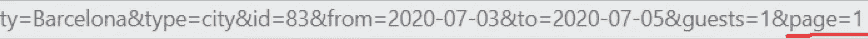
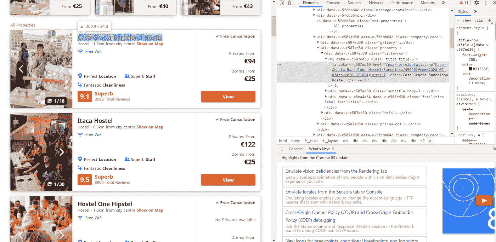
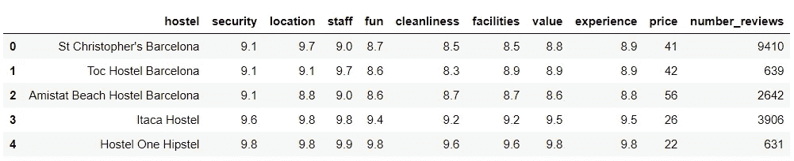

# 如何用 Python 抓取多个 URL:教程

> 原文：<https://towardsdatascience.com/scraping-multiple-urls-with-python-tutorial-2b74432d085f?source=collection_archive---------0----------------------->

## 因为您想要的数据并不总是您拥有的数据


[来源](https://unsplash.com/photos/N6HTCyN50p0)

在本文中，我将向您展示三种从多个 URL 获取数据的方法。更具体地说，我将展示如何遍历页码，遍历手动创建的 URL 列表，最后遍历一个粗略的 URL 列表。

我假设在本教程中，你有一些网页抓取的超级基础知识。如果你需要快速复习如何检查和抓取一个网站，看看这个。

[](/a-tutorial-of-what-kaggle-wont-teach-you-web-scraping-data-cleaning-and-more-16d402a206e8) [## 一个 Kaggle 不会教你的教程:网页抓取，数据清理等等

### 因为数据科学不仅仅是 EDA 和培训模型

towardsdatascience.com](/a-tutorial-of-what-kaggle-wont-teach-you-web-scraping-data-cleaning-and-more-16d402a206e8) 

我将从 Hostelworld 收集旅馆数据，Hostelworld 是世界上寻找旅馆最好的网站。好了，现在我们开始吧！

# 在页码上循环

这是抓取多个页面的最简单、最直接的方式。让我们先来看看我们收集旅舍的 URL 的末尾(文章末尾有完整的 URL):



我们看到对于第一页，我们有 page=1。对于第二页，我们将有 page=2，依此类推。

因此，我们需要做的就是创建一个“for”循环，在这里我们改变最后一个数字。对于每个页面，循环将收集我们指定的信息。

这里是收集从市中心的距离的代码，宿舍床的价格，一个私人房间的价格，以及以前的客户对网站前 2 页找到的所有旅馆的平均评级。

*   我在这里使用 selenium 是因为 hostelworld 页面是 JavaScript 渲染的，BeautifulSoup 无法处理。
*   我去掉了" *price-title 5"* 元素，因为该元素允许我们知道价格是针对宿舍还是私人房间。
*   睡眠功能有助于控制我们向网站服务器发出请求的速度(避免降低服务器速度)，但也有助于确保 selenium 在继续运行之前找到我们想要的信息。

通常，我们会继续清理数据以使其可用，但我将在最后用最后一种方法来做这件事。让我们继续下一个方法。

# 遍历手动创建的 URL 列表

那太好了，但是如果你要抓取的不同网址没有你可以循环通过的页码怎么办？此外，如果我想要的具体信息只在旅舍的实际页面上提供，该怎么办？

第一种方法是手动创建一个 URL 列表，并遍历这个列表。下面是为前两个旅馆创建 URL 列表的代码:

```
url = ['[https://www.hostelworld.com/pwa/hosteldetails.php/Casa-Gracia-Barcelona-Hostel/Barcelona/45620?from=2020-07-03&to=2020-07-05&guests=1'](https://www.hostelworld.com/pwa/hosteldetails.php/Casa-Gracia-Barcelona-Hostel/Barcelona/45620?from=2020-07-03&to=2020-07-05&guests=1') ,
       '[https://www.hostelworld.com/pwa/hosteldetails.php/Itaca-Hostel/Barcelona/1279?from=2020-07-03&to=2020-07-05&guests=1'](https://www.hostelworld.com/pwa/hosteldetails.php/Itaca-Hostel/Barcelona/1279?from=2020-07-03&to=2020-07-05&guests=1',\)]
```

然后，您可以创建一个新的“for”循环，遍历列表中的每个元素并收集您想要的信息，其方式与第一种方法完全相同。

如果你只有几个 URL，那也可以，但是想象一下如果你有 100，1000 甚至 10000 个 URL！当然，手动创建列表不是你想要做的(除非你有大量的空闲时间)！

谢天谢地，有更好/更聪明的方法来做事。

# 循环浏览抓取的 URL 列表

这是本教程的最后一个方法。让我们仔细看看我们正在抓取的 Hostelworld 页面。



我们看到每个旅舍列表都有一个 **href 属性**，它指定了到单个旅舍页面的链接。这就是我们想要的信息。

**方法如下:**

1.  创建一个“for”循环，抓取我们需要的所有页面的所有 href 属性(以及 URL)。
2.  清理数据并创建一个包含所有收集的 URL 的列表。
3.  创建一个新的循环，遍历 URL 列表，收集所有需要的信息。
4.  清理数据并创建最终的数据帧。

需要指出的是，如果抓取的每一页都有不同的结构，这种方法将无法正常工作。网址需要来自同一个网站！

对于每一个旅舍页面，我都刮掉了旅舍的名称、一张床最便宜的价格、评论数量以及 8 个类别(位置、氛围、安全、清洁度等)的评论分数。).

这使得我们看到的第一种方法毫无用处，因为使用这种方法，我们可以获得所有相同的信息，甚至更多！

下面是获得干净的 URL 列表的代码。

*   不需要的链接很可能会出现在你的 URL 列表中，就像这里的情况一样。一般来说，几乎总是有一个非常独特的模式来区分你想要的网址和其他网址(宣传等)。).在这种情况下，所有指向旅馆的链接都以/pwa/开头。
*   我将字符串*'*[*https://www.hostelworld.com*](https://www.hostelworld.com/)*'*添加到列表的每个元素中。在接下来的循环中，URL 需要用到这一部分。

现在我们有了干净网址的列表，我们可以通过循环列表来抓取我们想要的所有信息。

由于每次迭代大约需要 15-20 秒，所以我将只对这里的前 10 个旅舍这样做。你可以很容易地通过改变范围来改变它。

*   当我收集评论数量时，由于该信息在每页上出现两次，所以我使用[-1]只获得最后一次发现的评论数量。
*   通常有许多价格选择(取决于宿舍的类型)。最后给的价格永远是最便宜的，这也是我想保留的。如果找到多个，try/except 循环基本上保持最后的价格，如果只找到一个，则保持价格不变。

这种类型的循环是处理潜在错误的好方法！

收集完所有数据后，下面是清理数据并将其放入 dataframe 的代码:

这是最终数据帧的头部:



现在你有了，三种不同的抓取多个页面/URL 的方法。我真的希望这有所帮助，不要忘记负责任地刮。

非常感谢你的阅读！

## 参考

[](https://www.hostelworld.com/s?q=Barcelona,%20Catalonia,%20Spain&country=Spain&city=Barcelona&type=city&id=83&from=2020-07-03&to=2020-07-05&guests=1&page=1) [## 便宜的巴塞罗那旅舍“旅舍宿舍和私人房间”旅舍世界

### 巴塞罗那拥有欧洲最好的夜生活，吸引了来自世界各地的背包客和派对爱好者…

www.hostelworld.com](https://www.hostelworld.com/s?q=Barcelona,%20Catalonia,%20Spain&country=Spain&city=Barcelona&type=city&id=83&from=2020-07-03&to=2020-07-05&guests=1&page=1)